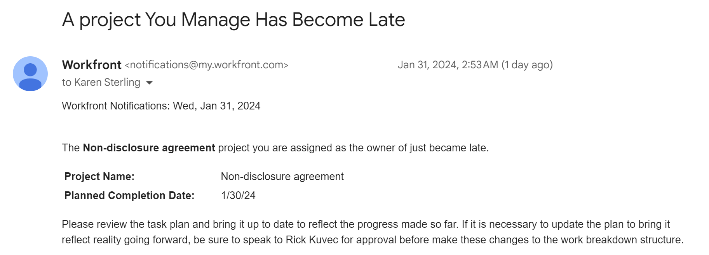

# E-Mail-Vorlagen konfigurieren

Als Adobe Workfront-Administrator können Sie E-Mail-Vorlagen konfigurieren, um Erinnerungsbenachrichtigungen zu unterstützen.

E-Mail-Vorlagen enthalten die Nachricht, die Benutzern gesendet wird, wenn eine Erinnerungsbenachrichtigung initiiert wird.\
Ohne E-Mail-Vorlage wird die Erinnerungsbenachrichtigung als leerer Inhalt im Text der E-Mail gesendet.

E-Mail-Vorlagen können mit Erinnerungsbenachrichtigungen für Probleme, Aufgaben, Projekte und Timesheets verknüpft werden. Bei der Erstellung von E-Mail-Vorlagen kann Ihr Workfront-Administrator Inhalte für die E-Mail und eine Betreffzeile bereitstellen.

## Zugriffsanforderungen

+++ Erweitern Sie , um die Zugriffsanforderungen für die Funktionalität in diesem Artikel anzuzeigen.

Sie müssen über folgenden Zugriff verfügen, um die Schritte in diesem Artikel ausführen zu können:

<table style="table-layout:auto"> 
 <col> 
 <col> 
 <tbody> 
  <tr> 
   <td role="rowheader">Adobe Workfront-Abo</td> 
   <td>Alle</td> 
  </tr> 
  <tr> 
   <td role="rowheader">Adobe Workfront-Lizenz*</td> 
   <td><p>Aktuell: Plan</p>
   Oder
   <p>Neu: Standard</p></td> 
  </tr> 
  <tr> 
   <td role="rowheader">Konfiguration der Zugriffsebene</td> 
   <td> <p>Systemadministrator</p> </td> 
  </tr> 
 </tbody> 
</table>

*Weitere Informationen zu Zugriffsanforderungen finden Sie unter [Zugriffsanforderungen in der Workfront-Dokumentation](/help/quicksilver/administration-and-setup/add-users/access-levels-and-object-permissions/access-level-requirements-in-documentation.md).

+++

## E-Mail-Vorlage erstellen {#create-an-email-template}

{{step-1-to-setup}}

1. Klicken Sie im linken Bereich auf **E-Mail** > **Benachrichtigungen**> **E-Mail-Vorlagen**.

   

1. Klicken Sie auf **Neue E-Mail-Vorlage**.

1. Geben Sie im Feld **Neue E-Mail-Vorlage** die folgenden Informationen an:

   <table style="table-layout:auto"> 
    <col> 
    <col> 
    <tbody> 
     <tr> 
      <td role="rowheader">Name</td> 
      <td>Fügen Sie einen Titel für die E-Mail-Vorlage hinzu. Dies ist ein Pflichtfeld.</td> 
     </tr> 
     <tr> 
      <td role="rowheader">Objekttyp</td> 
      <td>Geben Sie den Objekttyp an, mit dem Sie die Vorlage verknüpfen möchten. Wählen Sie aus den folgenden Objekten aus:
      <ul>
      <li>Projekt</li>
      <li>Aufgabe</li>
      <li>Problem</li>
      <li>Arbeitszeittabelle</li> </ul>

   Dies ist ein erforderliches Feld und standardmäßig auf Projekt eingestellt.</td>
   </tr>
     <tr> 
      <td role="rowheader">Beschreibung</td> 
      <td>Fügen Sie weitere Informationen zur E-Mail-Vorlage, zum Zweck und zur geplanten Zielgruppe hinzu.</td> 
     </tr>

   <tr> 
      <td role="rowheader">Betreff </td> 
      <td>Fügen Sie den Text hinzu, der in der Betreffzeile der E-Mail angezeigt wird, wenn die von der Vorlage generierte E-Mail-Nachricht gesendet wird. Dies ist ein Pflichtfeld.</td> 
     </tr> 
     <tr> 
      <td role="rowheader">Text </td> 
      <td> <p>Fügen Sie den Text für den Inhalt der E-Mail-Nachricht hinzu.</p> <p>Sie können die HTML-Formatierung für den E-Mail-Inhalt verwenden, wie im Abschnitt <a href="#add-html-formatting-to-an-email-template" class="MCXref xref">HTML-Formatierung zu einer E-Mail-Vorlage hinzufügen</a> in diesem Artikel beschrieben.</p> </td> 
     </tr> 
    </tbody> 
   </table>

1. Klicken Sie auf **Speichern**.

## HTML-Formatierung zu einer E-Mail-Vorlage hinzufügen {#add-html-formatting-to-an-email-template}

Sie können E-Mail-Vorlagen HTML-Tags hinzufügen, um benutzerdefinierte Benachrichtigungen zu erstellen.\
Beginnen Sie mit der Erstellung der E-Mail-Vorlage, wie in [Erstellen einer neuen E-Mail-Vorlage](#create-a-new-email-template) beschrieben.

Die HTML-Formatierung kann Ihre E-Mail-Vorlagen anreichern, wie in den folgenden Abschnitten dargestellt.

* [Verknüpfung zu Workfront-Objekten](#link-to-workfront-objects)
* [Verknüpfung zu benutzerdefinierten Feldern mit HTML](#link-to-custom-fields-with-html)
* [HTML-E-Mail-Beispiele](#html-email-examples)

### Verknüpfung zu Workfront-Objekten {#link-to-workfront-objects}

Mithilfe des Platzhalters &quot;`$$`&quot; können Sie Verknüpfungen zu Workfront-Feldern einfügen, um den E-Mail-Generator anzuweisen, nach Werten aus der Datenbank zu suchen, die mit einem bestimmten Objekt verknüpft sind.

Der Hauptteil der E-Mail für eine Benachrichtigung, die den Verantwortlichen der Aufgabe über den Beginn benachrichtigt, kann beispielsweise folgende Struktur aufweisen:

```html
<html>
<p>$$assignedTo:firstName$$</p>
<p>You are assigned to work on <b><a href="https://<your domain>.my.workfront.com/task/view?ID=$$ID$$">$$name$$</a></b>, which is due to start on $$plannedStartDate$$.</p>
<table width="350" style="font-size:12px;">
<tr>
<td><b><strong>HEADING</b></td>
<td>$$WILDCARD$$</td>
</tr>
<tr>
<td><b>HEADING</b></td>
<td>$$WILDCARD$$</td>
</tr>
<tr>
<td><b>HEADING</b></td>
<td>$$WILDCARD$$</td></tr>
</table>
</html>
```

Führen Sie einen der folgenden Schritte aus, um den Platzhalterwert für ein Objekt abzurufen:

* Wählen Sie im API Explorer auf der Registerkarte Felder eines beliebigen Objekts die Namen Ihrer Objekte aus. Weitere Informationen zum API Explorer finden Sie unter [API-Explorer](/help/quicksilver/wf-api/general/api-explorer.md).

* Verwenden Sie den `valuefield` -Wert, den Sie in einer Textmodusansicht eines Berichts finden. Weitere Informationen zu Textmoduswerten finden Sie unter [Textmodus - Übersicht](../../../reports-and-dashboards/reports/text-mode/understand-text-mode.md).

Der Wert `heading` kann der Name des Objekts sein, wie er im E-Mail-Textkörper angezeigt werden soll.

### Verknüpfung zu benutzerdefinierten Feldern mit HTML {#link-to-custom-fields-with-html}

Mithilfe des Platzhalters &quot;`$$`&quot; können Sie Links zu Benutzern und benutzerdefinierten Feldern hinzufügen, um den E-Mail-Generator anzuweisen, nach Werten aus der mit dem Objekt verknüpften Datenbank zu suchen. Sie müssen auf beiden Seiten der Datenbankattributreferenz vorhanden sein.

Wenn Sie beispielsweise den folgenden Text als HTML hinzufügen, wird der Vorname des zugewiesenen Benutzers zur Erinnerungsbenachrichtigung hinzugefügt, die mit einer Aufgabe verknüpft ist:

`assignedTo:firstName`

Um benutzerdefinierte Felder mit derselben Formatierung hinzuzufügen, können Sie Folgendes zu Ihrer E-Mail-Benachrichtigung hinzufügen:

`DE:Custom Field As It Appears in Workfront`

Dies ist beispielsweise eine E-Mail-Vorlage, die einen Verweis auf ein benutzerdefiniertes Feld namens Versanddatum enthält und davon ausgeht, dass das Feld Versanddatum zu einer Aufgabe gehört.

Ersetzen Sie `<your domain>` durch die Workfront-Domäne Ihres Unternehmens ohne die Klammern:

```html
<html>
<p>$$assignedTo:firstName$$</p>
<p>You are assigned to work on <b><a href="https://<your domain>.my.workfront.com/task/view?ID=$$ID$$">$$name$$</a></b>, which has a Delivery Date of $$DE:Task:Delivery Date$$.</p>
<table width="350" style="font-size:12px;">
<tr>
<td><b>Project Name:</b></td>
<td>$$project:name$$</td>
</tr>
<tr>
<td><b>Description:</b></td>
<td>$$description$$</td>
<tr>
<td><b>Estimated Effort:</b></td>
<td>$$work$$ hours</td>
</tr>
<tr>
<td><b>Planned Completion Date:</b></td>
<td>$$plannedCompletionDate$$</td>
<td><b>Delivery Date:</b></td>
<td>$$DE:Task:Delivery Date$$</td>
</tr>
</table>
</html>
```

>[!NOTE]
>
>Wenn das Feld zu einem Projekt gehört, ersetzen Sie Aufgabe durch Projekt:
>
>`DE:Project:Delivery Date`

### HTML-E-Mail-Beispiele {#html-email-examples}

* [Benachrichtigung zur verspäteten Erinnerung an ein Projekt (Beispiel)](#late-project-reminder-notification-example)
* [Aufgabe oder Problem Info zur Erinnerung starten (Beispiel)](#task-or-issue-about-to-start-reminder-example)

#### Benachrichtigung zur verspäteten Erinnerung an ein Projekt (Beispiel) {#late-project-reminder-notification-example}

Um eine E-Mail-Vorlage für eine verspätete Projekterinnerung zu bearbeiten, beachten Sie diese Informationen für die Felder Betreff und Inhalt .

Ersetzen Sie `<your domain>` durch die Workfront-Domäne Ihres Unternehmens ohne die Klammern.

**Betreff:**

Ein von Ihnen verwaltetes Projekt ist zu spät

**Inhalt:**

```html
<html>
<p>The <b><a href="https://<your domain>.my.workfront.com/project/view?ID=$$ID$$">$$name$$</a></b> project you are assigned as the owner of just became late.</p>
<table width="350" style="font-size:12px;">
<tr>
<td><b>Project Name:</b></td>
<td>$$project:name$$</td>
</tr>
</tr>
<tr>
<td><b>Planned Completion Date:</b></td>
<td>$$plannedCompletionDate$$</td>
</tr>
</table>
<p>Please review the task plan and bring it up to date to reflect the progress made so far. If it is necessary to update the plan to bring it reflect reality going forward, be sure to speak to $$sponsor:name$$ for approval before make these changes to the work breakdown structure.</p>
</html>
```

Dadurch wird eine E-Mail wie die folgende erzeugt:



#### Aufgabe oder Problem im Zusammenhang mit der Erinnerung {#task-or-issue-about-to-start-reminder-example}

Möglicherweise möchten Sie auch eine Erinnerungsbenachrichtigung für eine bevorstehende Aufgabe oder ein bevorstehendes Problem erstellen.

Der folgende Code kann in eine E-Mail-Vorlage eingefügt werden, die für Aufgaben- und Problemerinnerungsbenachrichtigungen verwendet werden kann, die eine beliebige Anzahl von Tagen vor dem geplanten Startdatum der Aufgabe oder des Problems gesendet werden.

Ersetzen Sie `<your domain>` durch die Workfront-Domäne Ihres Unternehmens ohne die Klammern.

Um dies für eine Problem-E-Mail zu verwenden, ändern Sie den Wert `/task/view.` in der Verknüpfung zum Arbeitselement in `/issue/view`.

**Betreff:**

`$$name$$ to start on $$plannedStartDate$$`

**Inhalt:**

```html
<html>
<p>$$assignedTo:firstName$$</p>
<p>You are assigned to work on <b><ahref=https://<your domain>.my.workfront.com/task/view?ID=$$ID$$">$$name$$</a></b>, which is due to start on $$plannedStartDate$$.</p>
<tablewidth=350"style=font-size:12px;">
<tr>
<td><b>Task Name:</b></td>
<td>$$name$$</td>
</tr>
<td><b>Project Name:</b></td>
<td>$$project:name$$</td>
</tr>
</tr>
<td><b>Created on:</b></td>
<td>$$entryDate$$</td>
</tr>
<tr>
<td><b>Project Manager:</b></td>
<td>$$project:owner:name$$</td>
<tr>
<td><b>Priority:</b></td>
<td>$$priority$$</td>
</tr>
<tr>
<td><b>Who is assigned to:</b></td>
<td>$$assignedTo:name$$</td>
</tr>
<tr>
<td><b>When it's due:</b></td>
<td>$$estCompletionDate$$</td>
</tr>
</table>
</html>
```


Nachdem eine E-Mail-Vorlage erstellt wurde, können Benutzer sie mit Erinnerungsbenachrichtigungen verknüpfen, wie unter [Einrichten von Erinnerungsbenachrichtigungen](../../../administration-and-setup/manage-workfront/emails/set-up-reminder-notifications.md) beschrieben.
