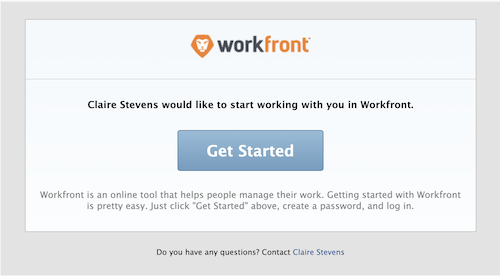

# E-Mail-Einladungen für neue Benutzer verwalten

<!--

*** DON'T DELETE, DRAFT OR HIDE THIS ARTICLE. IT IS LINKED TO THE PRODUCT, THROUGH THE CONTEXT SENSITIVE HELP LINKS. **

-->

>[!IMPORTANT]
>
>Das auf dieser Seite beschriebene Verfahren gilt nur für Organisationen, die noch nicht in die Admin Console integriert wurden. Wenn Ihr Unternehmen in der Adobe Admin Console integriert wurde, müssen Sie diese Aktion über die Adobe Admin Console durchführen.
>
>Eine Liste der Verfahren, die je nachdem, ob Ihr Unternehmen in die Adobe Admin Console integriert wurde, unterschiedlich sind, finden Sie unter [Plattformbasierte Verwaltungsunterschiede (Adobe Workfront/Adobe Business Platform)](../../../administration-and-setup/get-started-wf-administration/actions-in-admin-console.md).

Als Adobe Workfront-Administrator können Sie Workfront mithilfe von E-Mail-Einladungen Benutzer hinzufügen und diese über das Hinzufügen benachrichtigen.

Die Einladung per E-Mail ermöglicht es neuen Benutzern, einem Link zu folgen, über den sie ein Kennwort für ihr Workfront-Konto auswählen können. Anschließend können sie die Einrichtung ihres Kontos abschließen.

Um die Sicherheit der neuen Konten zu gewährleisten, empfehlen wir Ihnen, E-Mail-Einladungen für Ihre neuen Benutzer zu verwenden, damit diese ihr eigenes Kennwort wählen können. Alternativ können Sie bei der Erstellung des Kontos auch ein Kennwort für einen neuen Benutzer auswählen. Weitere Informationen zum Hinzufügen neuer Benutzer zu Workfront finden Sie unter [Benutzer hinzufügen](../../../administration-and-setup/add-users/create-and-manage-users/add-users.md).

Sie können die neuen Benutzer-E-Mails für Folgendes konfigurieren:

* Jeder neue Benutzer, der zu Workfront hinzugefügt wurde
* Benutzer, die Workfront mit einer Requestor-Lizenz hinzugefügt wurden

Alle neuen Benutzer sehen dieselbe E-Mail, wenn eine Einladung in eine E-Mail gesendet wird.

Informationen zum Empfang von E-Mail-Einladungen finden Sie unter [E-Mail-Einladungen empfangen und ein Kennwort für Adobe Workfront erstellen](../../../workfront-basics/manage-your-account-and-profile/managing-your-workfront-account/receive-email-invitations.md).

## Zugriffsanforderungen

Sie müssen über folgenden Zugriff verfügen, um die Schritte in diesem Artikel ausführen zu können:

<table style="table-layout:auto"> 
 <col> 
 <col> 
 <tbody> 
  <tr> 
   <td role="rowheader">Adobe Workfront-Abo</td> 
   <td>Alle</td> 
  </tr> 
  <tr> 
   <td role="rowheader">Adobe Workfront-Lizenz</td> 
   <td>Plan</td> 
  </tr> 
  <tr> 
   <td role="rowheader">Konfigurationen auf Zugriffsebene</td> 
   <td> 
Systemadministrator
 </td> 
  </tr> 
 </tbody> 
</table>

## E-Mail-Einladungen generieren {#generate-email-invitations}

E-Mail-Einladungen werden in den folgenden Szenarien generiert:

* Wenn Sie einen neuen Benutzer erstellen und die **Eine Einladungs-E-Mail an diese Person senden** auf **Neuer Benutzer** Formular. Weitere Informationen zum Erstellen neuer Benutzer finden Sie unter [Benutzer hinzufügen](../../../administration-and-setup/add-users/create-and-manage-users/add-users.md).
* Wenn Sie mehrere neue Benutzer importieren, wählen Sie die **Einladungs-E-Mails an diese Personen senden** -Option. Weitere Informationen zum Importieren mehrerer neuer Benutzer finden Sie unter [Benutzer importieren](../../../administration-and-setup/add-users/create-and-manage-users/import-users.md).
* Nachdem die Benutzer erstellt wurden, können Sie die Einladungen manuell für Benutzer generieren, die ihr Konto noch nicht bei Workfront registriert haben und noch kein Workfront-Kennwort festgelegt haben.\
  Benutzer, die ein Konto erstellt, aber noch kein Konto registriert haben, werden als **Nicht registriert** in Workfront.

  >[!NOTE]
  >
  >Wenn Sie die **Diese Person per E-Mail einladen** Wenn Sie den Benutzer erstellen, kann die E-Mail-Einladung nicht manuell generiert werden. Das manuelle Zurücksetzen der E-Mail-Einladungen ist nur für Benutzer möglich, die zum Zeitpunkt der Kontoerstellung die ursprüngliche E-Mail-Einladung erhalten haben. Weitere Informationen zum Erstellen neuer Benutzer finden Sie unter [Benutzer hinzufügen](../../../administration-and-setup/add-users/create-and-manage-users/add-users.md).

So generieren Sie manuell E-Mail-Einladungen für bestehende nicht registrierte Benutzer:

1. Klicken Sie auf **Hauptmenü** icon  Klicken Sie oben rechts in Adobe Workfront auf **Benutzer** .
1. Wählen Sie den Benutzer aus, der die **Nicht registriert** nach ihrem Namen.

   

1. Klicken Sie auf das Symbol Mehr . Klicken Sie auf **Benutzer zur Registrierung erinnern**.

   Dem neuen Benutzer wird eine E-Mail-Einladung mit einem neuen Link gesendet, den er zum Erstellen seines Workfront-Kennworts verwenden kann.

   >[!NOTE]
   >
   >Wenn Ihr Unternehmen in die Admin Console integriert wurde und Sie einen Benutzer über Workfront hinzufügen, haben Sie keine Möglichkeit, eine Einladung per E-Mail an neue Benutzer zu senden.
   >
   >Neue Adobe-Benutzer werden der Admin Console hinzugefügt und die Admin Console stellt eine E-Mail bereit, um sie zum Abschluss des Registrierungsprozesses einzuladen. Alle Benutzer müssen den Registrierungsprozess abschließen, um auf ein beliebiges Adobe-System zugreifen zu können.
   >
   >Für bestehende Adobe-Benutzer kann der Benutzer eine E-Mail über die Verfügbarkeit von Workfront erhalten oder auch nicht. Dies ist eine vom Adobe-Administrator kontrollierte Voreinstellung für das Produkt.

## E-Mail-Einladungen konfigurieren {#configure-email-invitations}

Als Workfront-Administrator können Sie die Nachricht konfigurieren, die Sie in die E-Mail-Einladungen für neue Benutzer einfügen.

1. Klicken Sie auf **Hauptmenü** icon  Klicken Sie oben rechts in Adobe Workfront auf **Einrichtung** .

1. Klicken Sie links in der Liste auf **Email** > **Einladungen**.

1. Im **Allgemeine Optionen** -Abschnitt eine der folgenden Änderungen vornehmen:

   <table style="table-layout:auto"> 
    <col> 
    <col> 
    <tbody> 
     <tr> 
      <td role="rowheader"><strong>Einladungs-Links nach ... Tagen deaktivieren</strong> </td> 
      <td> 
Wählen Sie die Zeitspanne aus, nach der die E-Mail-Einladungen keinen gültigen Link mehr zu Workfront enthalten. Der Standardzeitraum beträgt 45 Tage.
 </td> 
     </tr> 
     <tr> 
      <td role="rowheader"><strong>Nachricht und/oder Dienstzeit einschließen</strong> </td> 
      <td> 
Wählen Sie diese Option aus, wenn Sie die Einladung für alle neuen Benutzer ändern möchten, die zu Workfront hinzugefügt wurden. Benutzer mit einer Requestor-Lizenz sind hiervon nicht betroffen.
 
       <ul> 
        <li><strong>Nachricht</strong>: Wenn Sie die E-Mail-Einladung für alle neuen Benutzer ändern möchten, geben Sie den Text an, den Sie in Ihre E-Mail-Einladungen aufnehmen möchten.</li> 
        <li><strong>Geschäftsbedingungen</strong>: Wenn Sie die E-Mail-Einladung für alle neuen Benutzer ändern möchten, geben Sie den Text, den Sie in Ihre E-Mail-Einladungen aufnehmen möchten, als Nutzungsbedingungen an. </li> 
        <li><strong>Meldung und/oder Dienstdauer für Helpdesk-Benutzer einschließen</strong>: Wählen Sie diese Option aus, wenn Sie die Einladung in die E-Mail für alle neuen Benutzer ändern möchten, die zu Workfront hinzugefügt wurden und über eine Requestor-Lizenz verfügen.</li> 
        <li><strong>Nachricht</strong>: Wenn Sie die Änderung der E-Mail-Einladung für alle neuen Benutzer mit einer Requestor-Lizenz auswählen, geben Sie den Text an, den Sie als E-Mail-Textkörper in Ihre E-Mail-Einladungen aufnehmen möchten.</li> 
        <li><strong>Geschäftsbedingungen</strong>: Wenn Sie die Änderung der Einladung in die E-Mail für alle neuen Benutzer mit einer Requestor-Lizenz auswählen, geben Sie den Text an, den Sie in Ihre E-Mail-Einladungen aufnehmen möchten. </li> 
        <li> 
Im <strong>Einladungsvorschau</strong> angezeigt, können Sie eine Vorschau Ihrer Einladung in eine E-Mail anzeigen. Wenn Sie sich dafür entschieden haben, eine benutzerdefinierte Nachricht in Ihre E-Mail-Einladung aufzunehmen, wird die angepasste Nachricht in diesem Bereich angezeigt.
 
  
 </li> 
       </ul> </td> 
     </tr> 
    </tbody> 
   </table>

1. Klicken Sie auf **Speichern**.
