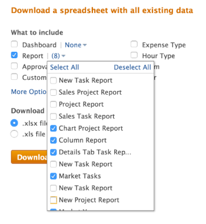

# Exportieren von Daten aus Workfront über Kickstarts

<!-- Audited: 2/2024 -->

<!--

***DON'T DELETE, DRAFT OR HIDE THIS ARTICLE. IT IS LINKED TO THE PRODUCT, THROUGH THE CONTEXT SENSITIVE HELP LINKS. **

-->

{{highlighted-preview}}

Als Adobe Workfront-Administrator können Sie den Kickstart-Datenexporteur verwenden, um Daten aus Workfront zu exportieren. Sie können sie in anderen Anwendungen verwenden, nachdem Sie sie exportiert haben.

Der Export von Daten über Kickstarts ist auch hilfreich, um zu verstehen, welche Felder mit den einzelnen Objekten verknüpft sind, wie diese Felder kodiert werden und wie die Werte dieser Felder in der Datenbank formatiert sind.

## Zugriffsanforderungen

+++ Erweitern Sie , um die Zugriffsanforderungen für die -Funktion in diesem Artikel anzuzeigen.

Sie müssen über folgenden Zugriff verfügen, um die Schritte in diesem Artikel ausführen zu können:

<table style="table-layout:auto"> 
 <col> 
 <col> 
 <tbody> 
  <tr> 
   <td role="rowheader">Adobe Workfront-Plan</td> 
   <td>Beliebig</td> 
  </tr> 
  <tr> 
   <td role="rowheader">Adobe Workfront-Lizenz</td> 
   <td>
   
Neu: Standard

   Oder
   
Aktuell: Plan

   </td> 
  </tr> 
  <tr> 
   <td role="rowheader">Konfigurationen der Zugriffsebene</td> 
   <td>[!UICONTROL Systemadministrator]</td>
  </tr> 
 </tbody> 
</table>

Weitere Informationen zu den Informationen in dieser Tabelle finden Sie unter [Zugriffsanforderungen in der Dokumentation zu Workfront](/help/quicksilver/administration-and-setup/add-users/access-levels-and-object-permissions/access-level-requirements-in-documentation.md).

+++

## Vor- und Nachteile der Verwendung von Kickstarts zum Datenexport

Es gibt zwei Möglichkeiten, Daten in Workfront zu exportieren:

* Exportieren von Daten aus einem Bericht oder einer Liste

  Weitere Informationen zum Exportieren von Daten aus einem Bericht oder einer Liste finden Sie unter [Exportieren von Daten](../../../reports-and-dashboards/reports/creating-and-managing-reports/export-data.md).

* Datenexport über Kickstarts

Die folgende Tabelle zeigt die Vor- und Nachteile jeder Methode:

<table style="table-layout:auto"> 
 <col> 
 <col> 
 <col> 
 <thead> 
  <tr> 
   <th>  </th> 
   <th> 
Die exportierten Daten enthalten Objekt- und Feldwerte
 </th> 
   <th> 
Fähigkeit, Daten um mehrere Objekttypen gleichzeitig zu exportieren
 </th> 
  </tr> 
 </thead> 
 <tbody> 
  <tr> 
   <td> 
<strong>Exportieren von Daten aus einer Listenansicht</strong> 
 
Weitere Informationen zum Exportieren von Daten aus einer Liste finden Sie unter <a href="../../../reports-and-dashboards/reports/creating-and-managing-reports/export-data.md" class="MCXref xref">Exportieren von Daten</a>
 </td> 
   <td> 
Ja
 
Sowohl native Workfront-Felder als auch benutzerdefinierte Felder, die mit den -Objekten verknüpft sind, werden exportiert.
 </td> 
   <td> 
Nein
 </td> 
  </tr> 
  <tr> 
   <td> 
<strong>Exportieren von Daten über Kickstarts</strong> 
 </td> 
   <td> 
Ja (begrenzt)
 
Die meisten nativen Workfront-Felder, die mit -Objekten verknüpft sind, werden exportiert, einige jedoch nicht. Beispielsweise können Sie die Felder „Zeitplan“, „Projektbesitzer“ oder „Projektsponsor“ nicht über einen Projekt-Kickstart-Export exportieren.
 
In einem Projekt, an das ein benutzerdefiniertes Formular angehängt ist, werden alle Daten, die in die Felder des Formulars eingegeben werden, nicht exportiert.
 
Sie können jedoch auch ein benutzerdefiniertes Formular exportieren. Die resultierende Datei listet die im Formular konfigurierten Felder auf, z. B. Textfelder und Optionsfelder.
 </td> 
   <td> 
Ja
 
Durch Kickstarts zum Exportieren von Workfront-Daten können Sie Daten, die sich auf mehrere Objekttypen beziehen, in einen einzigen Export exportieren. Sie können beispielsweise Aufgaben, Probleme und Projekte in einen einzigen Export einbeziehen.
 </td> 
  </tr> 
 </tbody> 
</table>

## Exportbeschränkungen

Beim Exportieren von Daten über Kickstarts (Daten werden im Excel-Dateiformat exportiert) bestehen die folgenden Einschränkungen:

* **50.000 Zeilen:** Die Anzahl der Zeilen, die in der Datei zulässig sind.
* **65.530 Hyperlinks:** Dies ist eine von Excel auferlegte Grenze für Dokumente, die mehr als 65.530 Hyperlinks enthalten. Diese Dokumente können nach dem Export nicht mehr geöffnet werden. Beachten Sie, dass ein Excel-Dokument möglicherweise nur 200 Datenzeilen enthält. Wenn das Dokument jedoch mehr als 65.530 Links enthält, wird es nicht geöffnet.

## Exportieren von Daten über Kickstarts

{{step-1-to-setup}}

1. Klicken Sie auf **System** > **Kickstarts** und dann auf **Daten exportieren.**

1. Wählen Sie das Objekt aus, das Sie exportieren möchten. Standardmäßig werden die folgenden Objekte unter „Was **einschließen** angezeigt:

   <table style="table-layout:auto"> 
    <col> 
    <col> 
    <col> 
    <thead> 
     <tr> 
      <th> 
<strong>Objekt</strong> 
 </th> 
      <th> 
<strong>Exportierte Tabellen der Excel-Datei</strong> 
 </th> 
      <th> 
 <strong>Exportformat</strong>
 </th> 
     </tr> 
    </thead> 
    <tbody> 
     <tr> 
      <td scope="col" valign="top"> 
Dashboard
 
 
 
 
 </td> 
      <td scope="col" valign="top"> 
Parameter Parameteroption Parametergruppe Kategorieparameter Kategorie Bericht Portalregisterkartenabschnitt dashboard preferences
 </td> 
      <td scope="col" valign="top"> PLZ</td> 
     </tr> 
     <tr> 
      <td scope="col" valign="top"> 
Bericht
 
 
 
 
 </td> 
      <td scope="col" valign="top">Parameter Parameteroption Parametergruppe Kategorieparameter Kategorie Bericht Voreinstellungen</td> 
      <td scope="col" valign="top"> PLZ </td> 
     </tr> 
     <tr> 
      <td scope="col" valign="top"> 
Genehmigung
 </td> 
      <td scope="col" valign="top"> 
Schritt Genehmiger Genehmigungsschritt Genehmigung Genehmigungsprozess Voreinstellungen
 </td> 
      <td scope="col" valign="top"> 
 Excel
 </td> 
     </tr> 
     <tr> 
      <td scope="col" valign="top"> 
Benutzerdefinierte Daten
 </td> 
      <td scope="col" valign="top"> 
Parameter Parameteroption Parametergruppe Kategorieparameter Kategorie Voreinstellungen
 </td> 
      <td scope="col" valign="top"> 
 Excel
 </td> 
     </tr> 
     <tr> 
      <td scope="col" valign="top"> 
Ausgabentyp
 </td> 
      <td valign="top"> 
Ausgabentyp/ 
 </td> 
      <td scope="col" valign="top"> 
Excel
 </td> 
     </tr> 
     <tr> 
      <td valign="top"> 
Stundentyp
 </td> 
      <td valign="top"> 
Stundentyp/ 
 </td> 
      <td scope="col" valign="top"> 
Excel
 </td> 
     </tr> 
     <tr> 
      <td valign="top"> 
Team
 </td> 
      <td valign="top"> Teammitglied Team preferences </td> 
      <td scope="col" valign="top"> 
 Excel
 </td> 
     </tr> 
     <tr> 
      <td valign="top"> 
Benutzerin oder Benutzer
 </td> 
      <td valign="top"> 
 
 </td> 
      <td valign="top"> 
 Excel
 </td> 
     </tr> 
    </tbody> 
   </table>

1. Klicken Sie auf **Weitere Optionen**, um die vollständige Liste der Objekte anzuzeigen.

   Alle hier aufgeführten Objekte können auch zum Importieren von Daten in Workfront verwendet werden.

   Die einzige Ausnahme ist das **Zugriffsebenen**-Objekt. Das Datenblatt Zugriffsebenen , das in einem Export enthalten ist, wird nur zu Referenzzwecken bereitgestellt. Damit können Sie einem neuen Benutzerkonto eine Zugriffsebene anhand der ID zuweisen.

   Weitere Informationen zum Importieren von Daten in Workfront über Kickstarts finden Sie unter [Importieren von Daten in Adobe Workfront mithilfe einer Kickstart-Vorlage](../../../administration-and-setup/manage-workfront/using-kick-starts/import-data-via-kickstarts.md). Im Folgenden finden Sie eine Liste aller Objekte, die über Kickstarts exportiert werden können:

   <table style="table-layout:auto"> 
    <col> 
    <col> 
    <col> 
    <thead> 
     <tr> 
      <th> 
Objekt
 </th> 
      <th> 
Exportierte Tabellen der Excel-Datei
 </th> 
      <th> 
Exportformat
 </th> 
     </tr> 
    </thead> 
    <tbody> 
     <tr> 
      <td scope="col" valign="top">Zugriffsebene</td> 
      <td scope="col" valign="top">Zugriffsebene Einstellungen</td> 
      <td scope="col" valign="top">Excel</td> 
     </tr> 
     <tr> 
      <td scope="col" valign="top">Zuweisung</td> 
      <td scope="col" valign="top">assignment preferences</td> 
      <td scope="col" valign="top">Excel</td> 
     </tr> 
     <tr> 
      <td scope="col" valign="top">Firma</td> 
      <td scope="col" valign="top"> company preferences </td> 
      <td scope="col" valign="top">Excel</td> 
     </tr> 
     <tr> 
      <td scope="col" valign="top">E-Mail-Vorlage</td> 
      <td scope="col" valign="top"> Email template preferences </td> 
      <td scope="col" valign="top">Excel</td> 
     </tr> 
     <tr> 
      <td scope="col" valign="top">Ausgabe</td> 
      <td valign="top">   </td> 
      <td scope="col" valign="top"> Excel</td> 
     </tr> 
     <tr> 
      <td valign="top">Externe Seite</td> 
      <td valign="top"> Externe Seite Voreinstellungen </td> 
      <td scope="col" valign="top">Excel</td> 
     </tr> 
     <tr> 
      <td valign="top">Filter</td> 
      <td valign="top">   </td> 
      <td valign="top">ZIP </td> 
     </tr> 
     <tr> 
      <td valign="top">Gruppe</td> 
      <td valign="top">    </td> 
      <td valign="top">Excel</td> 
     </tr> 
     <tr> 
      <td valign="top">Gruppierung</td> 
      <td valign="top"> grouping.  </td> 
      <td valign="top">ZIP</td> 
     </tr> 
     <tr> 
      <td valign="top">Stunde</td> 
      <td valign="top">   </td> 
      <td valign="top">Excel</td> 
     </tr> 
     <tr> 
      <td valign="top">Problem</td> 
      <td valign="top"> Anfrage Voreinstellungen </td> 
      <td valign="top">Excel</td> 
     </tr> 
     <tr> 
      <td valign="top">Aufgabengebiet</td> 
      <td valign="top"> Aufgabengebiet/  </td> 
      <td valign="top">Excel</td> 
     </tr> 
     <tr> 
      <td valign="top">Meilensteinpfad</td> 
      <td valign="top"> Milestone Milestone-Pfad Voreinstellungen </td> 
      <td valign="top">Excel </td> 
     </tr> 
     <tr> 
      <td valign="top">Notiz</td> 
      <td valign="top"> Hinweis Voreinstellungen </td> 
      <td valign="top">Excel</td> 
     </tr> 
     <tr> 
      <td valign="top">Portfolio</td> 
      <td valign="top"> Portfolios  preferences  </td> 
      <td valign="top">Excel</td> 
     </tr> 
     <tr> 
      <td valign="top">Projekt</td> 
      <td valign="top"> queue project routing rule queue topic preferences </td> 
      <td valign="top">Excel</td> 
     </tr> 
     <tr> 
      <td valign="top">Ressourcenkalkulation</td> 
      <td valign="top"> Ressourcenkalkulation/  </td> 
      <td valign="top">Excel</td> 
     </tr> 
     <tr> 
      <td valign="top">Ressourcen-Pool</td> 
      <td valign="top"> Ressourcenpool Voreinstellungen </td> 
      <td valign="top">Excel</td> 
     </tr> 
     <tr> 
      <td valign="top">Risiko</td> 
      <td valign="top">    </td> 
      <td valign="top">Excel</td> 
     </tr> 
     <tr> 
      <td valign="top">Risikotyp</td> 
      <td valign="top"> Risikotyp/   </td> 
      <td valign="top">Excel </td> 
     </tr> 
     <tr> 
      <td valign="top">Scorecard</td> 
      <td valign="top">Scorecard-Fragen Scorecard-Option Scorecard Voreinstellungen </td> 
      <td valign="top">Excel </td> 
     </tr> 
     <tr> 
      <td valign="top">Aufgabe</td> 
      <td valign="top">   </td> 
      <td valign="top">Excel </td> 
     </tr> 
     <tr> 
      <td valign="top">Vorlage</td> 
      <td valign="top"> queue template routing rule queueTopic preferences </td> 
      <td valign="top">Excel  </td> 
     </tr> 
     <tr> 
      <td valign="top">Vorlagenzuweisung</td> 
      <td valign="top"> Vorlagenzuweisung Einstellungen </td> 
      <td valign="top">Excel </td> 
     </tr> 
     <tr> 
      <td valign="top">Vorlagenaufgabe</td> 
      <td valign="top"> Vorlagenaufgabe/  </td> 
      <td valign="top">Excel </td> 
     </tr> 
     <tr> 
      <td valign="top">Arbeitszeittabelle</td> 
      <td valign="top"> Arbeitszeittabellen-Profil Arbeitszeittabelle Voreinstellungen </td> 
      <td valign="top">Excel  </td> 
     </tr> 
     <tr> 
      <td valign="top"> Anzeigen </td> 
      <td valign="top">    </td> 
      <td valign="top">ZIP</td> 
     </tr> 
    </tbody> 
   </table>

1. Klicken Sie auf **Herunterladen.**

   Die exportierte Kickstart-Datei wird entweder als Excel-Datei oder als heruntergeladen. komprimierte Datei, die mehrere Excel- und Eigenschaftendateien enthält. Jede Excel-Datei ist eine Sammlung von Blättern, wobei jedes Blatt ein Feld darstellt, das mit dem ausgewählten Objekt verknüpft ist. Jedem Export ist **Blatt** Eigenschaften“ zugeordnet.

   Mit den **Dashboard** und **Report** können Sie bestimmte Dashboards und Berichte auswählen, die in den Download aufgenommen werden sollen. Sie können nur Dashboards exportieren, die systemweit freigegeben sind.

   Matrixberichte können nicht exportiert werden. Weitere Informationen zu Matrixberichten finden Sie unter [Erstellen eines Matrixberichts](../../../reports-and-dashboards/reports/creating-and-managing-reports/create-matrix-report.md).

   Kickstarts unterstützen keine Textmodusfilter oder Gruppierungen. Für einen erfolgreichen Export müssen die Berichtsfilter und Gruppierungen in den Standardmodus umgeschaltet werden.

   Sie können in einem Export bis zu 100 Dashboards und 100 Berichte auswählen.

   Beispielbild in der Vorschau-Umgebung:
   

   Beispielbild in der Produktionsumgebung:
   

   Sie können mehrere Objekte gleichzeitig exportieren.

1. (Empfohlen) Analysieren Sie die exportierten Daten, um sicherzustellen, dass alle erwarteten Informationen exportiert wurden.

   Bei großen Exporten arbeitet Workfront im Hintergrund, um die Excel-Datei zu erstellen, und gibt Ihnen eine Warnmeldung über die Verzögerung. Die Kickstart-Datei wird Ihnen nach Abschluss des Downloads per E-Mail zugeschickt.

