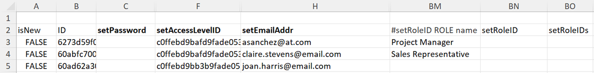

# Importieren von Daten in Workfront mithilfe einer Kickstart-Vorlage

<!--Audited: 12/2023-->

Kickstarts sind speziell formatierte Excel-Arbeitsmappen, die Sie mit Daten füllen können, die Sie in Workfront importieren möchten. Adobe Workfront bietet eine Kickstart-Vorlage, die Sie dazu verwenden können, wie unter [Datenimport über Kickstarts](../../../administration-and-setup/manage-workfront/using-kick-starts/kick-starts-data-importer.md) erläutert.

Dieses Verfahren ist in die folgenden drei Hauptaufgaben unterteilt:

* Zuerst exportieren Sie eine Kickstart-Vorlage als Arbeitsblattdatei
* Dann füllen Sie das Arbeitsblatt mit Ihren Daten
* Schließlich importieren Sie das ausgefüllte Arbeitsblatt in Workfront

Jedes dieser Verfahren wird in der entsprechenden Reihenfolge in diesem Artikel beschrieben.

## Zugriffsanforderungen

+++ Erweitern, um die Zugriffsanforderungen für die in diesem Artikel beschriebene Funktionalität anzuzeigen.

<table style="table-layout:auto"> 
 <col> 
 <col> 
 <tbody> 
  <tr> 
   <td>Adobe Workfront-Paket</td> 
   <td>
Beliebig
</td> 
  </tr> 
  <tr> 
   <td>Adobe Workfront-Lizenz</td> 
   <td>
Standard

       
Abo
</td>
  </tr> 
  <tr> 
   <td>Konfigurationen der Zugriffsebene</td> 
   <td>Systemadmin</td> 
  </tr> 
 </tbody> 
</table>

Weitere Informationen finden Sie unter [Zugriffsanforderungen in der Dokumentation zu Workfront](/help/quicksilver/administration-and-setup/add-users/access-levels-and-object-permissions/access-level-requirements-in-documentation.md).

+++

## Einschränkungen

Mithilfe einer Kickstart-Vorlage können Sie eine große Anzahl an Objekten in Workfront importieren. Beachten Sie jedoch die folgenden Einschränkungen:

* Durch das Importieren von Daten auf diese Weise werden Informationen zu Einträgen nicht aktualisiert, die bereits in Workfront vorhanden sind.
* Sie können nur neue Einträge und die zugehörigen Informationen importieren.
* Importieren Sie maximal 2.000 Einträge gleichzeitig, um sicherzustellen, dass beim Import keine Zeitüberschreitung auftritt

## Exportieren einer Kickstart-Vorlage als Arbeitsblattdatei

Wenn Sie eine Kickstart-Vorlage exportieren, erhalten Sie eine leere Excel-Arbeitsmappe. Nachdem das Arbeitsblatt auf Ihren Computer heruntergeladen wurde, können Sie es mit Ihren Informationen füllen und anschließend wieder in Workfront importieren.

So exportieren Sie eine Kickstart-Vorlage:

{{step-1-to-setup}}

<!--
1. Click the **Main Menu** icon  in the upper-right corner of Adobe Workfront, then click **Setup** .
-->

1. Klicken Sie auf **System** > **Daten importieren (Kickstarts)**.

1. Wählen Sie die Art der Informationen aus, die Sie einbeziehen möchten.

   Jede von Ihnen ausgewählte Option stellt eine Sammlung mehrerer Registerkarten im exportierten Arbeitsblatt dar. Wenn Sie beispielsweise die Option **Bericht** auswählen, werden alle erforderlichen Objekte zum Erstellen eines Berichts in das Arbeitsblatt aufgenommen (Ansichten, Filter, Gruppierungen, Berichte).

   Sie können alle unten aufgeführten Objekttypen verwenden, um Daten in Workfront zu importieren. (Die einzige Ausnahme ist die Option „Zugriffsebenen“. Das Datenblatt „Zugriffsebenen“ in einem Export wird zu Referenzzwecken bereitgestellt – es ermöglicht Ihnen, einem neuen Benutzerkonto eine Zugriffsebene per ID zuzuweisen.)

   Die Vorlage für jeden Objekttyp kann in den folgenden Dateiformaten exportiert werden und enthält die folgenden Blätter:

   <table style="table-layout:auto"> 
    <col> 
    <col> 
    <col> 
    <thead> 
     <tr> 
      <th> 
<strong>Objekt</strong> 
 </th> 
      <th> 
<strong>Exportiert als</strong> 
 </th> 
      <th> 
<strong>Blätter im exportierten Arbeitsblatt</strong> 
 </th> 
     </tr> 
    </thead> 
    <tbody> 
     <tr> 
      <td scope="col"> 
Dashboard
 
Alle öffentlich freigegebenen Dashboards im System können exportiert werden. Dashboards, die nicht systemweit freigegeben sind, können nicht exportiert werden. Sie können bis zu 100 Dashboards in einem einzelnen Export auswählen.
 </td> 
      <td scope="col">Exportiert als ZIP-Datei</td> 
      <td scope="col"> 
Parameter
 
Beschreibender Text

Parameteroption
 
Parametergruppe
 
Kategorieparameter
 
Kategorie
 
Bericht
 
Portal-Registerkarten-Abschnitt
 
Dashboard
 
Einstellungen
 </td> 
     </tr> 
     <tr> 
      <td scope="col"> 
Bericht
 
Alle Berichte im System können exportiert werden. Sie können bis zu 100 Berichte in einem einzelnen Export auswählen.
 
Kickstarts unterstützen keine Textmodusfilter oder Gruppierungen. Für einen erfolgreichen Export muss für Berichtsfilter und Gruppierungen in den Standardmodus gewechselt werden.
 </td> 
      <td scope="col">Exportiert als ZIP-Datei </td> 
      <td scope="col"> 
Parameter
 
Beschreibender Text
 
Parameteroption
 
Parametergruppe
 
Kategorieparameter
 
Kategorie
 
Bericht
 
Einstellungen
 </td> 
     </tr> 
     <tr> 
      <td scope="col"> 
Genehmigung
 </td> 
      <td scope="col"> 
Exportiert als Excel-Datei
 </td> 
      <td scope="col"> 
Genehmigende Person für Phase
 
Genehmigungsphase
 
Genehmigung
 
Genehmigungsprozess
 
Einstellungen
 </td> 
     </tr> 
     <tr> 
      <td scope="col"> 
Benutzerdefinierte Daten
 </td> 
      <td scope="col"> 
Exportiert als Excel-Datei
 </td> 
      <td scope="col"> 
Parameter
 
Beschreibender Text
  
Parameteroption
 
Parametergruppe
 
Kategorieparameter
 
Kategorie
 
Einstellungen
 </td> 
     </tr> 
     <tr> 
      <td scope="col"> 
Ausgabentyp
 </td> 
      <td scope="col"> 
Exportiert als Excel-Datei
 </td> 
      <td> 
Ausgabentyp
 
Einstellungen
 </td> 
     </tr> 
     <tr> 
      <td> 
Stundentyp
 </td> 
      <td scope="col"> 
Exportiert als Excel-Datei
 </td> 
      <td> 
Stundentyp
 
Einstellungen
 </td> 
     </tr> 
     <tr> 
      <td> 
Team
 </td> 
      <td scope="col"> 
Exportiert als Excel-Datei
 </td> 
      <td> 
 Team-Mitglied
 
Team
 
Einstellungen 
 </td> 
     </tr> 
     <tr> 
      <td> 
Benutzerin oder Benutzer
 </td> 
      <td> 
Exportiert als Excel-Datei. Um die vollständige Liste der Optionen anzuzeigen, klicken Sie auf <strong>Weitere Optionen</strong>.
 </td> 
      <td> 
Benutzerin oder Benutzer
 
Einstellungen
 </td> 
     </tr> 
     <tr> 
      <td>Zugriffsebene</td> 
      <td>Exportiert als Excel-Datei</td> 
      <td> 
Zugriffsebene
 
Einstellungen
 </td> 
     </tr> 
     <tr> 
      <td>Zuweisung</td> 
      <td>Exportiert als Excel-Datei</td> 
      <td> 
Zuweisung
 
Einstellungen
 </td> 
     </tr> 
     <tr> 
      <td>Firma</td> 
      <td>Exportiert als Excel-Datei</td> 
      <td> 
 Firma
 
Einstellungen 
 </td> 
     </tr> 
     <tr> 
      <td>E-Mail-Vorlage</td> 
      <td>Exportiert als Excel-Datei</td> 
      <td> 
E-Mail-Vorlage
 
Einstellungen 
 </td> 
     </tr> 
     <tr> 
      <td>Ausgabe</td> 
      <td>Exportiert als Excel-Datei</td> 
      <td> 
 Ausgabe
 
Einstellungen 
 </td> 
     </tr> 
     <tr> 
      <td>Externe Seite</td> 
      <td>Exportiert als Excel-Datei</td> 
      <td> 
 Externe Seite
 
Einstellungen 
 </td> 
     </tr> 
     <tr> 
      <td>Filter</td> 
      <td>Exportiert als ZIP-Datei</td> 
      <td> 
 Filter
 
Einstellungen 
 </td> 
     </tr> 
     <tr> 
      <td>Gruppe</td> 
      <td>Exportiert als Excel-Datei</td> 
      <td> 
 Gruppe
 
Einstellungen 
 </td> 
     </tr> 
     <tr> 
      <td>Gruppierung</td> 
      <td>Exportiert als ZIP-Datei</td> 
      <td> 
 Gruppierung
 
Einstellungen 
 </td> 
     </tr> 
     <tr> 
      <td>Stunde</td> 
      <td>Exportiert als Excel-Datei</td> 
      <td> 
 Stunde
 
Einstellungen 
 </td> 
     </tr> 
     <tr> 
      <td>Problem</td> 
      <td>Exportiert als Excel-Datei</td> 
      <td> 
 Problem
 
Einstellungen 
 </td> 
     </tr> 
     <tr> 
      <td>Aufgabengebiet</td> 
      <td>Exportiert als Excel-Datei</td> 
      <td> 
 Aufgabengebiet
 
Einstellungen 
 </td> 
     </tr>

   <tr> 
      <td>Meilensteinpfad</td> 
      <td> Exportiert als Excel-Datei</td> 
      <td> 
 Meilenstein
 
Meilensteinpfad
 
Einstellungen 
 </td> 
     </tr>

   <tr> 
      <td>Notiz</td> 
      <td>Exportiert als Excel-Datei</td> 
      <td> 
 Notiz
 
Einstellungen 
 </td> 
     </tr> 
     <tr> 
      <td>Portfolio</td> 
      <td>Exportiert als Excel-Datei</td> 
      <td> 
 Portfolio
 
Einstellungen 
 </td> 
     </tr> 
     <tr> 
      <td>Projekt</td> 
      <td>Exportiert als Excel-Datei</td> 
      <td> 
 Warteschlange
 
Projekt
 
Routing-Regel
 
Warteschlangen-Thema
 
Einstellungen 
 </td> 
     </tr> 
     <tr> 
      <td>Ressourcenkalkulation</td> 
      <td>Exportiert als Excel-Datei</td> 
      <td> 
 Ressourcenkalkulation
 
Einstellungen 
 </td> 
     </tr> 
     <tr> 
      <td>Risiko</td> 
      <td>Exportiert als Excel-Datei</td> 
      <td> 
 Risiko
 
Einstellungen 
 </td> 
     </tr> 
     <tr> 
      <td>Risikotyp</td> 
      <td> Exportiert als Excel-Datei</td> 
      <td> 
 Risikotyp
 
Einstellungen
 </td> 
     </tr> 
     <tr> 
      <td>Scorecard</td> 
      <td>Exportiert als Excel-Datei</td> 
      <td> 
Scorecard-Frage
 
Scorecard-Option
 
Scorecard
 
Einstellungen 
 </td> 
     </tr> 
     <tr> 
      <td>Aufgabe</td> 
      <td>Exportiert als Excel-Datei</td> 
      <td> 
 Aufgabe
 
Einstellungen 
 </td> 
     </tr> 
     <tr> 
      <td>Vorlage</td> 
      <td> Exportiert als Excel-Datei</td> 
      <td> 
 Warteschlange
 
Vorlage
 
Routing-Regel
 
Warteschlangen-Thema
 
Einstellungen 
 </td> 
     </tr> 
     <tr> 
      <td>Vorlagenzuweisung</td> 
      <td>Exportiert als Excel-Datei</td> 
      <td> 
 Vorlagenzuweisung
 
Einstellungen 
 </td> 
     </tr> 
     <tr> 
      <td>Vorlagenaufgabe</td> 
      <td>Exportiert als Excel-Datei</td> 
      <td> 
 Vorlagenaufgabe
 
Einstellungen 
 </td> 
     </tr> 
     <tr> 
      <td>Arbeitszeittabelle</td> 
      <td> Exportiert als Excel-Datei</td> 
      <td> 
 Arbeitszeittabellenprofil
 
Arbeitszeittabelle
 
Einstellungen 
 </td> 
     </tr> 
     <tr> 
      <td>Ansicht </td> 
      <td> 
Exportiert als ZIP-Datei
 </td> 
      <td> 
 Ansicht
 
Einstellungen 
 </td> 
     </tr> 
    </tbody> 
   </table>

1. Klicken Sie auf **Herunterladen**.
1. Fahren Sie mit [Füllen des Tabellenarbeitsblatts mit Ihren Daten](#populate-the-spreadsheet-template-with-your-data) fort, um das leere Tabellenarbeitsblatt mit Ihren Informationen zu füllen.

## Füllen des Tabellenarbeitsblatts mit Ihren Daten {#populate-the-spreadsheet-template-with-your-data}

* [Überblick über die im Arbeitsblatt enthaltenen Registerkarten (Datenblätter)](#overview-of-the-tabs-data-sheets-included-in-the-spreadsheet)
* [Importieren eines Eintrags](#import-a-record)
* [Einfügen von Datumsangaben](#include-dates)
* [Verwenden von Platzhaltern](#use-wildcards)
* [Ersetzung von IDs durch Attributnamen](#attribute-name-substitution-for-ids)

### Überblick über die im Arbeitsblatt enthaltenen Registerkarten (Datenblätter)

>[!TIP]
>
>Um besser zu verstehen, wie Sie die Informationen in den einzelnen Spalten formatieren müssen, wenn Sie die Kickstart-Vorlage ausfüllen, sollten Sie einen Übungslauf durchführen, indem Sie einen Kickstart mit den vorhandenen Workfront-Daten für die Objekte exportieren, die Sie importieren möchten. Anweisungen dazu finden Sie unter [Exportieren von Daten aus Adobe Workfront über Kickstarts](../../../administration-and-setup/manage-workfront/using-kick-starts/export-data-from-wf-via-kick-starts.md).

Wenn Sie eine leere Kickstart-Vorlage öffnen, steht eine Reihe von Registerkarten (Datenblätter) zur Verfügung. Sie richten sich nach den Objekten, die Sie zum Herunterladen ausgewählt haben. Jede Komponente stellt ein Objekt in der Anwendung dar, z. B. ein Projekt, Aufgaben, Stunden, ein Dashboard und Benutzende:

Wenn Sie eine dieser Registerkarten öffnen, zeigt Zeile 2 die Felder für jedes Objekt an, das während eines Imports festgelegt werden kann. In einer Spaltenüberschrift wird nach dem Wort „set“ der Name des Feldes so angezeigt, wie er in der Datenbank angezeigt wird. Diese Felder dienen als Spaltenüberschriften.

>[!IMPORTANT]
>
>Um Fehler zu vermeiden, stellen Sie Folgendes sicher:
>
>* Löschen Sie die leere erste Zeile eines Kickstart-Arbeitsblatts nicht.
>* Diese Felder (Spaltenüberschriften) dürfen in keiner Weise gelöscht, geändert oder neu angeordnet werden. Ändern Sie beispielsweise weder ihre Reihenfolge noch ihren Namen.
>* Fügen Sie jedem Feld, das in der Spaltenüberschrift fett dargestellt wird, Werte hinzu. Dabei handelt es sich um Pflichtfelder.
>
>     Wenn ein Pflichtfeld jedoch einen in den Systemeinstellungen festgelegten Standardwert enthält, müssen Sie keine Angabe machen.
>
>     Auf der Registerkarte **PROJ Project** können beispielsweise die Felder **setCondition** und **setConditionType** leer gelassen werden, die Spalten **setGroupID** und **setName** jedoch nicht.
>
>* Bestimmte Felder, darunter **setResourceRevenue** und **setEnteredByID**, werden automatisch vom System generiert. Wenn Sie Daten für diese Felder in das Arbeitsblatt eingeben, überschreibt der Kickstart-Prozess diese Daten beim Hochladen des Arbeitsblatts.

### Importieren eines Eintrags  {#import-a-record}

Jede Zeile des Blattes entspricht einem eindeutigen Objekt.

1. Fügen Sie Informationen in der Spalte **isNew** hinzu:

   * Wenn das zu importierende Objekt neu ist, geben Sie **WAHR** ein, um die Daten in die Zeile zu importieren. Bei diesem Wert wird zwischen Groß- und Kleinschreibung unterschieden. Er muss immer in Großbuchstaben geschrieben werden
   * Wenn sich das Objekt bereits in Workfront befindet, geben Sie **FALSCH** in die Spalte **isNew** ein, damit die Zeile ignoriert wird. Bei diesem Wert wird zwischen Groß- und Kleinschreibung unterschieden. Er muss immer in Großbuchstaben geschrieben werden

      * Einträge, die bereits in Workfront vorhanden sind, werden nicht aktualisiert.
      * Wenn Sie eine Vorlage mit Daten aus Workfront heruntergeladen haben, sind vorhandene Objekte bereits mit **FALSCH** gekennzeichnet.
      * Wenn Sie eine leere Vorlage heruntergeladen haben, müssen Sie keine neuen Zeilen für vorhandene Objekte hinzufügen.

1. Fügen Sie Informationen in der Spalte **ID** auf eine der folgenden Arten hinzu:

   * Wenn das zu importierende Objekt neu ist (und Sie **WAHR** in der Spalte **isNew** eingegeben haben), geben Sie eine beliebige Zahl als ID ein. Diese Zahl muss im Arbeitsblatt eindeutig sein. Wenn Sie beispielsweise drei Objekte importieren, können Sie ihnen die ID 1, 2 bzw. 3 zuweisen.

   * Wenn das Objekt bereits in Workfront vorhanden ist (und **FALSE** in der Spalte **isNew** angegeben wurde) und Sie neue Informationen über vorhandene Objekte importieren, muss die ID die alphanumerische GUID sein, die in Workfront für dieses Objekt vorhanden ist.

   >[!TIP]
   >
   > Um die eindeutige GUID eines Objekts in Workfront zu ermitteln, können Sie einen Bericht für dieses Objekt erstellen und die ID-Spalte zum Bericht hinzufügen. Der Wert für jedes Objekt in dieser Spalte ist die GUID des Objekts.

   * Einträge, die bereits in Workfront vorhanden sind, werden nicht aktualisiert.
   * Wenn Sie eine Vorlage mit Daten heruntergeladen haben, enthalten vorhandene Objekte bereits die GUID als ID.
   * Sie können ein neues Objekt importieren, das auf einem vorhandenen Objekt basiert, indem Sie **FALSCH** in der Spalte **isNew** in **WAHR** ändern, die ID ändern und vor dem Import die erforderlichen Datenanpassungen vornehmen.

   

   * Beim Importieren eines Projekts müssen Sie eine Gruppen-ID angeben.

      * Wenn die Gruppe bereits in Workfront vorhanden ist, müssen Sie ihre eindeutige ID zum Feld **setGroupID** für das Projekt hinzufügen.
      * Wenn die Gruppe in Workfront nicht vorhanden ist, können Sie das Blatt **GROUP Group** zu Ihrer Importdatei hinzufügen, das Feld **isNew** im Gruppenblatt auf **WAHR** festlegen und in der Spalte **ID** eine numerische ID für die neue Gruppe angeben. Das Feld **setGroupID** für das neue Projekt muss mit der numerischen **ID** für die neue Gruppe übereinstimmen.

     **Beispiel** Für ein Projekt muss der in der Spalte **setGroupID** angezeigte Wert einer der folgenden sein:

      * Die GUID für eine bestehende Gruppe in Ihrer Workfront-Instanz
      * Der Wert (Zahl) in der Spalte „ID“ im Blatt **GROUP Group**, wenn Sie beim Import eine neue Gruppe erstellen

1. Geben Sie Werte für die erforderlichen Felder und alle anderen Felder ein, die Sie beim Import ausfüllen möchten.
1. (Optional) So fügen Sie benutzerdefinierte Daten hinzu:

   * Erstellen Sie für jedes benutzerdefinierte Feld, das Sie in den Importvorgang einbeziehen möchten, eine neue Spalte.
   * Benennen Sie jede neue Spalte für das entsprechende benutzerdefinierte Feld wie folgt: **DE:[Name des benutzerdefinierten Feldes, wie es in Workfront angezeigt wird]**. Sie können beispielsweise das folgende benutzerdefinierte Feld erstellen: „DE: Departments“.
   * Geben Sie in die Spalte **setCategoryID** die GUID des vorhandenen benutzerdefinierten Formulars ein, in dem sich dieses benutzerdefinierte Feld befindet. Dieses Feld wird beim Import von benutzerdefinierten Daten benötigt.
   * Wenn Sie mehrere Datenwerte in dem benutzerdefinierten Feld hinzufügen müssen (z. B. Optionsfelder, Kontrollkästchen oder Listen), verwenden Sie das vertikale Balken-Trennzeichen für benutzerdefinierte Daten „|“, das auf der Registerkarte „Einstellungen“ aufgeführt ist, um die Werte zu trennen.

     **Beispiel** Geben Sie A|D unter der Spalte „DE:Departments“ ein, um Daten für Abteilung A und Abteilung D in Ihrem benutzerdefinierten Formular zu übernehmen.

     >[!NOTE]
     >
     >Verwenden Sie nur das Trennzeichen „|“, um benutzerdefinierte Feldwerte zu trennen. Sie können es in keiner der anderen Arbeitsblattspalten verwenden, einschließlich **setCategoryID**.

### Einfügen von Datumsangaben  {#include-dates}

Workfront kann die meisten Datumsformate verarbeiten. Sie müssen jedoch sicherstellen, dass die Datumsspalte im Arbeitsblatt als Datum formatiert ist. Der Import schlägt fehl, wenn die Spalte als „Allgemein“, „Zahl“ oder „Text“ formatiert ist.

>[!TIP]
>
>Das beliebteste Format ist das Format MM/TT/JJJJ.
>
>Beispiel: 07/10/2023.

Workfront akzeptiert auch Zeitwerte als Teil des Datums.

Beispiel: 07/10/2022 01:30 Uhr oder 07/10/2022 13:00 Uhr.

Wenn Sie eine Uhrzeit im Datum auslassen, führt Workfront einen der folgenden Schritte aus:

* Angenommen, die Uhrzeit ist 12:00 Uhr. Damit Sie das erwartete Ergebnis für das Datum sehen können, muss die Zeitzone des Systems mit Ihrer Zeitzone übereinstimmen.
* Wenn es sich in einem Objekt befindet, das mit einem Zeitplan verknüpft ist, bezieht sich die Zeit auf die früheste Zeit, die der Zeitplan zulässt.

>[!NOTE]
>
>Bei Verwendung eines UNIX-Zeitstempels müssen Sie drei zusätzliche Nullen am Ende des Werts angeben.
>
>Wenn Ihr Zeitstempel beispielsweise 7336899000 ist, geben Sie 7336899000000 in die Zelle ein.

### Verwenden von Platzhaltern {#use-wildcards}

Beim Ausfüllen des Arbeitsblatts für Ihre Kickstart-Vorlage können Sie die folgenden Platzhalter verwenden:

<table style="table-layout:auto"> 
 <col> 
 <col> 
 <thead> 
  <tr> 
   <th> 
<strong>Platzhalter</strong> 
 </th> 
   <th> 
<strong>Verhalten</strong> 
 </th> 
  </tr> 
 </thead> 
 <tbody> 
  <tr> 
   <td> 
$$TODAY
 </td> 
   <td> 
Wenn dieser Platzhalter im Feld <strong>setDate</strong> verwendet wird, legt er das Datum als Mitternacht am Tag des Kickstart-Imports fest.
 
Sie können den Platzhalter mit der Standardsyntax ändern, die mit dem Platzhalter für einen Filter zulässig ist.
 
Example: </b>"><b>Beispiel:</b> Wenn ein Projekt am Montag der Woche beginnen soll, in der es importiert wird, können Sie unabhängig von dem Tag, an dem der Import tatsächlich stattfindet, den Platzhalter <strong>$$TODAYbw</strong> verwenden. Damit wird das geplante Startdatum Ihres Projekts auf Sonntag, 00:00 Uhr festgelegt. Da der Zeitplan für das Projekt wahrscheinlich zu diesem Zeitpunkt keine Arbeit zulässt, beginnt es am Montagmorgen um 9:00 Uhr.
 </td> 
  </tr> 
  <tr> 
   <td> 
$$NOW
 </td> 
   <td> 
Wenn dieser Platzhalter im Feld <strong>setDate</strong> verwendet wird, legt er das Datum entsprechend dem Zeitpunkt fest, zu dem Sie den Eintrag während des Kickstart-Imports erstellen.
 
Sie können den Platzhalter mit der Standardsyntax ändern, die mit dem Platzhalter für einen Filter zulässig ist.
 
Example: </b>"><b>Beispiel: </b>Wenn ein Projekt 3 Stunden nach dem Import beginnen soll, können Sie <strong>$$NOW+3h</strong> verwenden.
 </td> 
  </tr> 
  <tr> 
   <td> 
$$USER.ID
 </td> 
   <td> 
Wenn dieser Platzhalter im Feld <strong>setAssignedToID</strong> oder einem anderen auf userID basierenden Feld verwendet wird, weist dieser Platzhalter die Arbeit zu oder verknüpft den Eintrag auf andere Weise mit der Person, die den Import durchführt.
 </td> 
  </tr> 
  <tr> 
   <td> 
$$CUSTOMER
 </td> 
   <td> 
Dieser Platzhalter wurde speziell für Kickstart-Benutzerimporte hinzugefügt. Beim Erstellen eines Workfront-Kontos wird ein Benutzer bzw. eine Benutzerin mit der Zugriffsebene „Systemadmin“ erstellt. Der dem Standardadmin zugewiesene Benutzername kann beim Erstellen von anderen Benutzenden im Konto als Präfix verwendet werden.
 
Da Benutzernamen für alle Kundinnen und Kunden eindeutig sein müssen, ist dieser Platzhalter nützlich, wenn Sie mehrere Personen mit sehr gängigen Namen wie beispielsweise Martin Müller haben, die möglicherweise den Benutzernamen „mmueller“ haben. Indem Sie bei Zuweisung des Benutzernamens den standardmäßigen Admin-Benutzernamen voranstellen, garantieren Sie, dass jeder Benutzername eindeutig ist (z. B.: <strong>$$CUSTOMER.mmueller</strong>).
 
Tipp: Eine elegantere Methode, um sicherzustellen, dass Benutzernamen systemweit eindeutig sind, besteht darin, die E-Mail-Adresse des Kontakts in das Feld <strong>setUsername</strong> einzugeben.
 </td> 
  </tr> 
 </tbody> 
</table>

### Ersetzung von IDs durch Attributnamen  {#attribute-name-substitution-for-ids}

Obwohl es eine Best Practice ist, nach Möglichkeit immer IDs zu verwenden, ist es manchmal unpraktisch, IDs von einem Blatt zum anderen zu referenzieren, wenn ein Wert des Typs **setAttributeID** festgelegt wird. Sie können Werte anhand des Namens referenzieren, indem Sie einfach die Spaltenüberschrift ändern.

**Beispiele:**

* **Projektimport**

  Legen Sie beim Importieren von Projekten die **setGroupID** der Projekte fest, indem Sie zum Blatt **GROUP Group** wechseln, die entsprechenden Gruppen-IDs notieren und sie in die richtigen Zellen (Spalte **setGroupID**) im Blatt **PROJ Project** einfügen.

  Dies ist möglich, wenn Sie nur mit wenigen Gruppen und Projekten arbeiten. Wenn Sie jedoch mit zahlreichen Gruppen und Projekten arbeiten, ist dies nicht praktikabel.

  Um die Ersetzung des Attributnamens für das oben beschriebene Beispiel durchzuführen, ändern Sie die Spaltenüberschrift **setGroupID** in **#setGroupID GROUP name**. Sie können dann nach Name auf die Gruppe der einzelnen Projekte verweisen.

  >[!NOTE]
  >
  >Die Option zur Verwendung der Attributnamensersetzung ist auf Verweise für vorhandene Einträge beschränkt. Sie können keine Namensersetzung für Objekte verwenden, die Sie im selben Import erstellen.

* **Benutzerimport**

  Füllen Sie beim Importieren von Benutzenden das Feld **setRoleID** auf der Registerkarte **ROLE Role** in einer Liste von Rollen aus.

  Einige der Rollen-IDs sind für Einträge vorgesehen, die bereits im Konto vorhanden sind, andere werden während des Imports erstellt.

  Für neue Benutzereinträge, die vorhandenen Rollen zugewiesen sind, können Sie die Namensersetzung verwenden. Für die neuen Benutzereinträge, die neu importierten Rollen zugewiesen wurden, ist dies nicht möglich.

  So können Sie beide Methoden für dieselbe Importdatei verwenden:

   * Fügen Sie im Arbeitsblatt links neben der Spalte **setRoleID** eine Spalte hinzu.
   * Benennen Sie die Spalte als **#setRoleID ROLE name**.
   * Für Rollenzuweisungen zu vorhandenen Einträgen geben Sie die Rollennamen in die Spalte **#setRoleID ROLE name** ein.

     Für Rollenzuweisungen zu neuen Rolleneinträgen geben Sie die ID ein, die Sie im Blatt „ROLE Rolle“ im Feld „setRoleID“ zugewiesen haben.

     

## Importieren der Arbeitsblattdaten in Workfront

Nachdem Sie die Excel-Vorlage mit Ihren Daten gefüllt haben, können Sie die Daten in Workfront hochladen.

Der Kickstart-Import unterstützt die folgenden Dateitypen:

* Excel (XLS oder XLSX)
* ZIP-Datei (die nur XLSX- oder XLS-Dateien enthält)

  >[!NOTE]
  >
  >Beim Importieren von Excel-Arbeitsblättern, die auf die folgenden Objekte verweisen, müssen Sie eine ZIP-Datei verwenden:
  >
  >* Berichte
  >* Dokumente
  >* Avatare
  >* Anzeigen, Filtern oder Gruppieren von Eigenschaftendateien
  >
  >Bei Verwendung einer komprimierten Importdatei muss die ZIP-Datei denselben Namen haben wie die XLSX- oder XLS-Datei und alle Dateien müssen sich auf derselben Strukturebene befinden (keine Ordner).

So importieren Sie die Arbeitsblattdaten der Vorlage in Workfront:

<!--1. Click the **Main Menu** icon  in the upper-right corner of Adobe Workfront, then click **Setup** .-->

{{step-1-to-setup}}

1. Klicken Sie auf **System** > **Daten importieren (Kickstarts)**.

1. Klicken Sie im Abschnitt **Daten mit Kickstart-Arbeitsblatt hochladen** auf **Datei auswählen**, suchen Sie nach dem ausgefüllten Arbeitsblatt und wählen Sie es aus.

   Die Datei wird automatisch hochgeladen und es wird eine Benachrichtigung angezeigt, dass der Import erfolgreich war.

   Wenn das Hochladen der Excel-Datei in Workfront länger als 5 Minuten dauert, tritt in der Anwendung ein Timeout auf und Workfront kann die Datei nicht hochladen. Importieren Sie Ihre Daten in kleineren Batches mit Objekten.

1. (Bedingt) Wenn der Import nicht erfolgreich war, erhalten Sie eine Fehlermeldung, die Sie über das Problem informiert. Versuchen Sie, das Feld, das Blatt und die Nummer der Zeile, in der das Problem aufgetreten ist, zu ermitteln, und korrigieren Sie die Angaben in der Excel-Datei. Versuchen Sie dann erneut, die Datei zu importieren.
1. (Bedingt) Wenn Sie Workfront Fusion verwenden, können Sie jetzt Ihre FLOs oder Szenarien nach Abschluss des Imports aktivieren.
