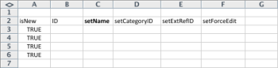
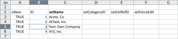
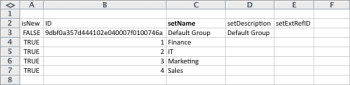

# Kick-Starts-Szenario: Vorbereitung von Unternehmen, Gruppe, Rolle und Kick-Start-Benutzern

Wenn Sie mit der Implementierung von Adobe Workfront beginnen, können Sie anstelle der manuellen Eingabe von Daten Ihre Kundenliste, Ihre internen Abteilungen, Ihre Jobrollen und Benutzerinformationen importieren.

## Zugriffsanforderungen

+++ Erweitern Sie , um die Zugriffsanforderungen für die Funktionalität in diesem Artikel anzuzeigen.

Sie müssen über folgenden Zugriff verfügen, um die Schritte in diesem Artikel ausführen zu können:

<table style="table-layout:auto"> 
 <col> 
 <col> 
 <tbody> 
  <tr> 
   <td role="rowheader">Adobe Workfront-Abo</td> 
   <td>Alle</td> 
  </tr> 
  <tr> 
   <td role="rowheader">Adobe Workfront-Lizenz</td> 
   <td>
   
 Neu: Standard

   oder
   
Aktuell: Plan
</td> 
  </tr> 
  <tr> 
   <td role="rowheader">Konfigurationen auf Zugriffsebene</td> 
   <td>[!UICONTROL Systemadministrator]</td> 
  </tr> 
 </tbody> 
</table>

Weitere Informationen zu den Informationen in dieser Tabelle finden Sie unter [Zugriffsanforderungen in der Workfront-Dokumentation](/help/quicksilver/administration-and-setup/add-users/access-levels-and-object-permissions/access-level-requirements-in-documentation.md).

+++

## Was Sie importieren können

In der folgenden Tabelle sind die zu importierenden Unternehmen, Gruppen und Rollen aufgeführt:

<table style="table-layout:auto"> 
 <col> 
 <col> 
 <col> 
 <thead> 
  <tr> 
   <th><strong>Unternehmen</strong> </th> 
   <th><strong>Gruppen</strong> </th> 
   <th><strong>Rollen</strong> </th> 
  </tr> 
 </thead> 
 <tbody> 
  <tr> 
   <td valign="top"> 
Acme, Co
 
Workfront, Inc.
 
<em>Ihr Unternehmen</em> 
 
XYZ, Inc.
 </td> 
   <td valign="top"> 
Finanzielle Details
 
IT 
 
Marketing 
 
Verkauf
 </td> 
   <td valign="top"> 
Geschäftsanalyst
 
Controller Creative
 
Entwerfende Person
 
Ressourcenmanager
 
Scrum Master
 
Technischer Schriftsteller
 
Webentwickler
 </td> 
  </tr> 
 </tbody> 
</table>

Rollennamen müssen eindeutig sein. Vorhandene Vorgangsrollen können nicht importiert werden.

In den folgenden Tabellen sind die zu importierenden Benutzer sowie verschiedene Benutzerattribute für jedes aufgeführt:

### Benutzer 1

| **Vorname** | Chris |
|---|---|
| **Nachname** | Beschneiden |
| **Benutzername/E-Mail** | mailto:cmanning@foo.com |
| **Kennwort** | updateMe |
| **Zugriff** | Teammitglied |
| **Firma** | &lt;*Ihr Unternehmen>* |
| **Home Group** | Marketing |
| **Auftragsrolle** | Geschäftsanalyst |

{style="table-layout:auto"}

### Benutzer 2

| **Vorname** | Jennifer |
|---|---|
| **Nachname** | Campbell |
| **Benutzername/E-Mail** | jcampbell@foo.com |
| **Kennwort** | updateMe |
| **Zugriff** | Project Manager |
| **Firma** | &lt;*Ihr Unternehmen>* |
| **Home Group** | Marketing |
| **Auftragsrolle** | Project Manager |

{style="table-layout:auto"}

### Benutzer 3

| **Vorname** | Jill |
|---|---|
| **Nachname** | Sullivan |
| **Benutzername/E-Mail** | jsullivan@foo.com |
| **Kennwort** | updateMe |
| **Zugriff** | Helpdesk |
| **Firma** | &lt;*Ihr Unternehmen>* |
| **Home Group** | Verkauf |
| **Auftragsrolle** | Vertriebsmitarbeiter |

{style="table-layout:auto"}

### Benutzer 4

| **Vorname** | Marc |
|---|---|
| **Nachname** | Lewis |
| **Benutzername/E-Mail** | mlewis@foo.com |
| **Kennwort** | updateMe |
| **Zugriff** | Portfolio-Manager |
| **Firma** | &lt;*Ihr Unternehmen>* |
| **Home Group** | Finanzielle Details |
| **Auftragsrolle** | Controller |

{style="table-layout:auto"}

### Benutzer 5

| **Vorname** | Pam |
|---|---|
| **Nachname** | Reynolds |
| **Benutzername/E-Mail** | preynolds@foo.com |
| **Kennwort** | updateMe |
| **Zugriff** | Project Manager |
| **Firma** | *Ihr Unternehmen>* |
| **Home Group** | Marketing |
| **Auftragsrolle** | IT |

{style="table-layout:auto"}

### Benutzer 6

| **Vorname** | Ray |
|---|---|
| **Nachname** | Andrews |
| **Benutzername/E-Mail** | randrews@foo.com |
| **Kennwort** | updateMe |
| **Zugriff** | Administrator |
| **Firma** | *Ihr Unternehmen>* |
| **Home Group** | Ressourcenmanager |
| **Auftragsrolle** | Keine |

{style="table-layout:auto"}

## Herunterladen einer Kick-Start-Vorlage

{{step-1-to-setup}}

1. Klicken Sie auf **System** > **Kick-Starts** > **Daten importieren**.

1. Klicken Sie auf **Mehr Optionen** , um die vollständige Liste der Importoptionen anzuzeigen.
1. Wählen Sie die zu importierenden Objekte &quot;Zugriffsstufe&quot;, &quot;Unternehmen&quot;, &quot;Gruppe&quot;, &quot;Auftragsrolle&quot;und &quot;Benutzer&quot;aus.

## Firmeninformationen eingeben

1. Öffnen Sie die soeben heruntergeladene Datei **Workfront.xlsx** .

   >[!TIP]
   >
   >Wenn Sie mit sehr großen Datenblättern arbeiten, sollten Sie das Freeze Pane-Tool (oder ein entsprechendes Tool) Ihres Tabelleneditors verwenden, um die Arbeit mit dieser Tabelle zu vereinfachen.

1. Gehen Sie in das Blatt &quot;CMPY Company&quot;.

   Es sollte leer sein, es sei denn, die Unternehmen sind bereits im System. 

   

1. Geben Sie TRUE in die Spalte **isNew** ein.
1. Wiederholen Sie diese Aktion für jedes hinzugefügte Unternehmen. (In diesem Beispiel führen Sie diese Aktion für die Zeilen 3-6 aus, da vier Unternehmen hinzugefügt werden.)

   

1. Geben Sie eine eindeutige ID an.

   Dies muss für jede Zeile der ID-Spalte erfolgen. Bei der Erstellung neuer Datensätze können Ganzzahlen ab 1 problemlos verwendet werden.

   

1. Legen Sie einen Namen fest.

   Geben Sie die Namen der einzelnen Kunden in der Spalte **setName** an.

   

1. Gehen Sie zum Gruppenblatt .

   Sofern Sie keine bereits in Workfront erstellten Gruppen erstellt haben, sollte dieses Blatt nur die Standardgruppe anzeigen, die mit jedem Konto von Workfront bereitgestellt wurde.

    

1. Legen Sie die Spalte **isNew** fest. Gemäß dem Szenario werden vier Gruppen importiert. Geben Sie daher für die Spalte &quot;isNew&quot;TRUE in die Zeilen 4 bis 7 an.
1. Geben Sie eine eindeutige ID an.

   Dies muss für jede Zeile der ID-Spalte erfolgen. Bei der Erstellung neuer Datensätze können Ganzzahlen ab 1 problemlos verwendet werden.

   

1. Legen Sie einen Namen fest.

   Geben Sie die Namen der einzelnen Abteilungen in der Spalte **setName** an.

   

   Geben Sie Rolleninformationen an. Gehen Sie zum ROLE Role-Blatt.

1. Sofern Sie keine Rollen in Ihrem Konto erstellt oder gelöscht haben, sollten in diesem Arbeitsblatt acht Rollen angezeigt werden, die für jedes Konto von Workfront bereitgestellt werden.

   

1. True-Anweisung festlegen.

   Sieben Auftragsrollen importieren und geben TRUE in die Zeilen 12 bis 18 für die Spalte &quot;isNew&quot;ein.

   

1. Geben Sie eine eindeutige ID an.

   Dies muss für jede Zeile der ID-Spalte erfolgen. Bei der Erstellung neuer Datensätze können Ganzzahlen ab 1 problemlos verwendet werden.

   

   

1. Geben Sie für jede Rolle einen Namen ein, indem Sie sie in die Spalte setName eingeben.

   

1. Geben Sie bei Bedarf weitere Details an.

   Schließen Sie bei Bedarf Abrechnungsraten, Kostensätze und Beschreibungen für die Rollen ein, die Sie erstellen.

1. Wechseln Sie zum Blatt &quot;USER User&quot;, um Benutzerinformationen einzugeben.

   Sofern Sie in Ihrem Konto noch keine Benutzer erstellt haben, sollte auf diesem Arbeitsblatt nur der Admin-Benutzer angezeigt werden, der für jedes Konto von Workfront bereitgestellt wurde.

    

1. Legen Sie den Wert True fest, indem Sie für die Spalte &#39;isNew&#39; TRUE in die Zeilen 4 bis 9 eingeben, da 6 Benutzer importiert werden.

   

1. Legen Sie eine eindeutige ID fest, indem Sie in jeder Zeile für die ID-Spalte eine eindeutige ID angeben. Normalerweise funktionieren Ganzzahlen ab 1 gut für neue Datensätze.

   

1. Geben Sie die Namen der einzelnen Benutzer in die Spalten &quot;setFirstName&quot;und &quot;setLastName&quot;ein.

   

1. Legen Sie Detailwerte fest, indem Sie Werte in die Spalten &quot;setEmail&quot;, &quot;setPassword&quot;und &quot;setUsername&quot;eingeben.

   

1. Geben Sie Werte für die Zugriffsebene an.

   Beispiel: Chris Manning, ein Team-Mitglied, sucht die Kennung auf der ACSLVL-Zugriffsstufe nach der Zugriffsstufe für Team-Mitglieder. Kopieren Sie die ID in die Zwischenablage und fügen Sie sie im Benutzerblatt in die Spalte **setAccessLevelID** in der Zeile von Chris ein.

   Wiederholen Sie diesen Schritt für jeden Benutzer und jede Zugriffsebene.

    

1. Geben Sie Details zur Home Group an.

   Dem Szenario zufolge gehört Chris Manning zur Marketing-Gruppe. Suchen Sie im Gruppierungsgruppenblatt die Kennung für die Marketing-Gruppe, kopieren Sie sie in die Zwischenablage und fügen Sie sie im Benutzerblatt &quot;BENUTZER&quot;in die Spalte **setHomeGroupID** in der Zeile &quot;Chris&quot;ein. &#x200B;Wiederholen Sie diesen Schritt für jede Benutzer- und Gruppenzuweisung.

    

1. Geben Sie Details zum Unternehmen an.

   Alle Benutzer in diesem Szenario gehören demselben Unternehmen an. Suchen Sie im Arbeitsblatt &quot;CMPY Company&quot;die ID für das Unternehmen *Ihre eigene Firma*, kopieren Sie die ID in die Zwischenablage und fügen Sie diesen Wert auf der Registerkarte &quot;USER-Benutzer&quot;in jede Zeile der Spalte &quot;setCompanyID&quot;ein. &#x200B;

   Wiederholen Sie diesen Schritt für jede Benutzer- und Gruppenzuweisung.

   

   

1. Geben Sie Details zur Auftragsrolle an.

   Dem Szenario zufolge wird Chris Manning die Rolle &quot;Business Analyst&quot;haben. Suchen Sie im Arbeitsblatt ROLE Role die ID für die Rolle Business Analyst , kopieren Sie sie in die Zwischenablage und fügen Sie sie im Arbeitsblatt USER User in die Zeile setRoleID in die Zeile Chris ein. &#x200B;Wiederholen Sie diesen Schritt für jede Benutzer- und Gruppenzuweisung.

   

   

1. Füllen Sie bei Bedarf weitere Benutzerdetails aus und speichern Sie dann die Datei.
1. Importieren Sie die Excel-Datei.

   Befolgen Sie die Anweisungen unter [Importieren von Daten in Adobe Workfront mithilfe einer Kick-Start-Vorlage](/help/quicksilver/administration-and-setup/manage-workfront/using-kick-starts/import-data-via-kickstarts.md).
