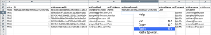

# Kickstarts-Szenario: Unternehmen, Gruppe, Rolle und Benutzer-Kickstarts Vorbereitung

Wenn Sie mit der Implementierung von Adobe Workfront beginnen, können Sie anstelle der manuellen Eingabe von Daten Ihre Kundenliste, interne Abteilungen, Aufgabengebiete und Benutzerinformationen importieren.

## Zugriffsanforderungen

+++ Erweitern Sie , um die Zugriffsanforderungen für die -Funktion in diesem Artikel anzuzeigen.

Sie müssen über folgenden Zugriff verfügen, um die Schritte in diesem Artikel ausführen zu können:

<table style="table-layout:auto"> 
 <col> 
 <col> 
 <tbody> 
  <tr> 
   <td role="rowheader">Adobe Workfront-Plan</td> 
   <td>Beliebig</td> 
  </tr> 
  <tr> 
   <td role="rowheader">Adobe Workfront-Lizenz</td> 
   <td>
   
 Neu: Standard

   oder
   
Aktuell: Plan
</td> 
  </tr> 
  <tr> 
   <td role="rowheader">Konfigurationen der Zugriffsebene</td> 
   <td>[!UICONTROL Systemadministrator]</td> 
  </tr> 
 </tbody> 
</table>

Weitere Informationen zu den Informationen in dieser Tabelle finden Sie unter [Zugriffsanforderungen in der Dokumentation zu Workfront](/help/quicksilver/administration-and-setup/add-users/access-levels-and-object-permissions/access-level-requirements-in-documentation.md).

+++

## Was importiert werden kann

In der folgenden Tabelle werden die zu importierenden Unternehmen, Gruppen und Rollen angezeigt:

<table style="table-layout:auto"> 
 <col> 
 <col> 
 <col> 
 <thead> 
  <tr> 
   <th><strong>Firmen</strong> </th> 
   <th><strong>Gruppen</strong> </th> 
   <th><strong>Rollen</strong> </th> 
  </tr> 
 </thead> 
 <tbody> 
  <tr> 
   <td valign="top"> 
ACME, CO
 
Workfront, Inc.
 
<em>Ihre Firma</em> 
 
XYZ, Inc.
 </td> 
   <td valign="top"> 
Finanzielle Details
 
IT 
 
Marketing 
 
Verkauf
 </td> 
   <td valign="top"> 
Wirtschaftsanalytiker
 
Kreativ-Controller
 
Entwerfende Person
 
Ressourcenmanager
 
Scrum Master
 
technischer Redakteur
 
Web-Entwickler
 </td> 
  </tr> 
 </tbody> 
</table>

Rollennamen müssen eindeutig sein. Vorhandene Aufgabengebiete können nicht importiert werden.

In den folgenden Tabellen werden die zu importierenden Benutzer und jeweils mehrere Benutzerattribute angezeigt:

### Benutzer 1

| **Vorname** | Chris |
|---|---|
| **Nachname** | Besatzung |
| **Benutzername/E-Mail** | mailto:cmanning@foo.com |
| **Kennwort** | updateMe |
| **Zugriff** | Teammitglied |
| **Firma** | &lt;*Ihre Firma>* |
| **Hauptgruppe** | Marketing |
| **Aufgabengebiet** | Wirtschaftsanalytiker |

{style="table-layout:auto"}

### Benutzer 2

| **Vorname** | Jennifer |
|---|---|
| **Nachname** | Campbell |
| **Benutzername/E-Mail** | jcampbell@foo.com |
| **Kennwort** | updateMe |
| **Zugriff** | Project Manager |
| **Firma** | &lt;*Ihre Firma>* |
| **Hauptgruppe** | Marketing |
| **Aufgabengebiet** | Project Manager |

{style="table-layout:auto"}

### Benutzer 3

| **Vorname** | Jill |
|---|---|
| **Nachname** | Sullivan |
| **Benutzername/E-Mail** | jsullivan@foo.com |
| **Kennwort** | updateMe |
| **Zugriff** | Helpdesk |
| **Firma** | &lt;*Ihre Firma>* |
| **Hauptgruppe** | Verkauf |
| **Aufgabengebiet** | Vertriebsmitarbeiter |

{style="table-layout:auto"}

### Benutzer 4

| **Vorname** | Trester |
|---|---|
| **Nachname** | Lewis |
| **Benutzername/E-Mail** | mlewis@foo.com |
| **Kennwort** | updateMe |
| **Zugriff** | Portfolio-Manager |
| **Firma** | &lt;*Ihre Firma>* |
| **Hauptgruppe** | Finanzielle Details |
| **Aufgabengebiet** | Controller |

{style="table-layout:auto"}

### Benutzer 5

| **Vorname** | Pam |
|---|---|
| **Nachname** | Reynolds |
| **Benutzername/E-Mail** | preynolds@foo.com |
| **Kennwort** | updateMe |
| **Zugriff** | Project Manager |
| **Firma** | *Ihre Firma>* |
| **Hauptgruppe** | Marketing |
| **Aufgabengebiet** | IT |

{style="table-layout:auto"}

### Benutzer 6

| **Vorname** | Strahl |
|---|---|
| **Nachname** | Andrews |
| **Benutzername/E-Mail** | randrews@foo.com |
| **Kennwort** | updateMe |
| **Zugriff** | Administrator |
| **Firma** | *Ihre Firma>* |
| **Hauptgruppe** | Ressourcenmanager |
| **Aufgabengebiet** | Keine |

{style="table-layout:auto"}

## Kickstart-Vorlage herunterladen

{{step-1-to-setup}}

1. Klicken Sie auf **System** > **Kickstarts** > **Daten importieren.**

1. Klicken Sie **Weitere Optionen**, um die vollständige Liste der Importoptionen anzuzeigen.
1. Wählen Sie Zugriffsebene, Unternehmen, Gruppe, Aufgabengebiet und Benutzerobjekte aus, die Sie importieren möchten.

## Firmeninformationen eingeben

1. Öffnen Sie die Datei **Workfront.xlsx**, die Sie gerade heruntergeladen haben.

   >[!TIP]
   >
   >Wenn Sie mit sehr breiten Datenblättern arbeiten, können Sie das Tool zum Einfrieren (oder Ähnliches) Ihres Tabelleneditors verwenden, um die Arbeit mit der Tabelle zu vereinfachen.

1. Zum Blatt „Firma“ gehen.

   Es sollte leer bleiben, es sei denn, Unternehmen sind bereits im System. 

   

1. Geben Sie TRUE in die Spalte **isNew** ein.
1. Wiederholen Sie diese Aktion für jede hinzugefügte Firma. (Führen Sie in diesem Beispiel diese Aktion für die Zeilen 3-6 aus, da vier Unternehmen hinzugefügt werden.)

   

1. Geben Sie eine eindeutige ID an.

   Dies muss für jede Zeile der Spalte ID erfolgen. Ganzzahlen, die mit 1 beginnen, funktionieren beim Erstellen neuer Datensätze gut.

   

1. Einen Namen festlegen.

   Geben Sie die Namen der einzelnen Kunden in der Spalte **setName** an.

   

1. Navigieren Sie zur Tabelle GRUPPE .

   Sofern Sie noch keine Gruppen in Workfront erstellt haben, sollte dieses Blatt nur die Standardgruppe anzeigen, die mit jedem Konto von Workfront bereitgestellt wurde.

    

1. Legen Sie die Spalte **isNew** fest. Je nach Szenario werden 4 Gruppen importiert. Geben Sie also „TRUE“ in die Zeilen 4 bis 7 für die Spalte „isNew“ ein.
1. Geben Sie eine eindeutige ID an.

   Dies muss für jede Zeile der Spalte ID erfolgen. Ganzzahlen, die mit 1 beginnen, funktionieren beim Erstellen neuer Datensätze gut.

   

1. Einen Namen festlegen.

   Geben Sie die Namen der einzelnen Abteilungen in der Spalte &quot;**&quot;**.

   

   Geben Sie Rolleninformationen an. Navigieren Sie zum Funktionsblatt.

1. Sofern Sie in Ihrem Konto noch keine Rollen erstellt oder gelöscht haben, sollte dieses Blatt acht Rollen anzeigen, die mit jedem Konto von Workfront bereitgestellt werden.

   

1. True-Anweisung festlegen.

   Es werden sieben Aufgabengebiete importiert. Geben Sie TRUE in die Zeilen 12 bis 18 für die Spalte „isNew“ ein.

   

1. Geben Sie eine eindeutige ID an.

   Dies muss für jede Zeile der Spalte ID erfolgen. Ganzzahlen, die mit 1 beginnen, funktionieren beim Erstellen neuer Datensätze gut.

   

   

1. Geben Sie für jede Rolle einen Namen an, indem Sie ihn in die Spalte „setName“ eingeben.

   

1. Geben Sie bei Bedarf zusätzliche Details an.

   Geben Sie bei Bedarf Abrechnungssätze, Kostensätze und Beschreibungen für die Rollen an, die Sie erstellen.

1. Gehen Sie zum Benutzerblatt, um Benutzerinformationen einzugeben.

   Sofern Sie noch keine Benutzenden in Ihrem Konto erstellt haben, sollte dieses Blatt nur die Admin-Benutzenden anzeigen, die mit jedem Konto von Workfront ausgestattet sind.

    

1. Legen Sie den Wert „True“ fest, indem Sie TRUE in die Zeilen 4 bis 9 für die Spalte „isNew“ eingeben, da 6 Benutzer importiert werden.

   

1. Legen Sie eine eindeutige ID fest, indem Sie in jeder Zeile für die Spalte ID eine eindeutige ID angeben. Normalerweise funktionieren Ganzzahlen, die bei 1 beginnen, gut für neue Datensätze.

   

1. Die Namen der einzelnen Benutzer in die Spalten „setFirstName“ und „setLastName“ eingeben.

   

1. Legen Sie Detailwerte fest, indem Sie Werte in die Spalten „setEmail“, „setPassword“ und „setUsername“ eingeben.

   

1. Geben Sie Werte für die Zugriffsebene an.

   Beispiel: Chris Manning, der ein Teammitglied ist, sucht im Blatt „ACSLVL-Zugriffsebene“ nach der ID für die Zugriffsebene der Teammitglieder. Kopieren Sie die ID in die Zwischenablage und fügen Sie sie im Benutzerblatt in die Spalte **setAccessLevelID** in der Zeile von Chris ein.

   Wiederholen Sie diesen Schritt für jeden Benutzer und jede Zugriffsebene.

    

1. Details zur Hauptgruppe angeben.

   Gemäß dem Szenario gehört Chris Manning zur Marketing-Gruppe. Suchen Sie auf dem Blatt GRUPPE die ID für die Marketing-Gruppe, kopieren Sie sie in die Zwischenablage und fügen Sie sie auf dem Blatt BENUTZER in die Spalte **setHomeGroupID** in der Zeile von Chris ein. &#x200B;Wiederholen Sie diesen Schritt für jede Benutzer- und Gruppenzuweisung.

    

1. Geben Sie Details zum Unternehmen an.

   Alle Benutzer in diesem Szenario gehören demselben Unternehmen. Suchen Sie auf dem Blatt „Unternehmen kopieren“ die ID für das Unternehmen „Ihr eigenes Unternehmen“, kopieren Sie die ID in die Zwischenablage und fügen Sie diesen Wert auf der Registerkarte „Benutzer“ in jede Zeile der Spalte „setCompanyID“ ein&#x200B;

   Wiederholen Sie diesen Schritt für jede Benutzer- und Gruppenzuweisung.

   

   

1. Geben Sie Details zum Aufgabengebiet an.

   Dem Szenario zufolge wird Chris Manning die Rolle eines Unternehmensanalysten haben. Suchen Sie auf dem Blatt „Rolle“ die ID für die Rolle „Geschäftsanalyst“, kopieren Sie sie in die Zwischenablage und fügen Sie sie auf dem Blatt „Benutzer“ in die Zeile „setRoleID“ in der Zeile „Chris“ ein. &#x200B;Wiederholen Sie diesen Schritt für jede Benutzer- und Gruppenzuweisung.

   

   

1. Geben Sie bei Bedarf weitere Benutzerdetails ein und speichern Sie dann die Datei.
1. Importieren Sie die Excel-Datei.

   Befolgen Sie die Anweisungen unter [Importieren von Daten in Adobe Workfront mithilfe einer Kickstart-Vorlage](/help/quicksilver/administration-and-setup/manage-workfront/using-kick-starts/import-data-via-kickstarts.md).
