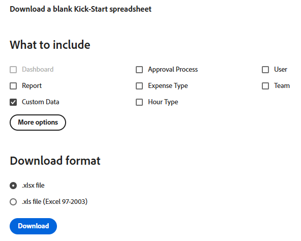

# Kickstart-Szenario: Importieren von benutzerdefinierten Feldern mit mehreren Optionen in Workfront

Benutzerdefinierte Felder mit mehreren Optionen können in Adobe Workfront mithilfe der Kickstart-Funktion importiert werden.

Beispiele für benutzerdefinierte Felder mit mehreren Optionen:

* Mehrfachauswahl-Dropdown
* Dropdown
* Kontrollkästchen
* Optionsfelder

Diese Felder können manchmal viele (manchmal Hunderte) Optionen aufweisen. Wenn Sie sie über die Kickstart-Funktion importieren, können Sie als Workfront-Admin viel Zeit sparen und Fehler vermeiden.

>[!IMPORTANT]
>
>Sie müssen die in den folgenden Abschnitten beschriebenen Schritte ausführen, um benutzerdefinierte Felder mit mehreren Optionen mithilfe eines Kickstarts zu importieren:
>
>1. Exportieren vorhandener benutzerdefinierter Daten aus Workfront (optionaler Schritt)
>1. Kickstart-Vorlage für benutzerdefinierte Daten exportieren
>1. Ausfüllen der Excel-Kickstarts-Tabelle
>1. Excel-Tabelle in Workfront hochladen

## Zugriffsanforderungen

+++ Erweitern Sie , um die Zugriffsanforderungen für die -Funktion in diesem Artikel anzuzeigen.

Sie müssen über folgenden Zugriff verfügen, um die Schritte in diesem Artikel ausführen zu können:

<table style="table-layout:auto"> 
 <col> 
 <col> 
 <tbody> 
  <tr> 
   <td role="rowheader">Adobe Workfront-Plan</td> 
   <td>Beliebig</td> 
  </tr> 
  <tr> 
   <td role="rowheader">Adobe Workfront-Lizenz</td> 
   <td>
   
 Neu: Standard

   oder
   
Aktuell: Plan
</td> 
  </tr> 
  <tr> 
   <td role="rowheader">Konfigurationen der Zugriffsebene</td> 
   <td>[!UICONTROL Systemadministrator]</td> 
  </tr> 
 </tbody> 
</table>

Weitere Informationen zu den Informationen in dieser Tabelle finden Sie unter [Zugriffsanforderungen in der Dokumentation zu Workfront](/help/quicksilver/administration-and-setup/add-users/access-levels-and-object-permissions/access-level-requirements-in-documentation.md).

+++

## Exportieren vorhandener benutzerdefinierter Daten aus Workfront (optionaler Schritt)

Wenn Sie mit der Workfront-Datenbankstruktur nicht vertraut sind oder wenn Sie nicht mit der Kickstart-Datei vertraut sind, die Workfront zum Importieren von Informationen benötigt, empfehlen wir, zunächst eine Kickstart-Datei aus Workfront mit vorhandenen Informationen zu exportieren, ähnlich der der Felder, die Sie importieren möchten.

Wenn Sie beispielsweise benutzerdefinierte Formulare oder Felder importieren möchten, müssen Sie zunächst eine Kickstart-Datei mit vorhandenen benutzerdefinierten Daten exportieren.

Wenn Sie Ihre vorhandenen Daten exportieren, können Sie sie scannen und sehen, wie Ihre neuen Daten formatiert werden müssen.

Wenn Sie ein gutes Verständnis der Workfront-Datenbankobjekte und -struktur haben, können Sie mit dem folgenden Abschnitt fortfahren.

So exportieren Sie vorhandene Daten aus Workfront:

{{step-1-to-setup}}

1. Erweitern Sie **System** im linken Menü und klicken Sie dann auf **Daten exportieren (Kickstarts)**.

1. Wählen **Benutzerdefinierte Daten** im Abschnitt **Was eingeschlossen werden soll** aus.

   

1. Wählen Sie im Abschnitt **Download-Format** die Datei **.xlsx**.

   >[!TIP]
   >
   >Je nachdem, wie viele benutzerdefinierte Daten Sie in Ihrem System haben, kann dies lange dauern.

1. Klicken Sie **Herunterladen**. Eine XLSX-Datei wird auf Ihren Computer heruntergeladen. Navigieren Sie dazu und öffnen Sie sie.

   

1. Überprüfen Sie die heruntergeladene Datei und beachten Sie die folgenden Details:

   * Die Datei enthält mehrere Blätter. Möglicherweise benötigen Sie nicht die Informationen in jedem Blatt, aber Sie verwenden einige der Blätter, um Ihre Informationen zu importieren. Nehmen Sie sich etwas Zeit, um sich mit deren Inhalt und insbesondere mit dem Format des Inhalts in jedem Blatt vertraut zu machen.
   * Achten Sie besonders auf die Spaltennamen und auf das Format, in dem die Daten in jeder Spalte angezeigt werden.
   * Sie dürfen die Namen oder die Reihenfolge der Spalten in keinem der Blätter ändern. Die Spaltenüberschriften geben in jeder Zeile die Felder an, die Sie mit Ihren Informationen ausfüllen müssen. Wenn die Spaltenüberschrift fett gedruckt ist, ist dies ein Pflichtfeld, sodass Sie Informationen in dieser Spalte haben müssen.

   >[!IMPORTANT]
   >
   >Einige Spaltenüberschriften werden möglicherweise nicht fett formatiert, sind aber möglicherweise trotzdem erforderlich.

   * Behalten Sie die heruntergeladene Datei als Referenz bei und fahren Sie mit dem folgenden Abschnitt fort.

## Kickstart-Vorlage für benutzerdefinierte Daten exportieren

Nachdem Sie die Informationen zu vorhandenen benutzerdefinierten Feldern in Ihrem System gescannt haben, können Sie eine neue Kickstart-Vorlage für Ihren Import herunterladen.

{{step-1-to-setup}}

1. Erweitern Sie **System** im linken Menü.

1. Klicken Sie **Daten importieren (Kickstarts)**.

1. Aktivieren **im Bereich „Leeres Kickstart-Arbeitsblatt herunterladen** das Kontrollkästchen **Benutzerdefinierte Daten** und klicken Sie auf **Herunterladen**.

   

   Eine leere Kickstart-Datei wird auf Ihren Computer heruntergeladen.

   >[!NOTE]
   >
   >Die Anzahl der Blätter in der Datei, ihre Namen sowie die Anzahl und Namen der Spalten in jedem Blatt sollten mit denen identisch sein, die aus dem Kickstart im obigen Abschnitt heruntergeladen wurden, der Ihre vorhandenen benutzerdefinierten Daten enthielt.

## Ausfüllen der Excel-Kickstarts-Tabelle

Bevor Sie das Excel-Arbeitsblatt ausfüllen, laden Sie die Kickstart-Vorlage wie im obigen Abschnitt beschrieben herunter.

>[!IMPORTANT]
>
>Versuchen Sie nicht, Informationen mithilfe einer Excel-Ad-hoc-Tabelle zu importieren. Alle Tabellen zum Importieren von Informationen in Workfront mithilfe der Kickstart-Funktion müssen mit dem Inhalt der Dateien übereinstimmen, die Sie von Workfront herunterladen und in diesem Artikel beschreiben.

So füllen Sie die Excel-Tabelle mit Informationen für die neuen benutzerdefinierten Felder aus:

1. Öffnen Sie das Excel-Arbeitsblatt, das Sie im vorherigen Abschnitt heruntergeladen haben, und überprüfen Sie die Arbeitsblätter. Jedes Blatt stellt ein Objekt in der Anwendung dar.

   Beispiel: **Parameter** (verweist auf benutzerdefiniertes Feld), **Parameteroption** (verweist auf die Option für benutzerdefiniertes Feld), **Kategorie** (verweist auf benutzerdefiniertes Formular).

   Sie müssen die Namen der Objekte und deren Attribute in dem von der Workfront-Datenbank unterstützten Format schreiben.

   Informationen zur Bedeutung dieser Objekte finden Sie im [Glossar der  [!DNL Adobe Workfront] Terminologie](../../../workfront-basics/navigate-workfront/workfront-navigation/workfront-terminology-glossary.md).

   Informationen zu den Namen der Objekte in der Workfront-Datenbank finden Sie unter [API-Explorer](../../../wf-api/general/api-explorer.md).

   

1. Stellen Sie sicher, dass die folgenden Informationen korrekt formatiert sind:

   * Die erste Zeile jedes Blatts muss leer bleiben, da der Import sonst einen Fehler erzeugt.
   * Die Spaltenüberschriften in jedem Blatt stellen Attribute der Objekte dar, die während eines Imports festgelegt werden können. Alle Spaltenüberschriften müssen in der gleichen Reihenfolge bleiben, in der Sie sie beim Exportieren des Blatts finden, und sie können nicht umbenannt werden.
   * Die fett gedruckten Spaltenüberschriften sind Pflichtfelder und müssen einen Wert enthalten.

     >[!TIP]
     >
     >Einige Spalten sind erforderlich, obwohl sie nicht fett formatiert sind. Die Spalten `isNew` und `ID` sind beispielsweise nicht fett gedruckt, sondern Pflichtfelder.

1. Wählen Sie das `**PARAM Parameter`**-Blatt aus und fügen Sie Informationen zu den neuen benutzerdefinierten Feldern in den folgenden erforderlichen Spalten hinzu:

   * **`isNew`** = Geben Sie **`TRUE`** in dieser Spalte für jede Zeile ein, die ein neues benutzerdefiniertes Feld darstellt. Dies bedeutet, dass das Feld neu ist und nicht in Workfront vorhanden ist.

     >[!TIP]
     >
     >Wenn eine Zeile ein bereits in Workfront vorhandenes Feld darstellt, geben Sie **`isNew`** = **`FALSE`** ein.

   * **`ID`** = muss für jede Zeile, die ein neues Feld darstellt, eine eindeutige Zahl sein. Sie können eine beliebige Zahl verwenden, die mit 1 beginnt, sofern jedes neue Feld über eine eindeutige Zahl verfügt.
   * **`setDataType`** = Geben Sie für jede Zeile, die ein neues Feld darstellt, den vom Feld unterstützten Datentyp ein. Der Datentyp muss so eingegeben werden, wie er in der Datenbank angezeigt wird. Wählen Sie aus den folgenden Datentypen:

      * **`NMBR`** für Zahl
      * **`CURC`** für Währung
      * **`TEXT`** für Text

   * `**setDisplaySize**`= Die Anzeigegröße (&#39;**setDisplaySize**&#39;) für mehrere benutzerdefinierte Felder mit Optionen ist immer 0.
   * **`setDisplayType`** = Geben Sie für jede Zeile, die ein neues Feld darstellt, den Anzeigetyp des Felds ein. Der Anzeigetyp muss so eingegeben werden, wie er in der Datenbank erscheinen würde.

     Wählen Sie für benutzerdefinierte Felder mit mehreren Optionen aus den folgenden Optionen aus:

      * **`MULT`** für Mehrfachauswahl-Dropdown
      * **`SLCT`** für Dropdown
      * **`RDIO`** für Optionsfelder
      * **`CHCK`** für Kontrollkästchen

     >[!TIP]
     >
     >Informationen zum Datentyp und Anzeigetyp finden Sie im [API-Explorer](../../../wf-api/general/api-explorer.md), erweitern Sie das Objekt **Parameter** und suchen Sie auf der Registerkarte **Felder** nach diesen Attributen.

   * **`setName`** = Geben Sie den Namen der benutzerdefinierten Felder ein, wie er in Workfront angezeigt werden soll.

     >[!INFO]
     >
     >Beispielsweise können wir zwei benutzerdefinierte Felder importieren, _Marke_ ein Kontrollkästchen und _Medien_ ein Optionsfeld.

   * Die Spalten **`setName`** und **`setValue`** enthalten in der Regel dieselben Informationen und sollten die Namen widerspiegeln, die in der Workfront-Benutzeroberfläche für Ihr neues Feld gewünscht werden.

   Der Wert eines Felds ist beispielsweise der Name, der in Berichten angezeigt wird, während der Name in den benutzerdefinierten Formularen angezeigt wird, die an -Objekte angehängt sind.

   Weitere Informationen finden Sie unter [Erstellen eines benutzerdefinierten Formulars](/help/quicksilver/administration-and-setup/customize-workfront/create-manage-custom-forms/form-designer/design-a-form/design-a-form.md).

   

1. Wählen Sie das **`POPT Parameter Options`** aus und fügen Sie Informationen zu den Optionen der einzelnen benutzerdefinierten Felder in den folgenden erforderlichen Spalten hinzu:

   * **`isNew`** = Geben Sie **`TRUE`** in dieser Spalte für jede Zeile ein, die eine neue Feldoption darstellt.

     >[!TIP]
     >
     >    Wenn eine Zeile eine vorhandene Option darstellt, geben Sie **`isNew`** = **`FALSE`** ein.

   * **`ID`** = muss eine eindeutige Zahl für jede Zeile sein, die eine neue Option darstellt. Sie können eine beliebige Zahl verwenden, die mit 1 beginnt, sofern jede neue Option über eine eindeutige Zahl verfügt.
   * **`setIsDefault`** = Geben Sie `TRUE` für die Optionen ein, die Sie standardmäßig anzeigen möchten, und `FALSE` Sie für alle anderen Optionen für jedes Feld ein.  Beispielsweise möchten wir, _Nike_ die Standardoption für _Marke_ und _Print_ die Standardoption für _Media_ ist.

     >[!TIP]
     >
     >Pro Feld kann nur eine Standardoption ausgewählt werden.

   * **`setParameterID`** = die Optionen, die dem benutzerdefinierten Feld _Marke_ entsprechen, haben einen **`setParameterID`** von 1, und die Optionen, die dem _Media_ entsprechen, haben einen **`setParameterID`**von 2. Die `PARAM`- und `POPT`-Blätter verweisen einander, um anzugeben, welche Optionen zu welchem benutzerdefinierten Feld gehören.
   * **`setDisplayOrder`**= Die Spalte Anzeigereihenfolge gibt die Reihenfolge an, in der die Optionen in Ihrem benutzerdefinierten Feld angezeigt werden. Sie können mit 1 beginnen und für alle Optionen in aufsteigender Reihenfolge fortfahren, unabhängig davon, zu welchen Feldern sie gehören. Wichtig ist hier, dass für jede Option eindeutige Zahlen vorhanden sind.
   * Die Spalten **`setLabel`** und `**setValue`** enthalten in der Regel dieselben Informationen und sollten die gewünschten Namen in der Workfront-Benutzeroberfläche widerspiegeln. Der Wert einer Option ist beispielsweise der Name, der in Berichten angezeigt wird, während die Beschriftung in den benutzerdefinierten Formularen angezeigt wird, wenn sie an ein Objekt angehängt wird. Weitere Informationen finden Sie unter [Erstellen eines benutzerdefinierten Formulars](/help/quicksilver/administration-and-setup/customize-workfront/create-manage-custom-forms/form-designer/design-a-form/design-a-form.md).
   * **`setIsHidden`** = Geben Sie `TRUE` ein, wenn eine der Optionen ausgeblendet werden soll.

   

1. (Optional) Wenn Sie auch ein benutzerdefiniertes Formular erstellen möchten, in dem Sie später die neuen Felder hinzufügen können, wählen Sie das **`CTGY Category`** aus und aktualisieren Sie die folgenden erforderlichen Spalten für die Informationen des benutzerdefinierten Formulars:

   * **`isNew`** = Geben Sie **`TRUE`** in dieser Spalte für jede Zeile ein, die ein neues benutzerdefiniertes Formular darstellt.
   * **`ID`** = Geben Sie für jede Zeile, die für ein neues Formular steht, eine eindeutige Zahl ein. Sie können eine beliebige Zahl verwenden, die mit 1 beginnt, sofern jede neue Option oder Zeile über eine eindeutige Zahl verfügt.
   * **`setGroupID`** = Fügen Sie die Gruppen-ID für Ihre Hauptgruppe oder eine andere Gruppe im System hinzu, deren Mitglieder Sie auf dieses Formular zugreifen möchten. Dies ist ein Pflichtfeld.

   Um die `ID` einer Gruppe zu ermitteln, können Sie entweder einen Gruppenbericht erstellen und das Feld `ID` in der Ansicht hinzufügen oder zu einer Gruppe navigieren und die URL für die Gruppe suchen. Die Gruppen-ID befindet sich in der URL der Gruppenseite. Wenn beispielsweise die URL der Gruppe `https://companyName.my.workfront.com/group/575b000800467a6f66e747932c807464/members` ist, wird die Gruppen-ID `575b000800467a6f66e747932c807464`.

   * **`setCatObjCode`**= Dies ist der Objekt-Code für den Objekttyp, für den Sie das Formular erstellen möchten. Geben Sie einen Code aus den folgenden Optionen ein:
      * **`CMPY`** für Firma
      * Aufgabe **`TASK`**
      * **`PROJ`** für Projekt
      * **`PORT`** für Portfolio
      * **`PRGM`** für Programm
      * **`USER`** für Benutzer
      * **`DOCU`** für Dokument
      * **`OPTASK`** für Anfrage
      * **`EXPNS`**
      * **`ITRN`** für Iteration
      * **`BILL`** für Rechnungsnachweise
      * **`GROUP`** für Gruppe

     >[!NOTE]
     >
     >Geben Sie für Formulare mit mehreren Objekten das erste Objekt ein, das Sie beim Erstellen eines Formulars in der Benutzeroberfläche auswählen würden. Legen Sie beispielsweise den `setCatObjCode` auf `TASK` fest, wenn Sie in der Workfront-Benutzeroberfläche zunächst die Option „Aufgabe“ und dann „Problem“, &quot;Portfolio&quot; usw. auswählen, das Formular jedoch nicht für Projekte verfügbar sein soll.

   * **`setName`** = Dies ist der Name des benutzerdefinierten Formulars, wie er in der Benutzeroberfläche von Workfront angezeigt werden soll.

     

1. Speichern Sie die Tabelle als XLS- oder XLSX-Datei auf Ihrem Computer. Ihre Excel-Tabelle ist ausgefüllt und kann jetzt in Workfront importiert werden.

## Excel-Tabelle in Workfront hochladen

Fahren Sie nach dem Ausführen der in den vorherigen Abschnitten beschriebenen Schritte mit den folgenden Schritten fort, um die neuen Felder und Formulare in Workfront hochzuladen:

{{step-1-to-setup}}

1. Klicken Sie **System > Daten importieren (Kickstarts)**.

1. Klicken Sie **Datei auswählen** unter dem Abschnitt **Daten mit Kickstart-Arbeitsblatt hochladen**.

1. Suchen Sie die von Ihnen vorbereitete Excel-Tabelle auf Ihrem Computer und wählen Sie sie aus, wenn Sie sie finden.

   Die Datei wird automatisch hochgeladen, und es wird eine Benachrichtigung angezeigt, dass der Import erfolgreich war. Je nachdem, wie viele Informationen Sie importieren, kann dieser Schritt einige Sekunden bis eine Minute dauern.

   Die neuen benutzerdefinierten Felder und Formulare befinden sich nun in Ihrem Workfront-System. Sie finden sie im Bereich „Benutzerdefinierte Forms&quot; unter „Setup“.

   >[!NOTE]
   >
   >Die neuen Formulare und die importierten Felder sind noch nicht verbunden. Das Formular wird ohne benutzerdefinierte Felder importiert. Sie müssen die Felder manuell dem neuen benutzerdefinierten Formular oder einem anderen vorhandenen benutzerdefinierten Formular hinzufügen.

   Informationen zum Hinzufügen von Feldern zu benutzerdefinierten Formularen finden Sie unter [Erstellen eines benutzerdefinierten Formulars](/help/quicksilver/administration-and-setup/customize-workfront/create-manage-custom-forms/form-designer/design-a-form/design-a-form.md).

1. (Bedingt) Wenn der Import nicht erfolgreich war, erhalten Sie eine Fehlermeldung, die Sie über das Problem informiert. Versuchen Sie, das Feld, das Blatt und die Zeilennummer zu identifizieren, in der das Problem aufgetreten ist, und korrigieren Sie die Informationen in der Excel-Datei. Versuchen Sie dann erneut, die Datei zu importieren.

1. (Bedingt) Je nachdem, was das Problem ist, werden, wie in der Fehlermeldung angegeben, möglicherweise bereits einige Informationen importiert. Sie müssen einen der folgenden Schritte ausführen, bevor Sie das Blatt erneut importieren können:

   * Löschen Sie die Informationen, die erfolgreich aus Workfront importiert wurden, aus dem Bereich Benutzerdefinierter Forms und nehmen Sie dann die in der Fehlermeldung angegebene Korrektur vor.
   * Geben Sie an, dass für die bereits importierten Felder oder Formulare ein Feld oder ein Formular bereits im System vorhanden ist, und korrigieren Sie.
Wenn Sie angeben möchten, dass ein Feld oder ein benutzerdefiniertes Formular bereits in Workfront vorhanden ist, müssen Sie sicherstellen, dass das `inNew` Feld in Plänen, die Informationen zum Formular (`CTGY`) oder zum Feld (`PARAM`) im Kickstart-Importblatt enthalten, als `FALSE` markiert ist.
