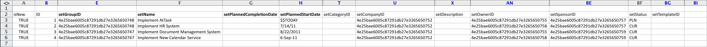
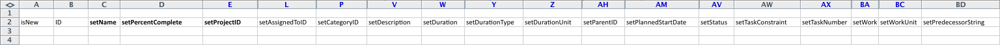

# Kickstart-Szenario: einfache Vorbereitung für den Projekt- und Aufgabenimport

Beschreibt detailliert die verfügbaren Einstellungen und Steuerelemente für ein grundlegendes Projekt und den Aufgabenimport mithilfe der Kickstart-Methode.

## Szenario

Das Implementierungs-Team importiert lieber Projekt- und Aufgabeninformationen für aktive Projekte, anstatt diese Daten manuell in das System einzugeben.

* [Projekte](#projects)
* [Aufgabenliste](#task-list)

### Projekte {#projects}

In der folgenden Tabelle werden vier Projekte und deren grundlegende Details angezeigt, die den Kickstart-Dateiformaten zugeordnet werden müssen.

Bei diesem Szenario wird davon ausgegangen, dass Benutzende bereits in Adobe Workfront importiert wurden. Wenn sich noch keine Benutzer in Workfront befinden, ändern Sie die Namen oder schließen Sie das Kickstart-Szenario vor diesem Szenario mit Benutzern ab.

1. Implementieren von Workfront.

   | Geplantes Startdatum | Heute |
   |---|---|
   | Project Manager | Jennifer Campbell |
   | Projektsponsor | Marc Lewis |
   | Gruppe | Marketing |
   | Firma | *IhrUnternehmen* |

   {style="table-layout:auto"}

1. HR-System implementieren.

   | Geplantes Startdatum | 14. Juli 20XX |
   |---|---|
   | Project Manager | Pam Reynolds |
   | Projektsponsor | Marc Lewis |
   | Gruppe | Marketing |
   | Firma | *IhrUnternehmen* |

   {style="table-layout:auto"}

1. Implementieren des Document Management-Systems.

   | Geplantes Startdatum | 22. August 20XX |
   |---|---|
   | Project Manager | Jennifer Campbell |
   | Projektsponsor | Ray Andrews |
   | Gruppe | IT |
   | Firma | *IhrUnternehmen* |

   {style="table-layout:auto"}

1. Implementieren Sie ein neues Kalendersystem.

   | Geplantes Startdatum | 6. September 20XX |
   |---|---|
   | Project Manager | Pam Reynolds |
   | Projektsponsor | Ray Andrews |
   | Gruppe | IT |
   | Firma | *IhrUnternehmen* |

   {style="table-layout:auto"}

### Aufgabenliste {#task-list}

Die folgende Aufgabenliste zeigt zu vereinfachte Aufgabenlisten für die Projekte. Der einzige Unterschied zwischen den Projekten ist der Starttermin und der Fortschritt, der bei jedem Projekt erzielt wurde.

Übergeordnete Aufgaben übernehmen die Aufgaben Dauer, Arbeit und Prozent abgeschlossen der untergeordneten Aufgaben. Es ist nicht erforderlich, diese Werte für festzulegen, die zu Übersichtsaufgaben werden.

>[!NOTE]
>
>Die in diesem Szenario bereitgestellten Anweisungen sind nicht so explizit wie die schrittweisen Anweisungen in [Kick-Starts-Szenario: Unternehmen, Gruppe, Rolle und Vorbereitung auf Benutzer-Kick-Starts](../../../administration-and-setup/manage-workfront/using-kick-starts/kick-starts-scenario-company-group-role-user-prep.md). Es wird davon ausgegangen, dass Sie bereits gelernt haben, wie Sie Werte aus den Unternehmens- und Gruppenblättern nachschlagen und kopieren können. Daher werden diese Schritte erwähnt, aber nicht speziell beschrieben.

1. Konfigurieren.
1. Benutzer importieren.

   <table style="table-layout:auto"> 
    <col width="50%"> 
    <col width="50%"> 
    <tbody> 
     <tr> 
      <td role="rowheader">Zugewiesen an</td> 
      <td>Ray Andrews</td> 
     </tr> 
     <tr> 
      <td role="rowheader">Übergeordnete Aufgabe</td> 
      <td>1</td> 
     </tr> 
     <tr> 
      <td role="rowheader">Dauer</td> 
      <td>1 Stunde</td> 
     </tr> 
     <tr> 
      <td role="rowheader">Arbeit</td> 
      <td>1 Stunde</td> 
     </tr> 
     <tr> 
      <td role="rowheader">Prozent abgeschlossen</td> 
      <td> 
Workfront: 0 %
 
HR: 100 %
 
Dokumente: 100 %
 
Kalender: 100 %
 </td> 
     </tr> 
    </tbody> 
   </table>

1. Berechtigungen festlegen.

   <table style="table-layout:auto"> 
    <col width="50%"> 
    <col width="50%"> 
    <tbody> 
     <tr> 
      <td role="rowheader">Zugewiesen an</td> 
      <td>Ray Andrews</td> 
     </tr> 
     <tr> 
      <td role="rowheader">Übergeordnete Aufgabe</td> 
      <td>1</td> 
     </tr> 
     <tr> 
      <td role="rowheader">Vor</td> 
      <td>2</td> 
     </tr> 
     <tr> 
      <td role="rowheader">Dauer</td> 
      <td>1 Stunde</td> 
     </tr> 
     <tr> 
      <td role="rowheader">Arbeit</td> 
      <td>1 Stunde</td> 
     </tr> 
     <tr> 
      <td role="rowheader">Prozent abgeschlossen</td> 
      <td> 
Workfront: 0 %
 
HR: 100 %
 
Dokumente: 100 %
 
Kalender: 100 %
 </td> 
     </tr> 
    </tbody> 
   </table>

1. Erstellen von Gruppen.

   <table style="table-layout:auto"> 
    <col width="50%"> 
    <col width="50%"> 
    <tbody> 
     <tr> 
      <td role="rowheader">Zugewiesen an</td> 
      <td>Ray Andrews</td> 
     </tr> 
     <tr> 
      <td role="rowheader">Übergeordnete Aufgabe</td> 
      <td>1</td> 
     </tr> 
     <tr> 
      <td role="rowheader">Vor</td> 
      <td>4</td> 
     </tr> 
     <tr> 
      <td role="rowheader">Dauer</td> 
      <td>2 Tage</td> 
     </tr> 
     <tr> 
      <td role="rowheader">Arbeit</td> 
      <td>4 Stunden</td> 
     </tr> 
     <tr> 
      <td role="rowheader">Prozent abgeschlossen</td> 
      <td> 
Workfront: 0 %
 
HR: 100 %
 
Dokumente: 100 %
 
Kalender: 25 %
 </td> 
     </tr> 
    </tbody> 
   </table>

1. Vorbereitung der Schulung.

   <table style="table-layout:auto"> 
    <col width="50%"> 
    <col width="50%"> 
    <tbody> 
     <tr> 
      <td role="rowheader">Zugewiesen an</td> 
      <td>Chris Manning</td> 
     </tr> 
     <tr> 
      <td role="rowheader">Dauer</td> 
      <td>2 Tage</td> 
     </tr> 
     <tr> 
      <td role="rowheader">Arbeit</td> 
      <td>4 Stunden</td> 
     </tr> 
     <tr> 
      <td role="rowheader">Prozent abgeschlossen</td> 
      <td> 
Workfront: 0 %
 
HR: 100 %
 
Dokumente: 50 %
 
Kalender: 100 %
 </td> 
     </tr> 
    </tbody> 
   </table>

1. Erstellen Sie fortlaufende Support-Richtlinien.

   <table style="table-layout:auto"> 
    <col width="50%"> 
    <col width="50%"> 
    <tbody> 
     <tr> 
      <td role="rowheader">Zugewiesen an</td> 
      <td>Chris Manning</td> 
     </tr> 
     <tr> 
      <td role="rowheader">Dauer</td> 
      <td>2 Tage</td> 
     </tr> 
     <tr> 
      <td role="rowheader">Arbeit</td> 
      <td>4 Stunden</td> 
     </tr> 
     <tr> 
      <td role="rowheader">Prozent abgeschlossen</td> 
      <td> 
Workfront: 0 %
 
HR: 100 %
 
Dokumente: 50 %
 
Kalender: 0%
 </td> 
     </tr> 
    </tbody> 
   </table>

1. Rollout

   | Vor | 1, 6, 7 |
   |---|---|

   {style="table-layout:auto"}

1. Benutzer schulen.

   <table style="table-layout:auto"> 
    <col width="50%"> 
    <col width="50%"> 
    <tbody> 
     <tr> 
      <td role="rowheader">Zugewiesen an</td> 
      <td>Chris Manning</td> 
     </tr> 
     <tr> 
      <td role="rowheader">Übergeordnete Aufgabe</td> 
      <td>8</td> 
     </tr> 
     <tr> 
      <td role="rowheader">Dauer</td> 
      <td>1 Tag</td> 
     </tr> 
     <tr> 
      <td role="rowheader">Arbeit</td> 
      <td>2 Stunden</td> 
     </tr> 
     <tr> 
      <td role="rowheader">Prozent abgeschlossen</td> 
      <td> 
Workfront: 0 %
 
HR: 0 %
 
Dokumente: 0 %
 
Kalender: 0%
 </td> 
     </tr> 
    </tbody> 
   </table>

## Vorlage herunterladen

Navigieren Sie zur Seite „Kickstarts“. Wählen Sie die Objekte Firma, Gruppe, Projekt, Aufgabe und Benutzer aus. Aktivieren Sie das Kontrollkästchen Vorhandene Daten einschließen (tun Sie dies, um schnell auf Unternehmens-, Gruppen- und Benutzer-IDs zu verweisen). Klicken Sie auf die Schaltfläche Herunterladen .

## Projektdetails eingeben

Öffnen Sie die Datei &quot;Workfront.xlsx“, die Sie soeben heruntergeladen haben. Navigieren Sie zum Projektblatt PROJ.

Sofern Sie noch keine Projekte in Workfront erstellt haben, sollte es leer sein.

Legen Sie die Werte für die folgenden Projektfelder fest:

* **set isNew column**
Geben Sie TRUE in die Zeilen 3 bis 6 für die Spalte „isNew“ ein.
* **Eindeutige IDs festlegen**
Geben Sie in jeder Zeile eine eindeutige ID für die ID-Spalte ein - Normalerweise funktionieren Ganzzahlen, die bei 1 beginnen, gut, wenn neue Datensätze erstellt werden.
* **Projektnamen festlegen**
Geben Sie die Namen der einzelnen Projekte in die Spalte setName ein.
* **Projektzeitplan festlegen**

  Geben Sie die ID des Zeitplans, den das Projekt verwenden soll, im Feld setScheduleID ein

* **Legen Sie das geplante Startdatum des Projekts fest**

  Geben Sie Datum und Uhrzeit in die Spalte setPlannedStartDate mit der Uhrzeit und dem Datum ein, an dem das Projekt beginnen soll. Wenn dies leer gelassen wird, importiert Workfront das Projekt mit dem aktuellen Datum und einem Zeitstempel von Mitternacht, entsprechend der Zeitzone des Browsers.

* **Aufgabennummern festlegen**
Geben Sie Werte in die Spalte „setTaskNumber“ ein, um die Reihenfolge zu steuern, in der die Aufgaben im Projektplan angezeigt werden.
* **Geben Sie Projektdaten an.**
Geben Sie in die Spalte setPlannedStartDate das geplante Startdatum für jedes Projekt ein.
* **Legen Sie andere erforderliche Details fest.**
Geben Sie bei Bedarf weitere Details ein, z. B. eine Beschreibung oder den aktuellen Status. Suchen Sie die Gruppen-IDs für jedes Projekt auf dem Blatt „Gruppe“ und geben Sie sie in die Spalte „setGroupID“ für die jeweiligen Projekte ein. Suchen Sie die Unternehmens-ID für die Projekte auf dem Blatt „Firma“ und geben Sie sie in die Spalte „setCompanyID“ ein. Suchen Sie die Benutzer-ID für jeden Projektbesitzer auf dem Blatt „Benutzer“ und geben Sie sie in die Spalte „setOwnerID“ ein. Suchen Sie die Benutzer-ID für jeden Projekt-Sponsor auf dem Benutzerblatt BENUTZER und geben Sie sie in die Spalte setSponsorID ein.

>[!NOTE]
>
>Sie können die gültigen Werte für die Status- und Prioritätsfelder ermitteln, indem Sie die Status- und Prioritätsvoreinstellungen für jedes Objekt im Bereich „Workflow-Setup“ von Workfront überprüfen.

## Aufgabendetails eingeben

Sie können Informationen zu den Aufgaben des Projekts hinzufügen, wenn Sie das Projekt mithilfe von Kickstarts importieren.

Öffnen Sie die Datei &quot;Workfront.xlsx“, die Sie soeben heruntergeladen haben. **Wechseln Sie zur Aufgabenübersicht.**

Sofern Sie in Workfront noch keine Aufgaben erstellt haben, sollte diese Tabelle leer sein.

Die einfachste Möglichkeit, Aufgaben zuzuordnen, besteht darin, jeweils ein Projekt zuzuordnen (insbesondere wenn die Aufgaben in jedem Projekt identisch sind). Sie können dann den Aufgabenplan für das erste Projekt kopieren und kleine Anpassungen am Aufgabenplan für die nachfolgenden Projekte vornehmen. In den restlichen Schritten wird davon ausgegangen, dass Sie Aufgaben nur für das Projekt Workfront implementieren erstellen. Je nach Szenario importieren Sie 9 Aufgaben pro Projekt. Geben Sie also TRUE in die Zeilen 3 bis 11 für die Spalte isNew ein.

Legen Sie die Werte für die folgenden Aufgabenfelder fest:

* **IDs festlegen**
Geben Sie in jeder Zeile für die Spalte ID eine eindeutige ID ein.
* **Namen festlegen**
Geben Sie die Aufgabennamen in die Spalte setName ein.
* **Projekt-ID bestätigen**
Geben Sie die ID ein, die Sie für das Projekt &quot;Workfront implementieren“ festgelegt haben. Überprüfen Sie das Blatt „PROJ-Projekt“, um sicherzustellen, dass es die richtige ID ist.
* **Benutzer festlegen**
Navigieren Sie zum Benutzerblatt, um die ID für den Benutzer nachzuschlagen, der jeder Aufgabe zugewiesen ist, und geben Sie diese Werte in die entsprechenden Zellen in der Spalte setAssignedToID ein.
* **Identifizieren von Aufgabenbeziehungen**
Geben Sie für die Aufgaben 2 bis 5 eine 1 in die Spalte setParentID ein. Geben Sie für Aufgabe 9 einen Wert 8 in die Spalte setParentID ein. Geben Sie in der Spalte setPredecessorString die Aufgabennummer für jede Vorgängeraufgabe ein. Wenn eine Aufgabe mehrere Vorgänger hat, wie z. B. Aufgabe 8 in diesem Szenario, müssen Sie ein Komma verwenden, um jede Vorgängeraufgaben-ID zu trennen. Vorgänger können mit Verzögerungen bei Nicht-Ende-Start-Beziehungen definiert werden, indem die Kurzschreibweise verwendet wird, die im Artikel Erstellen von Vorgänger-Beziehungen beschrieben wird.
* **Dauer festlegen**
Legen Sie die Dauer für jede Aufgabe fest, indem Sie die Anzahl der Stunden, Tage, Wochen oder Monate für die Aufgabe in das Feld setDuration eingeben. Geben Sie dann die Zeiteinheit im Feld setDurationUnit ein.

  |   | Zulässiger Wert |
  |---|---|
  | Minuten | M |
  | Stunden | H |
  | Tag(e) | D |
  | Wochen | W  |
  | Monate | D |

  Minuten können auch als Teil einer Stunde dargestellt werden (z. B. Minuten = 5 Stunden)

* Legen Sie den Arbeitsaufwand für jede Aufgabe im Feld setWorkRequired fest. Geben Sie dann die Arbeitseinheit in das Feld setWorkUnit ein. Wenn der Wert für „Erforderliche Arbeit“ nicht mit der Dauer übereinstimmt, müssen Sie auch ein „A“ in das Feld setDurationType eingeben.

  | Dauertyp | Zulässiger Wert |
  |---|---|
  | Berechnete Zuweisung | A |
  | Berechnete Arbeit | W  |
  | Leistungsgesteuert | D |
  | Einfach | S |

* Geben Sie für jede Aufgabe die Ganzzahldarstellung des abgeschlossenen Prozentsatzes in das Feld setPercentComplete ein. Dieser Wert sollte nicht das Prozentsymbol (%) enthalten.
* Fügen Sie für jede Aufgabe, die Sie erstellen, nach Bedarf eine Beschreibung und weitere Details hinzu.

  

* Die Spalten setPlannedStartDate und setTaskConstraint werden nicht zum Erstellen der Zeitleiste dieses Projekts verwendet, da wir auf Vorgängerbeziehungen angewiesen sind. Stattdessen können Sie für jede Aufgabe ein Datum eingeben. In diesem Fall müssen Sie auch eine gültige Aufgabenbeschränkung in der Spalte setTaskConstraint angeben. Weitere Informationen zu gültigen Werten für dieses Feld finden Sie in der Aufgabenbeschränkung und den entsprechenden Artikeln.

  In diesem Szenario besteht die einfachste Möglichkeit, die Aufgaben für die anderen Projekte zu erstellen, die Sie importieren, darin, die soeben definierten Aufgaben zu kopieren und sie unten einzufügen, beginnend mit Zeile 12. Dann werden Sie:

   1. Nummerieren Sie die Werte in der Spalte ID neu.
   1. Aktualisieren Sie die Spalte setProjectID auf den Wert, den Sie für das nächste Projekt festgelegt haben.
   1. Aktualisieren Sie die Werte setParentID und setPredecessorString, um die neuen IDs widerzuspiegeln, die den Aufgaben dieses Projekts zugewiesen sind.
   1. Aufgabenzuweisungen und abgeschlossenen Prozentsatz aktualisieren.
   1. Wiederholen Sie diese Schritte für die Aufgaben des nächsten Projekts.

* **Excel-Datei importieren**

  Befolgen Sie die Anweisungen unter [Importieren von Daten in Adobe Workfront mithilfe einer Kickstart-Vorlage](../../../administration-and-setup/manage-workfront/using-kick-starts/import-data-via-kickstarts.md).
