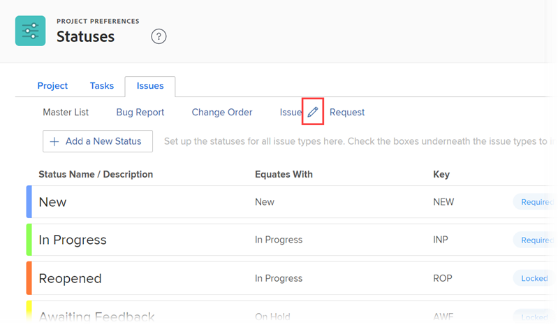

# Anfragetypen konfigurieren

Bei der Arbeit an einem Projekt können Sie feststellen, dass unerwartete Ereignisse auftreten. Sie können diese unerwarteten Ereignisse als Probleme für ein bestimmtes Projekt oder eine bestimmte Aufgabe protokollieren. Sie können auch Anfragen senden, die als Probleme in einem Projekt aufgezeichnet werden, das als Anforderungswarteschlange bezeichnet wird. Probleme und Anforderungen werden in Adobe Workfront als austauschbar betrachtet.

Weitere Informationen zum Erstellen von Problemen finden Sie unter [!DNL Workfront], siehe [Erstellen von Problemen](../../../manage-work/issues/manage-issues/create-issues.md). Informationen zum Erstellen von Anforderungen in [!DNL Workfront], siehe [Erstellen und Senden [!DNL Adobe Workfront] requests](../../../manage-work/requests/create-requests/create-submit-requests.md). Informationen zum Verknüpfen von Anfragetypen mit Projekten finden Sie unter [Anforderungstypen für ein Projekt definieren](../../../manage-work/requests/create-and-manage-request-queues/define-request-types-for-project.md).

## Zugriffsanforderungen

Sie müssen über folgenden Zugriff verfügen, um die Schritte in diesem Artikel ausführen zu können:

<table style="table-layout:auto"> 
 <col> 
 <col> 
 <tbody> 
  <tr> 
   <td role="rowheader">[!DNL Adobe Workfront] Plan</td> 
   <td>Beliebig</td> 
  </tr> 
  <tr> 
   <td role="rowheader">[!DNL Adobe Workfront] Lizenz</td> 
   <td>[!UICONTROL Plan]</td> 
  </tr> 
  <tr> 
   <td role="rowheader">Konfigurationen auf Zugriffsebene</td> 
   <td> 
Sie müssen [!DNL Workfront] Administrator.
 
<b>NOTE</b>: Wenn Sie noch keinen Zugriff haben, fragen Sie Ihren [!DNL Workfront] Administrator , wenn sie zusätzliche Einschränkungen für Ihre Zugriffsebene festlegen. Für Informationen zur [!DNL Workfront] Administrator kann Ihre Zugriffsebene ändern, siehe <a href="../../../administration-and-setup/add-users/configure-and-grant-access/create-modify-access-levels.md" class="MCXref xref">Benutzerdefinierte Zugriffsebenen erstellen oder ändern</a>.
 </td> 
  </tr> 
 </tbody> 
</table>

<!--
THIS IS DRAFTED IN FLARE
<h2>Set what issue or request types are allowed for a project</h2>

You can organize the kind of issues or requests that are logged in Workfront by Request Types. This organization is useful for reporting reasons and for helping users understand what kind of unexpected work might occur during the lifetime of a project.

You can specify the type of requests that can be logged on a project when you configure the <strong>Queue Details</strong> area for the project. 

<ol>
<li value="1"> 
 Click <strong>Projects</strong> in the Main Menu.  
 </li>
<li value="2">Click the name of the project to open it.</li>
<li value="3"> In the left panel, click <strong>Queue Details</strong>. </li>
<li value="4"> 
In the <strong>Queue Properties</strong> section, select the <strong>Request Types</strong> you want for the project.
 <note type="note">
You must have at least one request type selected. You can select multiple request types.
</note> </li>
<li value="5"> 
Click <strong>Save</strong>.
 
The request types you specified will be available to select when you enter a new issue on a task or a project, or when you submit a new request to the project.
 </li>
</ol>

-->

## Anpassen der Namen der Anfragetypen

Als [!DNL Workfront] -Administrator können Sie die Namen der Anfragetypen in Ihrem System konfigurieren. Die neuen Namen sind in jedem Bereich von [!DNL Workfront] wobei **[!UICONTROL Problemtyp]** oder **[!UICONTROL Anfragetyp]** werden Felder angezeigt:

* Im **[!UICONTROL Warteschlangendetails]** Bereich eines Projekts, der die Probleme oder Anforderungen erhält.
* Wenn für eine Anforderungswarteschlange mehr als ein Anfragetyp ausgewählt ist, wird im **[!UICONTROL Neues Problem] Formular** im **[!UICONTROL Problemtyp]** , wenn Sie ein neues Problem erstellen oder eine neue Anfrage senden.

   Weitere Informationen zum Erstellen von Problemen finden Sie unter [!DNL Workfront], siehe  [Erstellen von Problemen](../../../manage-work/issues/manage-issues/create-issues.md)

   Weitere Informationen zum Erstellen von Anforderungen finden Sie unter [!DNL Workfront], siehe  [Erstellen und Senden [!DNL Adobe Workfront] requests](../../../manage-work/requests/create-requests/create-submit-requests.md).

* Im **[!UICONTROL Detail des Warteschlangenthemas]** Formular, wenn Sie das Thema Warteschlange konfigurieren.\
   Weitere Informationen zum Erstellen von Warteschlangenthemen finden Sie unter [Erstellen von Warteschlangenthemen](../../../manage-work/requests/create-and-manage-request-queues/create-queue-topics.md).

So passen Sie die Namen der Anfragetypen an:

1. Klicken Sie auf **[!UICONTROL Hauptmenü]** icon  in der oberen rechten Ecke von [!DNL Adobe Workfront]Klicken Sie auf **[!UICONTROL Einrichtung]** .

1. Klicken **[!UICONTROL Projektvoreinstellungen]** > **[!UICONTROL Status]**.

1. Klicken Sie auf **[!UICONTROL Probleme]** Registerkarte.
1. Oben im **[!UICONTROL Probleme]** auf, bewegen Sie den Mauszeiger über den Namen eines Anfragetyps und klicken Sie auf die Schaltfläche **[!UICONTROL Bearbeiten]** angezeigt.

   

1. Geben Sie in das angezeigte Feld einen neuen Namen ein und drücken Sie dann die Eingabetaste **[!UICONTROL Eingabe]**.

## Konfigurieren des Problemstatus in verschiedenen Anfragetypen

Sie können jeden Anfragetyp mit verschiedenen Problemstatus verknüpfen. Sie können auch die Reihenfolge ändern, in der die Status zu einem Problem angezeigt werden, je nach Art des Problems.

Weitere Informationen zum Ändern der Standardreihenfolge der Problemstatus und zum Konfigurieren des Problemstatus finden Sie in der [Erstellen oder Bearbeiten eines Status](../../../administration-and-setup/customize-workfront/creating-custom-status-and-priority-labels/create-or-edit-a-status.md) Abschnitt in [Erstellen oder Bearbeiten eines Status](../../../administration-and-setup/customize-workfront/creating-custom-status-and-priority-labels/create-or-edit-a-status.md).
