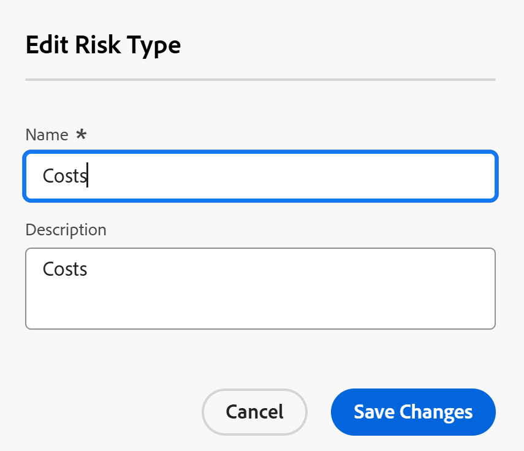
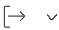
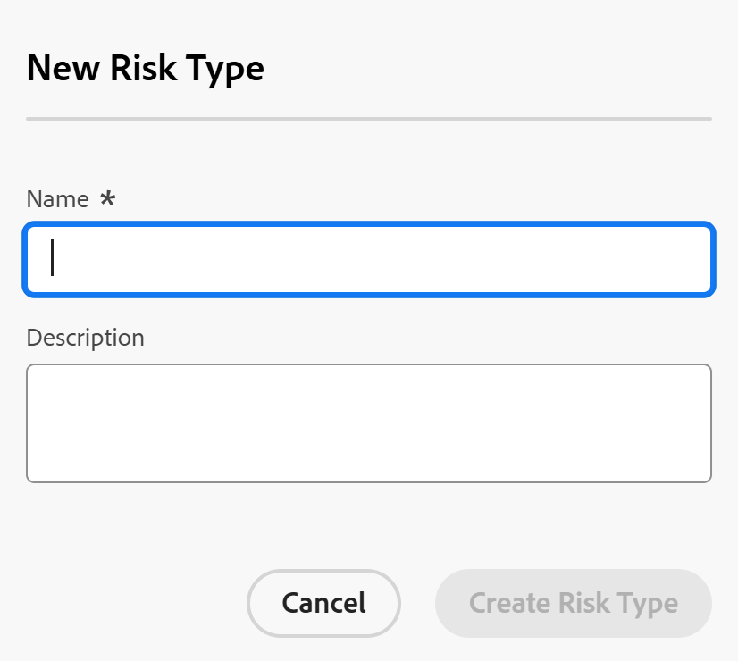

# Risikotypen bearbeiten und erstellen

<!--Audited: 03/2025-->

<!--DON'T DELETE, DRAFT OR HIDE THIS ARTICLE. IT IS LINKED TO THE PRODUCT, THROUGH THE CONTEXT SENSITIVE HELP LINKS.-->

Adobe Workfront verfügt über eine Reihe von Standardrisikotypen, die Sie Projekten in der Planungsphase zuordnen können, um potenzielle Hindernisse zu identifizieren, bevor Sie Arbeiten genehmigen.

Risiken sind mögliche Ereignisse, die den termingerechten oder budgetären Abschluss des Projekts verhindern könnten.

Zusätzlich zu den standardmäßigen Risikotypen können Sie einen neuen Risikotyp hinzufügen, um die Anforderungen in Ihrem Unternehmen widerzuspiegeln.

Sie können Risikotypen mit Projektrisiken verknüpfen, um festzustellen, auf welche Art von Risiko ein Projekt stoßen könnte.

## Zugriffsanforderungen

+++ Erweitern, um die Zugriffsanforderungen für die in diesem Artikel beschriebene Funktionalität anzuzeigen.

<table style="table-layout:auto"> 
 <col> 
 <col> 
 <tbody> 
  <tr> 
   <td>[!DNL Adobe Workfront] Packstück</td> 
   <td>
Beliebig
</td> 
  </tr> 
  <tr> 
   <td>[!DNL Adobe Workfront] Lizenz</td> 
   <td>
[!UICONTROL Standard]

       
[!UICONTROL Plan]
</td>
  </tr> 
  <tr> 
   <td>Konfigurationen der Zugriffsebene</td> 
   <td>[!UICONTROL Systemadministrator]</td> 
  </tr> 
 </tbody> 
</table>

Weitere Informationen finden Sie unter [Zugriffsanforderungen](/help/quicksilver/administration-and-setup/add-users/access-levels-and-object-permissions/access-level-requirements-in-documentation.md) in der Dokumentation zu Workfront.

+++

## Risikotypen

Risikotypen sind Kennzeichnungen, die Sie Ihren Risiken zuordnen können, um sie zu Berichtszwecken zu kategorisieren.

Als [!DNL Workfront] können Sie [!UICONTROL Risikotypen] im Bereich [!UICONTROL **Setup**] erstellen.

Nach der Einrichtung der Risikotypen sind sie für Ihr System universell.

Alle Projekteigentümer können für ihre Projekte dieselben Risikotypen verwenden.

## Risikotypen bearbeiten und erstellen

Einige Risikotypen sind standardmäßig bereits in [!DNL Workfront].

Sie können Folgendes tun, um die Anzahl der Risikotypen in Ihrer Workfront-Instanz zu erhöhen:

* [Bestehende Risikotypen bearbeiten](#edit-existing-risk-types)
* [Risikotypen erstellen](#create-risk-types)

### Bestehende Risikotypen bearbeiten {#edit-existing-risk-types}

{{step-1-to-setup}}

1. Klicken Sie **[!UICONTROL Risikotypen]**.
1. Wählen Sie den Risikotyp aus, den Sie bearbeiten möchten.
1. Klicken Sie auf das **[!UICONTROL Bearbeiten]**-Symbol .

   Das [!UICONTROL **Risikotyp bearbeiten**] wird geöffnet.

   

   >[!TIP]
   >
   >Sie können Risikotypinformationen inline bearbeiten, wenn Sie auf den Namen oder die Beschreibung eines Risikotyps in einer Liste von Risikotypen doppelklicken.

1. (Optional) Ändern Sie den Namen und die Beschreibung des Risikotyps.

   Für die Felder **[!UICONTROL Name“ und]** Beschreibung ]**gibt es eine Zeichenbeschränkung von**[!UICONTROL  0 Zeichen.

1. Klicken Sie **[!UICONTROL Änderungen speichern].**

1. (Optional) Um einen Risikotyp zu löschen, wählen Sie ihn in der Liste aus und klicken dann auf das [!UICONTROL **Löschen**]-Symbol  und dann auf [!UICONTROL **Ja, Löschen**]. Der Risikotyp wurde gelöscht und kann nicht wiederhergestellt werden.

1. (Optional) Um eine Liste von Risikotypen zu exportieren, klicken Sie auf das Symbol [!UICONTROL **Exportieren**] (Symbol . Sie können in die folgenden Dateitypen exportieren:

   * PDF
   * Excel
   * Excel (xlsx)
   * Durch Tabulatoren getrennt

   >[!TIP]
   >
   >   Sie können zunächst eine begrenzte Anzahl von Risikotypen auswählen und diese dann für eine kleinere Liste exportieren.

### Risikotypen erstellen {#create-risk-types}

Zusätzlich zu den standardmäßigen Risikotypen können Sie Risikotypen erstellen.

{{step-1-to-setup}}

1. Klicken Sie **[!UICONTROL Risikotypen]**.

1. Klicken Sie **[!UICONTROL Neuer Risikotyp]**, um das Feld [!UICONTROL **Neuer Risikotyp**] zu öffnen

   ODER

   Klicken Sie [!UICONTROL **Weitere Risikotypen hinzufügen**] in der linken unteren Ecke der Liste der Risikotypen, um Risikotypen inline hinzuzufügen.

   Das **Neuer Risikotyp** wird geöffnet.

   

1. Fügen Sie **[!UICONTROL Risikotyp einen]** Namen“ (erforderlich) und **[!UICONTROL Beschreibung]** (optional) hinzu.

   Für die Felder **[!UICONTROL Name“ und]** Beschreibung ]**gibt es eine Zeichenbeschränkung von**[!UICONTROL  0 Zeichen.

1. Klicken Sie **[!UICONTROL Risikotyp erstellen]**,

   Wenn Sie den Risikotyp mithilfe der Inline-Bearbeitung hinzugefügt haben, klicken Sie nach Abschluss **[!UICONTROL auf]** Eingabetaste“.

   >[!TIP]
   >
   >Informationen zum Bearbeiten eines benutzerdefinierten Risikotyps finden Sie im Abschnitt [[!UICONTROL Bearbeiten ] Risikotypen](#edit-existing-risk-types) in diesem Artikel.

## Risiken mit Risikotypen an Projekte anhängen

Sie können Risikotypen verwenden, um zu Ihren Projekten hinzugefügte Risiken zu kennzeichnen.

Weitere Informationen zum Hinzufügen von Risiken zu Projekten finden Sie unter [Erstellen und Bearbeiten von Risiken in Projekten](../../../manage-work/projects/define-a-business-case/create-edit-risks-on-projects.md).
