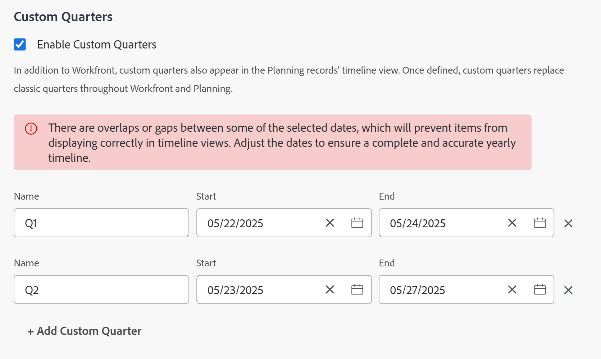

# Aktivieren von benutzerdefinierten Quartalen

<!--Audited: 03/2026-->

<!--
The highlighted information on this page refers to functionality not yet generally available. It is available only in the Preview environment for all customers. After the monthly releases to Production, the same features are also available in the Production environment for customers who enabled fast releases.    

For information about fast releases, see [Enable or disable fast releases for your organization](/help/quicksilver/administration-and-setup/set-up-workfront/configure-system-defaults/enable-fast-release-process.md). 
-->

Zu Berichtszwecken können Sie benutzerdefinierte Quartale erstellen, wenn die Quartale Ihres Unternehmens auf bestimmten Kriterien basieren, die keine Kalenderdaten sind (z. B. Geschäftstage oder Einkaufstage).

Je nachdem, welche Produkte Ihr Unternehmen gekauft hat, können Sie die folgende Anzahl von Quartalen in Ihrem Workfront-Setup-Bereich konfigurieren:

* Kunden, die nur [!DNL Workfront] erworben haben, können bis zu acht benutzerdefinierte Quartale für ihr [!DNL Adobe Workfront] konfigurieren.
* Kunden, die [!DNL Workfront] und [!DNL Workfront Planning] erworben haben, können bis zu 100 Quartale für ihr [!DNL Workfront] konfigurieren, die auch in [!DNL Planning] verfügbar sind.

<!--

* Customers who purchased [!DNL Workfront] and [!DNL Workfront Planning], can configure custom weeks for each custom quarter which are visible in the [!DNL Planning] timeline views. 

-->

## Zugriffsanforderungen

+++ Erweitern, um die Zugriffsanforderungen für die in diesem Artikel beschriebene Funktionalität anzuzeigen.

<table style="table-layout:auto"> 
 <col> 
 <col> 
 <tbody> 
  <tr> 
   <td>[!DNL Adobe Workfront] Packstück</td> 
   <td>
Beliebig
</td> 
  </tr> 
  <tr> 
   <td>[!DNL Adobe Workfront] Lizenz</td> 
   <td>
[!UICONTROL Workflow Standard] oder [!UICONTROL Workfront Plan] Lizenz

       

</td>
  </tr> 
  <tr> 
   <td>Konfigurationen der Zugriffsebene</td> 
   <td>[!UICONTROL Systemadministrator]</td> 
  </tr> 
 </tbody> 
</table>

Weitere Informationen finden Sie unter [Zugriffsanforderungen](/help/quicksilver/administration-and-setup/add-users/access-levels-and-object-permissions/access-level-requirements-in-documentation.md) in der Dokumentation zu Workfront.

+++

<!--
When we release fiscal weeks, replace the table above with this:

<table style="table-layout:auto"> 
 <col> 
 <col> 
 <tbody> 
  <tr> 
   <td>[!DNL Adobe Workfront] package</td> 
   <td>
   <ul>
   <li>
To configure custom quarters:

   
Any Workfront or Workflow package
</li>
   <li>
   

   
To configure custom weeks:

   
Any Planning package, including Planning as a standalone product

   

   </li>
   </ul>
   </td> 
  </tr> 
  <tr> 
   <td>[!DNL Adobe Workfront] license</td> 
   <td>
   
   <ul>
   <li>
To configure custom quarters:

   
[!UICONTROL Workflow Standard] or [!UICONTROL Workfront Plan] license
</li>
   <li>
   

   
To configure custom weeks:

   
A [!UICONTROL Planning Standard] license, in addition to a Workfront or a Workflow license

   

   </li>
   </ul>
    </td>
  </tr> 
  <tr> 
   <td>Access level configurations</td> 
   <td>[!UICONTROL System Administrator]</td> 
  </tr> 
 </tbody> 
</table>

-->

## Benutzerdefinierte Quartale für Ihr [!DNL Workfront] einrichten

<!--
Setting up custom quarters differs depending on which environment you use. 

### Set up custom quarters for your [!DNL Workfront] system in the Production environment
-->

{{step-1-to-setup}}

1. Klicken Sie auf **[!UICONTROL Benutzerdefinierte Quartale]**.

1. Wählen Sie **[!UICONTROL Benutzerdefinierte Quartale aktivieren]** aus.

1. Geben Sie einen Namen für das benutzerdefinierte Quartal ein, z. B. „Geschäftsjahr 1 2021“.
1. Wählen Sie das Start- und Enddatum für das benutzerdefinierte Quartal aus.

   

1. (Optional) Klicken Sie **[!UICONTROL Benutzerdefiniertes Quartal hinzufügen]**, um dem System zusätzliche benutzerdefinierte Quartale hinzuzufügen.

   >[!IMPORTANT]
   >
   > Wenn Ihr Unternehmen [!DNL Workfront Planning] gekauft hat, können Sie Ihre benutzerdefinierten Quartale nicht speichern, wenn es Lücken oder Überschneidungen zwischen den Quartalen gibt.
   >
   >Lücken und Überschneidungen zwischen den Quartalen sind nur für [!DNL Workfront] Kunden zulässig.

1. (Optional und bedingt) Wenn Ihr Unternehmen nur [!DNL Workfront] gekauft hat, erstellen Sie [!DNL Workfront Planning] ein Berichtselement, das sich auf das Geschäftsquartal bezieht.

   **Beispiel** Erstellen Sie einen Filter für eine [!UICONTROL Projekt]Liste und geben Sie das geplante Abschlussdatum eines Projekts an, das auf die benutzerdefinierten Quartale verweist.

   

   Die Verweise auf „Dieses Quartal“, „Nächstes Quartal“ und „Letztes Quartal“ werden durch neue Verweise auf die benutzerdefinierten Quartale ersetzt.

   Informationen zu Berichtselementen finden Sie unter [Berichtselemente: Filter, Ansichten und Gruppierungen](../../../reports-and-dashboards/reports/reporting-elements/reporting-elements-filters-views-groupings.md).

   Informationen zum Erstellen von Filtern finden Sie unter [Erstellen oder Bearbeiten von Filtern in [!DNL Adobe Workfront]](../../../reports-and-dashboards/reports/reporting-elements/create-filters.md).
1. (Optional und bedingt) Wenn Ihr Unternehmen Workfront Planning erworben hat und Sie Zugriff auf [!DNL Workfront Planning] haben, navigieren Sie zu einer Seite für den Datensatztyp und öffnen Sie eine Zeitleisten -Ansicht. Die Ansicht zeigt die neuen benutzerdefinierten Quartale an.
Weitere Informationen finden Sie unter [Verwalten der Timeline-Ansicht](/help/quicksilver/planning/views/manage-the-timeline-view.md).

<!--

### Set up custom quarters for your [!DNL Workfront] system in the Preview environment

>[!NOTE]
>
>If your organization purchased a Planning package in addition to a Workflow package, or if they purchased  Workfront Planning as a standalone package, you can configure custom weeks, in addition to custom quarters. 
> 
>Custom weeks are not available for Workfront reports and lists. 

{{step-1-to-setup}}

1. Click **[!UICONTROL Custom Quarters]**.

1. Select **[!UICONTROL Enable Custom Quarters]**.

1. Type a name for the custom quarter. For example, "Fiscal Q1 2021."
1. Select start and end dates for the custom quarter.

1. (Optional) Select the **Starts a new custom week sequence** option. 

    When selected, this option sets the start of the custom quarter as the start of the first custom week of the quarter in the Planning timeline view. 
1. (Optional) In the **Custom week label format** area, choose the **Format** for the custom week labels. Choose from the following options:

    * **W1, W2, W3 ...** . This is the default format.
    * **FW1, FW2, FW3 ...**
    * **Week1, Week 2, Week 3, ...**
    * **Custom**

1. (Conditional) If you selected **Custom** for the **Format** field, type a **Custom label** to identify the custom weeks.  

    Custom weeks display in Planning timeline views. 

    >[!TIP]
    >
    >When adding a custom label, you can type up to 100 characters. 
    >
    >You may indicate the name of the first week, and the following weeks will use the same label followed by a sequential number. 
    >
    >For example, a **Custom label** of "Fiscal week" will add the labels of "Fiscal week 1, Fiscal week 2, Fiscal week 3 ..." to the rest of the weeks in the sequence. 

1. (Optional) Click **[!UICONTROL Add Custom Quarter]** to add additional custom quarters to the system.

      >[!IMPORTANT]
      >
      > If your company purchased [!DNL Workfront Planning], you cannot save your custom quarters if there are gaps or overlaps between the quarters. 
      >
      >Gaps and overlaps between the quarters are allowed for [!DNL Workfront] only customers. 

1. (Optional and conditional) To view the custom quarters in Workfront, create a reporting element that refers to the custom quarters.

   **Example:** Create a filter for a [!UICONTROL project] list and include the Planned Completion Date of a project referencing the custom quarters.

   

   The references to "This Quarter", "Next Quarter", and "Last Quarter" are replaced with new references to the custom quarters.

   For information about reporting elements, see [Reporting elements: filters, views, and groupings](../../../reports-and-dashboards/reports/reporting-elements/reporting-elements-filters-views-groupings.md).

   For information about creating filters, see [Create or edit filters in [!DNL Adobe Workfront]](../../../reports-and-dashboards/reports/reporting-elements/create-filters.md).
1. (Optional and conditional) To view custom quarters and weeks in Workfront Planning, go to a record type page and open a timeline view. The view displays the new custom quarters and weeks. 

For information, see [Manage the timeline view](/help/quicksilver/planning/views/manage-the-timeline-view.md). 

-->