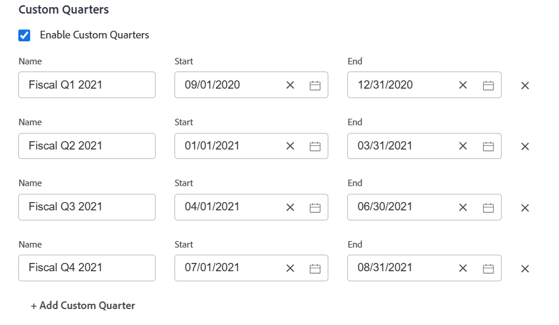

# Benutzerdefinierte Quartale für Projekte aktivieren

Zu Berichtszwecken können Sie benutzerdefinierte Quartale erstellen, wenn die Quartale Ihres Unternehmens auf bestimmten Kriterien basieren, die nicht mit Kalenderdaten identisch sind (z. B. Geschäftstage oder Einkaufstage).

Sie können bis zu acht benutzerdefinierte Quartale für Ihre [!DNL Adobe Workfront] System.

## Zugriffsanforderungen

Sie müssen über folgenden Zugriff verfügen, um die Schritte in diesem Artikel ausführen zu können:

<table style="table-layout:auto"> 
 <col> 
 <col> 
 <tbody> 
  <tr> 
   <td role="rowheader">[!DNL Adobe Workfront] Plan</td> 
   <td>Beliebig</td> 
  </tr> 
  <tr> 
   <td role="rowheader">[!DNL Adobe Workfront] Lizenz</td> 
   <td>[!UICONTROL Plan]</td> 
  </tr> 
  <tr> 
   <td role="rowheader">Konfigurationen auf Zugriffsebene</td> 
   <td> 
Sie müssen [!DNL Workfront] Administrator.
 
<b>NOTE</b>: Wenn Sie noch keinen Zugriff haben, fragen Sie Ihren [!DNL Workfront] Administrator , wenn sie zusätzliche Einschränkungen für Ihre Zugriffsebene festlegen. Für Informationen zur [!DNL Workfront] Administrator kann Ihre Zugriffsebene ändern, siehe <a href="../../../administration-and-setup/add-users/configure-and-grant-access/create-modify-access-levels.md" class="MCXref xref">Benutzerdefinierte Zugriffsebenen erstellen oder ändern</a>.
 </td> 
  </tr> 
 </tbody> 
</table>

## Benutzerdefinierte Quartale für Ihre [!DNL Workfront] System

1. Klicken Sie auf **[!UICONTROL Hauptmenü]** icon  in der oberen rechten Ecke von [!DNL Adobe Workfront]Klicken Sie auf **[!UICONTROL Einrichtung]** .

1. Klicken **[!UICONTROL Projektvoreinstellungen]** > **[!UICONTROL Projekte].**

1. Im **[!UICONTROL Zeitpläne]** Bereich, wählen Sie **[!UICONTROL Benutzerdefinierte Quartal aktivieren]**.

1. Geben Sie einen Namen für das benutzerdefinierte Quartal ein, z. B. &quot;Fiscal Q1 2021&quot;.
1. Wählen Sie das Start- und Enddatum für das benutzerdefinierte Quartal aus.

   

1. (Optional) Klicken Sie auf **[!UICONTROL Benutzerdefiniertes Quartal hinzufügen]** , um dem System weitere benutzerdefinierte Quartale hinzuzufügen.
1. (Optional) Erstellen Sie ein Berichterstellungselement, das auf die Geschäftsquartale verweist.

   **Beispiel:** Erstellen Sie einen Filter für eine [!UICONTROL Projekt] das geplante Abschlussdatum eines Projekts angeben, das auf die benutzerdefinierten Quartale verweist.

   

   Die Verweise auf &quot;Dieses Quartal&quot;, &quot;Nächstes Quartal&quot;und &quot;Letztes Quartal&quot;werden durch neue Verweise auf die benutzerdefinierten Quartale ersetzt.

   Informationen zu Berichterstellungselementen finden Sie unter [Berichterstellungselemente: Filter, Ansichten und Gruppierungen](../../../reports-and-dashboards/reports/reporting-elements/reporting-elements-filters-views-groupings.md).

   Informationen zum Erstellen von Filtern finden Sie unter [Erstellen und Bearbeiten von Filtern in [!DNL Adobe Workfront]](../../../reports-and-dashboards/reports/reporting-elements/create-filters.md).
