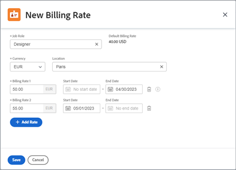

# Tarifkarten verwalten

{{highlighted-preview-article-level}}

Mit Tarifkarten können Sie je nach Standort mehrere Abrechnungssätze pro Rolle definieren. Sie könnten ein Aufgabengebiet für Designer mit Sitz in Paris und ein zweites Designer mit Sitz in New York haben, jedes mit unterschiedlichen Abrechnungssätzen. Für Aufgabengebiete auf einer Tarifkarte ist jedoch kein Standort erforderlich. Ein Abrechnungssatz für ein Aufgabengebiet (und möglicherweise den Standort) auf einer Tarifkarte kann auch Gültigkeitsdaten enthalten.

## Zugriffsanforderungen

+++ Erweitern Sie , um die Zugriffsanforderungen für die -Funktion in diesem Artikel anzuzeigen.

<table style="table-layout:auto"> 
 <col> 
 <col> 
 <tbody> 
  <tr> 
   <td>[!DNL Adobe Workfront] Packstück</td> 
   <td>
Beliebig
</td> 
  </tr> 
  <tr> 
   <td>[!DNL Adobe Workfront] Lizenz</td> 
   <td>
[!UICONTROL Standard]

       
[!UICONTROL -Plan]
</td>
  </tr> 
  <tr> 
   <td>Konfigurationen der Zugriffsebene</td> 
   <td>[!UICONTROL Systemadministrator]</td> 
  </tr> 
 </tbody> 
</table>

Weitere Informationen finden Sie unter [Zugriffsanforderungen in der Dokumentation zu Workfront](/help/quicksilver/administration-and-setup/add-users/access-levels-and-object-permissions/access-level-requirements-in-documentation.md).

+++

## Tarifkarte hinzufügen

{{step-1-to-setup}}

1. Klicken Sie im linken Bedienfeld auf [!UICONTROL **Tarifkarten**].
1. Klicken Sie auf [!UICONTROL **Neue Tarifkarte**] und geben Sie dann einen Namen für die Tarifkarte in das Feld [!UICONTROL Neue &#x200B;]&quot; ein, um „Unbenannte Tarifkarte“ zu ersetzen.
1. (Optional) Fügen Sie auf dem Bildschirm mit den Tarifkartendetails eine [!UICONTROL **Beschreibung**] hinzu.
1. (Optional) Um ein benutzerdefiniertes Formular an die Tarifkarte anzuhängen, klicken Sie auf das Feld [!UICONTROL **Benutzerdefiniertes Formular hinzufügen**] in der oberen rechten Ecke und wählen Sie ein benutzerdefiniertes Formular aus der angezeigten Liste aus.

   Weitere Informationen zum Anhängen eines benutzerdefinierten Formulars finden Sie unter [Hinzufügen eines benutzerdefinierten Formulars zu einem Objekt](/help/quicksilver/workfront-basics/work-with-custom-forms/add-a-custom-form-to-an-object.md).

1. Klicken Sie [!UICONTROL **linken Navigationsbereich auf**] Aufgabengebiete und Tarife“.
1. Klicken Sie auf dem Bildschirm „Aufgabengebiete und Tarife der Tarifkarte“ auf [!UICONTROL **Aufgabengebiet hinzufügen**].
1. Wählen Sie im Dialogfeld ein [!UICONTROL **Aufgabengebiet**] aus, um Abrechnungssätze für zu definieren.

   Der Standard-Abrechnungssatz zeigt den Satz auf Systemebene für dieses Aufgabengebiet an, sofern ein solcher definiert ist.

   

1. Wählen Sie [!UICONTROL **Aufgabengebiet eine**] Währung“ aus.
1. (Optional) Wählen Sie [!UICONTROL **Aufgabengebiet einen**] aus.
1. Geben Sie [!UICONTROL **Feld „Abrechnungssatz 1**] den Abrechnungssatz für diesen Speicherort ein. Klicken Sie dann auf [!UICONTROL **Speichern**], um den Abrechnungssatz einmal zu überschreiben.

   Oder

   Klicken Sie [!UICONTROL **Abrechnungssatz hinzufügen**], um weitere standortspezifische Abrechnungssätze mit Gültigkeitsdaten hinzuzufügen.

1. (Bedingt) Wenn Sie mehr als einen Abrechnungssatz für diesen Speicherort hinzufügen, geben Sie die folgenden Informationen ein:

   * **[!UICONTROL Abrechnungssatz 1], 2 usw.:** Der Wert des Abrechnungssatzes für den Zeitraum.
   * **[!UICONTROL Startdatum]:** Das Datum, an dem die Tarifüberschreibungen beginnen.
   * **[!UICONTROL Enddatum]:** Das Datum, an dem die Tarifüberschreibung endet.

     Abrechnungssatz 1 hat kein Startdatum und der letzte Abrechnungssatz hat kein Enddatum. Einige Daten werden automatisch hinzugefügt. Wenn beispielsweise Abrechnungssatz 1 kein Enddatum hat und Sie Abrechnungssatz 2 mit dem Startdatum 1. Mai 2023 hinzufügen, wird dem Abrechnungssatz 1 das Enddatum 30. April 2023 hinzugefügt, sodass keine Lücken bestehen.

1. Klicken Sie auf [!UICONTROL **Speichern**].
1. (Optional) Um einen weiteren Abrechnungssatz hinzuzufügen, entweder für dasselbe Aufgabengebiet an einem anderen Ort oder für ein separates Aufgabengebiet, klicken Sie auf [!UICONTROL **Aufgabengebiet hinzufügen**].
1. (Optional) Um eine Tarifkarte zu bearbeiten, klicken Sie im Setup in der Liste Tarifkarten auf den Namen der Tarifkarte. Um einen Abrechnungssatz zu bearbeiten, klicken Sie [!UICONTROL **linken Navigationsbereich der Tarifkarte auf**] Aufgabengebiete und Sätze“. Wählen Sie dann den Tarif aus und klicken Sie auf das **Bearbeiten**-Symbol .

## Tarifkarte kopieren

{{step-1-to-setup}}

1. Klicken Sie im linken Bedienfeld auf [!UICONTROL **Tarifkarten**].
1. Aktivieren Sie das Kontrollkästchen neben der Tarifkarte in der Liste und klicken Sie auf das **Kopieren**-Symbol .
1. Geben Sie einen Namen für die Tarifkarte in das Feld [!UICONTROL Tarifkarte kopieren] ein, um „Unbenannte Tarifkarte“ zu ersetzen. Klicken Sie dann auf **Speichern**.

   Die neue Tarifkarte wird gespeichert. Bearbeiten Sie die Details der Tarifkarte, Aufgabengebiete und Tarife nach Bedarf.

## Gesamte Tarifkarte löschen

{{step-1-to-setup}}

1. Klicken Sie im linken Bedienfeld auf [!UICONTROL **Tarifkarten**].
1. Aktivieren Sie das Kontrollkästchen neben der Tarifkarte in der Liste und klicken Sie auf das **Löschen**-Symbol .

   >[!NOTE]
   >
   >Eine Tarifkarte, die an ein Projekt angehängt ist, wird aus dem Projekt gelöscht.
