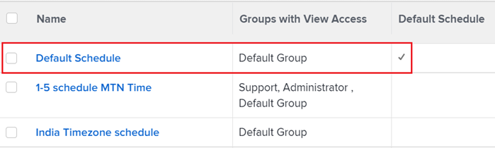

# Zeitpläne - Übersicht

Sie können Ihre Arbeitswoche mithilfe von Zeitplänen definieren und einen Zeitplan mit einem Benutzer oder Projekt verknüpfen. Dies ermöglicht Folgendes [!DNL Adobe Workfront] zur Berechnung der Zeitpläne und der Benutzerverfügbarkeit. Anweisungen finden Sie unter [Zeitplan erstellen](../../../administration-and-setup/set-up-workfront/configure-timesheets-schedules/create-schedules.md).

Beachten Sie beim Arbeiten mit Zeitplänen in Workfront Folgendes:

* Die [!DNL Workfront] -Administrator identifiziert die Betriebszeiten für die Organisation in einem Zeitplan.

  Auf ähnliche Weise kann ein Gruppenadministrator die Betriebsstunden eines Zeitplans identifizieren, der von einer von ihm verwalteten Gruppe verwaltet wird.

  Weitere Informationen zu Gruppenadministratoren finden Sie unter [Gruppenadministratoren](../../../administration-and-setup/manage-groups/group-roles/group-administrators.md).

  Beispielsweise kann ein Zeitplan wie folgt definiert werden: Montag bis Freitag, 8:00 bis 17:00 Uhr mit einer Stundenpause für das Mittagessen.

* [!DNL Workfront] verwendet den Zeitplan, um zu bestimmen, wann der Arbeitstag beginnt und endet.

  Dies hindert Benutzer nicht daran, an der Arbeit in [!DNL Workfront] außerhalb der normalen Geschäftszeiten. Im Allgemeinen ist es nicht erforderlich, einen neuen Zeitplan oder eine Planungsausnahme zu erstellen, um sich auf die abends geplanten Arbeiten zu konzentrieren.

  Ebenso kann Ihre Organisation flexible Ankunftszeiten für Ihren Arbeitstag haben. Sie können eine Gruppe von Mitarbeitern haben, die um 8 Uhr ankommen, und eine andere Gruppe, die um 9 Uhr ankommt. Es ist nicht erforderlich, für jede Gruppe eindeutige Zeitpläne zu erstellen, wenn die Gruppen ähnliche oder identische Zeitpläne haben. Wenn die Gruppen jedoch drastisch unterschiedliche Zeitpläne haben, sollten ihre Benutzer eindeutigen Zeitplänen zugeordnet werden. Ein Mitarbeiter versteht, ob eine Aufgabe um 17 Uhr abgeschlossen sein soll, es bedeutet, dass die Arbeit am Ende des Arbeitstages unabhängig von der Arbeitszeit durchgeführt werden muss.

* Es wird empfohlen, für jede mit der Organisation verbundene Zeitzone separate Zeitpläne zu erstellen.

  Sie können jedem Zeitplan eine bestimmte Zeitzone zuweisen, um sicherzustellen, dass die Arbeit für Benutzer, die in verschiedenen Zeitzonen arbeiten, entsprechend geplant ist.

* Die [!DNL Workfront] Standardzeitplan wird in Timeline-Berechnungen verwendet, wenn Benutzer oder Projekte keinem Zeitplan zugeordnet sind.

  Der Standardzeitplan wird mit Ihrem [!DNL Workfront] und kann nur gelöscht werden, wenn sie durch einen neuen Zeitplan ersetzt wurde, den Sie erstellen.

* Zusätzlich zur Berechnung der Zeitpläne [!DNL Workfront] verwendet Zeitpläne zur Berechnung der Benutzerverfügbarkeit.

  >[!IMPORTANT]
  >
  >[!DNL Workfront] verwendet entweder den Benutzer oder den Projektplan, um die Ressourcenverfügbarkeit im Ressourcen-Planer zu bestimmen. Welcher Zeitplan verwendet wird, hängt davon ab, was die [!DNL Workfront] Administrator ausgewählt für [!UICONTROL Berechnen der Ressourcenverfügbarkeit mithilfe von] -Einstellung. Informationen zu den Einstellungen für die Ressourcenverwaltung finden Sie unter [Voreinstellungen für die Ressourcenverwaltung konfigurieren](../../../administration-and-setup/set-up-workfront/configure-system-defaults/configure-resource-mgmt-preferences.md).

## Hierarchie der Zeitpläne

Wenn eine Aufgabe einem Benutzer zugewiesen ist, der mit einem Zeitplan verknüpft ist, und sich in einem Projekt befindet, das mit einem zweiten Zeitplan verknüpft ist, verfügen Sie über mindestens 2 Zeitpläne, die möglicherweise auf Ihre Zeitleistenberechnungen angewendet werden können.

>[!IMPORTANT]
>
>[!DNL Workfront] verwendet den Zeitplan eines Benutzers nur, wenn die Variable [!UICONTROL Berechnen der Ressourcenverfügbarkeit mithilfe von] festgelegt ist auf [!UICONTROL Der Zeitplan des Benutzers] im [!UICONTROL Ressourcenverwaltung] Gebiet von [!UICONTROL Einrichtung]. Informationen zur [!UICONTROL Berechnen der Ressourcenverfügbarkeit mithilfe von] -Einstellung beeinflusst, welcher Zeitplan für die Ressourcenverwaltung verwendet wird, siehe [Voreinstellungen für die Ressourcenverwaltung konfigurieren](../../../administration-and-setup/set-up-workfront/configure-system-defaults/configure-resource-mgmt-preferences.md).

Die Reihenfolge, in der die Zeitpläne vom System verwendet werden, wenn mehrere Zeitpläne vorhanden sind, lautet:

* Wenn ein Benutzer einer Aufgabe zugewiesen ist, [!DNL Workfront] verwendet den Zeitplan des Benutzers zur Berechnung der Zeitleiste der Aufgabe. Dies schließt auch die persönliche Zeit des Benutzers ein. Der Zeitplan des Projekts wird ignoriert.

  Weitere Informationen zur persönlichen Zeit finden Sie unter [Persönliche Zeit konfigurieren](../../../workfront-basics/manage-your-account-and-profile/configuring-your-user-profile/personal-time-overview.md).

* Wenn mehrere Benutzer einer Aufgabe zugewiesen sind und die Benutzer während des Zeitrahmens der Aufgabe unterschiedliche Zeitpläne haben, [!DNL Workfront] verwendet einen der folgenden Zeitpläne, wie in der [!UICONTROL Projektvoreinstellungen] Gebiet von [!UICONTROL Einrichtung]:

   * Der Zeitplan des Benutzers, der als Primärer Bevollmächtigter benannt wurde
   * Der mit dem Projekt verknüpfte Zeitplan.

     Weitere Informationen zu den Projektvoreinstellungen finden Sie unter [Systemweite Projektvoreinstellungen konfigurieren](../../../administration-and-setup/set-up-workfront/configure-system-defaults/set-project-preferences.md).

* Wenn der der Aufgabe zugewiesene Benutzer keinen Zeitplan hat oder die Aufgabe nur einer Auftragsrolle zugewiesen ist, wird ein Team oder die Zuweisung der Aufgabe aufgehoben. [!DNL Workfront] verwendet den Projektzeitplan für die Timeline-Berechnungen.
* Wenn der der Aufgabe zugewiesene Benutzer keinen Zeitplan hat oder die Aufgabe nur einer Auftragsrolle, einem Team oder einer nicht zugewiesenen Zuweisung zugewiesen ist und das Projekt keinen Zeitplan hat, dann [!DNL Workfront] verwendet den Zeitplan in dem System, das als Standardzeitplan für Zeitleistenberechnungen festgelegt ist.

  

## Zusammenarbeit in [!DNL Workfront] Zeitzonen

Informationen zur Verwendung von Zeitplänen zur Unterstützung der Zusammenarbeit von Benutzern in [!DNL Workfront] über Zeitzonen hinweg, siehe [Arbeiten über Zeitzonen hinweg](../../../workfront-basics/tips-tricks-and-troubleshooting/working-across-timezones.md).
