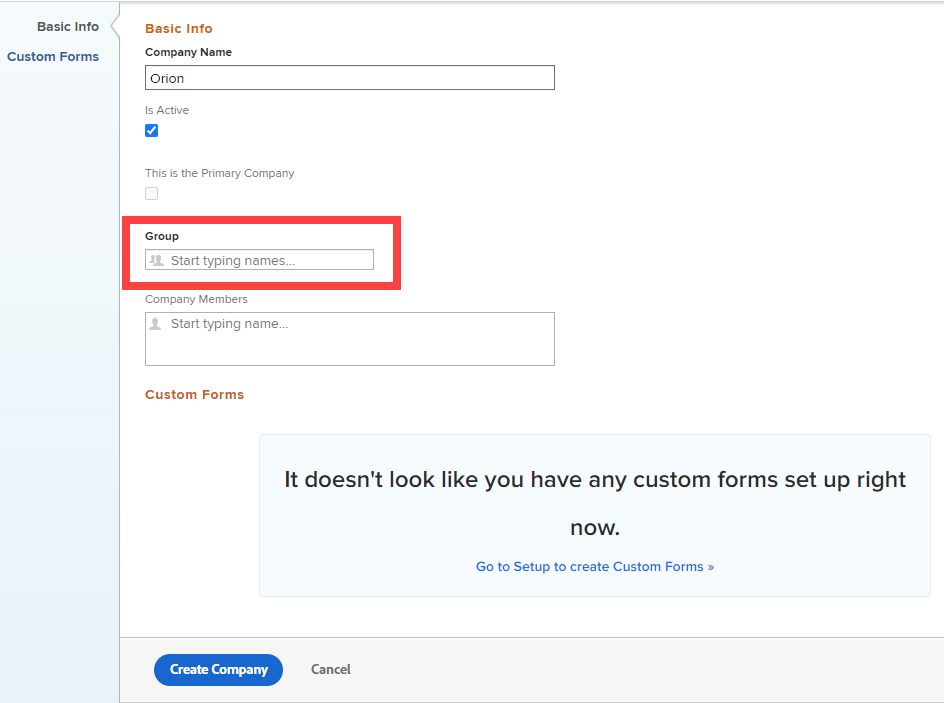

# Unternehmen erstellen und bearbeiten

<!--Audited: 01/2024-->

<!--DON'T DELETE, DRAFT OR HIDE THIS ARTICLE. IT IS LINKED TO THE PRODUCT, THROUGH THE CONTEXT SENSITIVE HELP LINKS.-->

Die hervorgehobenen Informationen auf dieser Seite beziehen sich auf Funktionen, die noch nicht allgemein verfügbar sind. Sie ist nur in der Sandbox-Vorschau -Umgebung verfügbar und wird in einem schrittweisen Rollout in die Produktion veröffentlicht.

Ein Unternehmen ist eine Organisationseinheit in [!DNL Adobe Workfront], die Ihr Unternehmen, eine Abteilung innerhalb des Unternehmens oder einen Kunden, mit dem Sie zusammenarbeiten, repräsentieren kann. Sie können Unternehmen zu [!DNL Workfront] hinzufügen und sie für Finanzplanung und Berichtszwecke verwenden, um Berechtigungen für Objekte zu definieren und Informationen vertraulich zu behandeln.

## Zugriffsanforderungen

+++ Erweitern Sie , um die Zugriffsanforderungen für die -Funktion in diesem Artikel anzuzeigen.

<table style="table-layout:auto"> 
 <col> 
 <col> 
 <tbody> 
  <tr> 
   <td> 
[!DNL Workfront] Packstück
 </td> 
   <td>
Beliebig
</td> 
  </tr> 
  <tr> 
   <td> 
[!DNL Adobe Workfront] Lizenz
 </td> 
   <td>
[!UICONTROL -Plan]

   
[!UICONTROL Standard]

   </td> 
  </tr> 
  <tr> 
   <td>Konfiguration der Zugriffsebene</td> 
   <td> 
Sie müssen eine der folgenden Möglichkeiten haben:
 
    <ul> 
     <li> 
Die Zugriffsebene [!UICONTROL Systemadministrator], mit der Sie jede Firma im System bearbeiten können.
 </li> 
     <li> 
Administrativer Zugriff auf die Verwaltung von Unternehmen, wodurch Sie jedes Unternehmen im System bearbeiten können.
 </li> 
    </ul> 
<b>HINWEIS</b>:  
     <ul> 
      <li> 
Sie können auch Firmen verwalten, die mit einer beliebigen Gruppe verknüpft sind, der Sie als Gruppenadministrator zugewiesen sind.
 </li> 
      <li> 
Um Benutzer zum [!DNL Workfront] hinzuzufügen oder daraus zu entfernen, benötigen Sie eine der folgenden Eigenschaften:
 
       <ul> 
        <li> 
Zugriffsebene des [!UICONTROL Systemadministrators]. 
 </li> 
        <li> 
<b>[!UICONTROL Users]</b> Einstellung in der Zugriffsebene konfiguriert, um den[!UICONTROL Edit]<b>-Zugriff zu </b>, wobei <b>[!UICONTROL Create]</b> und mindestens eine der beiden <b>[!UICONTROL User Admin]</b> Optionen unter <b> </b>[!UICONTROL Feinabstimmung der Einstellungen] aktiviert ist. 
 
  
 
Wenn <b>[!UICONTROL User Admin (Group Users)]</b> aktiviert ist, müssen Sie unter diesen beiden Optionen Gruppenadministrator einer Gruppe sein, in der der Benutzer Mitglied ist.
 </li> 
       </ul>
       </li> 
     </ul> 
 </td> 
  </tr> 
 </tbody> 
</table>

Weitere Informationen finden Sie unter [Zugriffsanforderungen in der Dokumentation zu Workfront](/help/quicksilver/administration-and-setup/add-users/access-levels-and-object-permissions/access-level-requirements-in-documentation.md).

+++

## Vorteile beim Hinzufügen von Benutzern zu einem Unternehmen {#benefits-of-adding-users-to-a-company}

* Sie können das Organigramm eines Unternehmens erstellen, indem Sie Benutzer mit direkt unterstellten Mitarbeitern verknüpfen. Nur Benutzer desselben Unternehmens können als direkt unterstellte Mitarbeiter eines anderen Benutzers dieses Unternehmens hinzugefügt werden.
* Als Projekt-Manager können Sie die verfügbaren Ressourcen innerhalb desselben Unternehmens identifizieren.
* Sie können Informationen zwischen Unternehmen vertraulich halten, indem Sie eine oder alle der folgenden Einstellungen auswählen:

   * Benutzer desselben Unternehmens können die Anfragen des jeweils anderen sehen.

     Weitere Informationen dazu, wie ein [!DNL Workfront]-Administrator ähnlichen Zugriff auf Anfragen gewähren kann, die auf dem Unternehmen des Benutzers basieren, finden Sie im Abschnitt [Konfigurieren von Voreinstellungen für Aufgaben und Probleme für alle in [!DNL Workfront]](../../../administration-and-setup/set-up-workfront/configure-system-defaults/set-task-issue-preferences.md#changing-task-and-issue-preferences) im Artikel [Konfigurieren von systemweiten Voreinstellungen für Aufgaben und Probleme](../../../administration-and-setup/set-up-workfront/configure-system-defaults/set-task-issue-preferences.md).

     Weitere Informationen dazu, wie ein Gruppenadministrator bzw. eine Gruppenadministratorin ähnlichen Zugriff auf Anfragen gewähren kann, die auf dem Unternehmen des Benutzers bzw. der Benutzerin basieren, finden Sie [Konfigurieren von Aufgaben- und Problemeinstellungen für eine Gruppe](../../../administration-and-setup/manage-groups/create-and-manage-groups/configure-task-issue-preferences-group.md).

   * Benutzende können nur Anforderungswarteschlangen sehen, die mit ihren Unternehmen verknüpft sind. Weitere Informationen zur Einschränkung der Sichtbarkeit einer Anfrage-Warteschlange finden Sie unter [Zugriff auf Anfrage-Warteschlangen gewähren](../../../manage-work/requests/create-and-manage-request-queues/provide-access-to-request-queues.md).
   * Sie können Benutzer so einschränken, dass sie nur Benutzer in ihrem Unternehmen oder ihrem Unternehmen und dem primären Unternehmen sehen. Informationen zur primären Unternehmensfunktion für den Datenschutz von Benutzern finden Sie unter [Erstellen oder Ändern benutzerdefinierter Zugriffsebenen](../../../administration-and-setup/add-users/configure-and-grant-access/create-modify-access-levels.md).
   * Benutzer können Aktualisierungen, die sie an Elementen vornehmen, darauf beschränken, dass sie nur für ihre Firmenbenutzer sichtbar sind. Weitere Informationen dazu, wie Sie eine Aktualisierung für eine Firma als privat festlegen, finden Sie unter [Arbeit aktualisieren](../../../workfront-basics/updating-work-items-and-viewing-updates/update-work.md).

## Erstellen oder Bearbeiten eines Unternehmens in [!DNL Workfront] {#create-or-edit-a-company-in-workfront}

Die Anzahl der Unternehmen, die Sie hinzufügen können, ist unbegrenzt. Wir empfehlen jedoch, die Anzahl der von Ihnen verwendeten Unternehmen zu begrenzen, da Probleme mit Objektberechtigungen auftreten können. Eine zu starke Fragmentierung kann die Sichtbarkeit der Benutzer für Arbeitselemente beeinträchtigen.

Standardmäßig wird das mit Ihrer Instanz von [!DNL Workfront] verknüpfte Unternehmen bereits in Ihrem [!DNL Workfront] erstellt und ist das Primäre Unternehmen für Ihr Unternehmen. Sie hat denselben Namen wie Ihr Kundenname. Weitere Informationen zu Ihren Kundeninformationen in [!DNL Workfront] finden Sie unter [Konfigurieren grundlegender Informationen für Ihr System](../../../administration-and-setup/get-started-wf-administration/configure-basic-info.md).

So fügen Sie eine Firma hinzu oder bearbeiten sie:

{{step-1-to-setup}}

1. Klicken Sie auf **[!UICONTROL Firmen]**.

   Eine Liste der Unternehmen wird angezeigt.

1. Wenn Sie eine Firma hinzufügen möchten, klicken Sie auf **[!UICONTROL Neue Firma]**.

   Oder

   Wenn Sie eine vorhandene Firma bearbeiten, wählen Sie die Firma aus und klicken Sie dann oben in der Liste der Firmen auf **[!UICONTROL Bearbeiten]** Symbol .

1. Aktualisieren Sie die folgenden Informationen im Abschnitt **Basisinfo**:

   * **Firmenname** oder **Name**: Geben Sie einen Namen für das Unternehmen ein.
   * **Ist Aktiv**: Wenn diese Option aktiviert ist, können Benutzer das Unternehmen finden und es an Projekte anhängen, die sie erstellen und bearbeiten. Eine inaktive Firma kann nicht mit Projekten verknüpft werden. Standardmäßig ist diese Option aktiviert.
   * **Dies ist die Primäre Firma** oder **Ist Primär**: Weist die Firma als die primäre Firma Ihrer Organisation zu. Die Primärfirma stellt in der Regel Ihr Workfront-Konto dar, in dem die meisten Ihrer Benutzenden arbeiten.

     Sie können eine Firma oder kein Unternehmen als Primärunternehmen festlegen, aber Sie können nicht mehrere Unternehmen als Primärunternehmen festlegen. Weitere Informationen finden Sie unter [Erstellen und Ändern benutzerdefinierter Zugriffsebenen](/help/quicksilver/administration-and-setup/add-users/configure-and-grant-access/create-modify-access-levels.md).

     >[!NOTE]
     >
     >Durch Ändern der Zugriffsebenen können Sie festlegen, dass Benutzer nur die anderen Benutzer sehen können: im Primärunternehmen oder im zugehörigen Unternehmen und im Primärunternehmen. Informationen dazu, wie das primäre Unternehmen mit den Zugriffsebenen von Benutzenden arbeitet, finden Sie unter [Erstellen und Ändern benutzerdefinierter Zugriffsebenen](/help/quicksilver/administration-and-setup/add-users/configure-and-grant-access/create-modify-access-levels.md).

   * **Gruppe**: Wenn es eine Gruppe gibt, die mit der Firma Geschäfte macht, können Sie den Namen der Gruppe hier hinzufügen. Dies ist für Gruppenadministratoren nützlich, die Berichte über alle Unternehmen erstellen und diese verwalten müssen, mit denen ihre Gruppen Geschäfte machen.

     Wenn Sie die Gruppe, die mit dieser Firma arbeiten wird, nicht verknüpfen, können Gruppenadministratoren nur dann auf die Firma zugreifen, wenn sie administrativen Zugriff auf Firmen in ihrer Zugriffsebene haben. Weitere Informationen dazu, wie dieser Zugriff gewährt wird, finden Sie unter [Gewähren von administrativem Zugriff für Benutzer auf bestimmte Bereiche](/help/quicksilver/administration-and-setup/add-users/configure-and-grant-access/grant-users-admin-access-certain-areas.md).

     Beginnen Sie mit der Eingabe des Namens der Gruppe und wählen Sie ihn aus, wenn er angezeigt wird.

     Wenn Sie einer Firma eine Gruppe zuweisen, erhalten die Gruppenadministratoren für die Gruppe Verwaltungszugriff auf die Firma. Weitere Informationen finden Sie unter [Gruppenadministratoren und Unternehmen](#group-administrators-and-companies) in diesem Artikel.

   * **Firmenmitglieder**: Fügen Sie dem Unternehmen vorhandene Benutzer hinzu. Auf diese Weise verknüpfen Sie diese Benutzer mit dieser Firma.

     Beginnen Sie mit der Eingabe des Benutzernamens und wählen Sie ihn aus, wenn er angezeigt wird.

     Es gibt keine Begrenzung dafür, wie viele Benutzer Sie mit einer Firma verknüpfen. Ein Benutzer kann jedoch nicht mit mehr als einer Firma verknüpft werden.

1. Hinzufügen oder Aktualisieren benutzerdefinierter Formulare im Abschnitt **Benutzerdefinierte Forms**.

   Wenn es Felder gibt, die Sie Ihrem Unternehmen hinzufügen möchten und die in Workfront nicht verfügbar sind, können Sie ein benutzerdefiniertes Formular erstellen und es mit Ihrem Unternehmen verknüpfen.

   Sie können dieses Formular an Ihr Unternehmen anhängen, indem Sie es aus dem Dropdown-Menü auswählen. Im Menü werden nur aktive benutzerdefinierte Formulare aufgelistet.

   >[!NOTE]
   >
   >Erweiterte benutzerdefinierte Formularfunktionen wie externe Suchfelder und native Workfront-Felder sind nur verfügbar, wenn Sie den Firmendatensatz auf der Detailseite öffnen, nicht im Dialogfeld „Unternehmen bearbeiten“. (Klicken Sie in der Liste der Unternehmen auf den Firmennamen, um die Details zu öffnen.)

   Informationen zum Erstellen benutzerdefinierter Formulare finden Sie unter [Erstellen eines benutzerdefinierten Formulars](/help/quicksilver/administration-and-setup/customize-workfront/create-manage-custom-forms/form-designer/design-a-form/design-a-form.md).

1. (Bedingt) Wenn Sie eine Firma erstellen, klicken Sie auf **[!UICONTROL Firma erstellen]** oder **&#x200B; Speichern &#x200B;**.

   Oder

   Wenn Sie eine vorhandene Firma bearbeiten, klicken Sie auf **[!UICONTROL Änderungen speichern]** oder **&#x200B; Speichern &#x200B;**.

## Verwalten von Unternehmensmitgliedschaften

Informationen zum Verwalten von Mitgliedschaften für eine bestehende Firma finden Sie unter [Verwalten von Firmenmitgliedschaften](../../../administration-and-setup/set-up-workfront/organizational-setup/manage-company-memberships.md).

## Abrechnungssätze verwalten

Informationen zum Überschreiben von Abrechnungssätzen auf Firmenebene finden Sie unter [Überschreiben von Abrechnungssätzen für Aufgabengebiete auf Firmenebene](/help/quicksilver/administration-and-setup/set-up-workfront/organizational-setup/override-job-role-billing-rates-company-level.md).

## Übersicht über die Freigabe von Objekten für Unternehmen

Bestimmte Berechtigungen stehen Benutzern zur Verfügung, die mit einem Unternehmen verknüpft sind, wie im Abschnitt [Vorteile beim Hinzufügen von Benutzern zu einem Unternehmen](#benefits-of-adding-users-to-a-company) erläutert. Zusätzlich zu diesen Berechtigungen können Sie Benutzerinnen und Benutzern die Berechtigung erteilen, Objekte in [!DNL Workfront] anzuzeigen, beizutragen oder zu bearbeiten, indem Sie das Objekt für ihr Unternehmen freigeben.

Anstatt ein Objekt jeweils für einen einzelnen Benutzer freizugeben, können Sie es für das gesamte Unternehmen freigeben. Jeder Benutzer im Unternehmen verfügt über dieselben Berechtigungen für dieses Objekt.

Weitere Informationen zum Freigeben von Objekten finden Sie unter [Übersicht über Berechtigungen zum Freigeben von Objekten](../../../workfront-basics/grant-and-request-access-to-objects/sharing-permissions-on-objects-overview.md).

## Gruppenadministratoren und Unternehmen {#group-administrators-and-companies}

Wenn ein [!DNL Workfront] eine Gruppe einem Unternehmen zuweist, erhalten die Gruppenadministratoren für die Gruppe [!UICONTROL Verwalten] Zugriff auf das Unternehmen in [!UICONTROL Setup]. Dazu gehört der Zugriff auf die [!UICONTROL Firmen] in [!UICONTROL Setup], wo sie das mit ihrer Gruppe verknüpfte Unternehmen sehen und verwalten können.

Mit diesem Zugriff auf die Seite [!UICONTROL Firmen] kann ein Gruppenadministrator eine Gruppe einem Unternehmen zuweisen, es muss jedoch ein Unternehmen sein, das der Gruppenadministrator erstellt hat. Wenn die Zugriffsebene des Gruppenadministrators nicht mit administrativem Zugriff auf Unternehmen konfiguriert ist, ist das Feld [!UICONTROL Gruppe] erforderlich, wenn der Gruppenadministrator die Firma erstellt - der fettgedruckte Titel zeigt dies an:

Informationen dazu, wie Benutzer administrativen Zugriff auf Unternehmen in ihrer Zugriffsebene erhalten, finden Sie unter [Gewähren von administrativem Zugriff für Benutzer auf bestimmte Bereiche](../../../administration-and-setup/add-users/configure-and-grant-access/grant-users-admin-access-certain-areas.md).

Informationen zum Verwalten eines Unternehmens im Bereich [!UICONTROL Setup] finden Sie unter [Erstellen oder Bearbeiten eines Unternehmens in [!DNL Workfront]](#create-or-edit-a-company-in-workfront) in diesem Artikel.

<!-- OLD HTML TABLE
<table style="table-layout:auto"> 
    <col> 
    <col> 
    <tbody> 
     <tr> 
      <td role="rowheader">[!UICONTROL Basic Info] section</td> 
      <td> 
       <ul> 
        <li> 
<b>[!UICONTROL Company Name]</b>: Type a name for the company.
 </li> 
        <li> 
<b>[!UICONTROL Is Active]</b>: When this option is enabled, users can find the company and attach it to projects that they create and edit. An inactive company cannot be attached to projects. This option is enabled by default.
 </li> 
        <li> 
<b>[!UICONTROL This is the Primary Company]</b>: Assigns the company as your organization's primary company. The primary company typically represents your [!DNL Workfront] account where most of your users work.
 
You can have one company or no company designated as a primary company, but you cannot have multiple companies designated as primary companies. For more information, see <a href="../../../administration-and-setup/add-users/configure-and-grant-access/create-modify-access-levels.md" class="MCXref xref">Create or modify custom access levels</a>.
 
<b>NOTE</b>: By modifying their access levels, you can restrict users to see other users: only in their primary company, or in their associated company and the primary company. For information about how the primary company works with users' access levels, see <a href="../../../administration-and-setup/add-users/configure-and-grant-access/create-modify-access-levels.md" class="MCXref xref">Create or modify custom access levels</a>.
 </li> 
        <li> 
<b>[!UICONTROL Group]</b>: If there is a group that conducts business with the company, you can add the name of the group here. This is useful for group administrators who need to report on and manage all the companies that their groups do business with.
 
<b>IMPORTANT</b>: If you don't associate the group that will be working with this company, administrators for the group can't access the company unless they have administrative access to companies in their access level. For information about how this access is granted, see <a href="../../../administration-and-setup/add-users/configure-and-grant-access/grant-users-admin-access-certain-areas.md" class="MCXref xref">Grant users administrative access to certain areas</a>.
 
Start typing the name of the group, then press <strong>[!UICONTROL Enter]</strong> when it appears.
 
When you assign a group to a company, the group administrators for the group gain [!UICONTROL Manage] access to the company. For more information, see <a href="#group-administrators-and-companies" class="MCXref xref">Group administrators and companies</a> in this article.
 </li> 
        <li> 
<b>[!UICONTROL Company Members]</b>: Add existing users to the company. By doing this, you are associating these users with this company.
 
There is no limit to how many users you associate with one company, but a user cannot be associated with more than one company.
 </li> 
       </ul> </td> 
     </tr>
     <tr> 
      <td role="rowheader">[!UICONTROL Custom Forms] section</td> 
      <td> 
If there are fields that you want to add to your company that are not available in [!DNL Workfront], you can build a custom form and associate it with your company. 
 
You can attach this form to your company by selecting it from the drop-down menu. Only active custom forms are listed in the menu.
 
<strong>Note:</strong> Advanced custom form features such as External lookup fields and Workfront native fields are only available when you open the company record on the details page, not on the Edit Company dialog. (From the list of companies, click the company name to open the details.)
 
 For information about creating custom forms, see <a href="/help/quicksilver/administration-and-setup/customize-workfront/create-manage-custom-forms/form-designer/design-a-form/design-a-form.md">Create a custom form</a>. 
 </td>
     </tr> 
    </tbody> 
   </table>
   -->
