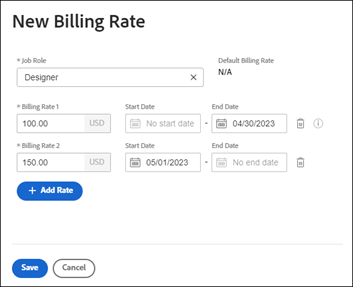

# Abrechnungssätze für Aufgabengebiete auf Firmenebene überschreiben

Wenn ein Aufgabengebiet erstellt wird, haben Sie die Möglichkeit, einen stündlichen Abrechnungssatz für diese Funktion auszuwählen. Sie können mehrere stündliche Abrechnungssätze erstellen, die spezifisch für eine Firma sind. Jeder Abrechnungssatz gilt für einen bestimmten Datumsbereich.

Auf Projektebene können Sie eine Option aktivieren, mit der Abrechnungssätze auf Firmenebene die Sätze auf Projektebene überschreiben können. Weitere Informationen finden Sie unter [Überschreiben von Abrechnungssätzen auf Projektebene mit Abrechnungssätzen auf Firmenebene](../../../manage-work/projects/project-finances/override-project-level-with-company-level-billing-rates.md).

## Zugriffsanforderungen

+++ Erweitern, um die Zugriffsanforderungen für die in diesem Artikel beschriebene Funktionalität anzuzeigen.

<table style="table-layout:auto"> 
 <col> 
 <col> 
 <tbody> 
  <tr> 
   <td>[!DNL Adobe Workfront] Packstück</td> 
   <td>
Beliebig
</td> 
  </tr> 
  <tr> 
   <td>[!DNL Adobe Workfront] Lizenz</td> 
   <td>
[!UICONTROL Standard]

       
[!UICONTROL Plan]
</td>
  </tr> 
  <tr> 
   <td>Konfigurationen der Zugriffsebene</td> 
   <td> 
Administratorzugriff auf Unternehmen, wenn Sie kein Systemadministrator sind

   
Zugriff auf Finanzdaten bearbeiten
 </td>
  </tr> 
 </tbody> 
</table>

Weitere Informationen finden Sie unter [Zugriffsanforderungen](/help/quicksilver/administration-and-setup/add-users/access-levels-and-object-permissions/access-level-requirements-in-documentation.md) in der Dokumentation zu Workfront.

+++

## Überschreiben oder Ändern eines festgelegten Abrechnungssatzes, der für ein bestimmtes Aufgabengebiet verwendet wird

{{step-1-to-setup}}

1. Klicken Sie auf **[!UICONTROL Firmen]**.
1. Suchen Sie das Unternehmen, dem das Aufgabengebiet zugewiesen ist.
1. Klicken Sie auf den Firmennamen in der Liste.
1. Klicken **[!UICONTROL im linken]** auf „Abrechnungssätze“.
1. Klicken Sie **[!UICONTROL Abrechnungssatz hinzufügen] > [!UICONTROL Neuer Abrechnungssatz]** oder wählen Sie einen vorhandenen Satz aus, um ihn zu bearbeiten.
1. Wählen Sie [!UICONTROL &#x200B; Dialogfeld „Neuer Abrechnungssatz] ein [!UICONTROL **Aufgabengebiet**], um den Abrechnungssatz für zu definieren.

   Der [!UICONTROL **Standard-Abrechnungssatz**] zeigt den Satz auf Systemebene für dieses Aufgabengebiet an.

   

1. Geben Sie [!DNL **Feld „Abrechnungssätze 1**] den Abrechnungssatz ein. Klicken Sie dann auf [!UICONTROL **Speichern**], um den Abrechnungssatz einmal zu überschreiben.

   ODER

   Klicken Sie [!UICONTROL **Abrechnungssatz hinzufügen**], um weitere Abrechnungssätze mit Gültigkeitsdaten hinzuzufügen.

1. (Bedingt) Wenn Sie mehr als einen Abrechnungssatz hinzufügen, geben Sie die folgenden Informationen ein:

   * **[!UICONTROL Abrechnungssätze 1], 2 usw.**: Der Wert des Abrechnungssatzes für den Zeitraum.
   * **[!UICONTROL Startdatum]**: Das Datum, an dem der Kurs in Kraft tritt.
   * **[!UICONTROL Enddatum]**: Das Datum, an dem der Kurs endet.

     Abrechnungssatz 1 hat kein Startdatum und der letzte Abrechnungssatz hat kein Enddatum. Einige Daten werden automatisch hinzugefügt. Wenn beispielsweise Abrechnungssatz 1 kein Enddatum hat und Sie Abrechnungssatz 2 mit dem Startdatum 1. Mai 2023 hinzufügen, wird dem Abrechnungssatz 1 das Enddatum 30. April 2023 hinzugefügt, sodass keine Lücken bestehen.

1. Klicken Sie auf [!UICONTROL **Speichern**].

   >[!NOTE]
   >
   >Die im Projekt geänderten Tarife für Aufgabengebiete wirken sich nur auf dieses Projekt aus. Auf Unternehmensebene geänderte Tarife wirken sich auf alle Projekte aus. Weitere Informationen finden Sie unter [Übersicht über das Überschreiben von Abrechnungssätzen und die Berechnung des Umsatzes für ein Projekt](/help/quicksilver/manage-work/projects/project-finances/override-role-billing-rates-and-calculate-project-revenue.md).
