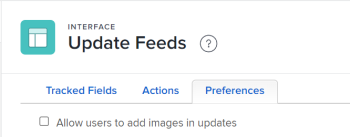

# Konfigurieren von Voreinstellungen für Benutzeraktualisierungen

<!--Audited: 08/2025-->

Sie können Voreinstellungen konfigurieren, die Benutzern Zugriff auf bestimmte Funktionen gewähren, wenn sie Kommentare im Bereich [!UICONTROL Aktualisierungen] eines Objekts hinzufügen.

## Zugriffsanforderungen

+++ Erweitern, um die Zugriffsanforderungen für die in diesem Artikel beschriebene Funktionalität anzuzeigen.

<table style="table-layout:auto"> 
 <col> 
 <col> 
 <tbody> 
  <tr> 
   <td role="rowheader">[!DNL Adobe Workfront] Packstück</td> 
   <td>
Beliebig
</td> 
  </tr> 
  <tr> 
   <td role="rowheader">[!DNL Adobe Workfront] Lizenz</td> 
   <td>
[!UICONTROL Standard]

   
[!UICONTROL Plan]

   </td> 
  </tr>  
  <tr> 
   <td role="rowheader">Konfigurationen der Zugriffsebene</td> 
   <td>
Systemadministrator, um diese Schritte auf Systemebene auszuführen. 

   
Planer, um diese Schritte für eine Gruppe auszuführen, zusätzlich zum Manager dieser Gruppe.
</td>
  </tr> 
 </tbody> 
</table>

*Weitere Informationen zu den Informationen in dieser Tabelle finden Sie unter [Zugriffsanforderungen in der Dokumentation zu Workfront](/help/quicksilver/administration-and-setup/add-users/access-levels-and-object-permissions/access-level-requirements-in-documentation.md).

+++

<!--
Old:
<table style="table-layout:auto"> 
 <col> 
 <col> 
 <tbody> 
  <tr> 
   <td role="rowheader">[!DNL Adobe Workfront] plan</td> 
   <td>Any</td> 
  </tr> 
  <tr> 
   <td role="rowheader">[!DNL Adobe Workfront] license*</td> 
   <td>
New: [!UICONTROL Standard]

   Or
   
Current: [!UICONTROL Plan]

   </td> 
  </tr>  
  <tr> 
   <td role="rowheader">Access level configurations</td> 
   <td>
To perform these steps at the system level, you need the [!UICONTROL System Administrator] access level.

To perform them for a group, you must be a manager of that group.
</td>
  </tr> 
 </tbody> 
</table>
-->

## Benutzern das Bearbeiten von Bildern in Aktualisierungen erlauben

Standardmäßig können Benutzende in Aktualisierungen keine Bilder hinzufügen. Wenn Sie diese Einstellung aktivieren, können Benutzer Bilder in Aktualisierungen anhängen. Die Voreinstellung gilt für alle Aktualisierungen in allen Bereichen Ihrer [!DNL Workfront].

>[!NOTE]
>
>* In Aktualisierungen gespeicherte Bilder werden in Richtung des Speicherlimits für Dokumente gezählt. Weitere Informationen finden Sie [Überprüfen von Dokumentspeicherbeschränkungen](../../../documents/managing-documents/check-document-storage.md).
>* Auf Bilder kann über die Registerkarte [!UICONTROL Aktualisierungen] eines Objekts zugegriffen werden. Sie sind auch im Bereich [!UICONTROL Dokumente] unter dem [!UICONTROL Hauptmenü] verfügbar.
>

1. Klicken Sie auf **[!UICONTROL Hauptmenü]**-Symbol  in der oberen rechten Ecke von [!DNL Adobe Workfront] und klicken Sie dann auf **[!UICONTROL Setup]** .
1. Wählen Sie im linken Bedienfeld **[!UICONTROL Schnittstelle]** > **[!UICONTROL Aktualisierungs-Feeds]**.
1. Wählen Sie die **[!UICONTROL Voreinstellungen]** aus.

   

1. Aktivieren Sie **[!UICONTROL Kontrollkästchen (Benutzern erlauben, Bilder in Aktualisierungen hinzuzufügen]**.
1. Wählen Sie **[!UICONTROL Speichern]** aus.

   Wenn diese Einstellung aktiviert ist, können Sie sie jederzeit deaktivieren. Alle Bilder, die bereits in Aktualisierungen veröffentlicht wurden, verbleiben im Bereich [!UICONTROL Aktualisierungen] des Objekts.
