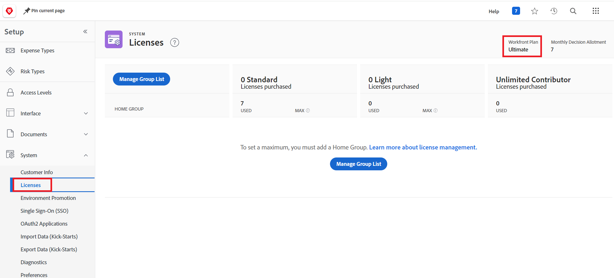

# Häufig gestellte Fragen zur Umgebungsförderung

Die folgenden Fragen werden häufig zur Umgebungsförderung gestellt:

## Wird eine domänenübergreifende Promotion unterstützt?

### Antwort

Eine domänenübergreifende Umgebungsförderung wird derzeit nicht unterstützt. Sie müssen zwischen Umgebungen in derselben Domain weiterleiten.

## Ist die Adobe Business Platform/IMS eine Voraussetzung für die Umgebungsförderung?

### Antwort

Nein. Die Umgebungsunterstützung ist sowohl für IMS-aktivierte als auch für Nicht-IMS-Workfront-Instanzen verfügbar.

## Wie können wir herausfinden, ob sich unsere Workfront-Instanz auf einer Prime- oder Ultimate-Lizenz befindet?

### Antwort

* Ein Workfront-Administrator kann die Lizenz Ihres Unternehmens suchen.

   1. Klicken Sie auf das **[!UICONTROL Hauptmenü]**-Symbol  in der oberen rechten Ecke von Adobe Workfront oder (falls verfügbar) klicken Sie auf das **[!UICONTROL Hauptmenü]**-Symbol  in der oberen linken Ecke und klicken Sie dann auf **&#x200B;**&#x200B;Setup.
   1. Klicken Sie **linken** auf „System“
   1. Um Ihren Workfront-Plan anzuzeigen, wählen Sie **Lizenzen** aus.
Der Plan wird oben rechts auf der Seite angezeigt.
      

  Oder
* Wenden Sie sich an Ihren Workfront-Kundenbetreuer.

## Ist die Umweltförderung bidirektional?

### Antwort

Ja. Sie können beispielsweise von Sandbox zur Produktion oder von Produktion zur Sandbox weiterleiten.

## Wird die Freigabe unterstützt?

### Antwort

Nein, die Freigabe wird derzeit nicht unterstützt.

## Ist Paket-Rollback verfügbar?

### Antwort

Das Paket-Rollback ist für das neueste Paket innerhalb von 24 Stunden nach der Paketinstallation verfügbar.

## Gibt es eine Option, um die Promotion einzelner Komponenten zu überspringen? Wo die Optionen &quot;`Use Existing`, `Overwrite` und `Save with a new Name`&quot; vorhanden sind, können `Skip` hinzugefügt werden, sodass Sie die Hochstufung einzelner Parameter überspringen können?

### Antwort

* „Vorhandenes verwenden“ bedeutet, dass die Bereitstellung übersprungen oder ignoriert wird, da sie dem vorhandenen Objekt in der Zielumgebung zugeordnet ist und keine Änderungen vornimmt.
* Zum Überspringen von Objekten empfehlen wir, alle Objekte, die Sie nicht installieren möchten, aus dem Promotion-Paket oder direkt aus der Quellumgebung zu entfernen. Bauen Sie das Paket nach dem Entfernen der Objekte neu zusammen.
