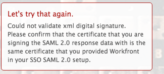

# Fehlermeldung: Digitale XML-Signatur konnte nicht validiert werden

## Problem

Sie können keine erfolgreiche Verbindung zu ADFS herstellen.

>[!NOTE]
>
>Wenn Sie eine erfolgreiche Testverbindung herstellen und weiterhin Probleme auftreten, kann es bei Ihnen zu falschen Zuordnungen von Attributen oder zu Problemen mit Verknüpfungs-IDs kommen. Wenden Sie sich bei Fragen an den Support.

## Zugriffsanforderungen

Sie müssen über folgenden Zugriff verfügen, um die Schritte in diesem Artikel ausführen zu können:

<table style="table-layout:auto"> 
 <col> 
 <col> 
 <tbody> 
  <tr> 
   <td role="rowheader">[!DNL Adobe Workfront] Plan</td> 
   <td>Beliebig</td> 
  </tr> 
  <tr> 
   <td role="rowheader">[!DNL Adobe Workfront] Lizenz</td> 
   <td>Plan</td> 
  </tr> 
  <tr> 
   <td role="rowheader">Konfigurationen auf Zugriffsebene</td> 
   <td> 
Sie müssen [!DNL Workfront] Administrator. Weitere Informationen finden Sie unter <a href="../../administration-and-setup/add-users/configure-and-grant-access/grant-a-user-full-administrative-access.md" class="MCXref xref">Gewähren eines vollen Administratorzugriffs</a>.
 
<b>NOTE</b>: Wenn Sie noch keinen Zugriff haben, fragen Sie Ihren [!DNL Workfront] Administrator , wenn sie zusätzliche Einschränkungen für Ihre Zugriffsebene festlegen. Für Informationen zur [!DNL Workfront] Administrator kann Ihre Zugriffsebene ändern, siehe <a href="../../administration-and-setup/add-users/configure-and-grant-access/create-modify-access-levels.md" class="MCXref xref">Benutzerdefinierte Zugriffsebenen erstellen oder ändern</a>.
 </td> 
  </tr> 
 </tbody> 
</table>

## Ursache 1: Das Zertifikat ist falsch

### Lösung

Rufen Sie das Signaturzertifikat manuell vom ADFS-Server ab:

1. In [!DNL Windows]klicken **[!UICONTROL Starten]** > **[!UICONTROL Administration]** > **[!UICONTROL ADFS 2.0-Verwaltung]**.\
   Das Dialogfeld ADFS 2.0-Verwaltung wird angezeigt.

1. Auswählen **[!UICONTROL Vertrauensbeziehung]** > **[!UICONTROL Vertrauen in Partei]** im linken Bereich.

1. Rechtsklick auf **[!UICONTROL Vertrauen von Parteien]** und wählen Sie **[!UICONTROL Eigenschaften]**.

1. Klicken Sie auf **[!UICONTROL Unterschrift]** Registerkarte.
1. Klicken Sie auf den Namen des Signaturzertifikats und klicken Sie auf **[!UICONTROL Ansicht]**.
1. Klicken Sie auf Kopieren nach **[!UICONTROL Datei]**... und wählen Sie **[!UICONTROL Nächste]**.

1. Auswählen **[!UICONTROL Base-64-kodierte x.509 (CER)]** und klicken Sie auf **[!UICONTROL Nächste]**.

1. Geben Sie den Dateinamen an und klicken Sie auf **[!UICONTROL Nächste]**.
1. Klicken **[!UICONTROL Beenden]**.
1. In [!DNL Adobe Workfront], navigieren Sie zu **[!UICONTROL Einrichtung]** > **[!UICONTROL System]** > **[!UICONTROL Single Sign-On (SSO)]** und laden Sie das Signaturzertifikat manuell hoch.

## Ursache 2: Das Zertifikat wird mit DSA signiert, wenn [!DNL Workfront] erwartet eine RSA-Signatur

### Lösung

Erstellen Sie das Zertifikat neu und verwenden Sie die RSA-Signatur anstelle der DSA.

## Ursache 3: XML-Daten sind falsch

### Lösung

Exportieren und importieren Sie die XML-Metadaten erneut aus dem ADFS-Verwaltungssystem.

## Ursache 4: Die Anfrage konnte aufgrund eines Fehlers auf der SAML-Seite nicht ausgeführt werden

### Lösung

Wenden Sie sich an Ihren SAML-Provider.
