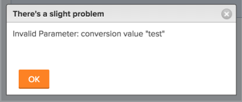

# Fehlermeldung: Ungültiger Parameter: Konversionswert

## Problem

Sie erhalten folgende Fehlermeldung, wenn Sie versuchen, das Format eines benutzerdefinierten Felds in einem vorhandenen benutzerdefinierten Formular zu ändern: „Ungültiger Parameter: Konversionswert &quot;&lt;…>&quot;\

## Ursache

Diese Meldung tritt in folgendem Szenario auf:

Sie haben beispielsweise ein benutzerdefiniertes Feld, das als Text formatiert ist.  Jetzt möchten Sie das Format des benutzerdefinierten Felds in „Währung“ ändern. Dieses Feld ist an einer beliebigen Stelle in Ihrer Adobe Workfront-Instanz bereits mit einem Objekt verbunden und enthält bereits angegebene Informationen. Die vorhandenen Informationen in mindestens einem dieser Felder sind bereits als Text formatiert. Daher kann das Format des Felds nicht in „Währung“ geändert werden.

## Zugriffsanforderungen

+++ Erweitern, um die Zugriffsanforderungen für die in diesem Artikel beschriebene Funktionalität anzuzeigen.

<table style="table-layout:auto"> 
 <col> 
 <col> 
 <tbody> 
  <tr> 
   <td>[!DNL Adobe Workfront] Packstück</td> 
   <td>
Beliebig
</td> 
  </tr> 
  <tr> 
   <td>[!DNL Adobe Workfront] Lizenz</td> 
   <td>
Standard

       
Abo
</td>
  </tr>
  <tr> 
   <td>Konfigurationen der Zugriffsebene</td> 
   <td> 
Zugriff bearbeiten auf:
 
    <ul> 
     <li> 
Berichte, Dashboards und Kalender erstellen
 </li> 
     <li> 
Filter, Ansichten und Gruppierungen erstellen
 </li> 
    </ul>
  </tr> 
 </tbody> 
</table>

Weitere Informationen finden Sie unter [Zugriffsanforderungen](/help/quicksilver/administration-and-setup/add-users/access-levels-and-object-permissions/access-level-requirements-in-documentation.md) in der Dokumentation zu Workfront.

+++

## Lösung

Gehen Sie folgendermaßen vor:

1. Erstellen Sie Berichte für alle Objekte, denen dieses Feld möglicherweise mit ihrer benutzerdefinierten Forms verknüpft ist.\
   Informationen zum Erstellen eines Berichts finden Sie unter [Erstellen eines benutzerdefinierten Berichts](../../reports-and-dashboards/reports/creating-and-managing-reports/create-custom-report.md).

1. Schließen Sie das benutzerdefinierte Feld, das Sie bearbeiten möchten, in die Ansicht des Berichts ein, damit Sie sehen können, welches Objekt dieses Feld mit einem Textwert gefüllt hat.
1. Korrigieren Sie die Werte des benutzerdefinierten Feldes der Objekte, die in einem Textformat angezeigt werden, und geben Sie ihnen einen Wert, der als Währung formatiert ist. Versuchen Sie dann erneut, das Feld „Format“ im benutzerdefinierten Formular zu ändern.\
   ODER\
   Wenn Sie bereits zu viele Feldwerte mit textformatierten Informationen ausgefüllt haben, sollten Sie ein neues benutzerdefiniertes Feld zu Ihrem benutzerdefinierten Formular hinzufügen und es als Währung formatieren.
