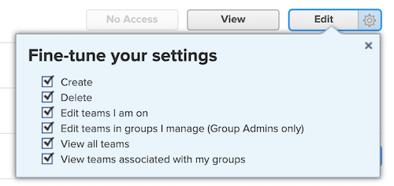

# Gruppenadmins müssen über höhere Zugriffsrechte verfügen als die von ihnen verwalteten

Wenn ein Gruppenadministrator bzw. eine Gruppenadministratorin in niedrigere Zugriffsberechtigungen hat als die, die er bzw. sie verwaltet, kann er bzw. sie keine niedrigeren Zugriffsebenen anzeigen, ändern oder zuweisen.

## Problem

Wenn einem Gruppenadministrator die Zugriffsebene Geänderter Planer mit den Anzeigeberechtigungen für Teams zugewiesen ist, aber bestimmten Benutzern die Zugriffsebene Arbeiter mit den Bearbeitungsberechtigungen für Teams zugewiesen ist, kann der Gruppenadministrator nicht mit der Zugriffsebene Geänderter Arbeiter interagieren.

>[!NOTE]
>
>Diese Logik gilt auch für das Dropdown-Menü Einstellungen optimieren . Beide Zugriffsebenen können Bearbeitungszugriff haben, aber die Einstellungen im Dropdown-Menü Einstellungen optimieren müssen für den Gruppenadministrator höher sein.
> 

## Lösung

Gruppenadmins müssen in allen Bereichen der Zugriffsebene über höhere Berechtigungen verfügen als die von ihnen verwalteten.
