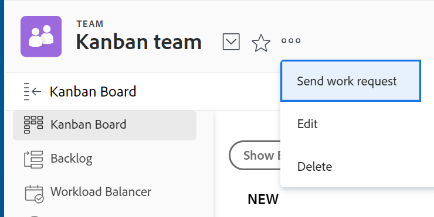

# Konfigurieren [!UICONTROL Kanban]

Sie können ein agiles Team in [!DNL Adobe Workfront] wie in [Erstellen eines agilen Teams](../../agile/get-started-with-agile-in-workfront/create-an-agile-team.md). Beim Erstellen eines agilen Teams können Sie die Methodik auswählen, die das Team zum Abschließen seiner Arbeit verwendet. Sie können aus den folgenden Optionen auswählen:

* Scrum
* Kanban

In diesem Artikel wird beschrieben, wie Sie die Einstellungen für ein Kanban-Team konfigurieren. Nachdem Sie ein agiles Team erstellt und die Kanban-Methode ausgewählt haben, können Sie in diesem Artikel die folgenden Einstellungen aktualisieren:

* Ob Meldungen in Punkten oder Stunden geschätzt werden
* Die Statusspalten auf der Übersichtskarte
* Zusätzliche Felder, die auf den Storykarten auf der Karte für die agile Meldung angezeigt werden
* Grenze für laufende Arbeit (WIP)
* So fügen Sie automatisch Meldungen aus dem Backlog hinzu
* Wie lange Karten auf dem Kanban-Brett bleiben

Informationen zum Konfigurieren eines Scrum-Teams finden Sie unter [Konfigurieren von Scrum](../get-started-with-agile-in-workfront/configure-scrum.md).

## Zugriffsanforderungen

Sie müssen über folgenden Zugriff verfügen, um die Schritte in diesem Artikel ausführen zu können:

<table style="table-layout:auto"> 
 <col> 
 </col> 
 <col> 
 </col> 
 <tbody> 
  <tr> 
   <td role="rowheader"><strong>[!DNL Adobe Workfront] plan*</strong></td> 
   <td> 
Alle
 </td> 
  </tr> 
  <tr> 
   <td role="rowheader"><strong>[!DNL Adobe Workfront] license*</strong></td> 
   <td> 
Neu: [!UICONTROL Standard]
 
   oder
   
Aktuell: [!UICONTROL Arbeit] oder höher
 </td> 
  </tr> 
 </tbody> 
</table>

*Wenden Sie sich an Ihren [!DNL Workfront] Administrator.

## Konfigurieren, ob Meldungen in Punkten oder Stunden geschätzt werden

Sie können Geschichten so konfigurieren, dass sie entweder anhand von Punkten oder Stunden geschätzt werden.

So konfigurieren Sie, wie Geschichten für Ihr agile Team geschätzt werden:

{{step1-to-team}}

1. Klicken Sie auf **[!UICONTROL Switch-Teams]** icon , wählen Sie entweder aus dem Dropdown-Menü ein neues Team aus oder suchen Sie im Suchfeld nach einem Team.
1. Wählen Sie das agile Team aus, das Sie verwalten möchten.
1. Klicken Sie auf **[!UICONTROL Mehr]** Menü  , wählen Sie **[!UICONTROL Bearbeiten]**.

   Nur Teammitglieder mit einer [!UICONTROL Plan] oder [!UICONTROL Arbeit] -Lizenz sehen Sie diese Option.\
   

1. Im **[!UICONTROL Agile]** im Abschnitt **[!UICONTROL Geschätzte Meldungen in]** festlegen, ob Sie Punkte oder Stunden zur Schätzung der Größe (Arbeitslast) von Meldungen verwenden möchten. Wenn Sie Punkte auswählen, geben Sie an, wie viele Stunden 1 Punkt entsprechen. (Der Standardwert ist 1 Punkt = 8 Stunden.) Dies ist die Anzahl der geplanten Stunden, die der Meldung hinzugefügt werden.

   **Beispiel:** Wenn Sie sich dafür entschieden haben, Geschichten in Punkten und 1 Punkt gleich 8 Stunden zu schätzen, und eine Geschichte auf 3 Punkte geschätzt wird, werden 24 geplante Stunden zu der Geschichte hinzugefügt.

1. Klicks **[!UICONTROL Änderungen speichern]**.

## Statusspalten auf der agilen Story-Pinnwand konfigurieren

Sie können die Status definieren, die auf der Story-Pinnwand für das agile Team vorhanden sind. Dies sind die einzigen Status, die auf dem Storyboard angezeigt werden.

So definieren Sie die Status, die für die mit dem agile Team verknüpfte Story-Pinnwand verfügbar sind:

{{step1-to-team}}

1. Klicken Sie auf **[!UICONTROL Switch-Teams]** icon , wählen Sie entweder aus dem Dropdown-Menü ein neues Team aus oder suchen Sie in der Suchleiste nach einem Team.

1. Wählen Sie das agile Team aus, das Sie verwalten möchten.
1. Klicken Sie auf **[!UICONTROL Mehr]** Menü und wählen Sie **[!UICONTROL Bearbeiten]**.

   Nur Teammitglieder mit einer [!UICONTROL Plan] oder [!UICONTROL Arbeit] -Lizenz sehen Sie diese Option.

   

1. Im **[!UICONTROL Agile]** -Abschnitt, suchen Sie die **[!UICONTROL Story Board]** Bereich.

1. (Optional) Klicken Sie auf **[!UICONTROL Spalte hinzufügen]** , um eine zusätzliche Statusspalte zum Storyboard hinzuzufügen.
1. (Optional) Ziehen Sie eine Statusspalte mit der Drag &amp; Drop-Anzeige, um die Statusspalten auf der Story-Pinnwand neu anzuordnen. Die erste Spalte kann nicht verschoben werden und Sie können keine andere Spalte vor die erste Spalte ziehen.

   

1. Wählen Sie den Aufgabenstatus aus.

   >[!IMPORTANT]
   >
   >Es stehen nur gesperrte systemweite Status zur Auswahl zur Verfügung. Gruppenspezifische Status können nicht ausgewählt werden. Der Status der ersten Spalte entspricht immer **[!UICONTROL Neu]**.

   Sie können benutzerdefinierte Status hinzufügen, wenn Ihre [!DNL Workfront] -Administrator hat sie konfiguriert. Weitere Informationen finden Sie unter [Erstellen oder Bearbeiten eines Status](../../administration-and-setup/customize-workfront/creating-custom-status-and-priority-labels/create-or-edit-a-status.md).

1. Klicks **[!UICONTROL Änderungen speichern]**.

## Zusätzliche Felder konfigurieren, die auf den Storykarten auf der Karte für Mobilgeräte angezeigt werden sollen

Wenn Sie Felder zu Storykarten hinzufügen, sind die Felder schreibgeschützt und werden nur angezeigt, wenn das Feld ausgefüllt ist.

Standardmäßig werden auf der Storykarte für Aufgaben und Probleme die folgenden Datentypen angezeigt:

* Name der Meldung mit einem Link direkt zur Aufgabe oder zum Problem
* Der Projektname mit einem Link direkt zum Projekt
* Dieser Link wird nur für Meldungen angezeigt, nicht für Unteraufgaben
* Aufgabenbeschreibung oder Problembeschreibung
* Aktuelle Zusage
* Anzeigen und Bearbeiten des Prozentsatzes &quot;complete&quot;entweder durch Anpassung des Prozentsatzes selbst oder durch Anpassung der Anzahl der abgeschlossenen Punkte oder Stunden
* Zugewiesene Benutzer

Sie können zusätzliche Daten (einschließlich benutzerdefinierter Daten) auf Storykarten anzeigen. Sie können aus verschiedenen Gründen zusätzliche Felder auf Storykarten anzeigen lassen. Beispielsweise können Sie die Kunden-ID anzeigen, wenn Sie innerhalb der Iteration an Geschichten für mehrere Kunden arbeiten, oder das Projekt-Startdatum oder das Projekt-Abschlussdatum anzeigen möchten.

>[!NOTE]
>
>Wenn Sie ein benutzerdefiniertes Feld auf einer Storykarte verwenden, darf es keinen Punkt (oder Punkt) im Namen enthalten.

So konfigurieren Sie dem agile Team zugewiesene Storykarten, um zusätzliche Felder anzuzeigen:

{{step1-to-team}}

1. Klicken Sie auf **[!UICONTROL Switch-Teams]** icon , wählen Sie entweder aus dem Dropdown-Menü ein neues Team aus oder suchen Sie in der Suchleiste nach einem Team.

1. Wählen Sie das agile Team aus, das Sie verwalten möchten.
1. Klicken Sie auf **[!UICONTROL Mehr]** Menü und wählen Sie **[!UICONTROL Bearbeiten]**.\
   Nur Teammitglieder mit einer [!UICONTROL Plan] oder [!UICONTROL Arbeit] -Lizenz sehen Sie diese Option.

   

1. Im **[!UICONTROL Agile]** -Abschnitt einen Feldnamen eingeben, um ihn zu finden.

   

1. Wählen Sie den Namen des Felds aus, das Sie hinzufügen möchten.
1. Geben Sie die **[!UICONTROL Anzeigename]** für das Feld, das auf der Meldung oder der Ausgabekarte angezeigt wird.
1. Klicks **[!UICONTROL Änderungen speichern]**.

## Konfigurieren der Grenze für laufende Arbeit (WIP)

Wenn Sie die WIP-Grenze eines Kanban-Teams definieren, können Sie die Anzahl der Elemente, an denen das Team derzeit arbeitet, steuern, indem Sie die Anzahl der Aufgaben begrenzen, die im [!UICONTROL Neu] oder [!UICONTROL In Bearbeitung] in der Spalte [!UICONTROL Kanban] Pinnwand.

Nachdem Sie die WIP-Beschränkung für ein Kanban-Team konfiguriert haben, können Sie die WIP-Beschränkung anzeigen und sie über das [!UICONTROL Kanban] Landingpage, wie beschrieben in [Verwalten Sie die Grenze für laufende Arbeiten (WIP) auf der [!UICONTROL Kanban] Pinnwand](../../agile/use-kanban-in-an-agile-team/work-in-progress-limit-on-the-kanban-board.md).

So begrenzen Sie die WIP für Ihr Kanban-Team:

{{step1-to-team}}

1. Klicken Sie auf **[!UICONTROL Switch-Teams]** icon , wählen Sie entweder aus dem Dropdown-Menü ein neues Team aus oder suchen Sie in der Suchleiste nach einem Team.

1. Wählen Sie das Kanban-Team aus, das Sie verwalten möchten.
1. Klicken Sie auf **[!UICONTROL Mehr]** Menü , wählen Sie **[!UICONTROL Bearbeiten]**.

   Nur Teammitglieder mit einer [!UICONTROL Plan] oder [!UICONTROL Arbeit] -Lizenz sehen Sie diese Option.

   

1. Im **[!UICONTROL Agile]** im Abschnitt **[!UICONTROL Methode]** -Abschnitt, stellen Sie sicher, dass Kanban ausgewählt ist.

1. Im **[!UICONTROL Story Board]** im Abschnitt **[!UICONTROL WIP-Limit]** -Feld die maximal zulässige Anzahl von Elementen in jeder Spalte der [!UICONTROL Kanban] agile Story Board. Sie können für jede Spalte einen anderen Grenzwert festlegen. Die Höchstgrenze, die Sie für jede Spalte festlegen können, beträgt 100.\
   Wenn diese Einstellung festgelegt ist, zeigt das WIP-Limit eine Warnmeldung auf der [!UICONTROL Kanban] agile Storyboard jedes Mal, wenn die Grenze für eine Spalte auf der Storyboard überschritten wird. Diese Warnmeldung wird nur angezeigt, wenn das WIP-Limit zum ersten Mal überschritten wird. Diese Warnmeldung wird nicht in Spalten angezeigt, deren Status mit [!UICONTROL Fertig].\
   Das WIP-Limit ist lediglich eine visuelle Warnung und schränkt Ihr Team nicht ein, mehr Elemente in einer Spalte als das von Ihnen festgelegte Limit zu haben.

   

1. Klicks **Änderungen speichern**.

## Automatisches Hinzufügen von Meldungen aus dem Rückstau konfigurieren

<!-- this functionality needs to be verified-->

Sie können Storys aus dem Backlog so konfigurieren, dass sie automatisch zur ersten Spalte auf der [!UICONTROL Kanban] -Pinnwand unmittelbar nachdem ein Element aus dieser Spalte verschoben wurde.

{{step1-to-team}}

1. Klicken Sie auf **[!UICONTROL Switch-Teams]** icon , wählen Sie entweder aus dem Dropdown-Menü ein neues Team aus oder suchen Sie in der Suchleiste nach einem Team.

1. Wählen Sie das Kanban-Team aus, das Sie verwalten möchten.
1. Klicken Sie auf **[!UICONTROL Mehr]** Menü , wählen Sie **[!UICONTROL Bearbeiten]**.

   Nur Teammitglieder mit einer [!UICONTROL Plan] oder [!UICONTROL Arbeit] -Lizenz sehen Sie diese Option.

   

1. Auswählen **[!UICONTROL Automatisch nächsten Story aus dem Backlog hinzufügen]** , um zu konfigurieren, dass das nächste Element aus dem Backlog automatisch zum **[!UICONTROL Neu]** Spalte, wenn ein Element aus der **[!UICONTROL In Bearbeitung]** Spalte.

   Benutzer müssen die **Rückstand anzeigen** -Einstellung auf [!UICONTROL Kanban] -Pinnwand, damit diese Funktion wirksam wird. Wenn Benutzer die [!UICONTROL Rückstand anzeigen] -Einstellung auf [!UICONTROL Kanban Board], die folgende Funktion ausgeführt wird:

   Jedes Mal, wenn eine Geschichte aus dem [!UICONTROL In Bearbeitung] in eine Spalte auf der Story-Pinnwand, die eine [!UICONTROL Fertig] Status (oder ein Status, der mit [!UICONTROL Fertig]), wird ein Artikel aus der Spalte &quot;Backlog&quot;automatisch in den [!UICONTROL Neu] Spalte [!UICONTROL Kanban Board].
Wenn die Meldung aus dem Rückstand hinzugefügt wird, wird die Meldung mit der höchsten Priorität zum Storyboard hinzugefügt.

1. Klicks **[!UICONTROL Änderungen speichern]**.

## Konfigurieren Sie, wie lange Karten auf der Seite bleiben [!UICONTROL Kanban] Pinnwand

Sie können festlegen, wie lange abgeschlossene Karten auf der [!UICONTROL Kanban] Pinnwand. Aufgaben, die von der [!UICONTROL Kanban] Die Pinnwand kann weiterhin in ihrem ursprünglichen Projekt aufgerufen werden.

{{step1-to-team}}

1. (Optional) Klicken Sie auf die **[!UICONTROL Switch-Teams]** icon , wählen Sie entweder ein neues Kanban-Team aus dem Dropdown-Menü aus oder suchen Sie in der Suchleiste nach einem Team.
1. Wählen Sie das Kanban-Team aus.
1. Klicken Sie auf **[!UICONTROL Mehr]** Menü  , wählen Sie **[!UICONTROL Bearbeiten]**.

   Nur Teammitglieder mit einer [!UICONTROL Plan] oder [!UICONTROL Arbeit] -Lizenz sehen Sie diese Option.

   

1. Im **[!UICONTROL Anzahl der Tage Abgeschlossene Karten bleiben auf der Kanban-Pinnwand]** aus.

   Sie können eine Zahl zwischen 1 und 30 Tagen wählen.
1. Klicks **[!UICONTROL Änderungen speichern]**.
