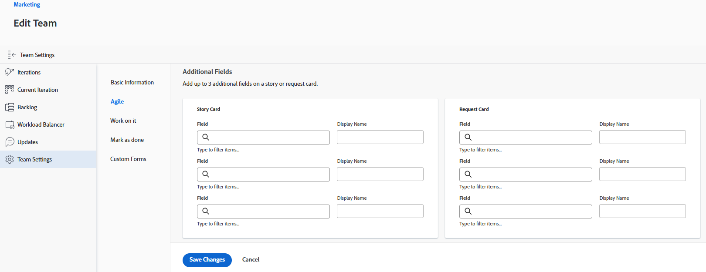

# Konfigurieren von [!UICONTROL Scrum]

Sie können ein Agile-Team in [!DNL Adobe Workfront] erstellen, wie in [Erstellen eines Agile-Teams](/help/quicksilver/agile/get-started-with-agile-in-workfront/create-an-agile-team.md) beschrieben. Beim Erstellen eines agilen Teams können Sie die Methodik auswählen, die das Team verwendet, um seine Arbeit abzuschließen. Sie können aus den folgenden Optionen wählen:

* Scrum
* Kanban

In diesem Artikel wird beschrieben, wie Sie die Einstellungen für ein Scrum-Team konfigurieren. Nachdem Sie ein Agile-Team erstellt und die Scrum-Methode ausgewählt haben, können Sie in diesem Artikel die folgenden Einstellungen aktualisieren:

* Ob Geschichten in Punkten oder Stunden geschätzt werden
* Die Statusspalten im Agile-Story-Board für Iterationen und Projekte
* Zusätzliche Felder zur Anzeige auf Story-Karten im Agile-Story-Board
* Verwendung von Farbindikatoren für Storys im Agile-Story-Board
* Anwenden von Datumsangaben beim Hinzufügen von Arbeitselementen zu einer Iteration

Informationen zum Konfigurieren eines Kanban-Teams finden Sie unter [Konfigurieren von &#x200B;](/help/quicksilver/agile/get-started-with-agile-in-workfront/configure-kanban.md)).

## Zugriffsanforderungen

+++ Erweitern, um die Zugriffsanforderungen für die in diesem Artikel beschriebene Funktionalität anzuzeigen.

<table style="table-layout:auto"> 
 <col> 
 </col> 
 <col> 
 </col> 
 <tbody> 
  <tr> 
   <td role="rowheader">Adobe Workfront-Paket</td> 
   <td> 
Beliebig
 </td> 
  </tr>

<tr> 
   <td role="rowheader">Adobe Workfront-Lizenz</td> 
   <td> 
Standard
 
   
Work oder höher
 </td> 
  </tr>

<tr> 
   <td role="rowheader">Konfigurationen der Zugriffsebene</td> 
   <td> 
Zugriff auf Teams bearbeiten
  </td> 
  </tr>

</tbody> 
</table>

Weitere Details zu den Informationen in dieser Tabelle finden Sie unter [Zugriffsanforderungen in der Dokumentation zu Workfront](/help/quicksilver/administration-and-setup/add-users/access-levels-and-object-permissions/access-level-requirements-in-documentation.md).

+++

## Konfigurieren, ob Storys in Punkten oder Stunden geschätzt werden

>[!NOTE]
>
>Diese Einstellung kann nicht geändert werden, wenn das Team über Iterationen verfügt, die derzeit in Bearbeitung sind.

Sie können Storys so konfigurieren, dass sie entweder anhand von Punkten oder Stunden geschätzt werden.

So konfigurieren Sie, wie Storys für Ihr Agile-Team geschätzt werden:

{{step1-to-team}}

1. Klicken Sie auf **[!UICONTROL Team wechseln]** Symbol und wählen Sie dann entweder ein neues Team aus dem Dropdown-Menü aus oder suchen Sie in der Suchleiste nach einem Team.
1. Wählen Sie das Agile-Team aus, das Sie verwalten möchten.
1. Klicken Sie auf das **[!UICONTROL Mehr]**-Menü und wählen Sie dann **[!UICONTROL Bearbeiten]** aus.

   Nur Team-Mitglieder mit einer [!UICONTROL Standard], [!UICONTROL Plan] oder [!UICONTROL Work]-Lizenz sehen diese Option.
   

1. Wählen Sie im Abschnitt **[!UICONTROL Agile]** im Bereich **[!UICONTROL Geschichten schätzen in]** aus, ob Sie Punkte oder Stunden für die Schätzung der Größe (Arbeitslast) von Geschichten verwenden möchten. Wenn Sie Punkte wählen, geben Sie an, wie viele Stunden 1 Punkt entsprechen. (Der Standardwert ist 1 Punkt = 8 Stunden.) Dies ist die Anzahl der geplanten Stunden, die der Story hinzugefügt werden.

   **Beispiel** Wenn Sie ausgewählt haben, dass Geschichten in Punkten geschätzt werden sollen, und 1 Punkt 8 Stunden entspricht und ein Geschoss auf 3 Punkte geschätzt wird, werden dem Geschoss 24 geplante Stunden hinzugefügt.

1. Klicken Sie **[!UICONTROL Änderungen speichern]**.

## Konfigurieren von Statusspalten auf dem agilen Storyboard

Sie können konfigurieren, welche Spalten auf dem agilen Storyboard für alle Iterationen angezeigt werden, die Ihrem Team oder einem bestimmten Projekt zugewiesen sind.

* [Konfigurieren von Statusspalten für Iterationen](#configure-status-columns-for-iterations)
* [Konfigurieren von Statusspalten für Projekte](#configure-status-columns-for-projects)

### Konfigurieren von Statusspalten für Iterationen {#configure-status-columns-for-iterations}

Sie können die Status definieren, die im Story Board für das Agile-Team vorhanden sind. Dies sind die einzigen Status, die auf dem Storyboard angezeigt werden.

So definieren Sie die Status, die für das mit dem Agile-Team verknüpfte Story Board verfügbar sind:

{{step1-to-team}}

1. Klicken Sie auf **[!UICONTROL Team wechseln]**-Symbol  und wählen Sie dann entweder ein neues Team aus dem Dropdown-Menü aus oder suchen Sie in der Suchleiste nach einem Team.

1. Wählen Sie das Agile-Team aus, das Sie verwalten möchten.
1. Klicken Sie auf das **[!UICONTROL Mehr]**-Menü und wählen Sie dann **[!UICONTROL Bearbeiten]** aus.

   Diese Option wird nur Team-Mitgliedern mit [!UICONTROL &#x200B; Lizenz &#x200B;]Plan[!UICONTROL &#x200B; oder &#x200B;]Work“ angezeigt.

   

1. Suchen Sie im Abschnitt **[!UICONTROL Agile]** den Bereich **[!UICONTROL Story Board]** .

1. (Optional) Klicken Sie auf **[!UICONTROL Spalte hinzufügen]**, um dem Storyboard eine zusätzliche Statusspalte hinzuzufügen.
1. (Optional) Ziehen Sie eine beliebige Statusspalte mit der Drag-and-Drop-Anzeige, um die Statusspalten auf dem Storyboard neu anzuordnen. Die erste Spalte kann nicht verschoben werden und Sie können keine weitere Spalte vor die erste Spalte ziehen.

   

1. Wählen Sie sowohl Task- als auch Problemstatus aus. Aufgabenstatus werden als Spaltentitel für jede Spalte im Storyboard angezeigt. Die von Ihnen ausgewählten Problemstatus werden den Aufgabenstatus zugeordnet. Wenn Sie also ein Problem in eine andere Spalte des Storyboards verschieben, ändert sich der Problemstatus in die hier angezeigten Problemstatus und nicht in den Namen der Spalte im Storyboard (der den Aufgabenstatus widerspiegelt).

   >[!IMPORTANT]
   >
   >Nur gesperrte systemweite Status können ausgewählt werden. Gruppenspezifische Status können nicht ausgewählt werden. Außerdem entspricht der Status der ersten Spalte immer **[!UICONTROL Neu]**.

   Sie können benutzerdefinierte Status hinzufügen, wenn sie von Ihrem [!DNL Workfront]-Administrator konfiguriert wurden. Benutzerdefinierte Status können wie in [Status erstellen oder bearbeiten](../../administration-and-setup/customize-workfront/creating-custom-status-and-priority-labels/create-or-edit-a-status.md) beschrieben konfiguriert werden.

   >[!NOTE]
   >
   >Bei der Auswahl von Problemstatus wird in der dritten Spalte standardmäßig immer &quot;[!UICONTROL &quot; &#x200B;]. Wenn Sie mehr als drei Spalten haben, stellen Sie sicher, dass Sie die Spalten manuell aktualisieren, damit sie die richtigen Status widerspiegeln.

1. Klicken Sie **[!UICONTROL Änderungen speichern]**.

### Konfigurieren von Statusspalten für Projekte {#configure-status-columns-for-projects}

Informationen zum Konfigurieren von Statusspalten für ein Projekt finden Sie im Abschnitt [Erstellen oder Anpassen einer [!UICONTROL Agile]-Ansicht](../../reports-and-dashboards/reports/reporting-elements/create-edit-views.md#customizing-an-agile-view) im Artikel [Erstellen oder Bearbeiten von Ansichten in [!DNL Adobe Workfront]](../../reports-and-dashboards/reports/reporting-elements/create-edit-views.md).

## Konfigurieren Sie zusätzliche Felder, die auf Story-Karten im Agile-Story-Board angezeigt werden sollen

Wenn Sie Felder zu Story-Karten hinzufügen, sind die Felder schreibgeschützt und nur angezeigt, wenn das Feld ausgefüllt ist.

Standardmäßig werden die folgenden Datentypen auf der Story-Karte für Aufgaben und Probleme angezeigt:

* Name der Story mit direktem Link zur Aufgabe oder zum Problem
* Der Projektname mit einem Link direkt zum Projekt
* Dieser Link wird nur für Storys angezeigt, nicht für Teilaufgaben
* Die Aufgaben- oder Problembeschreibung
* Laufende Mittelbindung
* Sie können den abgeschlossenen Prozentsatz anzeigen und bearbeiten, indem Sie entweder den abgeschlossenen Prozentsatz selbst oder die Anzahl der abgeschlossenen Punkte oder Stunden anpassen
* Zugewiesene Benutzer

Sie können zusätzliche Daten (einschließlich benutzerdefinierter Daten) auf Story-Karten anzeigen. Möglicherweise möchten Sie aus verschiedenen Gründen zusätzliche Felder auf Story-Karten anzeigen. Beispielsweise können Sie die Kunden-ID anzeigen, wenn Sie an Storys für mehrere Kunden innerhalb der Iteration arbeiten, oder Sie möchten das Projektstartdatum oder das Projektabschlussdatum anzeigen.

>[!NOTE]
>
>Wenn Sie ein benutzerdefiniertes Feld auf einer Story-Karte verwenden, darf es keinen Punkt/Punkt im Namen enthalten.

So konfigurieren Sie Story-Karten, die dem Agile-Team zugewiesen sind, um zusätzliche Felder anzuzeigen:

{{step1-to-team}}

1. Klicken Sie auf **[!UICONTROL Team wechseln]**-Symbol  und wählen Sie dann entweder ein neues Team aus dem Dropdown-Menü aus oder suchen Sie in der Suchleiste nach einem Team.

1. Wählen Sie das Agile-Team aus, das Sie verwalten möchten.
1. Klicken Sie auf das **[!UICONTROL Mehr]**-Menü und wählen Sie dann **[!UICONTROL Bearbeiten]** aus.
Diese Option wird nur Team-Mitgliedern mit [!UICONTROL &#x200B; Lizenz &#x200B;]Plan[!UICONTROL &#x200B; oder &#x200B;]Work“ angezeigt.

   

1. Geben Sie im Abschnitt **[!UICONTROL Agile]** einen Feldnamen ein, um es zu finden.

   

1. Wählen Sie den Namen des Felds aus, das Sie hinzufügen möchten.
1. Geben Sie den **[!UICONTROL Anzeigenamen]** für das Feld ein, das auf dem Textabschnitt oder der Problemkarte angezeigt werden soll.
1. Klicken Sie auf **[!UICONTROL Änderungen speichern]**.

## Konfigurieren der Verwendung von Farbindikatoren für Storys im Agile-Story-Board

Standardmäßig werden Story Board-Kacheln in einer Agile-Iteration entsprechend dem Projekt farbcodiert, mit dem die Story verknüpft ist. Jedem Projekt wird willkürlich eine Farbe auf dem Storyboard zugewiesen. Sie können dieses Standardverhalten für jedes Agile-Team ändern. Die Farben für Agile-Storys können an die Priorität der Story, den Eigentümer usw. gebunden werden.

So ändern Sie das Verhalten bei der Zuweisung von Farben zu Storys für ein Agile-Team:

{{step1-to-team}}

1. Klicken Sie auf **[!UICONTROL Team wechseln]**-Symbol  und wählen Sie dann entweder ein neues Team aus dem Dropdown-Menü aus oder suchen Sie in der Suchleiste nach einem Team.

1. Wählen Sie das Agile-Team aus, das Sie verwalten möchten.
1. Klicken Sie auf das **[!UICONTROL Mehr]**-Menü und wählen Sie dann **[!UICONTROL Bearbeiten]** aus.

   Diese Option wird nur Team-Mitgliedern mit [!UICONTROL &#x200B; Lizenz &#x200B;]Plan[!UICONTROL &#x200B; oder &#x200B;]Work“ angezeigt.

   

1. Wählen [!UICONTROL &#x200B; im Abschnitt &#x200B;] im Bereich [!UICONTROL Kartenfarbe &#x200B;] verknüpfen“ eine der folgenden Optionen aus:

   * **[!UICONTROL Projekt]**: Dem Projekt, mit dem der Textabschnitt verknüpft ist, sind Farben zugeordnet. (Wenn ein Textabschnitt erstellt wird, muss er mit einem Projekt verknüpft werden, wie in [Agile Story erstellen](/help/quicksilver/agile/work-in-an-agile-environment/create-an-agile-story.md) beschrieben. Alle Aufgaben aus demselben Projekt werden in derselben Farbe angezeigt.
   * **[!UICONTROL Freiform]**: Alle Karten werden standardmäßig blau angezeigt, bis ein Benutzer die Farbe manuell ändert, wie [[!UICONTROL Storys nach Farbe kategorisieren] auf dem Scrum-Board beschrieben](/help/quicksilver/agile/use-scrum-in-an-agile-team//scrum-board/categorize-stories-by-color.md).
   * **[!UICONTROL Priorität]**: Die Farben sind wie folgt mit der Story-Priorität verknüpft:

      * Hoch = Rot
      * Mittel = Gelb
      * Niedrig = Grün

        Wenn Ihr Systemadministrator benutzerdefinierte Prioritäten für Ihr [!DNL Workfront] konfiguriert hat, ist die höchste Priorität rot, die zweithöchste gelb und die dritthöchste grün.
   * **[!UICONTROL Aufgabenbesitzer]**: Alle Storys mit demselben primären Bearbeiter haben dieselbe Farbe. Der primäre Zugewiesene ist der Benutzer, der der Aufgabe zum ersten Mal zugewiesen wurde.

1. Klicken Sie **[!UICONTROL Änderungen speichern]**.

## Konfigurieren der Anwendung von Datumsangaben beim Hinzufügen von Arbeitselementen zu einer Iteration

Wenn Sie ein Arbeitselement zu einer Scrum-Iteration hinzufügen, werden standardmäßig das geplante Startdatum und das geplante Abschlussdatum im Arbeitselement so geändert, dass sie dem Start- und Enddatum der Iteration entsprechen. Sie können festlegen, dass die ursprünglichen Daten in allen Arbeitselementen für das Team beibehalten werden.

{{step1-to-team}}

1. (Optional) Klicken Sie auf das Symbol **[!UICONTROL Team wechseln]**  und wählen Sie dann entweder ein neues Scrum-Team aus dem Dropdown-Menü aus oder suchen Sie in der Suchleiste nach einem Team.
1. Klicken Sie auf das **[!UICONTROL Mehr]**-Menü und wählen Sie dann **[!UICONTROL Bearbeiten]** aus.
Diese Option wird nur Team-Mitgliedern mit [!UICONTROL &#x200B; Lizenz &#x200B;]Plan[!UICONTROL &#x200B; oder &#x200B;]Work“ angezeigt.
1. Wählen Sie im Abschnitt [!UICONTROL Agile] im Bereich [!UICONTROL Wenn ein Arbeitselement zu einer Iteration hinzugefügt wird] eine der folgenden Optionen aus:

   * **[!UICONTROL Ändern Sie das geplante Startdatum und das geplante Abschlussdatum so, dass sie mit dem Start- und Enddatum der Iteration übereinstimmen]**: Wenn einer Iteration Arbeitsaufgaben hinzugefügt werden, werden die Arbeitsaufgabendaten in die Iterationsdaten geändert.

     Weitere Informationen zur Änderung der Datumsangaben finden Sie im Abschnitt [Erfahren Sie, wie sich das Hinzufügen von Textabschnitten auf die Aufgabendaten &#x200B;](../../agile/use-scrum-in-an-agile-team/iterations/add-stories-to-existing-iteration.md#understand-how-adding-stories-affects-task-dates) im Artikel [Hinzufügen von Textabschnitten zu einer vorhandenen Iteration](../../agile/use-scrum-in-an-agile-team/iterations/add-stories-to-existing-iteration.md) auswirkt.
   * **[!UICONTROL Ändern Sie das geplante Startdatum und das geplante Abschlussdatum nicht so, dass sie mit dem Start- und Enddatum der Iteration übereinstimmen]**: Wenn einer Iteration Arbeitsaufgaben hinzugefügt werden, behalten die Arbeitsaufgaben ihre ursprünglichen Datumsangaben bei.

   Wenn Sie die Datumsoption ändern, werden die Datumsangaben für Arbeitsaufgaben, die sich bereits in der Iteration befinden, nicht angepasst.

   Diese Optionen können sich auf Daten auswirken, an denen Teams den Iterationen der anderen Arbeitsaufgaben zuweisen. Beispiel: Team A ändert Arbeitselementdaten in die Iterationsdaten, und Team B ändert die Arbeitselementdaten nicht. Wenn Team B der Iteration von Team A ein Arbeitselement zuweist, werden die Datumsangaben des Arbeitselements geändert. Wenn Team A der Iteration von Team B jedoch ein Arbeitselement zuweist, ändern sich die Daten nicht.

1. Klicken Sie **[!UICONTROL Änderungen speichern]**.
