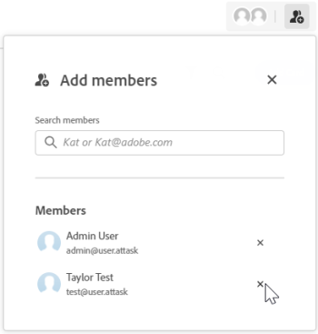

# Hinzufügen von Mitgliedern zu einer Pinnwand oder Entfernen von Mitgliedern von einer Pinnwand

Personen und Teams müssen dem Board als Mitglieder hinzugefügt werden, bevor sie das Board anzeigen können.

Der Ersteller einer Pinnwand ist standardmäßig der Besitzer. Der Board-Eigentümer ist die einzige Person, die dieses Board löschen oder seine Filter im Bedienfeld &quot;Konfigurieren&quot; aktualisieren kann. Nur ein Systemadministrator oder der aktuelle Board-Eigentümer kann den Board-Eigentümer ändern.

## Zugriffsanforderungen

+++ Erweitern, um die Zugriffsanforderungen für die in diesem Artikel beschriebene Funktionalität anzuzeigen.

<table style="table-layout:auto"> 
 <col> 
 <col> 
 <tbody> 
  <tr> 
   <td role="rowheader">Adobe Workfront-Paket</td> 
   <td> 
Beliebig
 </td> 
  </tr> 
  <tr> 
   <td role="rowheader">Adobe Workfront-Lizenz</td> 
   <td> 
   
Mitwirkende oder höher
 
   
Anfragende oder höher

   </td> 
  </tr> 
 </tbody> 
</table>

Weitere Details zu den Informationen in dieser Tabelle finden Sie unter [Zugriffsanforderungen in der Dokumentation zu Workfront](/help/quicksilver/administration-and-setup/add-users/access-levels-and-object-permissions/access-level-requirements-in-documentation.md).

+++

## Mitglieder zu einer Pinnwand hinzufügen

{{step1-to-boards}}

1. Eine neue Pinnwand erstellen oder eine vorhandene Pinnwand bearbeiten. Weitere Informationen finden Sie unter [Board erstellen oder bearbeiten](../../agile/get-started-with-boards/create-edit-board.md).
1. Klicken Sie auf das Symbol **[!UICONTROL Mitglied hinzufügen]** .
1. Beginnen Sie im Feld **[!UICONTROL Mitglieder hinzufügen]** mit der Eingabe eines Namens, und wählen Sie ihn aus, wenn er in der Liste angezeigt wird.

   Sie können ein einzelnes Mitglied oder ein Team auswählen. Wenn Sie ein Team auswählen, wird das Team selbst dem Board hinzugefügt.

   >[!NOTE]
   >
   >Für einen einzelnen Benutzer muss die Option **[!UICONTROL Ansicht]** oder **[!UICONTROL Bearbeiten]** in der Zugriffsebene für Teams festgelegt sein, andernfalls kann er das Board nicht anzeigen.

   

## Mitglieder aus einem Board entfernen

{{step1-to-boards}}

1. Eine neue Pinnwand erstellen oder eine vorhandene Pinnwand bearbeiten. Weitere Informationen finden Sie unter [Erstellen oder Bearbeiten einer Pinnwand](../../agile/get-started-with-boards/create-edit-board.md).
1. Klicken Sie auf **[!UICONTROL Symbol]** Mitglied hinzufügen.
1. Klicken Sie im Feld **[!UICONTROL Mitglieder hinzufügen]** auf das X neben dem Namen einer Person oder eines Teams, um sie aus der Pinnwand zu entfernen.

   

   Wenn Sie ein Mitglied aus einem Board entfernen, wird es nicht von den Karten entfernt, denen es zugewiesen ist. Bei verbundenen Karten werden die Zuweisungen auch für die [!DNL Workfront]-Aufgabe oder das Problem aktualisiert.

   Mitglieder werden nur aus diesem Board entfernt. Sie werden nicht von anderen Boards entfernt, zu denen sie gehören.

   >[!NOTE]
   >
   >Sie können den Board-Eigentümer nicht entfernen.

## Board-Eigentümer ändern

>[!NOTE]
>
>Nur ein Systemadministrator oder der aktuelle Board-Eigentümer kann den Board-Eigentümer ändern. Ein Board kann nur einen Besitzer haben.
>
>Die Möglichkeit, den Boardbesitzer zu ändern, ist auf grundlegenden, retrospektiven und Kanban-Boards verfügbar, nicht aber auf dynamischen Boards.

1. Rufen Sie die Pinnwand auf.
1. Klicken Sie auf das **[!UICONTROL Mehr]** Menü  neben dem Board-Namen und wählen Sie dann **[!UICONTROL Board-Inhaber ändern]**.
1. Suchen Sie im Dialogfeld Pinnwand-Inhaber ändern nach dem Benutzer, den Sie zum Besitzer machen möchten, und wählen Sie ihn aus.

   Sie können nicht nach Benutzern suchen, die bereits Mitglieder des Boards sind. Um ein vorhandenes Mitglied zum Eigentümer zu machen, müssen Sie es zunächst aus dem Board entfernen. Wenn Sie einen Benutzer zum Board-Eigentümer machen, werden sie dem Board hinzugefügt.

   Board-Eigentümer kann nur ein Benutzer sein. Ein Team kann kein Eigentümer sein.

1. Klicken Sie auf [!UICONTROL **Aktualisieren**].
