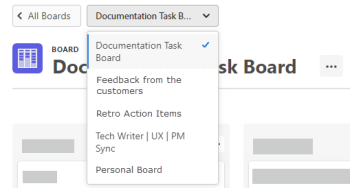

# Erstellen oder Bearbeiten einer Pinnwand

<!-- Audited: 12/2023 -->

Im Dashboard [!UICONTROL Pinnwände] können Sie eine neue Pinnwand erstellen oder eine vorhandene Pinnwand bearbeiten.

## Zugriffsanforderungen

+++ Erweitern, um die Zugriffsanforderungen für die in diesem Artikel beschriebene Funktionalität anzuzeigen.

<table style="table-layout:auto"> 
 <col> 
 <col> 
 <tbody> 
  <tr> 
   <td role="rowheader">Adobe Workfront-Paket</td> 
   <td> 
Beliebig
 </td> 
  </tr> 
  <tr> 
   <td role="rowheader">Adobe Workfront-Lizenz</td> 
   <td> 
   
Mitwirkende oder höher
 
   
Anfragende oder höher

   </td> 
  </tr> 
 </tbody> 
</table>

Weitere Informationen finden Sie unter [Zugriffsanforderungen in der Dokumentation zu Workfront](/help/quicksilver/administration-and-setup/add-users/access-levels-and-object-permissions/access-level-requirements-in-documentation.md).

+++

## Erstellen einer neuen Pinnwand

{{step1-to-boards}}

1. Klicken Sie **[!UICONTROL Pinnwand hinzufügen]**.

1. Wählen Sie eine Vorlage für die Pinnwand aus.

   | Vorlage | Beschreibung |
   |---------|----------|
   | Einfache Pinnwand | Auf der Pinnwand werden drei Standardspalten bereitgestellt. Sie können neue Spalten hinzufügen und die Standardspalten umbenennen oder löschen. 
Auf der Pinnwand werden drei Standardspalten bereitgestellt. Sie können neue Spalten hinzufügen und die Standardspalten umbenennen oder löschen. |
   | Kanban-Board | Auf der Pinnwand werden die folgenden Spalten bereitgestellt: Auftragsbestand, Neu, In Bearbeitung, Abgeschlossen und Halten. Sie können neue Spalten hinzufügen und die Standardspalten umbenennen oder löschen.
Um den Rückstand zu verwenden, müssen Sie Filter für die Aufnahmespalte einrichten. Weitere Informationen finden Sie unter [Hinzufügen einer Aufnahmespalte zu einer Pinnwand](/help/quicksilver/agile/use-boards-agile-planning-tools/add-intake-column-to-board.md). 
Um die Standardrichtlinien für jede Spalte zu überprüfen, klicken Sie auf das Menü [!UICONTROL **Mehr** &#x200B;] in einer Spalte und wählen Sie [!UICONTROL **Bearbeiten**] aus. Sie können jede dieser voreingestellten Richtlinien ändern. Weitere Informationen finden Sie unter [Pinnwand-Spalten verwalten](/help/quicksilver/agile/get-started-with-boards/manage-board-columns.md). |
   | Retrospektiv-Board | Die folgenden Spalten sind auf der Pinnwand vorhanden: Was ist gut gelaufen? Was könnte verbessert werden? Wen sollen wir feiern? Was können wir tun, um schneller voranzukommen? Sie können neue Spalten hinzufügen und die Standardspalten umbenennen oder löschen. 
Es werden keine Spaltenrichtlinien angewendet. |
   | Dynamische Pinnwand | Die Pinnwand enthält die folgenden Spalten: „Nicht ausgewählt“, „Neu“, „In Bearbeitung“, „Halten“ und „Fertig“. Sie können neue Spalten hinzufügen und die Standardspalten umbenennen oder löschen. (Die nicht ausgewählte Spalte kann umbenannt, aber nicht gelöscht werden.) Diese Spalte enthält alle Karten mit einem Status, der mit keinem der anderen Spaltenstatus übereinstimmt.) 
Die standardmäßigen Spaltenrichtlinien weisen den Spalten Karten basierend auf ihrem Status zu. Weitere Informationen finden Sie unter [Pinnwand-Spalten verwalten](/help/quicksilver/agile/get-started-with-boards/manage-board-columns.md). |

1. Führen Sie nur für dynamische Pinnwände die Schritte des Einrichtungsassistenten aus:

   1. Geben Sie einen Namen für die Pinnwand ein und klicken Sie auf [!UICONTROL **Weiter**].
   1. Suchen Sie nach [!DNL Workfront]Projekte [!UICONTROL **und wählen Sie diese aus**] um Aufgaben und Probleme in das Board zu bringen.
   1. Suchen Sie nach [!UICONTROL **Arbeitsaufträge**] und wählen Sie diese aus, um Aufgaben und Probleme auf die Pinnwand zu bringen.

      Alle Objekte werden auf der Pinnwand als verbundene Karten angezeigt.

      Der Zähler [!UICONTROL **Karten werden hinzugefügt**] zeigt an, wie viele Karten sich auf der Pinnwand befinden werden. Wenn Sie beispielsweise ein Projekt mit 100 Aufgaben und Problemen auswählen, zeigt der Zähler 100 an. Wenn Sie eine Benutzerzuweisung hinzufügen und diese Person fünf Aufgaben im Projekt zugewiesen ist, zeigt der Zähler 5 an.

      >[!NOTE]
      >
      >Das Kartenlimit für dynamische Pinnwände beträgt 700 Aufgaben und 700 Probleme, also insgesamt 1.400 Karten. Eine hohe Anzahl von Karten auf der Pinnwand kann die Leistung der Pinnwand beeinträchtigen. Alle archivierten Karten, sowohl ausgeblendet als auch sichtbar, werden auf diese Grenze angerechnet.

   1. (Optional) Wählen Sie [!UICONTROL **Abgeschlossene Karten nicht archivieren**], um abgeschlossene Aufgaben und Probleme als sichtbare Karten in der Spalte Abgeschlossen auf die Pinnwand zu bringen. Wenn diese Option nicht ausgewählt ist, werden vervollständigte Karten zum Zeitpunkt der Pinnwand-Erstellung als archivierte Karten auf die Pinnwand gebracht.

      >[!NOTE]
      >
      >Standardmäßig werden archivierte Karten nicht auf der Pinnwand angezeigt. Um archivierte Karten anzuzeigen, müssen Sie eine Konfigurationseinstellung aktivieren und dann die Pinnwand so filtern, dass archivierte Karten angezeigt werden. Weitere Informationen finden Sie unter [Anpassen der auf einer Karte angezeigten Felder](/help/quicksilver/agile/get-started-with-boards/customize-fields-on-card.md) und [Filtern und Suchen in einer Pinnwand](/help/quicksilver/agile/get-started-with-boards/filter-search-in-board.md).

   1. (Optional) Klicken Sie auf [!UICONTROL **Erweiterte Filter verwenden**], um zusätzliche Filteroptionen anzuzeigen.

      Dies ist der gleiche Prozess wie das Erstellen eines Filters in einer Aufnahmespalte. Weitere Informationen finden Sie unter [Hinzufügen einer Aufnahmespalte zu einer Pinnwand](/help/quicksilver/agile/use-boards-agile-planning-tools/add-intake-column-to-board.md).

      Wenn Sie die Filter auf einer dynamischen Pinnwand nach der Erstellung aktualisieren, werden Karteneinstellungen, die nicht Teil der Workfront-Aufgabe oder -Anfrage sind (z. B. Tags), zurückgesetzt.

   1. Klicken Sie nach dem Hinzufügen der Filter auf [!UICONTROL **Pinnwand erstellen**].

1. Geben Sie einen Namen für die Pinnwand in das Feld **[!UICONTROL Pinnwand]** ein und drücken Sie die Eingabetaste.
1. Konfigurieren Sie das Board nach Bedarf.

   Weitere Informationen finden Sie unter [Mitglieder einer Pinnwand hinzufügen oder daraus entfernen](../../agile/get-started-with-boards/add-members-to-board.md), [Pinnwand-Spalten verwalten](../../agile/get-started-with-boards/manage-board-columns.md), [Hinzufügen einer Ad-hoc-Karte zu einer Pinnwand](../../agile/get-started-with-boards/add-card-to-board.md) und [Verwenden von verbundenen Karten auf Pinnwänden](/help/quicksilver/agile/get-started-with-boards/connected-cards.md).

1. Klicken Sie auf **[!UICONTROL Alle Pinnwände]**, um zum Dashboard Pinnwände zurückzukehren.

   Sie können auch das Dropdown-Menü mit der Bezeichnung der aktuellen Pinnwand suchen und darauf klicken, um zu einer anderen Pinnwand zu wechseln.

   

## Bearbeiten einer vorhandenen Pinnwand

{{step1-to-boards}}

1. Wählen Sie im Dashboard die zu öffnende Pinnwand aus.
1. Bearbeiten Sie die Pinnwand nach Bedarf. Sie können auf den Namen der Pinnwand klicken, um sie umzubenennen.

   Um verbundene Karten mit Workfront zu synchronisieren und neue Aufgaben und Probleme auf die Pinnwand oder Aufnahmespalte zu übertragen, klicken Sie auf das **[!UICONTROL Mehr]** Menü ![[!UICONTROL Mehr]](assets/more-icon-spectrum.png) neben dem Namen der Pinnwand und wählen Sie **[!UICONTROL Verbundene Elemente synchronisieren]**.

   Weitere Informationen finden Sie unter [Mitglieder einer Pinnwand hinzufügen oder daraus entfernen](../../agile/get-started-with-boards/add-members-to-board.md), [Pinnwandspalten verwalten](../../agile/get-started-with-boards/manage-board-columns.md) und [Hinzufügen einer Karte zu einer Pinnwand](../../agile/get-started-with-boards/add-card-to-board.md).

1. Klicken Sie auf **[!UICONTROL Alle Pinnwände]**, um zum Dashboard Pinnwände zurückzukehren.

   Sie können auch das Dropdown-Menü mit der Bezeichnung der aktuellen Pinnwand suchen und darauf klicken, um zu einer anderen Pinnwand zu wechseln.

