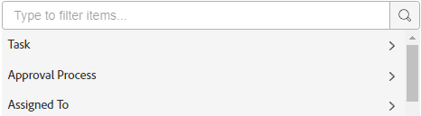

# Anpassen der auf einer Karte angezeigten Felder

Standardmäßig werden alle verfügbaren Felder auf einer Karte angezeigt, sowohl in der Vollansicht, wenn die Karte geöffnet ist, als auch in der komprimierten Kartenansicht auf dem Board. Sie können die angezeigten Felder wie folgt anpassen:

* Deaktivieren eines Felds, damit es in keiner der beiden Ansichten angezeigt wird
* Ausblenden eines Felds in der verdichteten Kartenansicht

Wenn ein Feld einen Wert enthält und Sie das Feld deaktivieren, bleibt der Wert erhalten, wenn Sie das Feld später wieder aktivieren.

Abschnitte (die als linke Navigationsoptionen auf den Kartendetails angezeigt werden) können ebenfalls angezeigt und ausgeblendet werden.

Sie können auch zuvor erstellte benutzerdefinierte Felder anzeigen. Sie können keine neuen benutzerdefinierten Felder innerhalb eines Boards entwerfen und erstellen.

>[!NOTE]
>
>Alle Feldanpassungen, die Sie vornehmen, gelten nur für das Board, in dem Sie arbeiten.

## Zugriffsanforderungen

+++ Erweitern, um die Zugriffsanforderungen für die in diesem Artikel beschriebene Funktionalität anzuzeigen.

<table style="table-layout:auto"> 
 <col> 
 <col> 
 <tbody> 
  <tr> 
   <td role="rowheader">Adobe Workfront-Paket</td> 
   <td> 
Beliebig
 </td> 
  </tr> 
  <tr> 
   <td role="rowheader">Adobe Workfront-Lizenz</td> 
   <td> 
   
Mitwirkende oder höher
 
   
Anfragende oder höher

   </td> 
  </tr> 
 </tbody> 
</table>

Weitere Details zu den Informationen in dieser Tabelle finden Sie unter [Zugriffsanforderungen in der Dokumentation zu Workfront](/help/quicksilver/administration-and-setup/add-users/access-levels-and-object-permissions/access-level-requirements-in-documentation.md).

+++

## Konfigurieren von Karten {#configure-cards}

{{step1-to-boards}}

1. Auf ein Board zugreifen. Weitere Informationen finden Sie unter [Board erstellen oder bearbeiten](../../agile/get-started-with-boards/create-edit-board.md).
1. Klicken Sie auf [!UICONTROL **Konfigurieren**] auf der rechten Seite des Boards, um den Bereich &quot;Konfigurieren&quot; zu öffnen.
1. Erweitern Sie [!UICONTROL **Karten**].

   Die meisten Felder und Abschnitte sind standardmäßig aktiviert.

1. Deaktivieren Sie ein Feld oder einen Abschnitt, um es in beiden Kartenansichten zu deaktivieren.
1. Klicken Sie auf das Symbol &quot;Ausblenden&quot;  neben einem Feld oder Abschnitt, um es in der verdichteten Ansicht auszublenden.
1. Um alle Felder und Abschnitte in beiden Ansichten anzuzeigen, klicken Sie auf [!UICONTROL **Alle Felder auf Standard zurücksetzen**].
1. Klicken Sie auf [!UICONTROL **Konfiguration ausblenden**], um den Bereich &quot;Konfigurieren&quot; zu schließen.

## Hinzufügen benutzerdefinierter Felder zu Karten

Benutzerdefinierte Felder sind für angeschlossene Karten verfügbar. Sie sind nur in der vollständigen Kartenansicht sichtbar, nicht in der komprimierten Ansicht auf dem Board.

Die Daten in benutzerdefinierten Feldern können auf der Karte bearbeitet werden, wobei bestimmte benutzerdefinierte Elemente möglicherweise nur im ursprünglichen Feld und nicht auf der Karte bearbeitet werden können.

1. Greifen Sie auf ein Board zu und klicken Sie auf [!UICONTROL **Konfigurieren**], um den Bereich &quot;Konfigurieren&quot; zu öffnen.
1. Erweitern Sie [!UICONTROL **Karten**].
1. Klicken Sie unter [!UICONTROL Kartenfelder] auf [!UICONTROL **Benutzerdefiniertes Feld hinzufügen**].
1. Wählen Sie [!UICONTROL **Aufgabe**] oder [!UICONTROL **Problem**].

   Die Kategorien verfügbarer Felder für Aufgaben oder Probleme werden angezeigt. Erweitern Sie eine Kategorie, um alle Felder anzuzeigen. Sie können auch nach einem Feld suchen.

   

   >[!NOTE]
   >
   >Die folgenden Feldtypen können nicht zu Karten hinzugefügt werden: Adobe XD, Bild, PDF, Video.

1. Wählen Sie den Feldnamen aus.
1. (Optional) Klicken Sie in das Feld **[!UICONTROL Feldwert]**, um dieses benutzerdefinierte Feld zu ändern.
1. (Optional) Ändern Sie die **[!UICONTROL Feldbezeichnung]** in den Feldnamen, der auf Karten angezeigt werden soll.
1. Wenn Sie die Änderungen abgeschlossen haben, klicken Sie auf [!UICONTROL **Feld speichern**].

   

   Das benutzerdefinierte Feld wird der Liste der verfügbaren Felder hinzugefügt und ist standardmäßig aktiviert. Sie können das benutzerdefinierte Feld gemäß den Schritten im Abschnitt [Karten konfigurieren](customize-fields-on-card.md#configure-cards) oben deaktivieren, das Feld bearbeiten oder es von allen Karten löschen.

>[!NOTE]
>
>Wenn Sie das benutzerdefinierte Feld später in Workfront umbenennen, müssen Sie die Feldbeschriftung im Bedienfeld &quot;Konfigurieren&quot; entsprechend bearbeiten, andernfalls wird das Feld nicht auf den Karten angezeigt.

## Anzeigen oder Ausblenden archivierter Karten

Sie müssen eine Konfigurationseinstellung aktivieren, um archivierte Karten auf einem Board anzuzeigen.

1. Greifen Sie auf ein Board zu und klicken Sie auf [!UICONTROL **Konfigurieren**], um den Bereich &quot;Konfigurieren&quot; zu öffnen.
1. Erweitern Sie [!UICONTROL **Karten**].
1. Aktivieren Sie [!UICONTROL **Archivierte Karten auf dem Board anzeigen**].

   Jetzt können Sie das Board filtern, um alle Karten anzuzeigen, die archiviert wurden. Ausführliche Informationen finden Sie unter [Filtern und Suchen in einem Board](/help/quicksilver/agile/get-started-with-boards/filter-search-in-board.md).

1. Klicken Sie auf [!UICONTROL **Konfiguration ausblenden**], um den Bereich &quot;Konfigurieren&quot; zu schließen.

## Konfigurieren der Verringerung von Karten

Informationen zum automatischen Entfernen von Karten aus dem Board nach einer bestimmten Zeit finden Sie unter [Abbrechen der Karte konfigurieren](/help/quicksilver/agile/use-boards-agile-planning-tools/configure-card-falloff.md).
