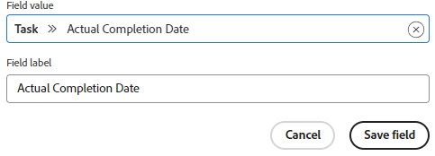

# Anpassen der angezeigten Felder auf einer Karte

Standardmäßig werden alle verfügbaren Felder auf einer Karte angezeigt, sowohl in der Vollansicht beim Öffnen der Karte als auch in der verdichteten Kartenansicht auf der Pinnwand. Sie können anpassen, welche Felder angezeigt werden durch:

* Deaktivieren eines Felds, sodass es in keiner Ansicht angezeigt wird
* Ausblenden eines Felds in der verdichteten Kartenansicht

Wenn ein Feld einen Wert enthält und Sie das Feld deaktivieren, wird der Wert beibehalten, wenn Sie das Feld später erneut aktivieren.

Abschnitte (die in den Kartendetails als linke Navigationsoptionen angezeigt werden) stehen auch zum Ein- und Ausblenden zur Verfügung.

Sie können auch benutzerdefinierte Felder anzeigen, die zuvor erstellt wurden. Sie können keine neuen benutzerdefinierten Felder in einer Pinnwand entwerfen und erstellen.

>[!NOTE]
>
>Alle Feldanpassungen, die Sie vornehmen, gelten nur für die Pinnwand, in der Sie arbeiten.

## Zugriffsanforderungen

Sie müssen über folgenden Zugriff verfügen, um die Schritte in diesem Artikel ausführen zu können:

<table style="table-layout:auto"> 
 <col> 
 </col> 
 <col> 
 </col> 
 <tbody> 
  <tr> 
   <td role="rowheader"><strong>[!DNL Adobe Workfront] plan*</strong></td> 
   <td> 
Alle
 </td> 
  </tr> 
  <tr> 
   <td role="rowheader"><strong>[!DNL Adobe Workfront] license*</strong></td> 
   <td> 
[!UICONTROL Anforderung] oder höher
 </td> 
  </tr>
   </tbody> 
</table>

&#42;Wenden Sie sich an Ihren [!DNL Workfront] -Administrator, um zu erfahren, welchen Plan, welchen Lizenztyp oder welchen Zugriff Sie haben.

## Karten konfigurieren {#configure-cards}

1. Klicken Sie auf das Symbol **[!UICONTROL Hauptmenü]** oben rechts in [!DNL Adobe Workfront] und klicken Sie dann auf **[!UICONTROL Pinnwände]**.
1. Öffnen Sie eine Pinnwand. Weitere Informationen finden Sie unter [Erstellen oder Bearbeiten einer Pinnwand](../../agile/get-started-with-boards/create-edit-board.md).
1. Klicken Sie rechts auf der Pinnwand auf [!UICONTROL **Konfigurieren**] , um den Bereich &quot;Konfigurieren&quot;zu öffnen.
1. Erweitern Sie [!UICONTROL **Karten**].

   Die meisten Felder und Abschnitte sind standardmäßig aktiviert.

1. Deaktivieren Sie ein Feld oder einen Abschnitt, um es in beiden Kartenansichten zu deaktivieren.
1. Klicken Sie auf das Symbol zum Ausblenden  neben einem Feld oder Abschnitt, um es in der gekürzten Ansicht auszublenden.
1. Um alle Felder und Abschnitte in beiden Ansichten anzuzeigen, klicken Sie auf [!UICONTROL **Alle Felder auf Standard wiederherstellen**].
1. Klicken Sie auf [!UICONTROL **Konfigurieren ausblenden**] , um den Bereich &quot;Konfigurieren&quot;zu schließen.

## Hinzufügen benutzerdefinierter Felder zu Karten

Benutzerdefinierte Felder sind auf verbundenen Karten verfügbar. Sie sind nur in der vollständigen Kartenansicht sichtbar, nicht in der gekürzten Ansicht auf der Pinnwand.

Die Daten in benutzerdefinierten Feldern können auf der Karte bearbeitet werden, bestimmte benutzerdefinierte Elemente stehen jedoch möglicherweise nur für die Bearbeitung im ursprünglichen Feld und nicht auf der Karte zur Verfügung.

1. Rufen Sie eine Pinnwand auf und klicken Sie auf [!UICONTROL **Konfigurieren**] , um den Bereich &quot;Konfigurieren&quot;zu öffnen.
1. Erweitern Sie [!UICONTROL **Karten**].
1. Klicken Sie unter [!UICONTROL Kartenfelder] auf [!UICONTROL **Benutzerdefiniertes Feld hinzufügen**].
1. Wählen Sie [!UICONTROL **Aufgabe**] oder [!UICONTROL **Problem**] aus.

   Die Kategorien der verfügbaren Felder für Aufgaben oder Probleme werden angezeigt. Erweitern Sie eine Kategorie, um alle Felder anzuzeigen. Sie können auch nach einem Feld suchen.

   

   >[!NOTE]
   >
   >Die folgenden Feldtypen können nicht zu Karten hinzugefügt werden: Adobe XD, Bild, PDF, Video.

1. Wählen Sie den Feldnamen aus.
1. (Optional) Klicken Sie in das Feld **[!UICONTROL Feldwert]** , um dieses benutzerdefinierte Feld in ein anderes zu ändern.
1. (Optional) Ändern Sie die **[!UICONTROL Feldbezeichnung]** in den Feldnamen, der auf den Karten angezeigt werden soll.
1. Wenn Sie alle Änderungen vorgenommen haben, klicken Sie auf [!UICONTROL **Feld speichern**].

   

   Das benutzerdefinierte Feld wird zur Liste der verfügbaren Felder hinzugefügt und ist standardmäßig aktiviert. Sie können das benutzerdefinierte Feld entsprechend den Schritten im Abschnitt [Karten konfigurieren](customize-fields-on-card.md#configure-cards) deaktivieren, das Feld bearbeiten oder es aus allen Karten löschen.

>[!NOTE]
>
>Wenn Sie das benutzerdefinierte Feld später in Workfront umbenennen, müssen Sie die Feldbeschriftung im Fenster &quot;Für Übereinstimmung konfigurieren&quot;bearbeiten. Andernfalls wird das Feld nicht auf den Karten angezeigt.

## Archivierte Karten anzeigen oder ausblenden

Sie müssen eine Konfigurationseinstellung aktivieren, um archivierte Karten auf einer Pinnwand anzuzeigen.

1. Rufen Sie eine Pinnwand auf und klicken Sie auf [!UICONTROL **Konfigurieren**] , um den Bereich &quot;Konfigurieren&quot;zu öffnen.
1. Erweitern Sie [!UICONTROL **Karten**].
1. Aktivieren Sie [!UICONTROL **Archivierte Karten auf der Pinnwand anzeigen**].

   Jetzt können Sie die Pinnwand filtern, um alle archivierten Karten anzuzeigen. Weitere Informationen finden Sie unter [Filtern und Suchen in einer Pinnwand](/help/quicksilver/agile/get-started-with-boards/filter-search-in-board.md).

1. Klicken Sie auf [!UICONTROL **Konfigurieren ausblenden**] , um den Bereich &quot;Konfigurieren&quot;zu schließen.

## Kartenfalloff konfigurieren

Informationen zum automatischen Entfernen von Karten aus der Pinnwand nach einem bestimmten Zeitraum finden Sie unter [Kartenfalloff konfigurieren](/help/quicksilver/agile/use-boards-agile-planning-tools/configure-card-falloff.md).
