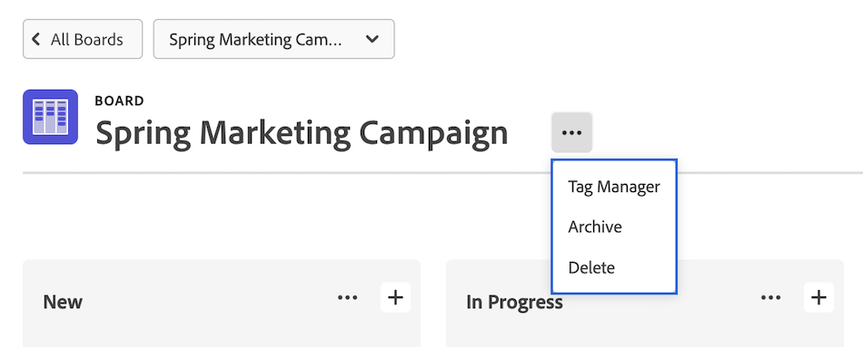

# Pinnwand löschen oder archivieren

Sie können eine Pinnwand löschen oder archivieren in [!DNL Workfront]. Wenn Sie eine Pinnwand löschen, wird sie endgültig aus [!DNL Workfront], während die Archivierung einer Pinnwand alle Karten behält und es ermöglicht, sie zu einem späteren Zeitpunkt wiederherzustellen. Diese Optionen gelten sowohl für eigenständige Pinnwände als auch für Pinnwände, die Teil von Workflows sind.

>[!NOTE]
>
>Die vorherige Version von Workflows, so genannte Sammlungen, ist nur über die frühe Funktion verfügbar, für die [!UICONTROL [!DNL Workfront] Pinnwände]. Weitere Informationen finden Sie unter [Vorabauswahl für Funktionen für Adobe Workfront-Pinnwände](/help/quicksilver/agile/get-started-with-boards/boards-early-feature-opt-in.md).
>Workflows stehen allen Benutzern in der Vorschauumgebung zur Verfügung.

## Zugriffsanforderungen

Sie müssen über folgenden Zugriff verfügen, um die Schritte in diesem Artikel ausführen zu können:

<table style="table-layout:auto"> 
 <col> 
 </col> 
 <col> 
 </col> 
 <tbody> 
  <tr> 
   <td role="rowheader"><strong>[!DNL Adobe Workfront] Plan*</strong></td> 
   <td> 
Beliebig
 </td> 
  </tr> 
  <tr> 
   <td role="rowheader"><strong>[!DNL Adobe Workfront] license*</strong></td> 
   <td> 
[!UICONTROL Anforderung] oder höher
 </td> 
  </tr>
   </tbody> 
</table>

&#42;Wenden Sie sich an Ihren [!DNL Workfront] Administrator.

## Pinnwand löschen

Wenn Sie eine Pinnwand löschen, wird sie dauerhaft aus [!DNL Workfront] und nicht wiederhergestellt werden können. Alle Karten auf der Pinnwand werden ebenfalls zusammen mit der Pinnwand gelöscht.

1. Klicken Sie auf **[!UICONTROL Hauptmenü]** icon  in der oberen rechten Ecke von [!DNL Adobe Workfront]Klicken Sie auf **[!UICONTROL Pinnwände]**.
1. Wählen Sie im Dashboard die zu öffnende Pinnwand aus.
1. Klicken Sie auf **[!UICONTROL Mehr]** Menü ![[!UICONTROL Mehr Menü]](assets/more-icon-spectrum.png) neben dem Pinnwandnamen und wählen Sie **[!UICONTROL Löschen]**. Klicken Sie anschließend auf **[!UICONTROL Pinnwand löschen]** in der Bestätigungsnachricht angezeigt.

   >[!NOTE]
   >
   >Sie können nur von Ihnen erstellte Pinnwände und nicht Pinnwände löschen, die Ihnen hinzugefügt wurden.

   

## Pinnwand archivieren

Archivierte Pinnwände behalten alle Karten und Zuweisungen bei. Jeder Benutzer kann eine Pinnwand jederzeit archivieren oder wiederherstellen.

1. Klicken Sie auf **[!UICONTROL Hauptmenü]** icon  in der oberen rechten Ecke von [!DNL Adobe Workfront]Klicken Sie auf **[!UICONTROL Pinnwände]**.
1. Wählen Sie im Dashboard die zu öffnende Pinnwand aus.
1. Klicken Sie auf **[!UICONTROL Mehr]** Menü ![[!UICONTROL Mehr Menü]](assets/more-icon-spectrum.png) neben dem Pinnwandnamen und wählen Sie **[!UICONTROL Archivieren]**.

   

## Pinnwand wiederherstellen

Eine archivierte Pinnwand kann jederzeit wiederhergestellt werden. Jeder Benutzer kann eine archivierte Pinnwand wiederherstellen.

1. Klicken Sie auf **[!UICONTROL Hauptmenü]** icon  in der oberen rechten Ecke von [!DNL Adobe Workfront]Klicken Sie auf **[!UICONTROL Pinnwände]**.
1. Klicken Sie im Dashboard auf das Filtersymbol  und wählen Sie **[!UICONTROL Archivierte Pinnwände]**.
1. Suchen Sie die Pinnwand, die Sie wiederherstellen möchten, und klicken Sie auf die Schaltfläche **[!UICONTROL Mehr]** Menü  neben dem Pinnwandnamen und wählen Sie **[!UICONTROL Wiederherstellen]**.

   
