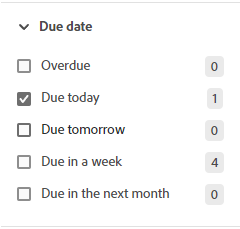
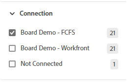
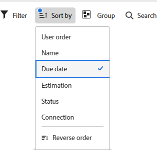

# Filtern und Suchen in einer Pinnwand

Sie können eine Pinnwand filtern, um Folgendes anzuzeigen:

* Karten, die bestimmten Personen zugewiesen sind
* Karten mit bestimmten Tags
* Karten mit einem bestimmten Status
* In einem bestimmten Zeitrahmen fällige Karten
* Archivierte Karten
* Karten, die mit einem bestimmten Projekt verbunden sind

Sortieren der Pinnwand Sortiert alle Karten in den Spalten. Es kann keine einzige Spalte sortiert werden, und der Rückstand oder die Aufnahmespalte sind nicht sortiert.

Die Suche hilft Ihnen auch, eine bestimmte Karte auf der Pinnwand zu finden.

Wenn Filter angewendet werden, wird eine Anzeige auf der Pinnwand angezeigt . Klicken Sie auf **[!UICONTROL Alle löschen]**, um alle Filter aus der Pinnwand zu entfernen, und klicken Sie auf das Symbol „Reduzieren“, um das Filterbedienfeld zu schließen.

## Zugriffsanforderungen

+++ Erweitern, um die Zugriffsanforderungen für die in diesem Artikel beschriebene Funktionalität anzuzeigen.

<table style="table-layout:auto"> 
 <col> 
 <col> 
 <tbody> 
  <tr> 
   <td role="rowheader">Adobe Workfront-Paket</td> 
   <td> 
Beliebig
 </td> 
  </tr> 
  <tr> 
   <td role="rowheader">Adobe Workfront-Lizenz</td> 
   <td> 
   
Mitwirkende oder höher
 
   
Anfragende oder höher

   </td> 
  </tr> 
 </tbody> 
</table>

Weitere Informationen finden Sie unter [Zugriffsanforderungen in der Dokumentation zu Workfront](/help/quicksilver/administration-and-setup/add-users/access-levels-and-object-permissions/access-level-requirements-in-documentation.md).

+++

## Pinnwand nach Verantwortlichen filtern

{{step1-to-boards}}

1. Zugriff auf eine Pinnwand. Weitere Informationen finden Sie unter [Erstellen oder Bearbeiten einer Pinnwand](../../agile/get-started-with-boards/create-edit-board.md).
1. Klicken Sie [!UICONTROL **Filter**], erweitern Sie den Abschnitt [!UICONTROL Mitglieder] und wählen Sie die Person(en) aus, deren Karten Sie anzeigen möchten. Sie können auch nicht zugewiesene Karten anzeigen.

   

## Pinnwand nach Tags filtern

1. Rufen Sie die Pinnwand auf.
1. Klicken Sie [!UICONTROL **Filter**], erweitern Sie den Abschnitt [!UICONTROL Tags] und wählen Sie die Tags aus, die Sie sehen möchten.

   

## Pinnwand nach Status filtern

1. Rufen Sie die Pinnwand auf.
1. Klicken Sie [!UICONTROL **Filter**], erweitern Sie den Abschnitt [!UICONTROL Status] und wählen Sie die Statustypen aus, die Sie sehen möchten.

   Sie können auch ausgefüllte Karten ausblenden.

   

## Pinnwand nach Fälligkeitsdatum filtern

1. Rufen Sie die Pinnwand auf.
1. Klicken Sie [!UICONTROL **Filter**] [!UICONTROL , erweitern Sie den &#x200B;] „Fälligkeitsdatum“ und wählen Sie die gewünschten Datumsoptionen aus.

   Nur Karten in den ausgewählten Datumsbereichen werden angezeigt.

   

## Pinnwand filtern, um archivierte Karten anzuzeigen

Standardmäßig werden nur aktive Karten auf einer Pinnwand angezeigt. Sie können die Pinnwand so filtern, dass auch archivierte Karten angezeigt werden.

1. Rufen Sie die Pinnwand auf.
1. Klicken Sie [!UICONTROL **rechts auf**] Pinnwand auf „Konfigurieren“, um das Bedienfeld „Konfigurieren“ zu öffnen.
1. Erweitern Sie [!UICONTROL **Karten**].
1. Schalten Sie [!UICONTROL **Anzeige archivierter Karten auf der Pinnwand**] ein.
1. Klicken Sie [!UICONTROL **Filtern**] erweitern Sie den Abschnitt [!UICONTROL Archivierte Karten] und wählen Sie **[!UICONTROL Archivierte Karten]** aus, um alle archivierten Karten anzuzeigen.

   Der Filter zeigt die Anzahl der archivierten Karten an.

   

   >[!NOTE]
   >
   >Der Abschnitt [!UICONTROL Archivierte Karten] ist im Filter nicht verfügbar, wenn Sie die Konfigurationseinstellung zur Anzeige archivierter Karten nicht aktiviert haben. Weitere Informationen finden Sie unter [Anpassen der auf einer Karte angezeigten Felder](/help/quicksilver/agile/get-started-with-boards/customize-fields-on-card.md).

1. Wählen Sie **[!UICONTROL Archivierte Karten]** erneut aus, um die Option zu deaktivieren und nur aktive Karten anzuzeigen.

## Pinnwand nach Verbindung filtern

1. Rufen Sie die Pinnwand auf.
1. Klicken Sie [!UICONTROL **Filter**], erweitern Sie den Abschnitt [!UICONTROL Verbindung] und wählen Sie die [!DNL Workfront] Projekte für die verbundenen Karten aus, die Sie anzeigen möchten.

   Sie können auch Karten anzeigen, die nicht mit einem Projekt verbunden sind.

   

## Auf einem Board sortieren

Wenn Sie eine Option zum Sortieren nach auswählen, werden alle Spalten sortiert. Es kann keine einzige Spalte sortiert werden, und der Rückstand oder die Aufnahmespalte sind nicht sortiert.

1. Rufen Sie die Pinnwand auf.
1. Klicken Sie [!UICONTROL **Sortieren nach**] und wählen Sie [!UICONTROL **Name**], [!UICONTROL **Fälligkeitsdatum**], [!UICONTROL **Schätzung**], [!UICONTROL **Status**] oder [!UICONTROL **Verbindung**].

   Verbindung (Projektname) gilt nur für verbundene Karten, und die anderen Optionen sortieren sowohl verbundene als auch Ad-hoc-Karten in den Spalten.

   Die Option „Benutzerreihenfolge“ gibt die Karten in der Reihenfolge zurück, in der sie manuell festgelegt wurden, bevor andere Sortieroptionen angewendet wurden. Dies ist die Standardsortierung für die Spalten.

1. Wählen Sie [!UICONTROL **Reihenfolge umkehren**], um die Spalten in umgekehrter Reihenfolge der Sortieroption zu sortieren.

   Der Pfeil auf dem Sortierungssymbol gibt an, ob die Spalten in auf- oder absteigender Reihenfolge sortiert sind.

   Wenn eine andere Sortierung als die Standardsortierung angewendet wird, wird ein Indikator auf dem Sortierungssymbol (Sortierung .

   

## In einer Pinnwand suchen

1. Rufen Sie die Pinnwand auf.
1. Klicken Sie [!UICONTROL **Suchen**] und geben Sie einen Suchbegriff ein. Drücken Sie dann die Eingabetaste.

   Es werden alle Karten angezeigt, die den Suchbegriff enthalten.

   Klicken Sie auf X , um die Suche zu löschen.

   
