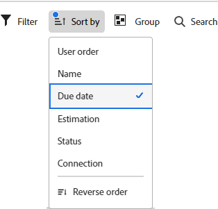

# Filtern und Suchen in einer Pinnwand

Sie können eine Pinnwand filtern, um Folgendes anzuzeigen:

* Karten, die bestimmten Personen zugewiesen wurden
* Karten mit bestimmten Tags
* Karten mit einem bestimmten Status
* Karten, die in einem bestimmten Zeitrahmen fällig sind
* Archivierte Karten
* Karten, die mit einem bestimmten Projekt verbunden sind

Durch Sortieren der Pinnwand werden alle Karten in den Spalten sortiert. Eine einzelne Spalte kann nicht sortiert werden und der Rückstand oder die Annahmespalte sind nicht sortiert.

Die Suche hilft Ihnen auch, eine bestimmte Karte auf der Pinnwand zu finden.

Wenn Filter angewendet werden, wird auf der Pinnwand eine Anzeige angezeigt . Klicken **[!UICONTROL Alle löschen]** , um alle Filter aus der Pinnwand zu entfernen, und klicken Sie auf **[!UICONTROL Filter ausblenden]** , um den Filterbereich zu schließen.

## Zugriffsanforderungen

Sie müssen über folgenden Zugriff verfügen, um die Schritte in diesem Artikel ausführen zu können:

<table style="table-layout:auto"> 
 <col> 
 <col> 
 <tbody> 
  <tr> 
   <td role="rowheader"><strong>[!DNL Adobe Workfront] Plan*</strong></td> 
   <td> 
Beliebig
 </td> 
  </tr> 
  <tr> 
   <td role="rowheader"><strong>[!DNL Adobe Workfront] license*</strong></td> 
   <td> 
[!UICONTROL Anforderung] oder höher
 </td> 
  </tr> 
 </tbody> 
</table>

&#42;Wenden Sie sich an Ihren [!DNL Workfront] Administrator.

## Pinnwand nach Bevollmächtigten filtern

1. Klicken Sie auf **[!UICONTROL Hauptmenü]** icon  in der oberen rechten Ecke von [!DNL Adobe Workfront]Klicken Sie auf **[!UICONTROL Pinnwände]**.
1. Greifen Sie auf eine Pinnwand zu. Weitere Informationen finden Sie unter [Pinnwand erstellen oder bearbeiten](../../agile/get-started-with-boards/create-edit-board.md).
1. Klicken [!UICONTROL **Filter**], erweitern Sie die [!UICONTROL Mitglieder] und wählen Sie die Person(en) aus, deren Karten Sie sehen möchten. Sie können auch nicht zugewiesene Karten anzeigen.

   

## Pinnwand nach Tags filtern

1. Rufen Sie die Pinnwand auf.
1. Klicken [!UICONTROL **Filter**], erweitern Sie die [!UICONTROL Tags] und wählen Sie die Tags aus, die Sie sehen möchten.

   

## Pinnwand nach Status filtern

1. Rufen Sie die Pinnwand auf.
1. Klicken [!UICONTROL **Filter**], erweitern Sie die [!UICONTROL Status] und wählen Sie die Statustypen aus, die Sie sehen möchten.

   Sie können auch abgeschlossene Karten ausblenden.

   

## Pinnwand nach Fälligkeitsdatum filtern

1. Rufen Sie die Pinnwand auf.
1. Klicken [!UICONTROL **Filter**], erweitern Sie die [!UICONTROL Fälligkeitsdatum] und wählen Sie die gewünschten Datumsoptionen aus.

   Es werden nur Karten aus den ausgewählten Datumsbereichen angezeigt.

   

## Filtern einer Pinnwand, um archivierte Karten anzuzeigen

Standardmäßig werden nur aktive Karten auf einer Pinnwand angezeigt. Sie können die Pinnwand filtern, um auch alle archivierten Karten anzuzeigen.

1. Rufen Sie die Pinnwand auf.
1. Klicken [!UICONTROL **Filter**], erweitern Sie die [!UICONTROL Archivierte Karten] und wählen Sie **[!UICONTROL Archivierte Karten]** , um alle archivierten Karten anzuzeigen.

   Der Filter zeigt die Anzahl der archivierten Karten an.

   

1. Auswählen **[!UICONTROL Archivierte Karten]** erneut, um die Option zu löschen und nur aktive Karten anzuzeigen.

## Pinnwand nach Verbindung filtern

1. Rufen Sie die Pinnwand auf.
1. Klicken [!UICONTROL **Filter**], erweitern Sie die [!UICONTROL Verbindung] und wählen Sie die [!DNL Workfront] Projekte für die verbundenen Karten, die Sie sehen möchten.

   Sie können auch Karten anzeigen, die nicht mit einem Projekt verbunden sind.

   

## Auf Pinnwand sortieren

Wenn Sie eine Sortieroption auswählen, werden alle Spalten sortiert. Eine einzelne Spalte kann nicht sortiert werden und der Rückstand oder die Annahmespalte sind nicht sortiert.

1. Rufen Sie die Pinnwand auf.
1. Klicken [!UICONTROL **Sortieren nach**] und wählen Sie [!UICONTROL **Name**], [!UICONTROL **Fälligkeitsdatum**], [!UICONTROL **Schätzung**], [!UICONTROL **Status**] oder [!UICONTROL **Verbindung**].

   Die Verbindung (Projektname) gilt nur für verbundene Karten. Die anderen Optionen sortieren sowohl verbundene als auch Ad-hoc-Karten in den Spalten.

   Die Option &quot;Benutzerreihenfolge&quot;gibt die Karten in der Reihenfolge zurück, in der sie manuell festgelegt wurden, bevor andere Sortieroptionen angewendet wurden. Dies ist die Standardsortierung der Spalten.

1. Auswählen [!UICONTROL **Rückwärtsreihenfolge**] , um die Spalten in umgekehrter Reihenfolge der Sortieroption zu sortieren.

   Der Pfeil auf dem Sortiersymbol gibt an, ob die Spalten in auf- oder absteigender Reihenfolge sortiert werden.

   Wenn eine andere Sortierung als die Standardsortierung angewendet wird, wird auf dem Sortiersymbol ein Indikator angezeigt .

   

## Durchsuchen einer Pinnwand

1. Rufen Sie die Pinnwand auf.
1. Klicken [!UICONTROL **Suche**] und geben Sie einen Suchbegriff ein. Drücken Sie dann die Eingabetaste.

   Alle Karten, die den Suchbegriff enthalten, werden angezeigt.

   Klicken Sie auf das X, um die Suche zu löschen.

   
