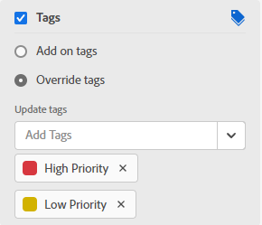

# Pinnwandspalten verwalten

{{highlighted-preview}}

Eine neue Pinnwand enthält standardmäßig drei Spalten. Sie können zusätzliche Spalten hinzufügen, die Reihenfolge der Spalten ändern, Spalten umbenennen und nicht benötigte Spalten löschen.

Die Spalteneinstellungen enthalten Richtlinien, mit denen Sie Optionen definieren können, was mit einer Karte passiert, wenn sie in diese Spalte verschoben wird.

## Zugriffsanforderungen

Sie müssen über folgenden Zugriff verfügen, um die Schritte in diesem Artikel ausführen zu können:

<table style="table-layout:auto"> 
 <col> 
 </col> 
 <col> 
 </col> 
 <tbody> 
  <tr> 
   <td role="rowheader"><strong>[!DNL Adobe Workfront] Plan*</strong></td> 
   <td> 
Beliebig
 </td> 
  </tr> 
  <tr> 
   <td role="rowheader"><strong>[!DNL Adobe Workfront] license*</strong></td> 
   <td> 
[!UICONTROL Anforderung] oder höher
 </td> 
  </tr> 
 </tbody> 
</table>

&#42;Wenden Sie sich an Ihren [!DNL Workfront] Administrator.

## Hinzufügen einer Spalte zu einer Pinnwand

1. Klicken Sie auf **[!UICONTROL Hauptmenü]** icon  in der oberen rechten Ecke von [!DNL Adobe Workfront]Klicken Sie auf **[!UICONTROL Pinnwände]**.
1. Greifen Sie auf eine Pinnwand zu. Weitere Informationen finden Sie unter [Pinnwand erstellen oder bearbeiten](../../agile/get-started-with-boards/create-edit-board.md).
1. Klicken **[!UICONTROL Spalte hinzufügen]** rechts von den vorhandenen Spalten.
1. Geben Sie in die neue Spalte einen Namen ein und klicken Sie auf **[!UICONTROL Spalte hinzufügen]**.

   

>[!TIP]
>
>Informationen zum Hinzufügen einer Aufnahmespalte finden Sie unter [Hinzufügen einer Aufnahmespalte zu einer Pinnwand](/help/quicksilver/agile/use-boards-agile-planning-tools/add-intake-column-to-board.md).

## Neuanordnen von Spalten auf einer Pinnwand

1. Rufen Sie die Pinnwand auf.
1. Ziehen Sie die Spalten in die richtige Reihenfolge. Wählen Sie unbedingt den oberen Rand der Spalte aus, bevor Sie sie an eine andere Position ziehen.

   

## Umbenennen einer Pinnwandspalte

1. Rufen Sie die Pinnwand auf.
1. Klicken Sie auf den Spaltennamen, geben Sie den neuen Namen ein und drücken Sie die Eingabetaste.

   Oder

   Klicken Sie auf **[!UICONTROL Mehr]** Menü  und wählen Sie **[!UICONTROL Bearbeiten]**. Geben Sie im Bereich &quot;Einstellungen&quot;den neuen Namen in die **[!UICONTROL Spaltenname]** und klicken Sie auf **[!UICONTROL Schließen]**.

## Pinnwandspalte löschen

1. Rufen Sie die Pinnwand auf.
1. Klicken Sie auf **[!UICONTROL Mehr]** Menü  in der Spalte und wählen Sie **[!UICONTROL Löschen]**.

   >[!NOTE]
   >
   >Spalten, die Karten enthalten, einschließlich archivierter Karten, können nicht gelöscht werden. Wenn Sie versuchen, eine Spalte zu löschen, die Karten enthält, müssen Sie eine andere Spalte für diese Karten auswählen.

## Anzahl der Karten anzeigen

Sie können eine Konfigurationseinstellung verwenden, um die Anzahl der Karten in jeder Spalte anzuzeigen.

Wenn Sie die WIP-Beschränkung für eine Spalte verwenden, wird kein separater Zähler für die Karte hinzugefügt. Weitere Informationen zu WIP-Beschränkungen finden Sie unter [Verwalten Sie die [!UICONTROL Laufende Arbeiten] (WIP)-Beschränkung auf einer Pinnwand](/help/quicksilver/agile/use-boards-agile-planning-tools/manage-wip-limit-on-board.md).

1. Rufen Sie die Pinnwand auf.
1. Klicken **[!UICONTROL Konfigurieren]** auf der rechten Seite der Pinnwand, um den Bereich Konfigurieren zu öffnen.
1. Erweitern **[!UICONTROL Spalte]**.
1. Aktivieren **[!UICONTROL Spaltenkartenanzahl anzeigen]**.

   

   Der Kartenzähler wird oben in jeder Spalte angezeigt.

1. Klicken **[!UICONTROL Konfigurieren ausblenden]** zum Schließen der [!UICONTROL Konfigurieren] Bereich.

## Spalteneinstellungen und Richtlinien definieren

1. Rufen Sie die Pinnwand auf.
1. Klicken Sie auf **[!UICONTROL Mehr]** Menü  in der Spalte und wählen Sie **[!UICONTROL Bearbeiten]**.

   Die [!UICONTROL Einstellungen] angezeigt. Die **[!UICONTROL Spaltenname]** informiert Sie darüber, für welche Spalte Sie Einstellungen definieren.

1. Aktivieren Sie die **[!UICONTROL Automatische Aktualisierung von Feldwerten]** Richtlinie, um bestimmte Feldwerte automatisch zu ändern, wenn eine Karte in diese Spalte verschoben wird.

   

1. (Optional) Legen Sie einen Wert für den Kartenstatus fest:

   1. Wählen Sie die **[!UICONTROL Status]** aktivieren.

   1. Wählen Sie den Status aus, der auf eine Karte angewendet werden soll, wenn sie in diese Spalte verschoben wird.

      

      Die Statusübersetzungsoptionen für verbundene Karten werden ebenfalls angezeigt. (Die Statusübersetzung gilt nicht für Ad-hoc-Karten.) Diese Optionen bestimmen den Status, der auf die Aufgabe oder das Problem in [!DNL Workfront] wenn eine verbundene Karte in diese Spalte verschoben wird.

   1. Um die Auswahl für die standardmäßige Statusübersetzung zu ändern, klicken Sie auf das **[!UICONTROL Bearbeiten]** icon .
   1. In der Vorschau-Umgebung: Wählen Sie eine [!UICONTROL **Benutzerdefiniert**] Status und [!UICONTROL **System**] Status, der auf die Karte angewendet wird, sowohl für Aufgaben als auch für Probleme.

      Wenn eine Karte in diese Spalte verschoben wird, [!DNL Workfront] versucht zunächst, den benutzerdefinierten Status anzuwenden (z. B. &quot;Gelöst&quot;). Wenn der benutzerdefinierte Status für diese Karte nicht verfügbar ist, wendet Workfront stattdessen den Systemstatus an (z. B. Geschlossen).

      Wenn der Status der verbundenen Aufgabe oder des Problems in den in der Spaltenrichtlinie festgelegten benutzerdefinierten Status oder Systemstatus geändert wird, wird die Karte automatisch in die Spalte verschoben.

   1. In der Produktionsumgebung: Wählen Sie einen Status für Aufgaben und einen Status für Probleme aus. Nur der Standardwert [!DNL Workfront] -Status verfügbar sind, nicht benutzerdefinierte Status.

      >[!NOTE]
      >
      >Wenn Sie benutzerdefinierte Status in [!DNL Workfront]Wenn Sie eine verbundene Karte zum ersten Mal in diese Spalte verschieben, werden Sie aufgefordert, einen Status auszuwählen. Wenn beispielsweise das verbundene Projekt mehrere Statustypen aufweist, die alle [!UICONTROL Abgeschlossen], müssen Sie festlegen, welcher Status in verwendet werden soll [!DNL Workfront]. Sie können Ihre Auswahl als Standard festlegen, sodass Sie nicht jedes Mal, wenn Sie eine Karte in die Spalte verschieben, die Auswahl treffen müssen.
      >Weitere Informationen zu Status finden Sie unter [Statusübersicht](/help/quicksilver/administration-and-setup/customize-workfront/creating-custom-status-and-priority-labels/statuses-overview.md).

1. (Optional) Legen Sie einen Wert für die Kartenverantwortlichen fest:

   1. Wählen Sie die **[!UICONTROL Zuweisung]** aktivieren.
   1. Wählen Sie eine Aktion aus.

      * **[!UICONTROL Hinzufügen zu Bevollmächtigten]:** Die von Ihnen ausgewählten Bevollmächtigten werden zur bestehenden Liste der Bevollmächtigten auf einer Karte hinzugefügt, wenn sie in diese Spalte verschoben werden.
      * **[!UICONTROL Zuweisung überschreiben]:** Die von Ihnen ausgewählten Bevollmächtigten überschreiben alle anderen Bevollmächtigten und werden zum einzigen Bevollmächtigten auf einer Karte, wenn sie in diese Spalte verschoben werden.
   1. Wählen Sie die Bevollmächtigten aus der Dropdownliste aus. Es stehen nur Mitglieder des Board zur Auswahl. Weitere Informationen finden Sie unter [Hinzufügen oder Entfernen von Mitgliedern aus einer Pinnwand](/help/quicksilver/agile/get-started-with-boards/add-members-to-board.md).

      

1. (Optional) Legen Sie einen Wert für die Karten-Tags fest:

   1. Wählen Sie die **[!UICONTROL Karten]** aktivieren.
   1. Wählen Sie eine Aktion aus.

      * **[!UICONTROL Tags hinzufügen]:** Die von Ihnen ausgewählten Tags werden der vorhandenen Liste der Tags auf einer Karte hinzugefügt, wenn sie in diese Spalte verschoben wird.
      * **[!UICONTROL Tags überschreiben]:** Die Tags, die Sie auswählen, überschreiben alle anderen Tags und werden zum einzigen Tags auf einer Karte, wenn sie in diese Spalte verschoben werden.
   1. Wählen Sie die Tags aus der Dropdownliste aus. Nur Tags, die bereits in der [!UICONTROL Tag-Manager] zur Auswahl stehen. Informationen zum Hinzufügen neuer Tags finden Sie unter [Tags hinzufügen](/help/quicksilver/agile/get-started-with-boards/add-tags.md).

      

1. Aktivieren Sie die **[!UICONTROL Laufende Arbeitsbegrenzung]** -Richtlinie, um die Anzahl der Karten zu begrenzen, die der Spalte hinzugefügt werden können. Geben Sie dann die Begrenzungsnummer in das Feld **[!UICONTROL Begrenzung festlegen]** -Feld.

   

   Weitere Informationen finden Sie unter [Grenze für laufende Arbeit (WIP) auf einer Pinnwand verwalten](/help/quicksilver/agile/use-boards-agile-planning-tools/manage-wip-limit-on-board.md).

1. Klicken **[!UICONTROL Schließen]** , um den Einstellungsbereich zu verlassen und die Spalte und deren Karten anzuzeigen.
