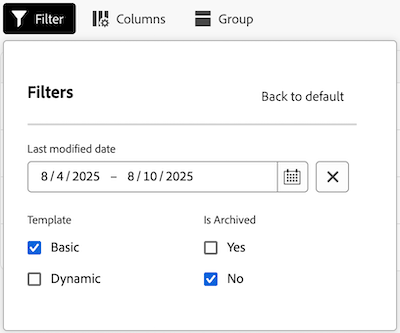

# Verwalten der Pinnwand-Administratoransicht

Die Admin-Ansicht der Pinnwände enthält eine Liste aller Pinnwände in Ihrem Konto, die Systemadministratoren verwenden können, um einen schnellen Überblick über die gesamten Pinnwand-Details zu erhalten, einschließlich des Zeitpunkts der letzten Aktualisierung, der Anzahl der Karten, die jede Karte hat, und mehr.

In diesem Bereich können Sie die folgenden Aktionen ausführen:

* Pinnwand-Liste filtern
* Pinnwand-Listenspalten konfigurieren
* Boards gruppieren

## Zugriffsanforderungen

+++ Erweitern Sie , um die Zugriffsanforderungen anzuzeigen.

<table style="table-layout:auto"> 
 <col> 
 </col> 
 <col> 
 </col> 
 <tbody> 
  <tr> 
   <td role="rowheader">Adobe Workfront-Plan</td> 
   <td> 
Beliebig
 </td> 
  </tr> 
  <tr> 
   <td role="rowheader">Adobe Workfront-Lizenz</td> 
   <td> 
Mitwirkender oder höher 

        
 Anfrage oder höher 
</td> 
  </tr> 
 </tbody> 
</table>

Weitere Informationen zu den Informationen in dieser Tabelle finden Sie unter [Zugriffsanforderungen in der Dokumentation zu Workfront](/help/quicksilver/administration-and-setup/add-users/access-levels-and-object-permissions/access-level-requirements-in-documentation.md).

+++

## Voraussetzungen

Sie müssen eine Pinnwand erstellen, bevor Sie sie in der Administratoransicht anzeigen können.

Weitere Informationen finden Sie unter [Erstellen oder Bearbeiten einer Pinnwand](/help/quicksilver/agile/get-started-with-boards/create-edit-board.md).

## Pinnwand-Liste filtern

{{step1-to-boards}}

1. Wählen Sie auf **Seite** Pinnwände **die Registerkarte Admin-** aus.

1. Wählen Sie **Filter** aus. Das Bedienfeld **Filter** wird geöffnet.

1. Gehen Sie wie folgt vor, um den Filter zu konfigurieren:

   1. (Optional) Klicken Sie auf das **Kalender**-Symbol  und wählen Sie dann einen Datumsbereich aus, um nach Pinnwänden zu filtern, die innerhalb dieses Zeitraums zuletzt geändert wurden.

   1. (Optional) Wählen Sie im **Vorlage** den Typ der Pinnwand-Vorlage aus, nach der die Liste filtern soll. Sie können mehrere Vorlagentypen auswählen.
Weitere Informationen zu Pinnwand-Vorlagentypen finden Sie unter [Erstellen oder Bearbeiten einer Pinnwand](/help/quicksilver/agile/get-started-with-boards/create-edit-board.md).

   1. (Optional) Wählen Sie im Abschnitt **Ist archiviert** aus, ob archivierte oder nicht archivierte Pinnwände angezeigt werden sollen. Sie können mehrere Optionen auswählen.

      

1. Klicken Sie außerhalb des Bedienfelds **Filter**, um es zu schließen. Ihre Filterauswahlen bleiben auf die Pinnwand-Liste angewendet, bis sie wieder in die Standardansicht geändert wird.

   >[!NOTE]
   >
   >Um einen Filter zu entfernen, öffnen Sie das Bedienfeld **Filter** und klicken **oben rechts auf** Zurück zur Standardeinstellung“.

## Pinnwand-Listenspalten konfigurieren

{{step1-to-boards}}

1. Wählen Sie auf **Seite** Pinnwände **die Registerkarte Admin-** aus.

1. Wählen Sie **Spalten** aus. Das Bedienfeld **Sichtbarkeit und Reihenfolge** wird geöffnet.

1. Sie können konfigurieren, welche Spalten in der Liste Pinnwände angezeigt werden, indem Sie den Umschalter für jede Spalte inline auswählen oder deaktivieren:

   * **Besitzer bzw. Besitzerin**
   * **Zuletzt aktualisiert**
   * **Mitglieder**
   * **Archiviert**
   * **Vorlage**
   * **Kartenanzahl**

1. (Optional) Um die Reihenfolge der Felder anzupassen, klicken Sie auf das Symbol **Ziehen** auf der linken Seite eines Felds und ziehen Sie es an eine neue Position.

   

1. Klicken Sie außerhalb des Bedienfelds **Sichtbarkeit und Reihenfolge**, um es zu schließen. Die Spaltenkonfigurationen bleiben auf die Pinnwand-Liste angewendet, bis sie geändert werden.

   >[!NOTE]
   >
   > Wenn die Spalten der Pinnwand-Liste geändert werden, wird ein blauer Punkt über dem Symbol **Spalten** angezeigt, um anzugeben, dass die aktuelle Ansicht von der Standardansicht geändert wurde.

## Pinnwand-Liste nach einem bestimmten Feld gruppieren

{{step1-to-boards}}

1. Wählen Sie auf **Seite** Pinnwände **die Registerkarte Admin-** aus.

1. Wählen Sie **Gruppe** aus. Das Bedienfeld **Gruppieren nach** wird geöffnet.

1. Wählen Sie das Feld aus, nach dem Sie die Pinnwand-Liste gruppieren möchten:

   * **Archiviert**
   * **Besitzer bzw. Besitzerin**
   * **Vorlage**

1. (Optional) Um die Gruppierung im Bedienfeld **Gruppieren nach“ zu erweitern oder**, klicken Sie auf **Alle** oder **Alle erweitern**.

   

1. (Optional) Um die Anzeigereihenfolge der Gruppierung von A-Z in Z-A zu ändern, wählen Sie das Feld aus, nach dem die Liste derzeit gruppiert ist, und wählen Sie dann **Z-A** aus der Dropdownliste aus.

   

1. Klicken Sie außerhalb des Bedienfelds **Gruppieren nach**, um es zu schließen. Von hier aus können Sie die angewendete Gruppierung in der Liste reduzieren oder erweitern, indem Sie den Pfeil neben dem Gruppierungstitel auswählen.

   

   >[!NOTE]
   >   
   >Wenn die Gruppierungsliste der Pinnwände geändert wird, wird ein blauer Punkt über dem Symbol **Gruppe** angezeigt, um anzugeben, dass die aktuelle Ansicht von der Standardansicht abweicht.  
   >Wenn Sie eine Gruppierung entfernen möchten, öffnen Sie das Bedienfeld **Gruppieren nach** und wählen **Alle löschen** in der oberen rechten Ecke aus.
