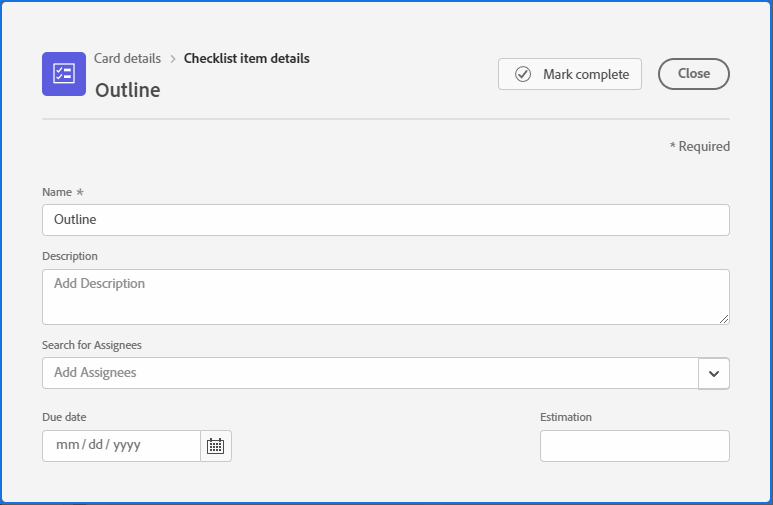
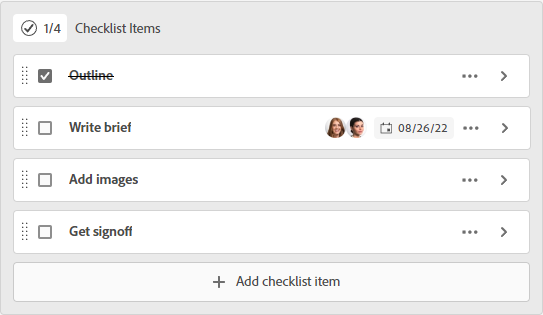

# Verwalten von Checklistenelementen auf Karten

Wenn Sie eine Checkliste auf einer Karte verwenden, können Sie Ihre Arbeit in kleinere Schritte unterteilen oder Notizen zur Karte hinzufügen. Checklisten-Elemente sind sowohl auf Ad-hoc- als auch auf verbundenen Karten verfügbar.

Informationen zu Karten finden Sie [Hinzufügen einer Ad-hoc-Karte zu einer Pinnwand](/help/quicksilver/agile/get-started-with-boards/add-card-to-board.md), [Verwenden von verbundenen Karten auf ](/help/quicksilver/agile/get-started-with-boards/connected-cards.md) und [Verwalten von Karten](/help/quicksilver/agile/get-started-with-boards/move-board-items.md).

## Zugriffsanforderungen

+++ Erweitern, um die Zugriffsanforderungen für die in diesem Artikel beschriebene Funktionalität anzuzeigen.

<table style="table-layout:auto"> 
 <col> 
 <col> 
 <tbody> 
  <tr> 
   <td role="rowheader">Adobe Workfront-Paket</td> 
   <td> 
Beliebig
 </td> 
  </tr> 
  <tr> 
   <td role="rowheader">Adobe Workfront-Lizenz</td> 
   <td> 
   
Mitwirkende oder höher
 
   
Anfragende oder höher

   </td> 
  </tr> 
 </tbody> 
</table>

Weitere Informationen finden Sie unter [Zugriffsanforderungen in der Dokumentation zu Workfront](/help/quicksilver/administration-and-setup/add-users/access-levels-and-object-permissions/access-level-requirements-in-documentation.md).

+++

## Hinzufügen einer Checkliste zu einer Karte

{{step1-to-boards}}

1. Zugriff auf eine Pinnwand. Weitere Informationen finden Sie unter [Erstellen oder Bearbeiten einer Pinnwand](../../agile/get-started-with-boards/create-edit-board.md).
1. Klicken Sie auf die Karte, um das Feld [!UICONTROL Kartendetails] zu öffnen.

   ODER

   Klicken Sie auf das **[!UICONTROL Mehr]**-Menü  auf der Karte und wählen Sie **[!UICONTROL Bearbeiten]**.

1. Um ein neues Element hinzuzufügen, klicken Sie auf **[!UICONTROL Checklisten-Element hinzufügen]**. Geben Sie dann den Titel des Elements ein und drücken Sie die Eingabetaste. Ein weiteres Element wird automatisch hinzugefügt. Fahren Sie mit der Eingabe von Titeln fort, um weitere Elemente hinzuzufügen.

   Der Zähler oben in der Checkliste zeigt die Anzahl der abgeschlossenen Elemente und die Gesamtzahl der Elemente an.

1. Klicken Sie , um das Feld [!UICONTROL Details zum Checklistenelement] zu öffnen.

   

1. (Optional) Fügen Sie eine Beschreibung, Verantwortliche, ein Fälligkeitsdatum und geschätzte Stunden für das Checklisten-Element hinzu.

   Informationen zu diesen Feldern finden Sie unter [Hinzufügen einer Ad-hoc-Karte zu einer Pinnwand](/help/quicksilver/agile/get-started-with-boards/add-card-to-board.md) oder [Verwenden von verbundenen Karten auf Pinnwänden](/help/quicksilver/agile/get-started-with-boards/connected-cards.md).

1. Klicken Sie **[!UICONTROL Schließen]**, um zu den Kartendetails und der vollständigen Liste der Checklisten-Elemente zurückzukehren.

   Die Verantwortlichen und das Fälligkeitsdatum werden im Element angezeigt.

1. Um ein Element zu kopieren, klicken Sie auf das **[!UICONTROL Mehr]** Menü  auf dem Element und wählen Sie **[!UICONTROL Kopieren]**.
1. Um ein Checklisten-Element zu löschen, klicken Sie auf das **[!UICONTROL Mehr]** Menü  auf das Element und wählen Sie **[!UICONTROL Löschen]**.

## Checklisten-Elemente abschließen

1. Rufen Sie die Pinnwand auf und suchen Sie die Karte, auf der die Checkliste steht.
1. Klicken Sie auf die Karte, um das Feld [!UICONTROL Kartendetails] zu öffnen.

   ODER

   Klicken Sie auf das **[!UICONTROL Mehr]**-Menü  auf der Karte und wählen Sie **[!UICONTROL Bearbeiten]**.

1. Aktivieren Sie das Kontrollkästchen neben dem Element, das abgeschlossen ist.

   Der Zähler wird aktualisiert und zeigt die abgeschlossenen Elemente an.

   Sie können das Kontrollkästchen deaktivieren, wenn Sie das Element wieder zur Liste hinzufügen müssen.

   

1. Klicken Sie auf **[!UICONTROL Schließen]**, um zur Pinnwand zurückzukehren.

   Der Zähler auf der Karte wird ebenfalls aktualisiert.
