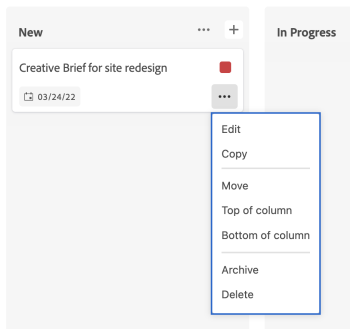

# Karten verwalten

Sie können eine Karte in eine beliebige Spalte auf der Pinnwand verschieben oder eine Karte kopieren.

Wenn Sie Spaltenrichtlinien zum Aktualisieren von Feldwerten aktiviert haben, können der Status, die Verantwortlichen und Tags automatisch aktualisiert werden, wenn Sie eine Karte von einer Spalte in eine andere verschieben. Weitere Informationen finden Sie unter „Definieren von Spalteneinstellungen und Richtlinien“ im Artikel [Verwalten von &#x200B;](/help/quicksilver/agile/get-started-with-boards/manage-board-columns.md)&quot;.

>[!NOTE]
>
>Es ist nicht möglich, eine Karte von einer Pinnwand auf eine andere zu verschieben.

## Zugriffsanforderungen

+++ Erweitern Sie , um die Zugriffsanforderungen für die -Funktion in diesem Artikel anzuzeigen.

Sie müssen über folgenden Zugriff verfügen, um die Schritte in diesem Artikel ausführen zu können:

<table style="table-layout:auto"> 
 <col> 
 <col> 
 <tbody> 
  <tr> 
   <td role="rowheader">[!DNL Adobe Workfront]</td> 
   <td> 
Beliebig
 </td> 
  </tr> 
  <tr> 
   <td role="rowheader">[!DNL Adobe Workfront] Lizenz</td> 
   <td> 
   
Neu: [!UICONTROL Contributor] oder höher
 
   
oder

   
Aktuell: [!UICONTROL -Anfrage] oder höher

   </td> 
  </tr> 
 </tbody> 
</table>

Weitere Informationen zu den Informationen in dieser Tabelle finden Sie unter [Zugriffsanforderungen in der Dokumentation zu Workfront](/help/quicksilver/administration-and-setup/add-users/access-levels-and-object-permissions/access-level-requirements-in-documentation.md).

+++

## Karten zwischen Spalten verschieben

{{step1-to-boards}}

1. Zugriff auf eine Pinnwand. Weitere Informationen finden Sie unter [Erstellen oder Bearbeiten einer Pinnwand](../../agile/get-started-with-boards/create-edit-board.md).
1. Ziehen Sie die Karte in eine andere Spalte an der Position, an der sie angezeigt werden soll.

   Oder

   Klicken Sie auf das **[!UICONTROL Mehr]**-Menü  auf der Karte und wählen Sie **[!UICONTROL Verschieben]**. Wählen Sie dann im Feld **[!UICONTROL Element verschieben]** eine andere Spalte aus und klicken Sie auf **[!UICONTROL Verschieben]**.

   

   >[!NOTE]
   >
   >Wenn Sie das Feld **[!UICONTROL Element verschieben]** verwenden, wird die Karte immer an den Anfang der Spalte verschoben.

## Karten nach oben oder unten in einer Spalte verschieben

1. Rufen Sie die Pinnwand auf.
1. Ziehen Sie die Karte per Drag-and-Drop an die Position, an der sie in der Spalte erscheinen soll.

   Oder

   Klicken Sie auf das **[!UICONTROL Mehr]** Menü  auf der Karte und wählen Sie **[!UICONTROL Spaltenanfang]** oder **[!UICONTROL Spaltenende]**.

   

## Kopieren einer Karte

Beim Kopieren einer Ad-hoc-Karte werden alle Felder auf der Karte einschließlich der Checklisten-Elemente dupliziert.

>[!NOTE]
>
>Man kann keine verbundenen Karten kopieren.

1. Rufen Sie die Pinnwand auf.
1. Klicken Sie auf das **[!UICONTROL Mehr]**-Menü ![[!UICONTROL Mehr]](assets/more-icon-spectrum.png) auf der Karte und wählen Sie **[!UICONTROL Kopieren]**.

   

   In derselben Spalte wird eine neue Karte mit dem Titel „Kopie von - [ursprünglicher Kartenname“ ].
