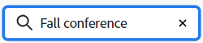

# Verwenden des Dashboards-Dashboards

Das Dashboard der Pinnwände zeigt die Liste der Pinnwände und Sammlungen an, auf die Sie Zugriff haben, einschließlich der Pinnwände, die Sie erstellt haben, und der Pinnwände, denen Sie hinzugefügt wurden. Zuerst werden einzelne Pinnwände angezeigt, auf die Sie Zugriff haben und die nicht Teil einer Sammlung sind.

>[!NOTE]
>
>Sammlungen sind nur über die frühe Funktion verfügbar. [!DNL Workfront] [!UICONTROL Pinnwände].

Im Dashboard haben Sie folgende Möglichkeiten für Pinnwände und Sammlungen:

* Pinnwand archivieren (Sammlungen können nicht archiviert werden)
* Pinnwandliste filtern
* Sortieren Sie die Pinnwandliste nach Pinnwandnamen oder Änderungsdatum.
* Suchen nach einer Pinnwand oder Sammlung
* Pinnwand oder Sammlung löschen

Informationen zum Erstellen einer neuen Pinnwand oder Bearbeiten einer vorhandenen Pinnwand finden Sie unter [Pinnwand erstellen oder bearbeiten](../../agile/get-started-with-boards/create-edit-board.md). Informationen zum Erstellen einer neuen Sammlung finden Sie unter [Verwalten von Sammlungen](/help/quicksilver/agile/use-boards-agile-planning-tools/manage-collections.md).

## Zugriffsanforderungen

Sie müssen über folgenden Zugriff verfügen, um die Schritte in diesem Artikel ausführen zu können:

<table style="table-layout:auto"> 
 <col> 
 <col> 
 <tbody> 
  <tr> 
   <td role="rowheader"><strong>[!DNL Adobe Workfront] Plan*</strong></td> 
   <td> 
Beliebig
 </td> 
  </tr> 
  <tr> 
   <td role="rowheader"><strong>[!DNL Adobe Workfront] license*</strong></td> 
   <td> 
[!UICONTROL Anforderung] oder höher
 </td> 
  </tr> 
 </tbody> 
</table>

&#42;Wenden Sie sich an Ihren [!DNL Workfront] Administrator.

## Filterboards {#filter-boards}

Sie können das Dashboard der Pinnwände filtern, um aktive Pinnwände, archivierte Pinnwände oder alle Pinnwände anzuzeigen.

1. Klicken Sie auf **[!UICONTROL Hauptmenü]** icon  in der oberen rechten Ecke von [!DNL Adobe Workfront]Klicken Sie auf **[!UICONTROL Pinnwände]**.
1. Klicken [!UICONTROL **Filter**] und wählen Sie **[!UICONTROL Alle]**, **[!UICONTROL Aktive Pinnwände]** oder **[!UICONTROL Archivierte Pinnwände]**.

   Wenn ein anderer als der standardmäßige Filter auf das Dashboard angewendet wird, wird auf dem Filtersymbol ein Indikator angezeigt ![[!UICONTROL Filter angewendet auf] Dashboard](assets/boards-filterapplied-30x30.png).

## Pinnwände

1. Klicken Sie auf **[!UICONTROL Hauptmenü]** icon  in der oberen rechten Ecke von [!DNL Adobe Workfront]Klicken Sie auf **[!UICONTROL Pinnwände]**.
1. Um die Liste der Pinnwände zu sortieren, klicken Sie auf [!UICONTROL **Sortieren**]. Die standardmäßige Sortieroption für die Seite ist nach **[!UICONTROL Datum geändert]**. Sie können die Seite auch nach Pinnwand sortieren **[!UICONTROL Name]**.

   Auswählen **[!UICONTROL Rückwärtsreihenfolge]** , um die Pinnwände in umgekehrter Reihenfolge der geänderten Daten oder des Namens zu sortieren. Wenn der Pfeil auf dem Sortiersymbol nach oben zeigt, wird die umgekehrte Reihenfolge angewendet. Wenn der Pfeil nach unten zeigt, wird die Standardreihenfolge angewendet.

   Wenn eine andere Sortierung als die Standardsortierung auf das Dashboard angewendet wird, wird auf dem Sortiersymbol ein Indikator angezeigt .

## Suchen nach einer Pinnwand oder Sammlung

Sie können im Bereich &quot;Pinnwände&quot;nach einer bestimmten Pinnwand suchen oder im Bereich &quot;Sammlungen&quot;nach einer bestimmten Sammlung suchen.

1. Klicken Sie auf **[!UICONTROL Hauptmenü]** icon  in der oberen rechten Ecke von [!DNL Adobe Workfront]Klicken Sie auf **[!UICONTROL Pinnwände]**.
1. Klicken [!UICONTROL **Suche**] und geben Sie einen Suchbegriff ein. Drücken Sie dann die Eingabetaste.

   Alle Pinnwände, die den Suchbegriff im Titel enthalten, werden angezeigt.

   Klicken Sie auf das X, um die Suche zu löschen.

   

## Pinnwand archivieren

Durch die Archivierung wird eine Pinnwand an das Archiv gesendet und Sie können sie später wiederherstellen.

>[!NOTE]
>
>Wenn Sie eine Pinnwand archivieren, wird sie für alle Mitglieder der Pinnwand archiviert.

1. Klicken Sie auf **[!UICONTROL Hauptmenü]** icon  in der oberen rechten Ecke von [!DNL Adobe Workfront]Klicken Sie auf **[!UICONTROL Pinnwände]**.
1. Klicken Sie auf **[!UICONTROL Mehr]** Menü  auf der Pinnwand und wählen Sie **[!UICONTROL Archivieren]**.

   Ein [!UICONTROL Archivieren] icon  auf der Pinnwand angezeigt. Sie können keine archivierte Pinnwand bearbeiten.

   Archivierte Pinnwände werden im Dashboard der Pinnwände ausgeblendet, es sei denn, Sie wenden einen Filter an, um sie anzuzeigen. Weitere Informationen finden Sie unter [[!UICONTROL Filterboards]](#filter-boards) in diesem Artikel.

1. Um eine archivierte Pinnwand wiederherzustellen, klicken Sie auf die Schaltfläche **[!UICONTROL Mehr]** Menü  auf der Pinnwand und wählen Sie **[!UICONTROL Wiederherstellen]**.

## Löschen einer Pinnwand oder Sammlung

Wenn Sie eine Pinnwand löschen, wird sie dauerhaft aus [!DNL Workfront] und nicht wiederhergestellt werden können. Alle Karten auf der Pinnwand werden ebenfalls zusammen mit der Pinnwand gelöscht.

Durch Löschen einer Sammlung werden alle Pinnwände in der Sammlung gelöscht.

>[!NOTE]
>
>Sie können nur von Ihnen erstellte Pinnwände und Sammlungen löschen, nicht aber Pinnwände und Sammlungen, denen Sie hinzugefügt wurden.

1. Klicken Sie auf **[!UICONTROL Hauptmenü]** icon  in der oberen rechten Ecke von [!DNL Adobe Workfront]Klicken Sie auf **[!UICONTROL Pinnwände]**.
1. Klicken Sie auf **[!UICONTROL Mehr]** Menü ![[!UICONTROL Mehr Menü]](assets/more-icon-spectrum.png) in der Pinnwand oder Sammlung und wählen Sie **[!UICONTROL Löschen]**.

   In einer Sammlung befindet sich das Menü rechts neben dem [!UICONTROL **Sammlung anzeigen**] Schaltfläche.

1. Klicken **[!UICONTROL Pinnwand löschen]** oder [!UICONTROL **Sammlung löschen**] in der Bestätigungsnachricht angezeigt.

## Verschieben einer Pinnwand in eine Sammlung

Sie können eine eigenständige Pinnwand in eine Sammlung verschieben oder eine Pinnwand von einer Sammlung in eine andere Sammlung verschieben.

>[!NOTE]
>
>Sie können nur von Ihnen erstellte Pinnwände verschieben, nicht Pinnwände, zu denen Sie hinzugefügt wurden.

1. Klicken Sie auf **[!UICONTROL Hauptmenü]** icon  in der oberen rechten Ecke von [!DNL Adobe Workfront]Klicken Sie auf **[!UICONTROL Pinnwände]**.
1. Klicken Sie auf **[!UICONTROL Mehr]** Menü ![[!UICONTROL Mehr Menü]](assets/more-icon-spectrum.png) auf der Pinnwand und wählen Sie [!UICONTROL **Zu Sammlung wechseln**].
1. Wählen Sie die Sammlung aus, der die Pinnwand hinzugefügt werden soll, und klicken Sie auf [!UICONTROL **Verschieben**].

   Die Pinnwand wird in die Sammlung verschoben und nicht mehr im [!UICONTROL Pinnwände] Bereich.
Wenn Sie noch keine Sammlung erstellt haben, werden Sie aufgefordert, eine zu erstellen, in die die Pinnwand verschoben werden soll.
