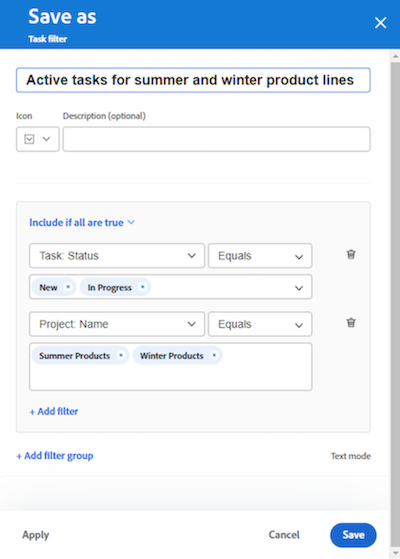

# Hinzufügen einer Aufnahmespalte zu einer Pinnwand

<!-- Audited: 5/2025 -->

Sie können Ihrer Pinnwand optional eine Aufnahmespalte hinzufügen, mit der Aufgaben und Probleme automatisch als verbundene Karten abgerufen werden, wenn sie basierend auf von Ihnen definierten Filtern [!DNL Workfront] hinzugefügt werden. Die Aufnahmespalte kann als Rückstandsspalte für ein Kanban-Team, als Aufnahmeposition für ein Support-Team dienen, um Probleme beim Hinzufügen zu einer Anfrage-Warteschlange oder für einen anderen von Ihnen benötigten Zweck anzuzeigen.

Auf einer Pinnwand ist nur eine Aufnahmespalte zulässig, die immer als Spalte ganz links angezeigt wird.

Die Aufnahmespalte ist auf einer dynamischen Pinnwand nicht verfügbar. Sie können jedoch die Filter aktualisieren, die definieren, welche Karten auf eine dynamische Pinnwand gebracht werden. Wenn Sie diese Filter auf einer dynamischen Pinnwand ändern, werden Karteneinstellungen, die nicht Teil der Aufgabe oder des Problems von Workfront sind (z. B. Tags), zurückgesetzt.

>[!NOTE]
>
>Aus Sicherheitsgründen können nur Pinnwandbesitzende die Pinnwandfilter im Panel „Konfigurieren“ ändern.

Die Aufnahmespalte ist auf 300 Aufgaben und 300 Probleme beschränkt. Die Standardreihenfolge der Elemente in der Aufnahmespalte lautet wie folgt:

Aufgaben:

* Primäre Reihenfolge: Projektname
* Sekundäre Reihenfolge: Struktur zur Aufschlüsselung des Arbeitsaufwands

Probleme:

* Primäre Reihenfolge: Projektname
* Sekundäre Reihenfolge: Referenznummer

>[!IMPORTANT]
>
>Es wird empfohlen, die Pinnwand häufig zu aktualisieren, wenn mehrere Benutzer gleichzeitig auf der Pinnwand arbeiten. Durch Aktualisieren der Seite bleiben die visuellen Änderungen auf der Pinnwand auf dem neuesten Stand und Probleme wie das Verschieben doppelter Karten aus der Aufnahmespalte auf der Pinnwand werden verhindert.
>
>Um eine Synchronisierung mit Workfront durchzuführen und neue Aufgaben und Probleme auf der Pinnwand oder der Aufnahmespalte zu beheben, klicken Sie auf das Menü Mehr ![[!UICONTROL Mehr Menü]](assets/more-menu.png) neben dem Namen der Pinnwand und wählen Sie Verbundene Elemente synchronisieren.

Weitere Informationen zu Spalten finden Sie unter [Verwalten von ](/help/quicksilver/agile/get-started-with-boards/manage-board-columns.md)). Informationen zu verbundenen Karten finden Sie unter [Verwenden von verbundenen Karten auf Karten](/help/quicksilver/agile/get-started-with-boards/connected-cards.md).

## Zugriffsanforderungen

+++ Erweitern Sie , um die Zugriffsanforderungen für die -Funktion in diesem Artikel anzuzeigen.

<table style="table-layout:auto"> 
 <col> 
 <col> 
 <tbody> 
  <tr> 
   <td role="rowheader">Adobe Workfront-Paket</td> 
   <td> 
Beliebig
 </td> 
  </tr> 
  <tr> 
   <td role="rowheader">Adobe Workfront-Lizenz</td> 
   <td> 
   
Mitwirkender oder höher
 
   
Anfrage oder höher

   </td> 
  </tr> 
 </tbody> 
</table>

Weitere Informationen zu den Informationen in dieser Tabelle finden Sie unter [Zugriffsanforderungen in der Dokumentation zu Workfront](/help/quicksilver/administration-and-setup/add-users/access-levels-and-object-permissions/access-level-requirements-in-documentation.md).

+++

## Erstellen einer Aufnahmespalte mit einfachen Filtern

{{step1-to-boards}}

1. Wählen Sie im Dashboard ein Board aus.
1. Klicken Sie **rechts auf** Pinnwand auf „Konfigurieren“, um das Bedienfeld &quot;**&quot;** öffnen.
1. Wählen Sie den **Board** aus. Neue Felder werden angezeigt.
1. Aktivieren Sie **Elemente dynamisch in die Pinnwand aufnehmen**. Die leere Aufnahmespalte wird auf der linken Seite der Pinnwand angezeigt.

   

1. (Optional) Suchen Sie nach und wählen Sie [!DNL Workfront]Projekte [!UICONTROL **aus**].
1. (Optional) Suchen Sie nach einem Benutzer oder einem Team und wählen Sie [!UICONTROL **Arbeitsaufträge**] aus.
1. Klicken Sie **Apply**. Die Objekte werden in der Aufnahmespalte der Pinnwand als verbundene Karten angezeigt.

   

## Erstellen einer Aufnahmespalte mit erweiterten Filtern

{{step1-to-boards}}

1. Wählen Sie im Dashboard ein Board aus.
1. Klicken Sie **rechts auf** Pinnwand auf „Konfigurieren“, um das Bedienfeld &quot;**&quot;** öffnen.
1. Wählen Sie den **Board** aus. Neue Felder werden angezeigt.
1. Aktivieren Sie **Elemente dynamisch in die Pinnwand aufnehmen**. Die leere Aufnahmespalte wird auf der linken Seite der Pinnwand angezeigt.

1. Klicken Sie [!UICONTROL **Erweiterte Filter verwenden**].

1. Klicken Sie **[!UICONTROL Filterquellen hinzufügen]** und wählen Sie dann **[!UICONTROL Aufgaben]** oder **[!UICONTROL Probleme]** aus.

   

   >[!NOTE]
   >
   >Sie können die Aufnahmespalte so filtern, dass sowohl Aufgaben als auch Probleme einbezogen werden. Sie müssen die Filter jedoch für jeden Objekttyp separat einrichten.
   >
   >Darüber hinaus stehen gespeicherte Filter und Systemstandardfilter zur Auswahl zur Verfügung.

1. Klicken Sie im Filterbedienfeld auf &quot;**[!UICONTROL Filter]**.

1. Erstellen Sie Ihren Filter und klicken Sie dann auf **[!UICONTROL Als neu speichern]**.

   

   Das obige Beispiel zeigt einen Filter für Aufgaben aus einem bestimmten Projekt mit dem Status [!UICONTROL Neu] oder [!UICONTROL In Bearbeitung].

   >[!NOTE]
   >
   >Es wird empfohlen, den Platzhalter „Ich“ (angemeldeter Benutzer) nicht in einem Pinnwand-Filter zu verwenden, da nicht garantiert ist, dass für den angemeldeten Benutzer immer Aufgaben oder Probleme angezeigt werden. Nachdem die Pinnwand mit den richtigen Aufgaben und Problemen eingerichtet wurde, können Sie die Pinnwand filtern, um Elemente für einen bestimmten Verantwortlichen anzuzeigen. Weitere Informationen finden Sie unter [Filtern und Suchen in einer Pinnwand](/help/quicksilver/agile/get-started-with-boards/filter-search-in-board.md).

   Weitere Informationen zum Erstellen eines Filters finden Sie im Abschnitt Erstellen oder Bearbeiten eines Filters im Standard Builder im Artikel [Erstellen oder Bearbeiten von Filtern in [!DNL Adobe Workfront]](/help/quicksilver/reports-and-dashboards/reports/reporting-elements/create-filters.md).

1. Benennen Sie den Filter und klicken Sie dann auf **[!UICONTROL Speichern]**. Der Filter wird in der Liste der gespeicherten Filter angezeigt und automatisch auf die Aufnahmespalte angewendet.

   

1. Klicken Sie auf das X oben im Filterbedienfeld, um es zu schließen.

1. (Optional) Um den Filter für andere freizugeben, bewegen Sie den Mauszeiger über den gespeicherten Filter, klicken Sie auf das Menü **[!UICONTROL Mehr]**  und wählen Sie **[!UICONTROL Freigeben]** aus. Wählen Sie die Benutzer oder Teams aus, die für freigegeben werden sollen, im Feld **Filterfreigabe**. Weitere Informationen finden Sie unter [Freigeben von Filtern, Ansichten oder Gruppierungen](/help/quicksilver/reports-and-dashboards/reports/reporting-elements/share-filter-view-grouping.md).
1. (Optional) Um sowohl Aufgaben als auch Probleme in der Aufnahmespalte aufzunehmen, klicken Sie auf **[!UICONTROL Quellen filtern]** und wählen Sie das andere Objekt aus, um einen weiteren Filter zu erstellen.
1. Wenn Sie alle Filter hinzugefügt haben, überprüfen Sie die Aufnahmespalte, um sicherzustellen, dass die richtigen Aufgaben und Probleme angezeigt werden.

   

   >[!NOTE]
   >
   >Sie können die Filter jederzeit aktualisieren, indem Sie den Bereich „Konfigurieren“ öffnen, auf **[!UICONTROL Quellen]** klicken und **[!UICONTROL Aufgaben]** oder **[!UICONTROL Probleme]** auswählen.

## Aufnahmespalte verwenden

Karten in der Aufnahmespalte können erst bearbeitet werden, wenn sie in andere Pinnwand-Spalten verschoben werden. Sie können auf die Karte klicken, um sie in einer schreibgeschützten Ansicht zu öffnen, oder auf , um die Aufgabe oder das Problem in einer neuen Browser-Registerkarte zu öffnen.

Sie können die Elemente in der Aufnahmespalte manuell neu anordnen.

Die Symbole oben rechts in der Aufnahmespalte geben an, wie viele Karten sich derzeit in der Spalte befinden und wie viele Filter angewendet werden.

1. (Optional) Um in der Aufnahmespalte nach einem Element zu suchen, klicken Sie auf  in der Spalte.
1. (Optional) Um eine Karte aus der Aufnahmespalte in eine andere Spalte zu verschieben, ziehen Sie die Karte per Drag-and-Drop an die Position, an der sie angezeigt werden soll.

   Oder

   Klicken Sie auf das **[!UICONTROL Mehr]** Menü  auf der Karte und wählen Sie **[!UICONTROL Verschieben]**. Wählen Sie dann im Feld **Verschieben [ITEM]** eine andere Spalte aus und klicken Sie auf **[!UICONTROL Move]**.

1. (Optional) Um die Aufnahmespalte zu löschen, klicken Sie auf das Menü **[!UICONTROL Mehr]**  und wählen Sie **[!UICONTROL Löschen]**.
