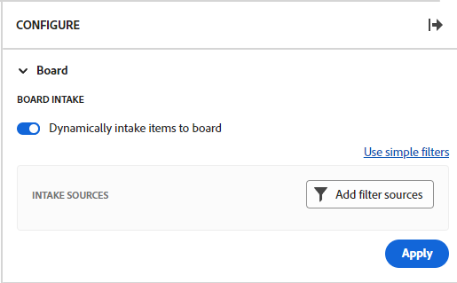

# Hinzufügen einer Aufnahmespalte zu einer Pinnwand

Sie können optional eine Aufnahmespalte zu Ihrer Pinnwand hinzufügen, die Aufgaben und Probleme automatisch als verbundene Karten einfügt, wenn sie in [!DNL Workfront] hinzugefügt werden, basierend auf von Ihnen definierten Filtern. Die Ansauspalte kann als Rückstau für ein Kanban-Team dienen, als Aufnahmeort für ein Support-Team, um Probleme zu sehen, wenn sie einer Anfragewarteschlange hinzugefügt werden, oder zu einem anderen Zweck, den Sie benötigen.

Auf einer Pinnwand ist nur eine Aufnahmespalte erlaubt, und sie erscheint immer als ganz links liegende Spalte.

Die Ansaugspalte ist auf einer dynamischen Pinnwand nicht verfügbar. Sie können jedoch die Filter aktualisieren, die festlegen, welche Karten auf eine dynamische Pinnwand gebracht werden. Wenn Sie diese Filter auf einer dynamischen Pinnwand ändern, werden Karteneinstellungen zurückgesetzt, die nicht Teil der Workfront-Aufgabe oder des Problems sind (z. B. Tags).

>[!NOTE]
>
>Aus Sicherheitsgründen können nur Pinnwandbesitzende die Pinnwandfilter im Panel „Konfigurieren“ ändern.

Die Ansauspalte ist auf 300 Aufgaben und 300 Probleme beschränkt. Die Standardreihenfolge der Elemente in der Ansaugluft-Spalte lautet wie folgt:

Aufgaben:

* Primäre Reihenfolge: Projektname
* Sekundäre Reihenfolge: Struktur für Auffächerung des Arbeitsaufwands

Probleme:

* Primäre Reihenfolge: Projektname
* Sekundäre Reihenfolge: Referenznummer

>[!IMPORTANT]
>
>Es wird empfohlen, die Pinnwand häufig zu aktualisieren, wenn mehrere Benutzer gleichzeitig auf der Pinnwand arbeiten. Das Aktualisieren der Seite hilft dabei, die visuellen Änderungen auf der Pinnwand auf dem neuesten Stand zu halten, und verhindert, dass Probleme wie doppelte Karten aus der Annahmespalte auf die Pinnwand verschoben werden.
>
>Um mit Workfront zu synchronisieren und neue Aufgaben und Probleme auf die Pinnwand oder die Ansauspalte zu übertragen, klicken Sie auf das Menü **[!UICONTROL Mehr]** Menü ![[!UICONTROL Mehr Menü]](assets/more-icon-spectrum.png) neben dem Pinnwandnamen und wählen Sie **[!UICONTROL Verknüpfte Elemente synchronisieren]**.

Weitere Informationen zu Spalten finden Sie unter [Pinnwandspalten verwalten](/help/quicksilver/agile/get-started-with-boards/manage-board-columns.md). Informationen zu verbundenen Karten finden Sie unter [Verwenden Sie verbundene Karten auf Pinnwänden](/help/quicksilver/agile/get-started-with-boards/connected-cards.md).

## Zugriffsanforderungen

+++ Erweitern Sie , um die Zugriffsanforderungen für die Funktionalität in diesem Artikel anzuzeigen.

Sie müssen über folgenden Zugriff verfügen, um die Schritte in diesem Artikel ausführen zu können:

<table style="table-layout:auto"> 
 <col> 
 <col> 
 <tbody> 
  <tr> 
   <td role="rowheader">[!DNL Adobe Workfront]</td> 
   <td> 
Alle
 </td> 
  </tr> 
  <tr> 
   <td role="rowheader">[!DNL Adobe Workfront] Lizenz</td> 
   <td> 
   
Neu: [!UICONTROL Contributor] oder höher
 
   
oder

   
Aktuell: [!UICONTROL Anforderung] oder höher

   </td> 
  </tr> 
 </tbody> 
</table>

Weitere Informationen zu den Informationen in dieser Tabelle finden Sie unter [Zugriffsanforderungen in der Workfront-Dokumentation](/help/quicksilver/administration-and-setup/add-users/access-levels-and-object-permissions/access-level-requirements-in-documentation.md).

+++

## Ansauspalte mit einfachen Filtern erstellen

{{step1-to-boards}}

1. Öffnen Sie eine Pinnwand. Weitere Informationen finden Sie unter [Erstellen oder Bearbeiten einer Pinnwand](../../agile/get-started-with-boards/create-edit-board.md).
1. Klicken Sie rechts auf der Pinnwand auf **[!UICONTROL Konfigurieren]** , um den Bereich &quot;Konfigurieren&quot;zu öffnen.
1. Erweitern Sie **[!UICONTROL Pinnwand]**.
1. Aktivieren Sie **[!UICONTROL Dynamische Aufnahme von Elementen an die Pinnwand]**.

   

   Die Ansaugspalte wird auf der linken Seite der Pinnwand hinzugefügt. Sie bleibt leer, bis Sie Filter darauf anwenden.

1. (Optional) Suchen Sie nach und wählen Sie [!DNL Workfront] [!UICONTROL **Projekte**] aus.
1. (Optional) Suchen Sie nach Benutzern oder Teams [!UICONTROL **Zuweisungen**] und wählen Sie sie aus.
1. Wählen Sie [!UICONTROL **Abgeschlossene Arbeit einschließen**] aus, um Aufgaben und Probleme mit dem Status &quot;Fertig stellen&quot;in der Annahmespalte anzuzeigen.

   >[!NOTE]
   >
   >Wenn diese Option nicht ausgewählt ist und Karten in anderen Status als vollständig markiert sind, werden sie auf der Pinnwand &quot;abfallen&quot;und nicht mehr angezeigt.

1. Klicken Sie auf [!UICONTROL **Anwenden**].

   Alle Objekte werden in der Spalte für die Aufnahme der Pinnwand als verbundene Karten angezeigt.

   

## Erstellen einer Annahmespalte mit erweiterten Filtern

{{step1-to-boards}}

1. Öffnen Sie eine Pinnwand. Weitere Informationen finden Sie unter [Erstellen oder Bearbeiten einer Pinnwand](../../agile/get-started-with-boards/create-edit-board.md).
1. Klicken Sie rechts auf der Pinnwand auf **[!UICONTROL Konfigurieren]** , um den Bereich &quot;Konfigurieren&quot;zu öffnen.
1. Erweitern Sie **[!UICONTROL Pinnwand]**.
1. Aktivieren Sie **[!UICONTROL Dynamische Aufnahme von Elementen an die Pinnwand]**.

   Die Ansaugspalte wird auf der linken Seite der Pinnwand hinzugefügt. Sie bleibt leer, bis Sie Filter darauf anwenden.

1. Klicken Sie auf [!UICONTROL **Erweiterte Filter verwenden**].
1. Klicken Sie auf **[!UICONTROL Filterquellen hinzufügen]** und wählen Sie **[!UICONTROL Aufgaben]** oder **[!UICONTROL Probleme]** aus.

   

   >[!NOTE]
   >
   >Sie können die Aufnahmespalte filtern, um sowohl Aufgaben als auch Probleme einzuschließen. Sie müssen die Filter jedoch für jeden Objekttyp separat einrichten.
   >
   >Außerdem können Sie gespeicherte Filter und Systemstandardfilter auswählen.

1. Klicken Sie im Filterbereich auf **[!UICONTROL Neuer Filter]** , um zu beginnen.

   

1. Erstellen Sie Ihren Filter und klicken Sie auf **[!UICONTROL Als neu speichern]**.

   

   Dieses Beispiel zeigt einen Filter für Aufgaben eines bestimmten Projekts, die sich im Status &quot;[!UICONTROL Neu]&quot;oder &quot;[!UICONTROL In Bearbeitung]&quot; befinden.

   >[!NOTE]
   >
   >Es wird empfohlen, den Platzhalter &quot;Me&quot;(angemeldeter Benutzer) nicht in einem Pinnwandfilter zu verwenden, da nicht garantiert ist, dass immer Aufgaben oder Probleme für den angemeldeten Benutzer angezeigt werden. Nachdem die Pinnwand mit den richtigen Aufgaben und Problemen eingerichtet wurde, können Sie die Pinnwand filtern, um Elemente für einen bestimmten Bevollmächtigten anzuzeigen. Weitere Informationen finden Sie unter [Filtern und Suchen in einer Pinnwand](/help/quicksilver/agile/get-started-with-boards/filter-search-in-board.md).

   Weitere Informationen zum Erstellen eines Filters finden Sie im Abschnitt &quot;Erstellen oder Bearbeiten eines Filters im Standard-Builder&quot;im Artikel [Erstellen oder Bearbeiten von Filtern in  [!DNL Adobe Workfront]](/help/quicksilver/reports-and-dashboards/reports/reporting-elements/create-filters.md).

1. Benennen Sie den Filter und klicken Sie auf **[!UICONTROL Speichern]**.

   

   Wenn Sie dem Filter einen eindeutigen Namen geben, können Sie später danach suchen.

1. Der Filter wird in der Liste der gespeicherten Filter angezeigt und automatisch auf die Ansauspalte angewendet. Klicken Sie auf das X oben im Filterbereich, um es zu schließen.

   

1. (Optional) Um den Filter für andere freizugeben, bewegen Sie den Mauszeiger über den gespeicherten Filter, klicken Sie auf das Menüsymbol **[!UICONTROL Mehr]** im Menü  und wählen Sie **[!UICONTROL Freigeben]** aus. Wählen Sie im Feld Freigabe filtern die Benutzer oder Teams aus, für die Sie eine Freigabe vornehmen möchten. Weitere Informationen finden Sie unter [Filter, Ansichten oder Gruppierungen freigeben](/help/quicksilver/reports-and-dashboards/reports/reporting-elements/share-filter-view-grouping.md).
1. (Optional) Um sowohl Aufgaben als auch Probleme in die Ansauspalte aufzunehmen, klicken Sie auf **[!UICONTROL Quellen filtern]** und wählen Sie das andere Objekt aus, um einen weiteren Filter zu erstellen.
1. Wenn Sie mit dem Hinzufügen von Filtern fertig sind, überprüfen Sie in der Spalte Aufnahme , ob die richtigen Aufgaben und Probleme angezeigt werden.

   

   >[!NOTE]
   >
   >Sie können die Filter jederzeit aktualisieren, indem Sie das Fenster &quot;Konfigurieren&quot;öffnen, auf **[!UICONTROL Quellen filtern]** klicken und **[!UICONTROL Aufgaben]** oder **[!UICONTROL Probleme]** auswählen.

## Annahmespalte verwenden

Die Karten in der Annahmespalte können erst bearbeitet werden, wenn Sie sie in andere Pinnwandspalten verschieben. Sie können auf die Karte klicken, um sie in einer schreibgeschützten Ansicht zu öffnen, oder auf  klicken, um die Aufgabe oder das Problem in einer neuen Browser-Registerkarte zu öffnen.

Sie können die Elemente in der Annahmespalte manuell neu anordnen.

Die Symbole oben rechts in der Aufnahmespalte zeigen an, wie viele Karten sich derzeit in der Spalte befinden und wie viele Filter angewendet werden.

1. (Optional) Klicken Sie zum Suchen nach einem Element in der Annahmespalte auf das Symbol  in der Spalte.
1. (Optional) Um eine Karte aus der Ansauspalte in eine andere Spalte zu verschieben, ziehen Sie die Karte an die gewünschte Position.

   Oder

   Klicken Sie auf das Menüsymbol **[!UICONTROL Mehr]** im Menü  auf der Karte und wählen Sie **[!UICONTROL Verschieben]** aus. Wählen Sie dann im Feld **[!UICONTROL Element verschieben]** eine weitere Spalte und dann **[!UICONTROL Verschieben]** aus.

1. (Optional) Klicken Sie zum Löschen der Annahmespalte auf das Menüsymbol **[!UICONTROL Mehr]** im Menü  und wählen Sie **[!UICONTROL Löschen]** aus.
