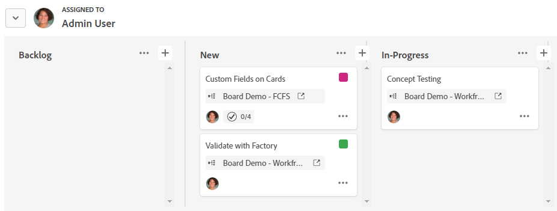

# Verwenden von Gruppen auf einer Pinnwand

Sie können Karten auf einer Pinnwand nach Verantwortlichem oder nach Tag gruppieren. Wenn Sie eine Option auswählen, nach der gruppiert werden soll, werden die Karten im SWMLANE-Format angezeigt. Nicht zugewiesene Karten oder Karten ohne Tags werden in ihrem eigenen Swimlane angezeigt.

>[!NOTE]
>
>Alle Karten in der Aufnahmespalte sind nicht in einer Gruppe enthalten, und die Aufnahmespalte wird ausgeblendet, wenn eine Gruppe angewendet wird. Weitere Informationen zur Aufnahmespalte finden Sie unter [Hinzufügen einer Aufnahmespalte zu einer Pinnwand](/help/quicksilver/agile/use-boards-agile-planning-tools/add-intake-column-to-board.md).

## Zugriffsanforderungen

+++ Erweitern Sie , um die Zugriffsanforderungen für die -Funktion in diesem Artikel anzuzeigen.

<table style="table-layout:auto"> 
 <col> 
 <col> 
 <tbody> 
  <tr> 
   <td role="rowheader">Adobe Workfront-Paket</td> 
   <td> 
Beliebig
 </td> 
  </tr> 
  <tr> 
   <td role="rowheader">Adobe Workfront-Lizenz</td> 
   <td> 
   
Mitwirkender oder höher
 
   
Anfrage oder höher

   </td> 
  </tr> 
 </tbody> 
</table>

Weitere Informationen zu den Informationen in dieser Tabelle finden Sie unter [Zugriffsanforderungen in der Dokumentation zu Workfront](/help/quicksilver/administration-and-setup/add-users/access-levels-and-object-permissions/access-level-requirements-in-documentation.md).

+++

## Gruppieren von Karten auf einer Pinnwand

{{step1-to-boards}}

1. Zugriff auf eine Pinnwand. Weitere Informationen finden Sie unter [Erstellen oder Bearbeiten einer Pinnwand](../../agile/get-started-with-boards/create-edit-board.md).
1. Klicken Sie **[!UICONTROL Gruppe]**, um das Bedienfeld „Gruppe“ auf der linken Seite der Pinnwand zu öffnen.

   >[!NOTE]
   >
   >Die Standardeinstellung zum Gruppieren nach ist **[!UICONTROL Keine]**. Sie können diese Option jederzeit auswählen, um eine Gruppe zu entfernen und nur die Spalten auf der Pinnwand anzuzeigen.

1. Um die Karten zu gruppieren, wählen Sie **[!UICONTROL Verantwortliche]** oder **[!UICONTROL Tags]** aus.

   Die Karten werden automatisch gruppiert. Klicken Sie auf den Pfeil neben dem Gruppennamen, um die Gruppe zu reduzieren und zu erweitern.

   

1. Auswählen, was passiert, wenn eine Karte in eine andere Gruppe verschoben wird.

   * **[!UICONTROL Bei Verantwortlichen hinzufügen]/[!UICONTROL Bei Tags hinzufügen]:** Die Verantwortlichen oder Tags in der neuen Gruppe werden der vorhandenen Liste der Verantwortlichen oder Tags auf der Karte hinzugefügt.
   * **[!UICONTROL Verantwortliche überschreiben]/[!UICONTROL Tags überschreiben]:** Die Verantwortlichen oder Tags in der neuen Gruppe überschreiben alle anderen Verantwortlichen oder Tags und werden die einzigen Verantwortlichen oder Tags auf der Karte.

   ![[!UICONTROL Gruppieren nach Optionen]](assets/group-by-rail.png)

1. Klicken Sie **[!UICONTROL Gruppen ausblenden]**, um das Gruppenbedienfeld auszublenden und die Vollpension anzuzeigen.
