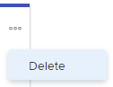

# Storys oder Probleme aus dem Kanban[!UICONTROL Board &#x200B;]

Sie können eine Story oder ein Problem aus dem Kanban[!UICONTROL Board &#x200B;]. Wenn Sie eine Story oder ein Problem löschen, wird diese für 30 Tage in den Papierkorb verschoben und kann nur vom Systemadministrator wiederhergestellt werden.

## Zugriffsanforderungen

+++ Erweitern, um die Zugriffsanforderungen für die in diesem Artikel beschriebene Funktionalität anzuzeigen.

<table style="table-layout:auto"> 
 <col> 
 </col> 
 <col> 
 </col> 
 <tbody> 
  <tr> 
   <td role="rowheader">Adobe Workfront-Paket</td> 
   <td> 
Beliebig
 </td> 
  </tr> 
  <tr> 
   <td role="rowheader">Adobe Workfront-Lizenz</td> 
   <td> 
Standard
 
   
Work oder höher
 </td> 
  </tr>
  <tr> 
   <td role="rowheader">Objektberechtigungen</td> 
   <td>Zugriff auf die Aufgabe oder das Problem verwalten </td> 
  </tr> 
 </tbody> 
</table>

Weitere Informationen finden Sie unter [Zugriffsanforderungen](/help/quicksilver/administration-and-setup/add-users/access-levels-and-object-permissions/access-level-requirements-in-documentation.md) in der Dokumentation zu Workfront.

+++

## Story oder Problem löschen

{{step1-to-team}}

1. (Optional) Klicken Sie auf das Symbol **[!UICONTROL Team wechseln]**  und wählen Sie dann entweder ein neues [!UICONTROL Kanban]-Team aus dem Dropdown-Menü aus oder suchen Sie in der Suchleiste nach einem Team.
1. Klicken Sie auf das **[!UICONTROL Mehr]**-Symbol in der Story oder dem Problem und wählen Sie **[!UICONTROL Löschen]**.

   

1. Klicken Sie in der Bestätigungsmeldung auf **[!UICONTROL Ja, löschen]**.
