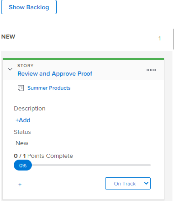

# Bearbeiten von Story-Informationen

## Informationen, welche Informationen angezeigt und bearbeitet werden können {#understand-what-information-can-be-viewed-and-edited}

Wenn Sie eine Story-Kachel auf dem [!UICONTROL Kanban]-Board anzeigen, sind die Informationen in der folgenden Tabelle verfügbar. Die meisten Informationen können direkt über die Story-Kachel inline bearbeitet werden.

<table style="table-layout:auto"> 
 <col> 
 <col> 
 <col> 
 <thead> 
  <tr> 
   <th><strong>Information</strong> </th> 
   <th><strong>sichtbar</strong> </th> 
   <th><strong>Bearbeitbar inline</strong> </th> 
  </tr> 
 </thead> 
 <tbody> 
  <tr> 
   <td>Der Name der Story mit einem Link direkt zur Aufgabe oder zum Problem</td> 
   <td>✓</td> 
   <td> </td> 
  </tr> 
  <tr> 
   <td> 
Der Projektname mit einem Link direkt zum Projekt
 </td> 
   <td>✓ </td> 
   <td> </td> 
  </tr> 
  <tr> 
   <td> 
Die Anzahl der Punkte oder Stunden bis zum Abschluss eines Storys und die Anzahl der Punkte oder Stunden bis zum Abschluss eines  . Diese Zahlen werden zur Berechnung und Anzeige des Prozentsatzes bis zum Abschluss eines Storys verwendet.
 </td> 
   <td>✓</td> 
   <td> </td> 
  </tr> 
  <tr> 
   <td> 
Der [!UICONTROL Prozent abgeschlossen] für jede Story und jedes Problem. [!UICONTROL Der Prozentsatz abgeschlossen] für die Iteration wird auf der Grundlage des [!UICONTROL Prozent abgeschlossen] für jede Story berechnet. 
 
Beim Aktualisieren von [!UICONTROL Prozent abgeschlossen] für eine Story oder ein Problem können Sie eine beliebige Zahl zwischen 0 und 100 auswählen.
 </td> 
   <td>✓</td> 
   <td>✓</td> 
  </tr> 
  <tr> 
   <td> 
Wem die Story zugewiesen ist
 </td> 
   <td>✓</td> 
   <td>✓</td> 
  </tr> 
  <tr> 
   <td> 
Die Farbe oder Kategorie der Kachel
 </td> 
   <td>✓</td> 
   <td>✓</td> 
  </tr> 
  <tr> 
   <td> 
Alle zusätzlichen Felder (einschließlich benutzerdefinierter Felder), die der Agile-Ansicht hinzugefügt wurden, indem die Agile-Ansicht geändert wurde, wie unter „Erstellen und Anpassen einer Agile-Ansicht“ in <a href="../../reports-and-dashboards/reports/reporting-elements/views-overview.md" class="MCXref xref">Überblick über Ansichten in [!DNL Adobe Workfront]</a> beschrieben
 </td> 
   <td>✓</td> 
   <td>✓</td> 
  </tr> 
 </tbody> 
</table>

## Zugriffsanforderungen

+++ Erweitern, um die Zugriffsanforderungen für die in diesem Artikel beschriebene Funktionalität anzuzeigen.

<table style="table-layout:auto"> 
 <col> 
 </col> 
 <col> 
 </col> 
 <tbody> 
  <tr> 
   <td role="rowheader">Adobe Workfront-Paket</td> 
   <td> 
Beliebig
 </td> 
  </tr> 
  <tr> 
   <td role="rowheader">Adobe Workfront-Lizenz</td> 
   <td> 
Standard
 
   
Work oder höher
 </td> 
  </tr>
 </tbody> 
</table>

Weitere Informationen finden Sie unter [Zugriffsanforderungen](/help/quicksilver/administration-and-setup/add-users/access-levels-and-object-permissions/access-level-requirements-in-documentation.md) in der Dokumentation zu Workfront.

+++

## Anzeigen und Bearbeiten von Informationen auf einer Story-Kachel

{{step1-to-team}}

1. (Optional) Klicken Sie auf das Symbol **[!UICONTROL Team wechseln]**  und wählen Sie dann entweder ein neues Kanban-Team aus dem Dropdown-Menü aus oder suchen Sie in der Suchleiste nach einem Team.

1. Zum Kanban[!UICONTROL Board &#x200B;].
1. Erweitern Sie die Kachel Story , um alle mit der Story verbundenen Felder anzuzeigen.

   

1. (Optional) Um ein Feld zu bearbeiten, klicken Sie auf das Feld und nehmen Sie dann Änderungen vor.
Sie müssen über [!UICONTROL Bearbeiten]-Rechte für die Aufgabe oder das Problem verfügen, um die Story-Kachel bearbeiten zu können.
Weitere Informationen zu den einzelnen Feldern und dazu, ob sie bearbeitet werden können, finden Sie unter [Informationen, die angezeigt und bearbeitet werden können](#understand-what-information-can-be-viewed-and-edited).

>[!NOTE]
>
>Um den [!UICONTROL Prozent abgeschlossen] zu ändern, müssen Sie eine Zahl zwischen 0 und 100 eingeben. Das Feld ist kein Schieberegler, den Sie verschieben können.
