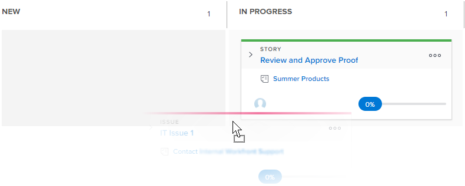

# Aktualisieren des Status von Storys auf dem Board [!UICONTROL Kanban]

Sie können den Status einer Story direkt vom [!UICONTROL Kanban]-Board aus ändern, um den Fortschritt der Stories widerzuspiegeln.

>[!NOTE]
>
>Nur im Abschnitt [!UICONTROL Story Board] im Bereich [!UICONTROL Team-Einstellungen] ausgewählte Status sind auf dem [!UICONTROL Kanban]-Board und im Status-Dropdown-Menü verfügbar. Weitere Informationen finden Sie unter [Kanban konfigurieren](../../agile/get-started-with-agile-in-workfront/configure-kanban.md).

## Zugriffsanforderungen

+++ Erweitern, um die Zugriffsanforderungen für die in diesem Artikel beschriebene Funktionalität anzuzeigen.

<table style="table-layout:auto"> 
 <col> 
 </col> 
 <col> 
 </col> 
 <tbody> 
  <tr> 
   <td role="rowheader">Adobe Workfront-Paket</td> 
   <td> 
Beliebig
 </td> 
  </tr> 
  <tr> 
   <td role="rowheader">Adobe Workfront-Lizenz</td> 
   <td> 
Standard
 
   
Work oder höher
 </td> 
  </tr>
 </tbody> 
</table>

Weitere Details zu den Informationen in dieser Tabelle finden Sie unter [Zugriffsanforderungen in der Dokumentation zu Workfront](/help/quicksilver/administration-and-setup/add-users/access-levels-and-object-permissions/access-level-requirements-in-documentation.md).

+++

## Aktualisieren des Status der Storys auf dem Kanban-Board

{{step1-to-team}}

1. (Optional) Klicken Sie auf das Symbol **[!UICONTROL Team wechseln]**  und wählen Sie dann entweder ein neues [!UICONTROL Kanban]-Team aus dem Dropdown-Menü aus oder suchen Sie in der Suchleiste nach einem Team.

1. Wechseln Sie zum Board [!UICONTROL Kanban], in dem Sie den Status eines Textabschnitts aktualisieren möchten.
1. Ziehen Sie einen Textabschnitt aus einer Statusspalte auf dem Board [!UICONTROL Kanban] und in eine andere Spalte.
Ein Textabschnitt verbleibt in der Spalte [!UICONTROL Vollständig] für zwei Wochen, nachdem er hinzugefügt wurde.
   
