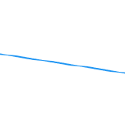
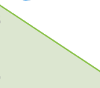
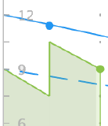

# Übersicht über die Agile-Burndown-Liste

Die Abbruchgrafik bietet eine visuelle Darstellung des Fortschritts von Geschichten während der Iteration. Die tatsächliche Abbruchrate wird mit der idealen Abbruchrate für die Iterationszeitleiste gemessen.

Das Diagramm passt sich je nach ausgewähltem Tag an. Der aktuelle Tag ist der Standardwert. Wenn ein vorheriger Tag ausgewählt wird, werden alle Daten in der Dropdownliste und alle Werte in der Variablen [!UICONTROL Abschlussstatus] -Abschnitt oberhalb des Startdiagramms neu berechnet werden, um die Daten so darzustellen, wie sie am Ende des ausgewählten Tages waren. (Sie können vergangene Tage oder den aktuellen Tag auswählen. Sie können keine Tage in der Zukunft auswählen.)

## Visuelle Indikatoren

Das Diagramm enthält die folgenden visuellen Indikatoren:

<table style="table-layout:auto"> 
 <col> 
 <col> 
 <tbody> 
  <tr> 
   <td role="rowheader">  </td> 
   <td> 
Ideale Abbruchrate basierend auf dem Zeitpunkt, zu dem die Iteration begann.
 
Diese Zeile wird nicht angezeigt, wenn sich der Umfang der Iteration nie ändert (Stunden oder Punkte werden nie hinzugefügt oder entfernt).
 
Diese Zeile wird als flach angezeigt, wenn die Arbeit an einem freien Tag erledigt wird. Weitere Informationen finden Sie unter <a title="Verwenden des Agile-Abblenddiagramms" href="#how-days-off-affect-the-burndown-chart" class="MCXref xref">Auswirkungen von Tagen ohne Startdatum auf die Niederschlagskarte</a>.
 </td> 
  </tr> 
  <tr> 
   <td role="rowheader">  </td> 
   <td> 
Ideal Burndown-Rate basierend auf aktuellen Geschichten oder Aufgaben.
 
Die aktuelle ideale Abbruchrate (solide blaue Linie) unterscheidet sich von der ursprünglichen idealen Abbruchrate (gepunktete blaue Linie), wenn Stunden oder Punkte nach Beginn der Iteration hinzugefügt oder aus der Iteration entfernt werden.
 
Diese Zeile wird als flach angezeigt, wenn die Arbeit an einem freien Tag erledigt wird.
 
Weitere Informationen finden Sie unter <a title="Verwenden des Agile-Abblenddiagramms" href="#how-days-off-affect-the-burndown-chart" class="MCXref xref">Auswirkungen von Tagen ohne Startdatum auf die Niederschlagskarte</a>.
 </td> 
  </tr> 
  <tr> 
   <td role="rowheader">  </td> 
   <td> 
Die tatsächliche Abbruchrate wird in Rot angezeigt, wenn die Abbruchrate geringer ist als die ideale (mehr Punkte oder Stunden, die pro Tag verbleiben, als die ideale Abbruchberechnung).
 
Die folgende Formel wird verwendet, um die tatsächliche Abbruchrate zu berechnen:
 
[SUM(Point or Hour Value of In Progress Work * Percent Complete) + Point or Hour Value of Completed Work]
 </td> 
  </tr> 
  <tr> 
   <td role="rowheader">  </td> 
   <td> 
Die tatsächliche Abbruchrate wird grün angezeigt, wenn die Abbruchrate dem Ideal entspricht oder besser ist (entspricht oder weniger Punkten, die pro Tag verbleiben, als die ideale Abbruchberechnung).
 
Die folgende Formel wird verwendet, um die tatsächliche Abbruchrate zu berechnen:
 
[SUM(Point or Hour Value of In Progress Work * Percent Complete) + Point or Hour Value of Completed Work]
 </td> 
  </tr> 
  <tr> 
   <td role="rowheader">  </td> 
   <td> 
Änderung des Umfangs (Stunden oder Punkte werden aus der Iteration hinzugefügt oder entfernt).
 
Änderungen am Umfang werden immer in der Tagesmitte als vertikale Linie angezeigt. Darüber hinaus wird ein blauer Punkt mitten an jedem Tag angezeigt, an dem eine Bereichsänderung vorgenommen wurde.
 
Die vertikale Achse des Niederschlags zeigt die Story-Punkte oder Stunden an.
 </td> 
  </tr> 
  <tr> 
   <td role="rowheader">  </td> 
   <td> 
Änderung des Datumsbereichs (die Iterationsdauer wird entweder erhöht oder verringert).
 
Mitten an jedem Tag, an dem die Iterationsdauer geändert wurde, wird ein blauer Punkt angezeigt.
 </td> 
  </tr> 
  <tr> 
   <td role="rowheader">  </td> 
   <td> 
Bei jedem Abbrennen der Arbeit wird ein grüner oder roter Punkt auf der tatsächlichen Abbruchrate angezeigt. (Wenn die tatsächliche Abbruchrate an diesem Tag rot ist, ist der Punkt rot. Wenn die tatsächliche Abbruchrate an diesem Tag grün ist, ist der Punkt grün.)
 
Arbeiten werden verbrannt, wenn eine der folgenden Aktionen eintritt:
 
    <ul> 
     <li> Die [!UICONTROL Prozentzahl der Vollständigkeit] wird auf die Meldung erhöht. [!UICONTROL Prozent abgeschlossen] wird erhöht, wenn: 
      <ul> 
       <li> 
Manuell geändert
 </li> 
       <li> 
Die Anzahl der Punkte oder Stunden wird über die Meldung aktualisiert.
 </li> 
      </ul></li>  
     <li>Der Status der Geschichte ändert sich in [!UICONTROL Complete]</li> 
    </ul> </td> 
  </tr> 
 </tbody> 
</table>

## Auswirkungen von Tagen ohne Startdatum auf die Niederschlagskarte {#how-days-off-affect-the-burndown-chart}

Der in [!DNL Workfront] wirkt sich auf die Burndown-Grafik aus, indem Tage (Wochenenden und Feiertage) aus der Burndown-Liste ausgeschlossen werden. Das Diagramm verwendet den Standardzeitplan zur Definition von Arbeitstagen (wie unter  [Zeitplan erstellen](../../../administration-and-setup/set-up-workfront/configure-timesheets-schedules/create-schedules.md)).

Agile Teams können Team-spezifische Nicht-Arbeitstage einbinden, indem sie einen alternativen Zeitplan definieren (wie im Artikel beschrieben). [Verwenden eines alternativen Teamzeitplans für Startdiagramme](../../../agile/use-scrum-in-an-agile-team/burndown/use-alt--team-schedule-burndown-charts.md)). Dieser alternative Zeitplan spiegelt sich dann in der Abbruchgrafik jeder dem Team zugewiesenen Iteration wider. Der alternative Zeitplan wirkt sich nur auf das Diagramm aus.

Die Tage vor dem Start werden nur dann in der Dropdownliste angezeigt, wenn:

* Die Arbeit wurde zuvor an einem freien Tag protokolliert. (Der Tag, an dem die Arbeit protokolliert wurde, wird angezeigt.)

   Wenn die Arbeit an einem freien Tag protokolliert wird:

   * Alle protokollierten Arbeiten werden bei der Berechnung des idealen Downloads nicht berücksichtigt, da das Team keine Arbeit erledigen soll.
   * Die idealen Abbruchlinien (die durchgezogene blaue Linie und die gestrichelte blaue Linie) werden in der Abbruchgrafik für jeden Tag, an dem die Arbeit abgeschlossen ist, oder für den Tag, an dem Sie die Abbruchgrafik anzeigen (wenn Sie an einem freien Tag anzeigen), als flach dargestellt.
   * Die protokollierten Arbeiten werden bei der Berechnung anderer Aufschlüsselungsstatistiken berücksichtigt, wie etwa der geschätzten Fertigstellung und der durchschnittlichen Tagespunkte oder -stunden.

* Sie sehen das Diagramm des Niederschlags an einem freien Tag. (Der Tag, den Sie anzeigen, wird in der Dropdownliste angezeigt.)
* Sie führen die für die Iteration verbleibenden Arbeiten an einem freien Tag durch.

   Wenn ein Benutzer die gesamte für die Iteration verbleibende Arbeit an einem freien Tag abschließt, wird die [!UICONTROL Geschätzter Abschluss] zeigt das Datum an, an dem die Iteration abgeschlossen wurde.

   Wenn Sie bei der Planung der Iteration das Enddatum der Iteration für einen nicht funktionierenden Tag festlegen und die Iteration dabei ist, rechtzeitig zu beenden, wird die [!UICONTROL Geschätzter Abschluss] Das Datum wird für den letzten Arbeitstag vor dem von Ihnen festgelegten Iterationsenddatum festgelegt (da die Arbeit nicht an anderen Tagen als Arbeitstagen gebrannt werden soll).

   Das Enddatum für die Iteration wird bei der Planung der Iteration angegeben, wie im Artikel beschrieben [Iteration erstellen](../../../agile/use-scrum-in-an-agile-team/iterations/create-an-iteration.md).
