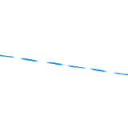

# Agile Burndown-Diagramm - Übersicht

Das Burndown-Diagramm zeigt den Fortschritt der Storys durch die Iteration. Die tatsächliche Burndown-Rate wird mit der idealen Burndown-Rate für die Iterationszeitleiste verglichen.

Das Burndown-Diagramm wird entsprechend dem ausgewählten Tag angepasst. Der aktuelle Tag ist der Standard. Wenn ein vorheriger Tag ausgewählt wird, werden alle Daten im Burndown-Diagramm und alle Werte im Abschnitt [!UICONTROL Abschlussstatus] über dem Burndown-Diagramm neu berechnet, um die Daten so darzustellen, wie sie am Ende des ausgewählten Tages waren. (Sie können vergangene oder aktuelle Tage auswählen; Sie können keine Tage in der Zukunft auswählen.)

## Visuelle Indikatoren

Das Burndown-Diagramm enthält die folgenden visuellen Indikatoren:

<table style="table-layout:auto"> 
 <col> 
 <col> 
 <tbody> 
  <tr> 
   <td role="rowheader">  </td> 
   <td> 
Ideale Burndown-Rate basierend auf dem Beginn der Iteration
 
Diese Zeile wird nicht angezeigt, wenn sich der Umfang der Iteration nie ändert (Stunden oder Punkte werden nie hinzugefügt oder entfernt).
 
Diese Zeile wird als flach angezeigt, wenn die Arbeit an einem freien Tag erledigt wird. Weitere Informationen finden Sie unter <a title="Verwenden des Agile-Burndown-Diagramms" href="#how-days-off-affect-the-burndown-chart" class="MCXref xref">Wie sich Urlaubstage auf das Burndown-Diagramm auswirken</a>.
 </td> 
  </tr> 
  <tr> 
   <td role="rowheader">  </td> 
   <td> 
Ideale Burndown-Rate basierend auf aktuellen Storys oder Aufgaben.
 
Die aktuelle ideale Burndown-Rate (durchgezogene blaue Linie) unterscheidet sich von der ursprünglichen idealen Burndown-Rate (gepunktete blaue Linie), wenn Stunden oder Punkte zu der Iteration hinzugefügt oder aus ihr entfernt werden, nachdem die Iteration beginnt.
 
Diese Zeile wird als flach angezeigt, wenn die Arbeit an einem freien Tag erledigt wird.
 
Weitere Informationen finden Sie unter <a title="Verwenden des Agile-Burndown-Diagramms" href="#how-days-off-affect-the-burndown-chart" class="MCXref xref">Wie sich Urlaubstage auf das Burndown-Diagramm auswirken</a>.
 </td> 
  </tr> 
  <tr> 
   <td role="rowheader">  </td> 
   <td> 
Die tatsächliche Burndown-Rate wird rot angezeigt, wenn die Burndown-Rate geringer ist als das Ideal (es verbleiben mehr Punkte oder Stunden pro Tag als die ideale Burndown-Berechnung).
 
Die folgende Formel wird zur Berechnung der tatsächlichen Burndown-Rate verwendet:
 
[SUM(Punkt- oder Stundenwert in Arbeit * Prozent abgeschlossen) + Punkt- oder Stundenwert der abgeschlossenen Arbeit]
 </td> 
  </tr> 
  <tr> 
   <td role="rowheader">  </td> 
   <td> 
Die tatsächliche Burndown-Rate wird grün angezeigt, wenn die Burndown-Rate gleich oder besser als das Ideal ist (gleich oder weniger Punkte pro Tag als die ideale Burndown-Berechnung).
 
Die folgende Formel wird zur Berechnung der tatsächlichen Burndown-Rate verwendet:
 
[SUM(Punkt- oder Stundenwert in Arbeit * Prozent abgeschlossen) + Punkt- oder Stundenwert der abgeschlossenen Arbeit]
 </td> 
  </tr> 
  <tr> 
   <td role="rowheader">  </td> 
   <td> 
Änderung des Umfangs (Stunden oder Punkte werden der Iteration hinzugefügt oder daraus entfernt).
 
Umfangsänderungen werden immer in der Tagesmitte als vertikale Linie angezeigt. Darüber hinaus wird ein blauer Punkt in der Mitte eines beliebigen Tages angezeigt, an dem eine Umfangsänderung stattgefunden hat.
 
Die vertikale Achse des Burndown-Diagramms zeigt die Story-Punkte oder -Stunden an.
 </td> 
  </tr> 
  <tr> 
   <td role="rowheader">  </td> 
   <td> 
Änderung des Datumsbereichs (Dauer der Iteration wird erhöht oder verringert).
 
Ein blauer Punkt in der Mitte eines beliebigen Tages wird angezeigt, an dem die Iterationsdauer geändert wurde.
 </td> 
  </tr> 
  <tr> 
   <td role="rowheader">  </td> 
   <td> 
Bei jedem Abbrennen der Arbeit wird ein grüner oder roter Punkt auf der tatsächlichen Abbrandrate angezeigt. (Wenn die tatsächliche Burndown-Rate an diesem Tag rot ist, ist der Punkt rot; wenn die tatsächliche Burndown-Rate an diesem Tag grün ist, ist der Punkt grün.)
 
Arbeit wird ausgebrannt, wenn eine der folgenden Situationen eintritt:
 
    <ul> 
     <li> Der [!UICONTROL Prozent abgeschlossen] wird in der Story erhöht. [!UICONTROL Percent Complete] wird erhöht, wenn: 
      <ul> 
       <li> 
Manuell geändert
 </li> 
       <li> 
Die Anzahl der Punkte oder Stunden für die Story wird aktualisiert
 </li> 
      </ul></li>  
     <li>Der Status der Story wird in [!UICONTROL Complete] geändert.</li> 
    </ul> </td> 
  </tr> 
 </tbody> 
</table>

## Wie sich Urlaubstage auf das Burndown-Diagramm auswirken {#how-days-off-affect-the-burndown-chart}

Der in [!DNL Workfront] definierte Standardzeitplan wirkt sich auf das Burndown-Diagramm aus, indem er Urlaubstage (Wochenenden und Feiertage) vom Burndown ausschließt. Das Burndown-Diagramm verwendet den Standardzeitplan zum Definieren von Arbeitstagen (wie in beschrieben.  [Zeitplan erstellen](../../../administration-and-setup/set-up-workfront/configure-timesheets-schedules/create-schedules.md)).

Agile Teams können teamspezifische arbeitsfreie Tage einbeziehen, indem sie einen alternativen Zeitplan definieren (wie im Artikel [Verwenden eines alternativen Teamplans für Burndown-Diagramme](../../../agile/use-scrum-in-an-agile-team/burndown/use-alt-team-schedule-burndown-charts.md) beschrieben). Dieser alternative Zeitplan wird dann im Burndown-Diagramm jeder dem Team zugewiesenen Iteration angezeigt. Der alternative Zeitplan wirkt sich nur auf das Burndown-Diagramm aus.

Urlaubstage werden nur dann im Burndown-Diagramm angezeigt, wenn:

* Die Arbeit wurde zuvor an einem freien Tag protokolliert. (Der Tag, an dem die Arbeit protokolliert wurde, wird angezeigt.)

  Wenn die Arbeit an einem freien Tag protokolliert wird:

   * Protokollierte Arbeiten werden bei der Berechnung des idealen Burndown nicht berücksichtigt, da das Team für keine Arbeit eingeplant ist.
   * Die idealen Burndown-Linien (durchgezogene blaue Linie und gestrichelte blaue Linie) werden im Burndown-Diagramm als flach für jeden Tag angezeigt, an dem die Arbeit erledigt wurde, oder an dem Tag, an dem Sie das Burndown-Diagramm anzeigen (wenn Sie an einem freien Tag anzeigen).
   * Protokollierte Arbeit wird bei der Berechnung anderer Burndown-Statistiken wie dem geschätzten Abschluss und den durchschnittlichen Punkten oder Stunden pro Tag einbezogen.

* Sie zeigen das Burndown-Diagramm an einem freien Tag an. (Der Tag, den Sie anzeigen, wird im Burndown-Diagramm angezeigt.)
* Sie schließen die gesamte verbleibende Arbeit für die Iteration an einem freien Tag ab.

  Wenn ein(e) Benutzende(r) die gesamte verbleibende Arbeit für die Iteration an einem freien Tag erledigt, wird im Feld [!UICONTROL Geschätzter Abschluss] das Datum angezeigt, an dem die Iteration abgeschlossen wurde.

  Wenn Sie bei der Planung der Iteration das Enddatum der Iteration für einen arbeitsfreien Tag festgelegt haben und die Iteration so verfolgt, dass sie pünktlich abgeschlossen wird, wird das [!UICONTROL Geschätzte Abschlussdatum] für den letzten Arbeitstag vor dem von Ihnen festgelegten Enddatum der Iteration festgelegt (da die Arbeit nicht an arbeitsfreien Tagen abgebrannt werden soll).

  Das Enddatum für die Iteration wird bei der Planung der Iteration angegeben, wie im Artikel [Erstellen einer Iteration](../../../agile/use-scrum-in-an-agile-team/iterations/create-an-iteration.md) beschrieben.
