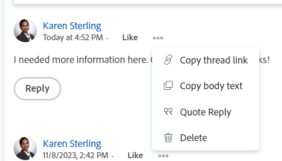

# Iterationskommentare verwalten

Sie können bei der Arbeit in einer Scrum-Umgebung Aktualisierungen zu einer Iteration hinzufügen, um mit anderen in Adobe Workfront zusammenzuarbeiten.

## Aktualisierungen bei Iterationen verwalten

1. Gehen Sie zu einem agile Team und klicken Sie auf **Iterationen** im linken Bereich.
1. Klicken Sie auf den Namen einer Iteration, um sie zu öffnen.
1. Klicks **Updates** , um im Abschnitt über das linke Bedienfeld zu öffnen.

   
1. Klicks **Neue Aktualisierung starten,** Geben Sie dann Ihr Update ein.
1. (Optional) Verwenden Sie die Optionen in der Rich-Text-Symbolleiste, um Ihren Text zu formatieren, Emojis, Links oder Bilder zu Ihrer Aktualisierung hinzuzufügen und Ihren Inhalt zu verbessern. Weitere Informationen finden Sie im Artikel im Abschnitt &quot;Verwenden von Rich Text in einem Workfront-Update&quot; [Update der Arbeit](/help/quicksilver/workfront-basics/updating-work-items-and-viewing-updates/update-work.md).
1. (Optional) Aktualisieren Sie Folgendes, wenn Sie der Iteration ein Update hinzufügen:

   <table style="table-layout:auto"> 
    <col> 
    <col> 
    <tbody> 
     <tr> 
      <td role="rowheader"><strong>Benachrichtigen</strong></td> 
      <td>Identifizieren Sie Benutzer, die über die Aktualisierung benachrichtigt werden müssen. 
Informationen dazu, wie Sie andere in eine Aktualisierung einbeziehen, finden Sie unter <a href="/help/quicksilver/workfront-basics/updating-work-items-and-viewing-updates/tag-others-on-updates.md">Tagging anderer Benutzer auf Updates</a>.
</td> 
     </tr> 
     <tr> 
      <td role="rowheader"><strong>Vertraulich für meine Firma</strong></td> 
      <td> 
Deaktivieren Sie diese Option, um zu verhindern, dass Benutzer außerhalb Ihres Unternehmens Zugriff auf diese Aktualisierung haben.
 
      
<b>NOTIZ</b>

      
Diese Option wird nur angezeigt, wenn Ihr Workfront-Benutzerprofil mit einem Unternehmen verknüpft ist.

      
Diese Option ist nicht in allen Bereichen verfügbar, aus denen Sie Aktualisierungen hinzufügen können. Dies ist beispielsweise nicht in Drittanbieteranwendungen verfügbar, aus denen Sie Aktualisierungen hinzufügen können. 

      </td> 
     </tr> 
    </tbody> 
   </table>

1. Klicks **Aktualisieren** , um die Aktualisierung zur Iteration hinzuzufügen.

   >[!NOTE]
   >
   >Nach dem Klicken auf wird ein kleines Popup-Fenster für sieben Sekunden angezeigt **Aktualisieren** klicken, sodass Sie auf **Kommentar rückgängig machen** und machen Sie die Aktualisierung rückgängig und kehren Sie zum Bearbeitungsbereich zurück, bevor die Aktualisierung veröffentlicht wird. Das Update wird veröffentlicht, wenn Sie das Popup &quot;Rückgängig&quot;schließen, warten, bis es ausgeblendet wird, oder von der Seite weg navigieren.
   >
   >Wenn Ihr Workfront-Administrator in Ihrer Zugriffsebene die Einstellung &quot;Benutzer dürfen Kommentare nie löschen&quot;auswählt, können Sie einen Kommentar nicht rückgängig machen. Weitere Informationen finden Sie unter [Benutzerdefinierte Zugriffsebenen erstellen und ändern](/help/quicksilver/administration-and-setup/add-users/configure-and-grant-access/create-modify-access-levels.md).

1. Um auf eine Aktualisierung zu antworten, klicken Sie auf **Antwort**.

   Weitere Informationen finden Sie unter [Antworten auf Aktualisierungen](/help/quicksilver/workfront-basics/updating-work-items-and-viewing-updates/reply-to-updates.md).

1. (Optional) Um den Inhalt eines Kommentars zu kopieren, klicken Sie auf das **Mehr** icon  rechts neben einem Update klicken Sie auf eine der folgenden Optionen:

   * **Link zum Kopieren des Threads**
   * **Textkörper kopieren**
   * **Antwort zitieren**

   

   Weitere Informationen finden Sie im Abschnitt . [Aktualisieren kopieren](#copy-an-update) in diesem Artikel.
1. (Optional) Um einen Kommentar zu löschen, klicken Sie auf das **Mehr** icon  rechts neben einem Update klicken Sie auf **Löschen**.

## Aktualisieren kopieren

Sie können den Inhalt einer Aktualisierung kopieren und wie folgt wiederverwenden:

* [Thread-Link kopieren](#copy-thread-link)
* [Fließtext kopieren](#copy-body-text)
* [Antwort zitieren](#quote-reply)

### Thread-Link kopieren

Mit dieser Option wird der vollständige Thread-Link in die Zwischenablage kopiert, damit Sie den Thread für andere Benutzer freigeben können.

1. Gehen Sie zum Aktualisierungs-Thread, den Sie kopieren möchten.

1. Klicken Sie auf **Mehr** Menü und klicken Sie auf **Link zum Kopieren des Threads**.

1. Fügen Sie den Link, den Sie im vorherigen Schritt kopiert haben, in eine E-Mail oder eine andere Anwendung ein, um ihn für andere freizugeben. Der freigegebene Link öffnet den Kommentar, von dem Sie den Link freigegeben haben.

### Fließtext kopieren

Mit dieser Option wird der Text von einem bestimmten Update in die Zwischenablage kopiert.

1. Gehen Sie zu der Aktualisierung oder Antwort, die Sie kopieren möchten.
1. Klicken Sie auf **Mehr** Menü und klicken Sie auf **Textkörper kopieren**.

### Antwort zitieren

Mit der Option Antwort zitieren wird der ursprüngliche Kommentar als Blockanführungszeichen in eine neue Antwort kopiert.

1. Gehen Sie zu der Aktualisierung oder Antwort, die Sie kopieren möchten.
1. Klicken Sie auf **Mehr** Menü und klicken Sie auf **Antwort zitieren**.

   Ein neues Kommentarfeld wird geöffnet und die zitierte Antwort wird in den neuen Kommentar aufgenommen und als Blockanführungszeichen markiert.

1. Fügen Sie Ihre Aktualisierung weiter hinzu und klicken Sie auf **Antwort** , um den Kommentar hinzuzufügen.
