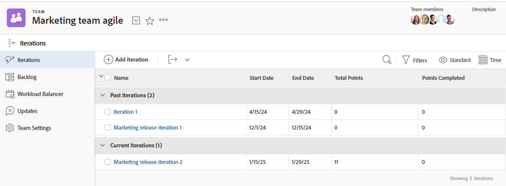

# Anzeigen einer Iteration

Sie können alle Iterationen für ein bestimmtes Team anzeigen oder eine einzelne Iteration anzeigen. Iterationen zeigen Daten zu den Geschichten, Problemen und Dokumenten an, die in der Iteration enthalten sind.

## Zugriffsanforderungen

+++ Erweitern Sie , um die Zugriffsanforderungen für die -Funktion in diesem Artikel anzuzeigen.

Sie müssen über folgenden Zugriff verfügen, um die Schritte in diesem Artikel ausführen zu können:

<table style="table-layout:auto"> 
 <col> 
 </col> 
 <col> 
 </col> 
 <tbody> 
  <tr> 
   <td role="rowheader">[!DNL Adobe Workfront] Plan</td> 
   <td> 
Beliebig
 </td> 
  </tr> 
  <tr> 
   <td role="rowheader">[!DNL Adobe Workfront] Lizenz</td> 
   <td> 
Neu: [!UICONTROL light] oder höher
 
   oder
   
Aktuell: [!UICONTROL Überprüfen] oder höher
 </td> 
  </tr>
 </tbody> 
</table>

Weitere Informationen zu den Informationen in dieser Tabelle finden Sie unter [Zugriffsanforderungen in der Dokumentation zu Workfront](/help/quicksilver/administration-and-setup/add-users/access-levels-and-object-permissions/access-level-requirements-in-documentation.md).

+++

## Anzeigen von Iterationen, die einem bestimmten Team zugewiesen sind

{{step1-to-team}}

1. (Optional) Klicken Sie auf das Symbol **[!UICONTROL Team wechseln]**  und wählen Sie dann entweder ein neues Scrum-Team aus dem Dropdown-Menü aus oder suchen Sie in der Suchleiste nach einem Team.

1. Wählen Sie im linken Bereich **[!UICONTROL Iterationen]**, um eine bestimmte Iteration auszuwählen, oder wählen Sie **[!UICONTROL Aktuelle Iteration]**.

   

   >[!NOTE]
   >
   >**[!UICONTROL Aktuelle Iteration]** wird nur im linken Bereich angezeigt, wenn er der Layout-Vorlage zugewiesen ist und die Iteration mindestens eine Aufgabe oder ein Problem enthält. Weitere Informationen finden Sie unter [Anpassen des linken Bedienfelds mithilfe einer Layout-Vorlage](/help/quicksilver/administration-and-setup/customize-workfront/use-layout-templates/customize-left-panel.md).

1. (Optional) Klicken Sie auf den Namen der spezifischen Iteration, die Sie anzeigen möchten.
Die Iterationsverläufe werden angezeigt.

   ![[!UICONTROL Geschichten in Iteration]](assets/iteration-stories-list-NWE.png)
