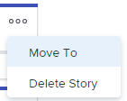

# Geschichten und Probleme auf dem [!UICONTROL Scrum]-Board verwalten

Sie können einen Artikel oder ein Problem aus dem [!UICONTROL Scrum]-Board in eine andere Iteration oder in den Rückstand verschieben oder aus dem [!UICONTROL Scrum]-Board löschen. Wenn Sie eine Story oder ein Problem löschen, wird diese für 30 Tage in den Papierkorb verschoben und kann nur vom Systemadministrator wiederhergestellt werden.

Um einen Vorgang oder ein Problem aus der Iteration zu entfernen, ohne ihn zu löschen oder an den Rückstand zu senden, wechseln Sie zum Projekt und entfernen Sie das agile Team aus der Aufgabenspalte. Dadurch wird der Vorgang bzw. das Problem aus der Arbeitsfläche &quot;Scrum&quot; entfernt, bleibt jedoch im Projekt erhalten.

## Zugriffsanforderungen

+++ Erweitern, um die Zugriffsanforderungen für die in diesem Artikel beschriebene Funktionalität anzuzeigen.

Sie benötigen die folgenden Zugriffsrechte, um die Schritte in diesem Artikel auszuführen:

<table style="table-layout:auto"> 
 <tbody> 
  <tr> 
   <td role="rowheader">[!DNL Adobe Workfront] Plan</td> 
   <td> 
Beliebig
 </td> 
  </tr> 
  <tr> 
   <td role="rowheader">[!DNL Adobe Workfront] genehmigen</td> 
   <td> 
Neu: [!UICONTROL Standard]
 
   oder
   
Aktuell: [!UICONTROL Work] oder höher
 </td> 
  </tr>
   <tr> 
   <td role="rowheader">Objektberechtigungen</td> 
   <td>[!UICONTROL Manager] Zugriff auf die Aufgabe oder das Problem </td> 
  </tr>
 </tbody> 
</table>

Weitere Details zu den Informationen in dieser Tabelle finden Sie unter [Zugriffsanforderungen in der Dokumentation zu Workfront](/help/quicksilver/administration-and-setup/add-users/access-levels-and-object-permissions/access-level-requirements-in-documentation.md).

+++

## Story oder Problem aus dem [!UICONTROL Scrum]-Board verschieben

{{step1-to-team}}

1. Klicken Sie auf das Symbol **[!UICONTROL Team wechseln]** . Wählen Sie dann entweder ein Scrum-Team aus dem Dropdown-Menü aus, oder suchen Sie in der Suchleiste nach einem Team.
1. Wählen Sie im linken Bereich **[!UICONTROL Iterationen]**, um eine bestimmte Iteration auszuwählen, oder **[!UICONTROL Aktuelle Iteration]**.
1. Klicken Sie auf das Symbol **[!UICONTROL Mehr]** in der Story oder im Problem, und wählen Sie **[!UICONTROL Verschieben nach]** aus.

   

1. Wählen Sie in der Bestätigungsmeldung eine der folgenden Optionen:

   <table style="table-layout:auto">
    <tr>
        <td><strong>[!UICONTROL , andere Iteration]</strong></td>
        <td>Wählen Sie diese Option aus, um das Element in eine andere Iteration zu verschieben, und wählen Sie dann aus, in welche Iteration die Story oder das Problem verschoben werden soll. Wenn keine zukünftigen Iterationen definiert sind, können Sie das Element nicht verschieben.</td>
    </tr>
    <tr>
        <td><strong>[!UICONTROL Rückstand]</strong></td>
        <td>Wählen Sie diese Option, um die Story oder das Problem in den Rückstand des Teams zu verschieben.</td>
    </tr>
   </table>

   >[!NOTE]
   >
   >Die Arbeitsaufgabe [!UICONTROL Geplantes Startdatum] und [!UICONTROL Geplantes Abschlussdatum] sind von einer Einstellung auf der Seite [!UICONTROL Team bearbeiten] betroffen. Weitere Informationen finden Sie im Abschnitt [[!UICONTROL Konfigurieren], wie Datumsangaben beim Hinzufügen von Arbeitsaufgaben zu einer Iteration angewendet werden](../../../agile/get-started-with-agile-in-workfront/configure-scrum.md#configur5) im Artikel [Scrum konfigurieren](../../../agile/get-started-with-agile-in-workfront/configure-scrum.md).

1. Klicken Sie auf **[!UICONTROL Verschieben]**.

## Story oder Problem aus dem [!UICONTROL Scrum]-Board löschen

{{step1-to-team}}

1. Klicken Sie auf das Symbol **[!UICONTROL Team wechseln]** . Wählen Sie dann entweder ein Scrum-Team aus dem Dropdown-Menü aus, oder suchen Sie in der Suchleiste nach einem Team.
1. Wählen Sie im linken Bereich **[!UICONTROL Iterationen]**, um eine bestimmte Iteration auszuwählen, oder **[!UICONTROL Aktuelle Iteration]**.
1. Klicken Sie auf das Symbol **[!UICONTROL Mehr]** in dem Artikel oder Problem und wählen Sie **[!UICONTROL Story löschen]** oder **[!UICONTROL Problem löschen]**.

   

1. Klicken Sie in der Bestätigungsmeldung auf **[!UICONTROL Ja, löschen]**.
