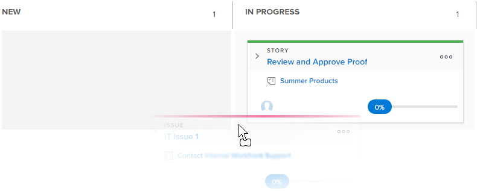

# Status von Storys und Teilaufgaben auf dem [!UICONTROL Scrum]-Board aktualisieren

Sie können den Status einer Story direkt im Agile-Story-Board ändern, um den Fortschritt der Storys während der Iteration oder des Projekts widerzuspiegeln.

>[!NOTE]
>
>Nur Status, die im Abschnitt [!UICONTROL Story Board] im Bereich Team-Einstellungen ausgewählt wurden, sind auf dem [!UICONTROL Scrum]-Board und im Dropdown-Menü Status verfügbar. Weitere Informationen finden Sie unter [Konfigurieren von Scrum](../../../agile/get-started-with-agile-in-workfront/configure-scrum.md).

## Zugriffsanforderungen

+++ Erweitern, um die Zugriffsanforderungen für die in diesem Artikel beschriebene Funktionalität anzuzeigen.

Sie benötigen die folgenden Zugriffsrechte, um die Schritte in diesem Artikel auszuführen:

<table style="table-layout:auto"> 
 <tbody> 
  <tr> 
   <td role="rowheader">[!DNL Adobe Workfront] Plan</td> 
   <td> 
Beliebig
 </td> 
  </tr> 
  <tr> 
   <td role="rowheader">[!DNL Adobe Workfront] Lizenz</td> 
   <td> 
Neu: [!UICONTROL Standard]
 
   oder
   
Aktuell: [!UICONTROL Work] oder höher
 </td> 
  </tr>
 </tbody> 
</table>

Weitere Informationen finden Sie unter [Zugriffsanforderungen](/help/quicksilver/administration-and-setup/add-users/access-levels-and-object-permissions/access-level-requirements-in-documentation.md) in der Dokumentation zu Workfront.

+++

## Status einer Story oder Teilaufgabe aktualisieren

{{step1-to-team}}

1. (Optional) Klicken Sie auf das Symbol **[!UICONTROL Team wechseln]**  und wählen Sie dann entweder ein neues Scrum-Team aus dem Dropdown-Menü aus oder suchen Sie in der Suchleiste nach einem Team.

1. Navigieren Sie zu einer aktiven Iteration.
1. Ziehen Sie eine Story aus einer Statusspalte auf dem Storyboard in eine andere Spalte.\
   
