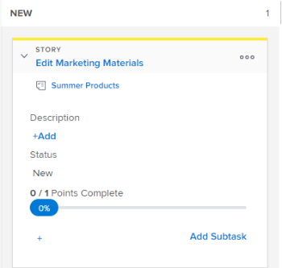

# Storyinformationen auf dem Board [!UICONTROL Scrum] anzeigen und bearbeiten

## Informationen, welche Informationen angezeigt und bearbeitet werden können

Wenn Sie eine Story-Kachel auf dem Story Board anzeigen, sind die Informationen in der folgenden Tabelle verfügbar. Die meisten Informationen können direkt über die Story-Kachel inline bearbeitet werden.

<table style="table-layout:auto"> 
 <col> 
 <col> 
 <col> 
 <thead> 
  <tr> 
   <th><strong>Information</strong> </th> 
   <th><strong>sichtbar</strong> </th> 
   <th><strong>Bearbeitbar inline</strong> </th> 
  </tr> 
 </thead> 
 <tbody> 
  <tr> 
   <td>Der Name der Story mit einem Link direkt zur Aufgabe oder zum Problem</td> 
   <td>✓</td> 
   <td> </td> 
  </tr> 
  <tr> 
   <td> 
Der Projektname mit einem Link direkt zum Projekt  Dieser Link wird bei Verwendung der agilen Ansicht bei einer Iteration nur für Storys (übergeordnete Aufgaben, nicht Teilaufgaben) angezeigt; er wird nicht angezeigt, wenn eine agile Ansicht für ein Projekt verwendet wird.
 </td> 
   <td>✓ </td> 
   <td> </td> 
  </tr> 
  <tr> 
   <td> 
Die Anzahl der Punkte oder Stunden für den Abschluss der Story und die Anzahl der Punkte oder Stunden, die der Story zugewiesen  . Diese Zahlen werden verwendet, um die [!UICONTROL Prozent abgeschlossen] für jede Story zu berechnen und anzuzeigen.
 </td> 
   <td>✓</td> 
   <td>✓</td> 
  </tr> 
  <tr> 
   <td> 
Die [!UICONTROL Prozent abgeschlossen] für jede Story und jedes Problem. Der [!UICONTROL Prozent abgeschlossen] für die Iteration wird basierend auf dem [!UICONTROL Prozent abgeschlossen] für jede Story berechnet.
 
Beim Aktualisieren von [!UICONTROL Prozent abgeschlossen] für eine Story oder ein Problem können Sie eine beliebige Zahl zwischen 0 und 100 auswählen.
 </td> 
   <td>✓</td> 
   <td>✓</td> 
  </tr> 
  <tr> 
   <td> 
Wem die Story zugewiesen ist
 </td> 
   <td>✓</td> 
   <td>✓</td> 
  </tr> 
  <tr> 
   <td> 
Die Farbe oder Kategorie der Kachel
 </td> 
   <td>✓</td> 
   <td>✓</td> 
  </tr> 
  <tr> 
   <td> 
Alle zusätzlichen Felder (einschließlich benutzerdefinierter Felder), die der agilen Ansicht hinzugefügt wurden, indem die agile Ansicht geändert wurde, wie in „Erstellen und Anpassen einer [!UICONTROL Agile]-Ansicht“ in <a href="../../../reports-and-dashboards/reports/reporting-elements/views-overview.md" class="MCXref xref">Überblick über Ansichten in [!UICONTROL Adobe Workfront]</a> beschrieben.
 </td> 
   <td>✓</td> 
   <td>✓</td> 
  </tr> 
 </tbody> 
</table>

## Zugriffsanforderungen

+++ Erweitern Sie , um die Zugriffsanforderungen für die -Funktion in diesem Artikel anzuzeigen.

Sie müssen über folgenden Zugriff verfügen, um die Schritte in diesem Artikel ausführen zu können:

<table style="table-layout:auto"> 
 <tbody> 
  <tr> 
   <td role="rowheader">[!DNL Adobe Workfront] Plan</td> 
   <td> 
Beliebig
 </td> 
  </tr> 
  <tr> 
   <td role="rowheader">[!DNL Adobe Workfront] Lizenz</td> 
   <td> 
Neu: [!UICONTROL Standard]
 
   oder
   
Aktuell: [!UICONTROL Work] oder höher
 </td> 
  </tr>
   <tr> 
   <td role="rowheader">Objektberechtigungen</td> 
   <td>Zugriff von [!UICONTROL Contribute] oder [!UICONTROL Manage] auf die Aufgabe oder das Problem</td> 
  </tr>
 </tbody> 
</table>

Weitere Informationen zu den Informationen in dieser Tabelle finden Sie unter [Zugriffsanforderungen in der Dokumentation zu Workfront](/help/quicksilver/administration-and-setup/add-users/access-levels-and-object-permissions/access-level-requirements-in-documentation.md).

+++

## Anzeigen und Bearbeiten von Informationen auf einer Story-Kachel

{{step1-to-team}}

1. (Optional) Klicken Sie auf das Symbol **[!UICONTROL Team wechseln]**  und wählen Sie dann entweder ein neues Scrum-Team aus dem Dropdown-Menü aus oder suchen Sie in der Suchleiste nach einem Team.

1. Wählen Sie im linken Bereich **[!UICONTROL Iterationen]**, um eine bestimmte Iteration auszuwählen, oder wählen Sie **[!UICONTROL Aktuelle Iteration]**.

1. Gehen Sie zum [!UICONTROL Scrum] Agile-Story-Board.
1. Erweitern Sie die [!UICONTROL Story]-Kachel, um alle mit der Story verbundenen Felder anzuzeigen.

   

1. (Optional) Um ein Feld zu bearbeiten, klicken Sie auf das Feld und nehmen Sie dann Änderungen vor.

   Sie müssen über [!UICONTROL Bearbeiten]-Rechte für die Aufgabe oder das Problem verfügen, um die Story-Kachel zu bearbeiten.

>[!NOTE]
>
>Um den [!UICONTROL Prozent abgeschlossen] zu ändern, müssen Sie eine Zahl zwischen 0 und 100 eingeben. Das Feld ist kein Schieberegler, den Sie verschieben können.
