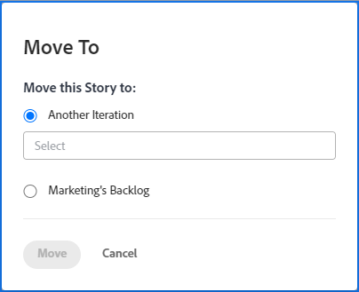

# Eine agile Story verschieben

Sie können eine agile Story entweder in eine andere Iteration verschieben (für Scrum-Teams) oder in den Rückstand (für Kanban- und Scrum-Teams).

## Zugriffsanforderungen

+++ Erweitern Sie , um die Zugriffsanforderungen für die -Funktion in diesem Artikel anzuzeigen.

Sie müssen über folgenden Zugriff verfügen, um die Schritte in diesem Artikel ausführen zu können:

<table style="table-layout:auto"> 
 <col> 
 </col> 
 <col> 
 </col> 
 <tbody> 
  <tr> 
   <td role="rowheader">[!DNL Adobe Workfront] Plan</td> 
   <td> 
Beliebig
 </td> 
  </tr> 
  <tr> 
   <td role="rowheader">[!DNL Adobe Workfront] Lizenz</td> 
   <td> 
Neu: [!UICONTROL Standard]
 
   oder
   
Aktuell: [!UICONTROL Work] oder höher
 </td> 
  </tr>
  <tr> 
   <td role="rowheader">Objektberechtigungen</td> 
   <td>[!UICONTROL Manage] Zugriff auf die Story</td> 
  </tr> 
 </tbody> 
</table>

Weitere Informationen zu den Informationen in dieser Tabelle finden Sie unter [Zugriffsanforderungen in der Dokumentation zu Workfront](/help/quicksilver/administration-and-setup/add-users/access-levels-and-object-permissions/access-level-requirements-in-documentation.md).

+++

## Story aus einer Iteration oder Kanban-Pinnwand in den Rückstand verschieben

1. Gehen Sie zur Iteration oder zum Kanban-Board, das die Story enthält, die Sie in den Rückstand verschieben möchten.
1. Klicken Sie oben auf der Seite auf die Überschrift „Iteration“.
1. Wählen Sie auf **[!UICONTROL Registerkarte]** Storys“ die Storys aus, die Sie verschieben möchten.
1. Klicken Sie auf **[!UICONTROL Mehr]** > **[!UICONTROL Verschieben nach]**. Das **[!UICONTROL Verschieben nach]** wird angezeigt.

   

1. Wählen Sie **Team_name&#39;s Backlog**. Im obigen Beispiel lautet der Name des Teams **Marketing**.

1. Klicken Sie **[!UICONTROL Verschieben]**.

## Story in eine andere Iteration verschieben

Sie können eine Story für Ihr Scrum-Team in eine andere Iteration verschieben, wenn Sie Systemadministrator oder Mitglied des Teams sind, mit dem die Iteration verknüpft ist.

>[!NOTE]
>
> Die **[!UICONTROL Verschieben nach]** ist nicht für übergeordnete Storys in einer Iteration verfügbar. Sie können Teilaufgaben nur in eine andere Iteration verschieben.

1. Wechseln Sie zur Iteration, die die Story enthält, die Sie verschieben möchten.
1. Klicken Sie oben auf der Seite auf die Überschrift „Iteration“.
1. Wählen Sie auf **[!UICONTROL Registerkarte]** Storys“ die Storys aus, die Sie verschieben möchten.
1. Klicken Sie auf **[!UICONTROL Mehr]** > **[!UICONTROL Verschieben nach]**. Das **[!UICONTROL Verschieben nach]** wird angezeigt.

   

1. Wählen Sie **[!UICONTROL eine weitere Iteration]**.
1. Wählen Sie im angezeigten Dropdown-Menü die Iteration aus, in die Sie die Story verschieben möchten.

   >[!NOTE]
   >
   >Die Einstellungen [!UICONTROL &#x200B; Arbeitselement &#x200B;]Geplantes Startdatum) und [!UICONTROL Geplantes Abschlussdatum] werden von einer Einstellung auf der Seite [!UICONTROL Team bearbeiten] beeinflusst. Weitere Informationen finden Sie im Abschnitt [[!UICONTROL Konfigurieren], wie Datumsangaben beim Hinzufügen von Arbeitselementen zu einer Iteration angewendet werden](../../agile/get-started-with-agile-in-workfront/configure-scrum.md#configure-how-dates-are-applied-when-adding-work-items-to-an-iteration) im Artikel [Konfigurieren von Scrum](../../agile/get-started-with-agile-in-workfront/configure-scrum.md).

1. Klicken Sie **[!UICONTROL Verschieben]**.
