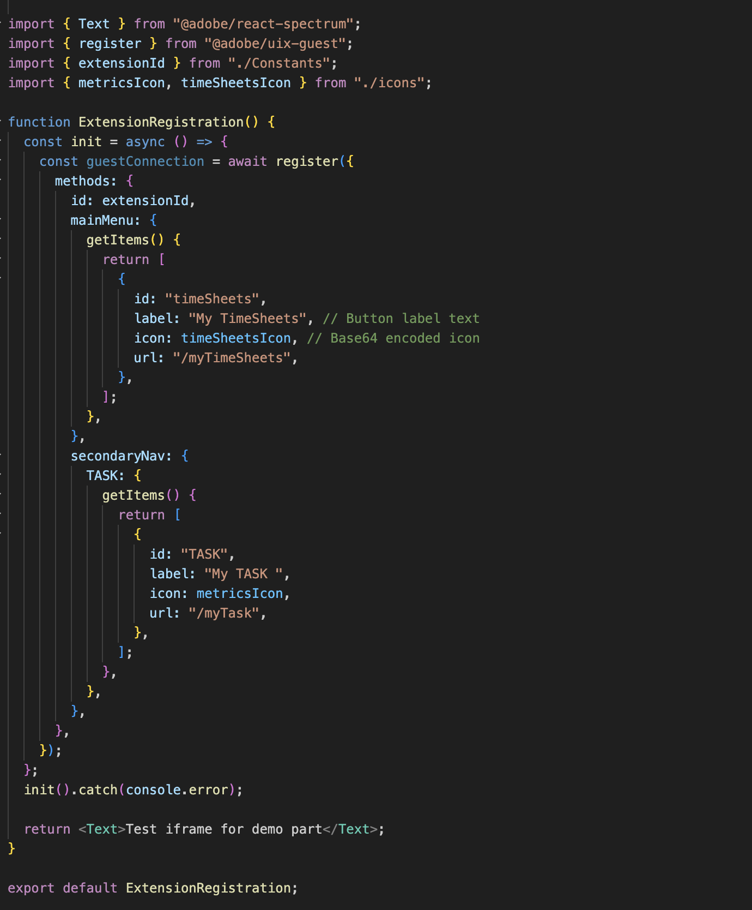

# Erstellen benutzerdefinierter Programme für Workfront mit Adobe App Builder

Benutzeroberflächenerweiterungen für Workfront auf Basis von Adobe App Builder ermöglichen es Kunden und Partnern, benutzerdefinierte Benutzererlebnisse zu erstellen. Diese Tools steigern die Effizienz, bieten nahtlose, vernetzte Erlebnisse und verbessern die Benutzerzufriedenheit erheblich und helfen Unternehmen, ihre einzigartige Vision zu verwirklichen.

Ohne Workfront UI-Erweiterungen muss ein Projektmanager beispielsweise möglicherweise zwischen Workfront und einem separaten Zeitverfolgungssystem wechseln, um Stunden zu protokollieren. Mit Benutzeroberflächenerweiterungen kann die Zeitverfolgung direkt in das Workfront-Erlebnis integriert werden, wodurch der Workflow optimiert und Zeit gespart wird. Darüber hinaus können Sie benutzerdefinierte Komponenten hinzufügen, um die Benutzerfreundlichkeit zu verbessern, sich wiederholende Aufgaben zu automatisieren und das Content-Management mit Funktionen wie Metadaten-Tagging und Inhaltsvorschauen zu verbessern. Adobe App Builder bietet außerdem Skalierbarkeit und robustes Identity Management (IMS), sodass eine sichere und effiziente Anpassung in jedem Maßstab gewährleistet ist.

Erweiterungen der Workfront-Benutzeroberfläche bieten mehrere wichtige Vorteile:

* Präzise Anpassung: Standardmäßige Software-Schnittstellen erfüllen häufig nicht alle Geschäftsanforderungen. Benutzeroberflächenerweiterungen ermöglichen es Entwicklerinnen und Entwicklern, die Standardbenutzeroberfläche zu ändern und zu erweitern, um bestimmte Geschäftsanforderungen zu erfüllen.
* Systemintegration: Benutzeroberflächenerweiterungen erleichtern die Integration anderer Systeme und sorgen so für nahtlose Workflows und Datenkonsistenz.
* Skalierbarkeit: Wenn Unternehmen wachsen, können Benutzeroberflächen-Erweiterungen entwickelt werden, um neue Funktionen hinzuzufügen, ohne dass das System komplett überholt werden muss.
* Verkürzte Entwicklungszeit: Vorkonfigurierte Erweiterungspunkte und Tools reduzieren den Zeit- und Arbeitsaufwand für die Implementierung benutzerdefinierter Funktionen erheblich.
* Verbesserte Benutzerakzeptanz: Ein optimiertes Benutzererlebnis kann die Softwareakzeptanz erheblich steigern. Benutzerdefinierte Benutzeroberflächenelemente, die auf die Benutzerpräferenzen abgestimmt sind, können die Akzeptanzraten und die allgemeine Zufriedenheit verbessern.
* Mithilfe von Workfront UI-Erweiterungen können Unternehmen maßgeschneiderte Benutzererlebnisse erstellen, die die Effizienz, Integration und Benutzerzufriedenheit steigern.

Nachdem eine Anwendung in der Adobe App Builder erstellt wurde, kann sie ein Workfront-Administrator mithilfe von Layout-Vorlagen dem Workfront-Hauptmenü und dem linken Navigationsbereich hinzufügen. Ein Benutzer mit der Layout-Vorlage, der auf das Programm klickt, sieht das Programm in Workfront eingebettet, anstatt es separat öffnen zu müssen.

In diesem Artikel wird beschrieben, wie Sie auf die App Builder zugreifen und eine Vorlage verwenden können, um eine Anwendung zu erstellen.

Informationen zum Hinzufügen einer benutzerdefinierten Anwendung zu Layout-Vorlagen finden Sie unter [Anpassen des Hauptmenüs mithilfe einer Layout-Vorlage](/help/quicksilver/administration-and-setup/customize-workfront/use-layout-templates/customize-main-menu.md) und [Anpassen des linken Bereichs mithilfe einer Layout-Vorlage](/help/quicksilver/administration-and-setup/customize-workfront/use-layout-templates/customize-left-panel.md).

## Voraussetzungen

Sie müssen über Folgendes verfügen:

* Ein IMS-aktiviertes Workfront-Konto
* Ein Entwicklungsrechner mit Knoten v18 und npm
* App Builder-Lizenz

## Zugriff auf Adobe App Builder

Um Benutzeroberflächenerweiterungen zu erstellen, benötigen Sie Zugriff auf Adobe App Builder in der Adobe Developer Console.

Weitere Anweisungen finden Sie auf der [Adobe Developer-Site](https://developer.adobe.com/uix/docs/guides/get-access/).

### Hinzufügen von Entwicklern zur Adobe Admin Console

>[!IMPORTANT]
>
>Stellen Sie sicher, dass Sie für alle folgenden Schritte die richtige IMS-Organisation ausgewählt haben. Wenn Sie mehreren Organisationen angehören, können Sie die falsche auswählen. Stellen Sie sicher, dass Sie unter der rechten Organisation handeln, die normalerweise oben rechts aufgeführt ist.

1. Navigieren Sie zur Produktion: https://adminconsole.adobe.com/

1. Klicken **Abschnitt „Benutzer** auf **Entwickler** > **Entwickler hinzufügen**.

   

   >[!NOTE]
   >
   >Wenn keine Option zum Verwalten von Entwicklern angezeigt wird, verfügen Sie über kein Produkt, das Entwicklerzugriff ermöglicht.

1. Fügen Sie die E-Mail des Benutzers hinzu. Sie sollte nach vorhandenen Benutzenden suchen, die bereits aus der Admin Console hinzugefügt wurden.

1. Fügen Sie die erforderlichen Produkte zum Entwicklerprofil hinzu und klicken Sie auf **Speichern**.\
   

### Zugriff auf App Builder erhalten

Unternehmen müssen beim Kauf von App Builder mit ihren Account Managern zusammenarbeiten.

Wenn AppBuilder ordnungsgemäß konfiguriert ist, sollte beim Erstellen eines neuen Projekts „Projekt aus Vorlage erstellen“ angezeigt werden.

## Erstellen eines neuen Projekts in der Adobe Developer Console

Sie müssen die Adobe Developer Console verwenden, um Ihre Benutzeroberflächenerweiterung zu erstellen.

Weitere Anweisungen finden Sie auf der [Adobe Developer-Site](https://developer.adobe.com/uix/docs/guides/creating-project-in-dev-console/).

1. Melden Sie sich mit Ihrer Adobe ID bei der Adobe Developer Console an.

1. Wählen Sie Ihr -Konto und Ihr Profil oder Ihre Organisation aus.

1. Klicken Sie **Schnellstartbereich auf** Projekt aus Vorlage erstellen“ oder klicken Sie auf **Neues Projekt erstellen > Projekt aus Vorlage**.

   >[!IMPORTANT]
   >
   >Wenn Sie die Option zum Erstellen eines Projekts über eine Vorlage nicht sehen, sind Sie in der Admin Console falsch konfiguriert und haben keinen Zugriff auf den App Builder-Katalog. Diese Option wird nur angezeigt, wenn Sie Zugriff auf AppBuilder haben.

   

1. **App Builder**.

1. Geben Sie einen **Projekttitel** und **App-Namen** ein. Beide haben Standardwerte, aber es ist einfacher, das gewünschte Projekt später zu identifizieren, wenn Sie den Wert anpassen.

1. Lassen Sie **Laufzeit**.

1. Klicken Sie auf **Speichern**.

## Verwenden der Adobe Developer (aio)-CLI

Adobe bietet eine Open-Source-CLI, mit der Sie das App Builder-Programm erstellen können.

Weitere Anweisungen finden Sie auf GitHub und der Adobe Developer-Site:

* https://github.com/adobe/aio-cli
* https://developer.adobe.com/app-builder/docs/getting_started/first_app/

1. Um das Tool zu installieren (stellen Sie sicher, dass Sie sich zuerst auf dem Knoten 18 befinden), führen Sie `npm install -g @adobe/aio-cli` aus.
1. Starten Sie Ihr Terminal und melden Sie sich mit dem Befehl `aio login` bei der Organisation an. Wenn Sie Probleme haben, sich bei der richtigen IMS-Organisation anzumelden, versuchen Sie `aio login -f`, eine Eingabeaufforderung zu erzwingen. Verwenden Sie `aio where`, um anzuzeigen, welche Organisation Sie bei der richtigen IMS-Organisation angemeldet sind. Weitere Informationen finden Sie unter `aio config`.
1. Beginnen Sie mit der Einrichtung Ihrer App, indem Sie ausführen: `aio app init example-app` Sie sicher, dass Sie „example-app“ durch Ihren App-Namen ersetzen. Wenn Sie sich nicht sicher sind, wie die App-Namen lauten, wird eine Liste der App-Namen mit dem `aio console project list` angezeigt.
1. Wählen Sie Ihre Organisation und Ihr Projekt aus den bereitgestellten Optionen aus.

   
   

1. Durchsuchen Sie alle verfügbaren Vorlagen und wählen Sie die **@adobe/workfront-ui-ext-tpl** für Ihr Projekt aus.

   

1. Wählen Sie den Projektnamen aus, den Sie in der Adobe Developer Console erstellt haben, und geben Sie ihn ein.

   

1. Beantworten Sie die Eingabeaufforderungen für die Anwendung:

   * Benennen Sie die Erweiterung.
   * Geben Sie eine beschreibende Zusammenfassung der Funktionalität der Erweiterung an.
   * Wählen Sie eine anfängliche Versionsnummer aus, mit der Sie beginnen möchten.
   * Die Vorlage erstellt den Code für eine primäre Navigationsschaltfläche, wenn Sie auf „Benutzerdefinierte Schaltfläche zum Hauptmenüelement hinzufügen“ klicken, wenn Sie nach „Was möchten Sie als Nächstes tun?“ gefragt werden.

   

1. Bestätigen Sie den Abschluss, indem Sie Ich bin fertig wählen. Die Code-Generierung aus der Vorlage ist in Bearbeitung.

   

1. Warten Sie, bis eine Meldung angezeigt wird, dass die App-Initialisierung abgeschlossen ist. Anschließend können Sie das Projekt in einer IDE öffnen (Visual Studio Code wird empfohlen) und auf den src-Ordner zugreifen.

   Weitere Informationen zu den Ordnern und Dateien in Ihrem Projekt finden Sie auf der [Adobe Developer Site](https://developer.adobe.com/app-builder/docs/get_started/app_builder_get_started/first-app#anatomy-of-an-app-builder-application).

Weitere Informationen zu den Ordnern und Dateien in Ihrem Projekt finden Sie auf der [Adobe Developer-Site](https://developer.adobe.com/app-builder/docs/get_started/app_builder_get_started/first-app#anatomy-of-an-app-builder-application).

## Erstellen der Erweiterungen in VSCode

Die Dateikonfiguration App.js ist erforderlich, um die Navigation über das Workfront-Hauptmenü oder die sekundäre Navigation (linker Bereich) zu aktivieren.

Die Dateikonfiguration extensionRegistration.js ist erforderlich, um die Erweiterungen in Workfront-Layout-Vorlagen anzuzeigen.

Die folgenden Beispiele zeigen, wie Sie dem Workfront-Hauptmenü und dem linken Bedienfeld eines Objekts mithilfe der Benutzeroberflächenerweiterungen benutzerdefinierte Programme hinzufügen.

### Konfigurieren von ExtensionRegistration.js

So lassen Sie benutzerdefinierte Anwendungen im Hauptmenü von Workfront zu:

1. Gehen Sie zu ExtensionRegistration.js.

In der Funktion ExtensionRegistration sollte der folgende Code angezeigt werden. Dieser Code wurde von der Vorlage für Sie erstellt. Dieser Code kann hinzugefügt werden, um zusätzliche Menüelemente zu erstellen. Ersetzen Sie unbedingt die IDs und URLs.

    &quot;
    mainMenu: {
    
    getItems() {
    
    return [
    
    {
    
    id: &#39;main-menu-label&#39;,
    
    url: &#39;/index.html#/main-menu-label&#39;,
    
    label: &#39;main menu label&#39;,
    
    icon: icon1,
    
    },
    
    ];
    
    },
    
    }
    &quot;

1. Fügen Sie das folgende Codefragment hinzu:

   

   Dieses Beispiel zeigt ein Hauptmenüelement. Sie müssen die ID, die Bezeichnung, das Symbol und die URL auf die richtigen Namen für Ihr Programm aktualisieren. Stellen Sie beim Hinzufügen mehrerer Elemente sicher, dass die ID eindeutig ist.

1. Speichern Sie Ihre Arbeit.

### Zulassen von benutzerdefinierten Programmen in der Navigation im linken Bereich von Workfront

So lassen Sie benutzerdefinierte Programme im Navigationsbereich des linken Workfront-Bereichs zu:

1. Gehen Sie zu ExtensionRegistration.js.
1. Fügen Sie in der Funktion ExtensionRegistration das folgende Codefragment hinzu:

   ```
   secondaryNav: {
   
   TASK: {  
   
       getItems() {       return [         {           id: "TASK", 
   
   label: "My TASK",           icon: metricsIcon,           url: "/myTask",  
   
           },  
   
       ];  
   
       },  
   
   },  
   
   },  
   ```

   

   * Dieses Beispiel zeigt ein Navigationselement des linken Bedienfelds namens „Meine Aufgabe“. Sie müssen die ID, die Bezeichnung, das Symbol und die URL auf die richtigen Namen für Ihr Programm aktualisieren.
   * Dieses Beispiel zeigt ein Navigationselement des linken Bedienfelds für den Projektobjekttyp. Sie müssen diese Elemente für jedes Objekt, in dem sie in Workfront unterstützt werden, separat erstellen. Die folgenden Objekte sind verfügbar: Projekt, Aufgabe, Problem, Portfolio und Programm.

1. Speichern Sie Ihre Arbeit.

### Einbetten einer App mithilfe eines benutzerdefinierten Workfront-Formulars

Der Forms Widget-Erweiterungspunkt ist eine Benutzeroberflächenerweiterungsfunktion in Adobe Workfront, mit der Sie benutzerdefinierte Widgets erstellen können, die in benutzerdefinierte Workfront-Formulare eingebettet werden können. Im Gegensatz zu anderen Erweiterungspunkten, die Navigationselemente oder Menüoptionen hinzufügen, bieten Widgets eine Möglichkeit, benutzerdefinierte Inhalte in speziellen Bereichen in benutzerdefinierten Formularfeldern anzuzeigen.

Widgets sind modulare UI-Komponenten, die zu benutzerdefinierten Workfront-Formularen als Formularfelder hinzugefügt werden können. Sie bieten eine Möglichkeit, benutzerdefinierte Funktionen, Datenvisualisierungen oder externe Inhalte direkt in benutzerdefinierten Formularschnittstellen zu präsentieren, sodass Benutzende beim Ausfüllen von Formularen mit benutzerdefinierter Logik interagieren können.

#### Konfigurieren einer Widget-Erweiterung

Wie Benutzeroberflächen-Erweiterungspunkte für das Hauptmenü und die sekundäre Navigation wird der Erweiterungspunkt „Widgets“ innerhalb des Methodenobjekts der `ExtensionRegistration`-Komponente konfiguriert, normalerweise im `ExtensionRegistration.js`. Das bedeutet, dass bei Verwendung des Forms-Widgets nur ein „Widget“-Element in `extesionregistration` mit einer gültigen Route in Ihrer App.js hinzugefügt werden muss:

```
javascript 


Apply to ExtensionReg... 

widgets: { 

  getItems() { 

    return [ 

      { 

        id: "test2", 

        url: "/index.html#/widgets1", 

        label: "Test Widget with dimensions", 

        dimensions: { 

          height: 450, 

          width: 300, 

          maxHeight: 600, 

          maxWidth: 400, 

        }, 

      }, 

      { 

        id: "test", 

        url: "/index.html#/widgets1", 

        label: "Test Widget without dimensions", 

      }, 

    ]; 

  }, 

}, 
```

#### Widget-Konfigurationseigenschaften

**Erforderliche Eigenschaften**

* id (String): Eindeutige Kennung für das Widget. Muss für alle Widgets in Ihrer Erweiterung eindeutig sein.

* url (Zeichenfolge): Der URL-Pfad zum Inhalt des Widgets. Dieser sollte auf eine Route in Ihrer Erweiterung verweisen, die die Widget-Komponente rendert.

* label (Zeichenfolge): Anzeigename für das Widget, das in der Benutzeroberfläche zur Auswahl benutzerdefinierter Formularfelder angezeigt wird.

**Optionale Eigenschaften**

* Dimensionen (Objekt): Gibt die Anzeigeabmessungen des Widgets an. Alle Eigenschaften sind optional, und dies sind die einzigen möglichen Dimensionen:

* Höhe (Zahl): Höhe des Widgets in Pixel

* Breite (Zahl): Breite des Widgets in Pixel

* maxHeight (Zahl): Maximale Höhe des Widgets in Pixel

* maxWidth (Zahl): Maximale Breite des Widgets in Pixel

**Dimension-Eigenschaften**

Mit dem Dimensions -Objekt können Sie die Größe und Layout-Beschränkungen Ihres Widgets steuern:

* Höhe und Breite : Legen Sie die anfängliche/bevorzugte Größe des Widgets fest

* maxHeight und maxWidth: Legen Sie Obergrenzen fest, um zu verhindern, dass das Widget zu groß wird

* Responsives Verhalten: Widgets können innerhalb dieser Einschränkungen responsiv sein

* Formularintegration: Dimensionen helfen sicherzustellen, dass das Widget gut in Formularfeld-Layouts passt

#### Beispielkonfigurationen für Dimension

```
// Fixed size widget 

dimensions: { 

  height: 300, 

  width: 250, 

} 

// Flexible height with width constraint 

dimensions: { 

  width: 300, 

  maxHeight: 500, 

} 

// Height constraint only 

dimensions: { 

  height: 400, 

  maxWidth: 350, 

} 

// No dimensions - uses default sizing 

{} 
```

#### Kontextdaten

Widgets haben Zugriff auf denselben freigegebenen Kontext wie andere Erweiterungspunkte, einschließlich:

* Auth: Authentifizierungsinformationen, einschließlich IMS-Token

* objCode: Objekttyp-Code (AUFGABE, PROJEKT, PROBLEM usw.)

* objID: Objektkennung

* Host-Name: Hostname der Workfront-Instanz

* Protokoll: Verbindungsprotokoll

* Benutzer: Aktuelle Benutzerinformationen

* isLoginAs: Gibt an, ob der Benutzer als ein anderer Benutzer angemeldet ist

* isInBulkEditing: wenn sich das Formular derzeit im Massenbearbeitungsmodus befindet. Wenn ja, enthält der Kontext mehrere Werte für die Objekt-ID.

#### Hinzufügen eines Widgets zu einem benutzerdefinierten Workfront-Formular

Eine App kann mithilfe des Feldtyps „UI-Erweiterungen“ in ein benutzerdefiniertes Workfront-Formular eingebettet werden. Nachdem Sie das Feld hinzugefügt haben, wählen Sie ein Formular-Widget aus. Die Liste der Widgets basiert auf aktiven Apps in Ihrer IMS-Organisation oder auf lokal aktiven Apps, wenn sie `extensionoverride=TRUE` werden.


### Konfigurieren von App.js

1. Wechseln Sie zu App.js.

1. Die Vorlage erstellt eine Route für eine Option im Hauptmenü. Eine Route definiert die Zuordnung zwischen URL-Pfaden und den für diese Pfade gerenderten Komponenten. Um eine Route hinzuzufügen, verwenden Sie das folgende Codefragment. Ersetzen Sie unbedingt den genauen Pfad und das Element durch Ihres.

   ```
       <Route 
   
               exact path="custom-application" 
   
               element={<Customapplication />} 
   
           /> 
   ```

   
1. Speichern Sie Ihre Arbeit.

Weitere Informationen zum Entwickeln und Ausführen der Anwendung finden Sie auf der [Adobe Developer Site](https://developer.adobe.com/app-builder/docs/get_started/app_builder_get_started/first-app#develop-the-application).


## Freigegebener Kontext

Freigegebener Kontext wird verwendet, um Daten aus Workfront für eine Benutzeroberflächenerweiterung freizugeben. Zu den über Shared Context verfügbaren Daten gehören Benutzerdaten und der Anwendungskontext.


### Benutzerin bzw. Benutzer

Benutzeroberflächenerweiterungen von Workfront nutzen Benutzerdaten gemeinsam. Das über den freigegebenen Kontext verfügbare Benutzerobjekt enthält eine Workfront-Benutzer-ID und die E-Mail-Adresse des Benutzers.

`user = (conn?.sharedContext?.get("user")); // {ID: '1', email: 'test@aaa.com'} userID = user.ID userEmail = user.email`

### Anwendungskontext

Beim Hinzufügen einer benutzerdefinierten Anwendung mit einem Sekundären Navigationserweiterungspunkt verwendet die benutzerdefinierte Anwendung häufig Kontextdaten wie eine Projekt-ID oder Dokument-ID. Für diese Daten enthält der freigegebene Kontext einen Objekt-Code und eine Objekt-ID.

Im Folgenden finden Sie ein Beispiel für das Abrufen des Anwendungskontexts für Dokumente:

`context = conn?.sharedContext; // Using the connection created above, grab the document details from the host tunnel. // conn?.host?.document?.getDocumentDetails().then(setDocDetails);`

## Testen der App in Workfront

Beim Entwickeln Ihres App Builder-Programms für Workfront müssen Sie Ihr Programm möglicherweise in Workfront testen, ohne es zu veröffentlichen.

Innerhalb Ihrer App Builder-App können Sie `aio app run` für die lokale Entwicklung initiieren. Dadurch erhalten Sie eine URL, normalerweise `https://localhost:9080`. Alternativ können Sie `aio app deploy` ausführen, um eine statische Adobe-Domain abzurufen. Notieren Sie sich diese URLs für die zukünftige Verwendung.

Navigieren Sie dann in Ihrem Browser zu der Seite, für die Sie eine Entwicklung durchführen möchten. Öffnen Sie die Entwickler-Tools und greifen Sie auf den lokalen Speicher für workfront.com oder workfront.adobe.com zu. Hier müssen Sie einen Eintrag hinzufügen. Verwenden Sie `extensionOverride` als Schlüssel und die zuvor erwähnte App Builder-URL als Wert.

Wenn die Konfiguration korrekt abgeschlossen wurde, werden beim Neuladen der Layoutvorlagenseite in Workfront die Schaltflächen in Ihrem App Builder-Programm angezeigt. Fügen Sie die App-Schaltflächen zum Hauptmenü und zum linken Bedienfeld für ein Objekt hinzu und überprüfen Sie, ob sie in diesen Bereichen korrekt angezeigt werden.

Weitere Anweisungen finden Sie auf der Adobe Developer-Site. Verwenden Sie dazu ein Beispiel aus AEM: https://developer.adobe.com/uix/docs/guides/preview-extension-locally/

## Anträge veröffentlichen und Einreichung genehmigen

Um den Antrag zu veröffentlichen und zu genehmigen, folgen Sie den Anweisungen auf der [Adobe Developer-Site](https://developer.adobe.com/uix/docs/guides/publication/).
